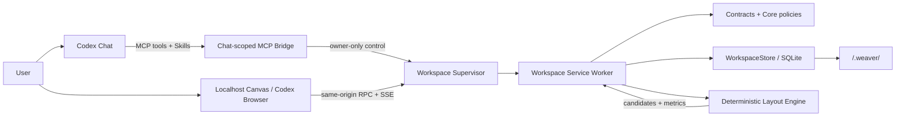

# Weaver Next Agent Guide

本文件是所有开发 Agent 进入仓库后的第一入口。开始工作前必须同时阅读：

- [product.md](product.md)：产品愿景、目标用户、核心问题与产品边界。
- [WORKFLOW.md](WORKFLOW.md)：强制开发流程、TDD 规则和 UI 真实页面验收规则。
- [docs/PRD-Weaver-Redesign-2026.md](docs/PRD-Weaver-Redesign-2026.md)：当前产品需求的详细事实源。
- [docs/architecture-current.md](docs/architecture-current.md)：当前运行时、状态权威与数据兼容架构。

`docs/rebuild-plan.md` 与 `docs/architecture/` 已废弃，只可用于了解早期 tree-first 重建背景，不得作为当前需求、架构或里程碑依据。

若现行文档互相冲突，优先级为：最新 PRD 明确决策 > 本文件的工程约束 > `WORKFLOW.md` 的执行流程。发现冲突时不要静默猜测，应在实现说明中指出并修正文档。

## 项目是什么

Weaver 是一个由 Codex 插件驱动、以 workspace 级 localhost Canvas 为正式操作界面的场景化语义知识空间。底层核心工件是带类型的 Node/Edge 图谱；自由画布、树、关系图、流程、时间线、看板、矩阵和表格只是同一内容图谱的独立投影。

用户在 localhost Canvas 中编辑、选择和组织内容，在 Codex Chat 中表达自然语言意图。Agent 读取当前 Chat 精确绑定的 Canvas 上下文，提交可审计的 `GraphOperation`、`ChangeSet` 或语义化 `LayoutPlan`；确定性布局引擎负责最终坐标，Canvas 负责预览、确认、撤销和实时反馈。Codex 右侧内置浏览器是首选容器，系统浏览器只作为降级入口。

## 核心设计

### 1. 内容和呈现严格分离

- Graph 是内容权威，内容变更只递增 `graphRevision`。
- 每个 View 有独立 `LayoutDocument` 和 `layoutRevision`。
- 坐标、尺寸、Pin、路由、Projection、Theme 和 viewport 相关操作不得递增 `graphRevision`。
- View 目录元数据使用 `viewCatalogRevision`；Chat/Canvas 租约切换使用 `bindingRevision`。
- 同一 Graph 可有多个 View；应用模板到已有项目只能创建 View，不得静默插入内容节点。

### 2. Agent 提交意图，系统计算结果

- Coding Agent 可以生成语义 Graph 操作、ChangeSet 和 LayoutPlan 约束。
- Agent 不得直接修改 SQLite，不得绕过 ChangeSet 审计，不得发明未经校验的最终坐标。
- 最终坐标由确定性布局引擎计算、评分并生成候选。
- pinned node、no-overlap、project path confinement、preview、apply/reject、undo 是约束，不是建议。

### 3. Chat 与 Canvas 精确绑定

- 一个 Codex Chat 同一时间只允许一个可写 Canvas Session。
- `threadId` 只在 MCP Server 内哈希为 `chatSessionKey`，不得存储或输出原始 Chat 标识。
- selection、viewport、focused node、Pin 和 presence 同步不旋转租约。
- Project/View 显式切换递增 binding revision，并使旧 Session 失效。
- AgentTask 必须绑定当前在线 Session；离线、opening、duplicate、detached 或 stale Session 均不得继续写入。
- 项目级 Graph/Layout 事件广播到相关 Session；Task 与 binding 事件按 Session 隔离。

### 4. 本地优先与可恢复

- 项目数据保存在 `<workspace>/.weaver/`，SQLite 是权威状态。
- Chat 级 MCP bridge 通过 stdio 提供结构化工具；workspace supervisor/worker 通过受限 loopback HTTP 提供 Canvas、RPC 和 SSE。
- Canvas 必须能通过 revision 核对恢复遗漏事件，不能依赖旧页面收到完整历史广播。
- Canvas 在 Chat/MCP 离线时仍允许经过审计的手动编辑；Agent 写入必须要求在线、精确配对且 revision/lease 有效的 Chat binding。
- viewport 恢复失败不能阻止 Session 激活；应降级为 Fit All 并给出可见警告。
- 优先保持简单的 local-first 架构，不为未来假设提前引入分布式系统。

### 5. 场景化上下文

- Scene Pack 固定节点类型、关系类型、上下文策略、推荐视图、Agent actions 和产物类型。
- branching/argument 场景保留 `ancestor_path` 隔离；其他场景使用有界的类型邻域与用户 Pin。
- 默认不得把整个 Graph 无边界塞入模型上下文。

## 运行时架构



关键数据流：

1. `weaver_open_space` 确保 workspace runtime、创建一次性 pairing nonce，并由 Skill 优先在 Codex 右侧浏览器打开或复用 Canvas。
2. Canvas 领取 Browser Session 与 Project writer lease，加载 Project/Graph/Layout；同一 Project 的第二个标签页默认只读，显式接管才可写。
3. Session 激活后异步恢复 viewport，再发送完整 state snapshot。
4. Canvas 将 selection、focused node、Pin、viewport 和 revisions 同步到 workspace service。
5. Codex 根据当前 Chat binding 准备并执行 AgentTask；浏览器不得自行声明 Chat 身份或 Agent 权限。
6. 内容写入经过 ChangeSet/validated manual mutation；布局写入经过 LayoutPlan/validated layout operations。
7. SQLite 事务同时写入状态、审计记录和 ProjectEvent；SSE 推送增量。
8. Canvas 幂等应用 delta，序列缺口或 revision 落后时重新读取权威 Graph/Layout。

## 目录地图

| 路径 | 职责 |
|---|---|
| `apps/widget/` | 迁移期 Canvas 源码；最终机械重命名为 `apps/canvas/`，生产与 E2E 使用同一 localhost 应用。 |
| `apps/widget/src/hooks/` | Bootstrap、Canvas 状态、绑定同步、SSE、文档编辑和 View 管理等前端领域逻辑。 |
| `apps/widget/src/components/` | Canvas、节点、边、导航、编辑器和任务预览 UI。 |
| `apps/widget/src/__tests__/` | 迁移期 Canvas 纯逻辑与交互相关回归测试。 |
| `packages/contracts/` | Zod schema、共享类型、错误和 API contract；跨层数据的唯一结构定义。 |
| `packages/core/` | 无 IO 的 Graph、LayoutOperation、上下文策略等纯领域逻辑。 |
| `packages/layout-engine/` | 确定性布局、候选生成、连线路由和质量评分。 |
| `packages/storage/` | `WorkspaceStore`、SQLite schema/事务、Graph/Layout/View/Task/事件持久化。 |
| `packages/mcp/` | Chat 级 stdio MCP bridge、model-facing Tools、可信 Chat identity 与 workspace service client。 |
| `packages/workspace-service/` | 目标 workspace worker；Canvas HTTP/RPC/SSE、Browser Session、业务操作与 SQLite 单一运行时所有者。 |
| `packages/workspace-supervisor/` | 目标按 workspace 按需 supervisor；稳定 loopback origin、worker 恢复、build 升级与空闲退出。 |
| `packages/scene-packs/` | 内置场景包及上下文/动作规则。 |
| `packages/visual-templates/` | 不可变、版本化的结构化视觉模板目录。 |
| `skills/` | 面向 Coding Agent 的稳定 Weaver 工作流。 |
| `scripts/` | MCP 启动、开发入口、探针和 benchmark。 |
| `docs/` | PRD、架构、设计和实施计划。 |
| `.codex-plugin/` | Codex 插件 manifest 和安装配置。 |
| `.weaver/` | 当前 workspace 的本地运行数据；不要手工编辑或提交业务状态。 |

## 工程边界

- 不要整体搬运旧 Weaver 模块；只有符合当前 branching/semantic-space loop 时才可复用，并记录原因。
- Schema 变更必须保持 legacy 数据可读；能用默认值兼容时不做无意义迁移。
- 所有写路径必须验证 Project/View/Session/revision 边界。
- 布局操作必须保持 `graphRevision` 不变。
- 文件和 Asset 必须限制在 project/workspace 路径内；禁止把任意本地路径暴露给 Canvas 或模型。
- 正式 Canvas 只有 localhost 一种业务运行模式；Codex 右侧浏览器、Claude 系统浏览器和 Playwright 只是容器，不得产生前端业务分叉。能力由服务端 bootstrap 下发，不得通过 hostname/query 推导。
- Codex/Claude 都通过 Chat 级 MCP bridge 与同一个 workspace service 配对。Codex 必须使用可信 thread metadata 哈希；Claude 可使用 bridge 生成的宿主身份。进程 `cwd` 不得代替精确 Chat pairing。
- 正式 loopback `/app`、`/api/bootstrap`、`/api/rpc`、`/events` 只绑 `127.0.0.1`，同源、workspace 钉死、操作白名单、最小 CSP，并校验 Host/Origin/CSRF；浏览器身份来自一次性 pairing 与 HttpOnly Session，不取自普通请求参数。
- 未配对的 localhost Canvas 不得启动 AgentTask，但允许经过 contracts/revision/事务/审计的手动编辑，并清楚显示 `Local editing · Agent disconnected`。
- Canvas runtime、workspace service、supervisor、插件和 MCP bridge 必须校验 build/protocol version；不允许混合版本继续写入。
- 开发态 Canvas bundle 可热更新并通过 runtime SSE 自动刷新；HTML 与资源必须钉死同一 buildId，杜绝版本错配白屏。
- **改 workspace service/supervisor/MCP/contracts/scene-packs 等服务端代码后必须重启或升级对应 worker/bridge**，再做真实页面验收，避免用旧 schema/逻辑得出错误结论。

## 开发与验收

所有变更必须遵循 [WORKFLOW.md](WORKFLOW.md)。最重要的完成标准：

- 使用 TDD：先写会失败的测试，再实现，再重构。
- Frontend/package 测试放在对应 `__tests__/`。
- 至少运行与改动直接相关的 typecheck/test；跨包协议、Storage、MCP 或发布链路改动运行完整回归。
- 任何 UI 行为、样式、响应式、交互、加载态或浏览器生命周期变更，都必须在真实本地页面完成点击/输入/刷新验证。
- UI 任务只有单元测试通过不算完成；最终报告必须写明实际操作路径、观察到的 DOM/视觉结果以及浏览器控制台错误情况。

常用命令：

```bash
npm install
npm --workspace @weaver/widget run dev
npm run typecheck:widget
npm run build:plugin
npm run test
node scripts/probe-mcp.mjs
```

## Agent skills

### Issue tracker

Issues and PRDs are tracked in GitHub Issues for `guangtouwangba/weaver-next`. See `docs/agents/issue-tracker.md`.

### Triage labels

Triage uses the five default canonical labels. See `docs/agents/triage-labels.md`.

### Domain docs

Domain documentation uses a single-context layout. See `docs/agents/domain.md`.

## 修改策略

- 工作区可能存在用户未提交改动；只修改当前任务需要的文件，不覆盖、不回滚无关变化。
- 优先小步、可验证、可回滚的改动。
- 修复根因，不用延时、重复 reload 或吞掉异常掩盖状态机问题。
- 状态栏和错误页应暴露可行动信息：Project、View、Session、错误码和 revisions，而不是无限 Loading。
- 完成后更新受影响文档；若实现改变了产品边界，同时更新 `product.md` 和 PRD。
