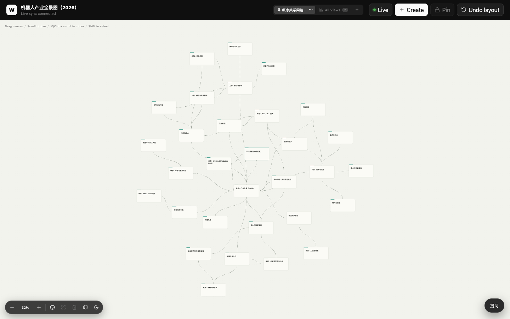
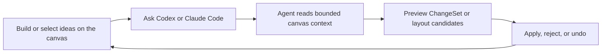
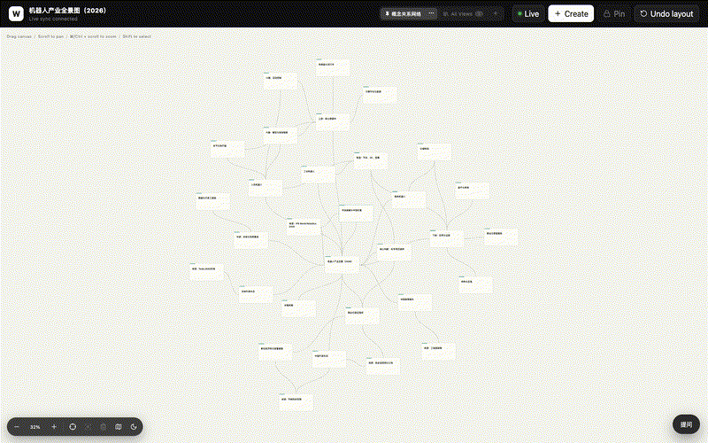

# Weaver Next

**Thinking branches. Chat does not.**

Weaver is a local-first semantic canvas where you and your coding agent can branch ideas, switch views, and review every AI change. It runs inside Codex as a native plugin and beside Claude Code as a live browser canvas.

> Early development · macOS · [MIT](LICENSE) · [中文介绍](#中文介绍)



## Why Weaver

Deep work rarely moves in a straight line. You compare hypotheses, follow evidence, revisit an earlier idea, merge useful branches, and abandon dead ends. A chat transcript hides that structure; a generic whiteboard cannot safely tell an agent what the structure means.

Weaver keeps the structure itself:

- **Branch without losing context.** Scene-aware nodes and typed relationships preserve how ideas connect.
- **Work with the exact selection.** Codex or Claude Code receives the active canvas, focused node, selection, pinned context, viewport, and revisions.
- **Review every AI edit.** Agents submit auditable ChangeSets and semantic layout plans. You preview, apply, reject, or undo them.
- **Project one graph into many views.** Use Canvas, Tree, Graph, Flow, Timeline, Board, Matrix, or Table without duplicating the underlying content.
- **Keep your data local.** SQLite-backed project state stays under `<workspace>/.weaver/`.

## Install

### Codex

```bash
codex plugin marketplace add guangtouwangba/weaver-next
codex plugin add weaver-next@weaver
```

Open a fresh Codex task in your project and ask:

```text
Open the Weaver space for this project.
```

### Claude Code

Requires macOS and Node.js 24 or newer.

```bash
git clone --depth 1 https://github.com/guangtouwangba/weaver-next.git \
  ~/.local/share/weaver-next
~/.local/share/weaver-next/install.sh claude
```

Restart Claude Code or run `/reload-skills`, then use `/weaver-open`. Run `/weaver-watch` to send instructions from the browser canvas.

See the complete [installation, upgrade, uninstall, and troubleshooting guide](docs/INSTALLATION.md).

## The Core Loop



1. Start with a goal, a visual template, or an existing Weaver project.
2. Add documents, local images, public links, semantic nodes, and typed relationships.
3. Select the part that matters and ask the coding agent to develop, challenge, reorganize, or lay it out.
4. Review the proposed content or layout before it changes the authoritative graph.
5. Continue exploring, then crystallize the useful structure into a scene-defined artifact.



## What Ships Today

| Status | Capability |
|---|---|
| Available | Native Codex Widget and Claude Code browser canvas |
| Available | Audited ChangeSets with preview, apply, reject, and undo |
| Available | Deterministic layout candidates and natural-language layout intent |
| Available | 13 scene packs for thinking, learning, research, and planning |
| Available | 16 versioned visual templates across 8 view families |
| Available | Markdown documents, project-local images, and safely enriched public links |
| Available | Exact Chat/Canvas binding, bounded context, revision checks, and SSE recovery |
| In progress | Deeper artifact workflows and end-to-end product polish |
| Planned | Broader platform support, collaboration, and an online template ecosystem |

The latest product boundary is documented in the [PRD](docs/PRD-Weaver-Redesign-2026.md). Roadmap items are not presented as current functionality.

## Built for Trust

The graph is content authority; every View has an independent layout document. Content changes increment `graphRevision`. Moving, pinning, routing, theming, or changing a projection increments only that View's `layoutRevision`.

An agent never writes SQLite directly or invents final coordinates. MCP tools validate the active Project, View, Canvas Session, lease, and revision before accepting a ChangeSet or LayoutPlan. A deterministic engine computes layout candidates. Loopback HTTP remains on `127.0.0.1`, uses a random token, and recovers dropped events through sequence and revision checks.

## Develop from Source

Source setup is for contributors, not required for installation:

```bash
git clone https://github.com/guangtouwangba/weaver-next.git
cd weaver-next
npm install
npm run build:plugin
npm test
```

Useful references:

- [Product vision](product.md)
- [Using Weaver](docs/USAGE.md)
- [Architecture and agent boundaries](AGENTS.md)
- [Contribution workflow](CONTRIBUTING.md)
- [Release process](docs/RELEASING.md)
- [Security policy](SECURITY.md)

## 中文介绍

**思考会分叉，Chat 不会。**

Weaver 是一个本地优先的语义画布，让你和 coding agent 在同一张可见、可分支、可回溯的空间里共同研究、规划和写作。它不是让 AI 直接覆盖整张白板，而是让每次内容与布局修改都可以预览、确认、拒绝和撤销。

它解决的是线性聊天难以承载复杂思考的问题：不同探索路径保留各自上下文，同一份语义图谱可以切换为自由画布、思维导图、关系图、流程图、时间线、看板、矩阵和表格。

Codex 用户可直接安装 GitHub Marketplace 插件：

```bash
codex plugin marketplace add guangtouwangba/weaver-next
codex plugin add weaver-next@weaver
```

Claude Code 用户可安装浏览器画布宿主：

```bash
git clone --depth 1 https://github.com/guangtouwangba/weaver-next.git \
  ~/.local/share/weaver-next
~/.local/share/weaver-next/install.sh claude
```

完整步骤、升级、卸载和故障排查见 [安装指南](docs/INSTALLATION.md)。项目处于早期开发阶段，首个公开版本仅承诺支持 macOS。

## License

[MIT](LICENSE) © Weaver contributors.
