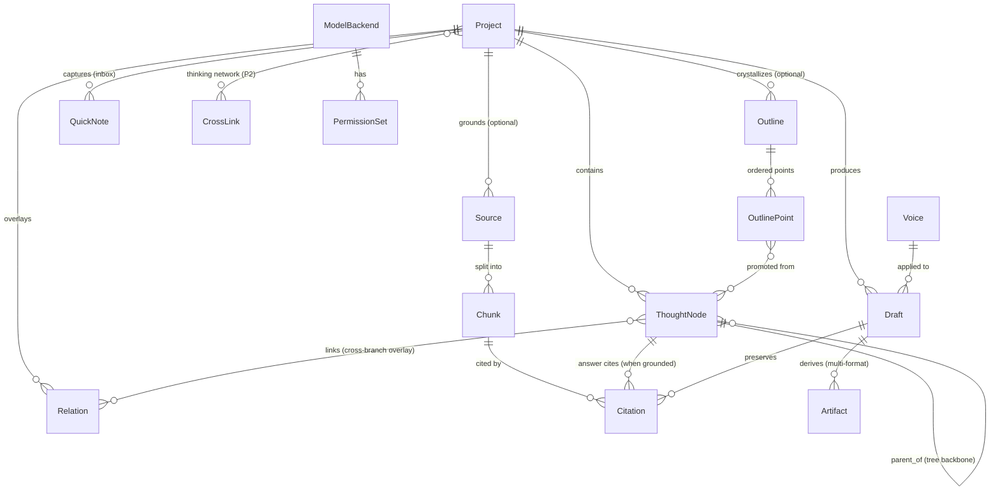
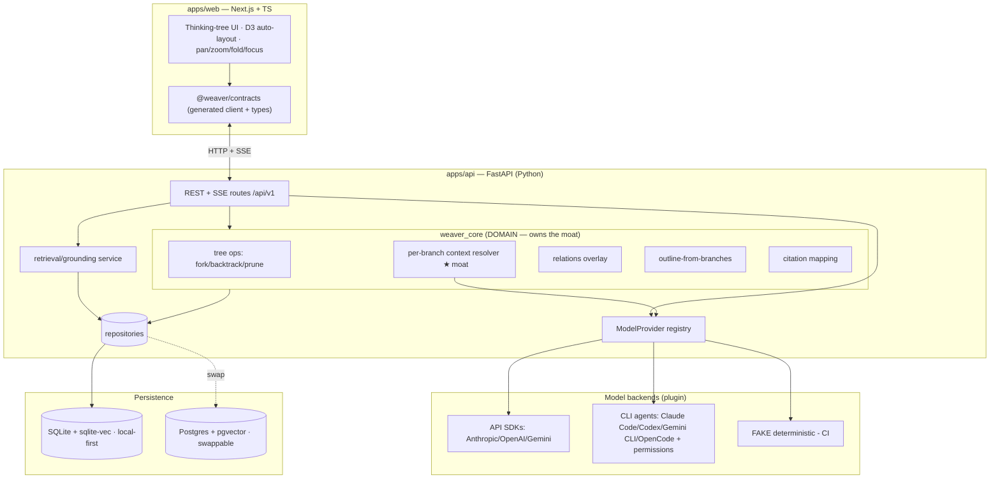

# 00 · Foundation — Canonical Architecture Contract

> **Status**: Authoritative. This is the single source of truth every other
> architecture doc conforms to.
> **Scope**: FULL VISION (P0/P1/P2). MVP boundary marked inline and in §9.
> **Upstream sources of truth**: `docs/PRD-Weaver-Redesign-2026.md` (中文,
> product spec), `docs/competitive-analysis-2026.md`, `docs/architecture.md`
> (initial sketch — deepened here, boundaries preserved), `docs/rebuild-plan.md`
> (M0–M6 milestones).

This document fixes the things that, if left to each sub-team, would diverge:

1. **Cross-cutting decisions** — where the domain core lives in a Python/TS
   split, the ModelProvider abstraction, persistence, jobs, API conventions.
2. **The canonical domain model** — entities, fields, relationships. Nobody
   redefines these.
3. **Repo structure** — the full cross-language monorepo tree.
4. **The doc plan** — the design docs the rest of the team writes.
5. **A glossary** so 中文 PRD terms and code terms map 1:1.

If you believe something here is wrong, do **not** silently diverge — record it
under *Open Questions* in your own doc and flag it.

---

## 0. Product truths this architecture must protect

These are non-negotiable and shape every decision below.

- The core artifact is a **branching thinking tree (思维树)**, never a free-form
  canvas. The backbone is a **tree** with auto-layout; cross-branch links are an
  additive `Relation` overlay, not hand-arranged geometry.
- **THE MOAT = per-branch context isolation (按分支隔离上下文)**: given a node,
  the resolved AI context is *only that node's ancestor chain*, never sibling
  branches. This is a **pure, first-class, unit-testable service, independent of
  any model call**. Built and tested first (M2).
- A **node = a thought segment + a user annotation** (一段思考 + 批注). Not
  locked to one Q&A; can carry a question/answer, an AI reasoning step, or a
  user-written thought plus annotation.
- **Sources are optional grounding.** The product works with zero sources
  (AI + your own ideas). When present, node answers carry **sentence-level
  clickable citations**.
- The **argument outline is an optional crystallization layer.** A draft can be
  generated **directly from selected branches**, bypassing the outline.
- **Voice (preset tone: academic / casual / professional) affects the DRAFT**,
  not just chat — a deliberate edge over NotebookLM Personas. *Contract-freeze
  (G6): Voice is a **draft-stage concern ONLY** and is **never applied to `/think`
  node answers** — node answers use a fixed neutral register, not the `VoiceTone`
  enum. This negative is intentional and frozen (see 03/06).*
- **Local-first, self-hosted, bring-your-own model. One user, not teams.**

---

## 1. Cross-cutting decisions

### 1.1 Where the domain core lives  (resolves binding decision #1)

**Decision: the domain core lives in Python (the API owns it). TypeScript
consumes generated types and never re-implements domain rules.**

The initial `architecture.md` sketch put domain logic in a TS `packages/core`.
That assumed a TS API. The product owner has fixed **API = Python (FastAPI)**.
We resolve the conflict as follows:

> **The authoritative domain logic — tree structure, fork/backtrack/prune,
> per-branch context resolution, relations, outline-from-branches, citation
> mapping — is implemented once, in Python, inside `apps/api/weaver_core/`.
> The TS frontend holds NO domain rules. It holds rendering, interaction, and a
> typed client generated from the API's OpenAPI schema.**

Why Python-owns-core (not shared-logic, not hybrid logic):

1. **The moat must have exactly one implementation.** Per-branch context
   resolution feeds model calls that happen server-side (API keys, CLI agents,
   retrieval all live in the API). Duplicating it in TS would create a second
   place for the most important algorithm to drift. One language, one source.
2. **Grounding/retrieval/embedding is Python-native** (PDF parsing, chunking,
   embeddings, Chinese tokenization). The core already has to live next to it.
3. **The frontend's job is genuinely different** — D3 auto-layout, pan/zoom,
   focus, fold/expand, compare panel. That is view logic, not domain logic, and
   belongs in TS.
4. A TS `packages/core` of *domain rules* would tempt contributors to compute
   "what context does this node see" client-side, which would silently break
   isolation guarantees. We forbid that by construction.

**How TS and Python stay in sync — schema-first, codegen, no hand-written
duplicate types:**

```
Python (Pydantic v2 models = source of truth for shapes)
        │  FastAPI auto-emits OpenAPI 3.1 (JSON Schema dialect)
        ▼
   openapi.json   ── checked in at packages/contracts/openapi.json
        │  codegen (openapi-typescript)  → types
        │  codegen (orval / openapi-fetch) → typed client + hooks
        ▼
TypeScript (packages/contracts: types + client, consumed by apps/web)
```

- **Source of truth for every wire shape = Pydantic models in
  `apps/api/weaver_core/schemas/`.** FastAPI serializes them and emits OpenAPI
  3.1 automatically.
- **`packages/contracts/`** holds the checked-in `openapi.json` plus the
  generated TS (`*.gen.ts`). Generation is a single `npm run codegen` /
  `make contracts` step.
- **CI guard**: a job regenerates the contract and fails if `openapi.json` or
  the generated TS is stale (drift = red build). This is the cross-language
  contract test required by repo conventions.
- TS code importing a domain type imports it from `@weaver/contracts`, never
  defines its own.
- Enums (`NodeState`, `VoiceTone`, `RelationKind`, `ArtifactFormat`,
  `BackendKind`, `Permission`) are declared once in Python and flow through the
  schema so both sides share identical string literals.

> **What about a tiny amount of geometry/layout math the frontend needs?**
> That is *view* logic (D3 layout coordinates), not domain logic. It lives in
> `apps/web` and is allowed there. The rule is narrow and precise: **domain
> rules (anything about what a node/branch *means* or *sees*) are Python-only;
> presentation is TS-only.**

**MVP vs Later**: MVP ships the full schema-first pipeline (it is cheap and
prevents drift from day one). Later phases only *add* schemas; the pipeline is
unchanged.

---

### 1.2 ModelProvider plugin abstraction  (resolves binding decision #2)

One plugin interface covers **both** backend families with a per-backend
**permission** model. This matches the prototype Settings screen (backends =
Anthropic/OpenAI/Gemini SDKs **and** Claude Code / Codex CLI / Gemini CLI /
OpenCode, each with Auto-run read-only / Allow file edits / Network access
toggles).

```python
# apps/api/weaver_core/model/provider.py  (canonical shape; full design in 02-*)

from enum import Enum
from typing import AsyncIterator, Protocol
from pydantic import BaseModel

class BackendKind(str, Enum):
    API_SDK   = "api_sdk"    # Anthropic / OpenAI / Gemini via SDK
    CLI_AGENT = "cli_agent"  # Claude Code / Codex CLI / Gemini CLI / OpenCode
    FAKE      = "fake"       # deterministic, CI-only

class Permission(str, Enum):
    AUTO_RUN_READONLY = "auto_run_readonly"  # auto-run read-only commands
    ALLOW_FILE_EDITS  = "allow_file_edits"   # allow file edits
    NETWORK_ACCESS    = "network_access"     # allow network access

class PermissionSet(BaseModel):
    auto_run_readonly: bool = False
    allow_file_edits:  bool = False
    network_access:    bool = False

class GenerateRequest(BaseModel):
    system: str | None
    messages: list["ChatMessage"]      # already context-resolved upstream
    temperature: float | None = None
    max_tokens: int | None = None
    tools: list["ToolSpec"] | None = None
    response_schema: dict | None = None  # for structured calls (fork proposals)

class TokenEvent(BaseModel):
    # Contract-freeze (C1): 02-model-provider-and-agents.md OWNS the full TokenEvent
    # shape and the closed `type` enum below; 03/05 REFERENCE it by name and never
    # re-declare it or invent new `type` members. There is NO `ingest_progress`.
    type: str           # closed set: "token" | "tool_call" | "tool_result" | "citation" | "proposal" | "progress" | "done" | "error"
    data: dict
    seq: int            # monotonic per stream (ordering/cancel/idempotency)
    request_id: str | None = None

class ModelProvider(Protocol):
    kind: BackendKind
    id: str                      # stable backend id, e.g. "anthropic", "claude_code"
    permissions: PermissionSet   # ignored by API_SDK; enforced by CLI_AGENT

    async def generate(self, req: GenerateRequest) -> AsyncIterator[TokenEvent]:
        """Unified streaming generation. Yields TokenEvents.
        API_SDK: maps SDK stream -> TokenEvents.
        CLI_AGENT: spawns/drives the agent subprocess, enforcing permissions
                   on every command/edit/network action; maps stdout -> TokenEvents.
        FAKE:    deterministic scripted TokenEvents for CI."""
        ...

    async def health(self) -> "BackendHealth": ...
```

Key contract rules (binding; elaborated in `02-model-provider-and-agents.md`):

- **The provider never resolves context.** It receives already-context-resolved
  `messages`. Per-branch isolation happens *before* the provider is called, in
  `weaver_core`. This keeps the moat independent of any model call (a core
  product truth).
- **Permissions are meaningful only for `CLI_AGENT`.** For API SDKs they are
  inert. For CLI agents they gate command execution / file edits / network
  per backend, enforced by the API process, not delegated to the agent's own
  trust prompts.
- **Streaming is the default output mode** (token-by-token), surfaced over the
  API as SSE/NDJSON (§1.5).
- **A deterministic `FAKE` provider is first-class**, selected by env in CI, so
  every test that would call a model is reproducible.
- **AI-proposed forks** are a *structured* generation (`response_schema`) over
  the same interface — not a special endpoint to a special model.

**MVP vs Later**: MVP ships `API_SDK` (≥1 provider) + `FAKE`, plus the
permission *model* and the registry. `CLI_AGENT` backends are wired through the
same interface but can land progressively (MVP+1). No interface change later.

---

### 1.3 Persistence

**Decision: repository interfaces (Protocols) in `weaver_core`; default impl
= SQLite (local-first); Postgres swappable behind the same interface.**

- One repository per aggregate root: `ProjectRepo`, `NodeRepo`, `RelationRepo`,
  `SourceRepo`, `OutlineRepo`, `DraftRepo`, `ArtifactRepo`, `BackendRepo`,
  `QuickNoteRepo`, `CrossLinkRepo` (P2).
- **SQLAlchemy 2.0** as the implementation layer; **Alembic** migrations. SQLite
  (file, WAL) for local-first single-user; Postgres for self-host-scale — same
  ORM models, dialect-specific bits isolated.
- **No raw SQL in `weaver_core` services.** Services depend on repository
  Protocols only; concrete repos live in `apps/api/weaver_core/persistence/`.
- **Embeddings/vectors**: SQLite uses `sqlite-vec` (or a flat numpy fallback for
  tiny corpora); Postgres uses `pgvector`. Hidden behind a `VectorIndex`
  interface so retrieval code is storage-agnostic. (Optional — only on grounded
  projects.)
- **IDs**: ULIDs (sortable, URL-safe) as string PKs everywhere.
- **Soft semantics over hard delete** where the product says "don't delete":
  pruned branches are `state = "dead_end"` + collapsed, *not* removed (PRD §2.2
  剪枝: "不删除，留作'我试过、走不通'的记录").

Full schema/DDL, migration, backup/restore in `07-persistence-deployment-ops.md`.

**MVP vs Later**: MVP = SQLite + Alembic + the repo Protocols. Postgres +
pgvector is a config swap proven by the interface, exercised later.

---

### 1.4 Background jobs policy

**Decision: synchronous-first. Jobs are introduced only for work proven too slow
to do in-request — and only for ingestion/embedding, never for the core loop.**

- The **think loop is synchronous + streaming** (ask → context-resolve →
  stream tokens). It must feel live; no queue in the hot path.
- **Ingestion (PDF/URL parse → chunk → embed) is the one async-eligible path.**
  MVP may do small sources inline with a progress channel; large docs (P1 "大文档
  完整处理，可见进度") move to a job with visible progress.
- **Job runner**: start with an in-process `asyncio` task + a `jobs` table
  (status, progress, error) polled/streamed by the UI. Only escalate to an
  external worker/broker if a real bottleneck appears (rebuild-plan: "Background
  jobs are introduced only after synchronous work is proven too slow").
- Jobs are **idempotent and resumable** (chunking/embedding can re-run).

**MVP vs Later**: MVP = inline ingestion with a progress field (jobs table
optional). Later = the same table backs an out-of-process worker if needed.

---

### 1.5 API contract conventions  (FastAPI)

**Decision: resource-oriented REST + JSON; SSE for token streaming; one
canonical error envelope; OpenAPI 3.1 is the contract.**

- **REST, not RPC**, for resources (`/projects`, `/projects/{id}/nodes`,
  `/nodes/{id}/fork`, `/drafts`, …). Actions that are genuinely verbs on a
  resource use a sub-path (`POST /nodes/{id}/fork`, `POST /nodes/{id}/prune`,
  `POST /branches/{id}/promote`). This stays close to the entity vocabulary and
  is naturally describable in OpenAPI for codegen.
- **Streaming**: token output and AI-proposed-fork generation stream via
  **Server-Sent Events** (`text/event-stream`) carrying the `TokenEvent` shape
  from §1.2. (NDJSON is the documented fallback for non-SSE clients.) Streaming
  endpoints are marked in OpenAPI with a documented event schema.
- **Error envelope** (every non-2xx):
  ```json
  { "error": { "code": "NODE_NOT_FOUND",
               "message": "human readable",
               "details": { } } }
  ```
  `code` is a stable machine enum; `message` is for humans; `details` is
  structured. The TS client maps `code` → typed errors.
- **IDs in URLs are ULIDs.** **Times are UTC ISO-8601.** **Pagination** is
  cursor-based (`?cursor=&limit=`).
- **Versioning**: path prefix `/api/v1`. Breaking changes bump the prefix; the
  generated client tracks it.
- **Auth**: single-user, local-first → a local bearer token / same-origin
  session by default; no multi-tenant auth in scope. (Non-goal: multi-tenant.)

Full route catalog, request/response schemas, and SSE event tables in
`03-api-service-and-contracts.md`.

---

### 1.6 Branch is a derived value object, not a stored table (binding)

**Decision: `Branch` is computed from the `ThoughtNode` forest, never persisted
as its own table.** A branch is the ordered path root→…→node (a node's ancestor
chain). Fork/backtrack/prune are operations on `ThoughtNode.parent_id` + lineage,
not on a separate branch row.

Why: a `branches` table would have to stay in sync with the node tree on every
fork/backtrack/prune, creating a second source of truth for the structure that
the **moat** depends on. By making `Branch` a pure value object
(`Branch = ordered list[ThoughtNode]`) derived by `weaver_core`, the tree is the
*only* truth and `resolve_branch_context` cannot disagree with what is stored.

Conformance rule for all docs: never introduce a persisted branch identity; if a
branch needs a display label, denormalize `branch_label?` onto its head node. The
API exposes branches as derived read models, not CRUD resources.

---

## 2. Canonical domain model

This is the **single source** for entities. Everyone uses these names, fields,
and relationships. Implemented as Pydantic + SQLAlchemy in `weaver_core`; flows
to TS via codegen (§1.1). Field lists are the load-bearing core, not exhaustive
column DDL (that's `07-*`).

### 2.1 Entity-relationship overview



### 2.2 Entities

> Conventions: every entity has `id: ULID`, `created_at`, `updated_at`.
> `MVP` / `P1` / `P2` marks scope.

**Project** `MVP` — a thinking topic / a piece to produce.
- `title`, `description?`, `voice_default: VoiceTone?`,
  `grounding_enabled: bool` (derived: has ≥1 Source), `default_backend_id?`.
- Has many: ThoughtNode, Source, Relation, Outline, Draft, QuickNote.

**ThoughtNode** `MVP` — *the tree's unit.* **A thought segment + annotation**
(PRD 已决议 #1). Not bound to one Q&A.
- `project_id`, `parent_id: ULID?` (null = root; defines the **tree backbone**),
  `kind: NodeKind` (`question_answer` | `ai_reasoning` | `user_thought`),
  `prompt?` (the question/intent), `content` (the thought segment / answer),
  `annotation?` (用户批注), `state: NodeState`
  (`open` | `promising` | `dead_end` — matches prototype "Open / Promising /
  Dead end"), `collapsed: bool`, `backend_id?` (which backend produced it),
  `order_index` (sibling ordering for stable layout).
- Citations: 0..n (only when grounded).
- **Invariant**: `parent_id` forms a forest per project; no cycles. Cross-branch
  links are NOT edges here — they are `Relation` rows.

**Branch** `MVP` — *derived, not a stored table.* A branch = the path
root→…→node (its ancestor chain). The **per-branch context** of a node is the
ordered ancestor chain (§3). Branch operations (fork, backtrack, prune) are
operations on ThoughtNode + its lineage. We model it as a *value object*
(`Branch = ordered list[ThoughtNode]`) computed by `weaver_core`, so there is no
sync risk between a "branch table" and the node tree. (A `branch_label?` may be
denormalized onto the head node for display.)

**Relation** `P1` (overlay) — additive cross-branch link; never a backbone edge.
- `project_id`, `from_node_id`, `to_node_id`, `kind: RelationKind`
  (`merge` 汇合 | `connection` 相通 | `contradiction` 反例), `note?`,
  `created_by` (`user` | `ai`).
- Rendered as an overlay layer on top of the tree (PRD §2.3 决策2).

**Source** `MVP (optional)` — optional grounding input.
- `project_id`, `kind: SourceKind` (`url` | `pdf` | `text` | `markdown` |
  `video` P1 | `audio` P1), `title`, `origin` (url/filename), `raw_ref`
  (blob/text pointer), `status` (`pending`|`ready`|`failed`),
  `ingest_progress: float`.
- Has many Chunk.

**Chunk** `MVP (optional)` — a retrievable segment of a Source.
- `source_id`, `ordinal`, `text`, `char_start`, `char_end`,
  `section?` (chapter/heading for big-doc coverage), `embedding_ref?`,
  `token_count`.

**Citation** `MVP (optional)` — **sentence-level** link to source text.
- `chunk_id`, `source_id`, target back-ref (`node_id?` for node answers,
  `draft_id?` + `draft_anchor` for draft text), `quote` (the cited sentence
  span), `char_start`, `char_end` (offset into the **SOURCE canonical document
  text**, NOT the Chunk text), `confidence?`, `answer_span?` (the `[start,end]`
  span in the answer/draft text this citation supports), `method`
  (`marker` | `lexical` | `semantic` | `none`), `details?` (JSON, incl.
  staleness `{stale: bool, ...}`).
- **Contract-freeze (C4): `char_start`/`char_end` ALWAYS index the SOURCE's
  canonical document text** (the single coordinate space every parser emits, per
  05 §2.5); the cited substring is `source_canonical_text[char_start:char_end] ≈
  quote`. Storage homes for `answer_span`/`method`/`confidence`/`details` are the
  dedicated `citation` columns in 07. This file owns the Citation shape.
- This is the P0 hard indicator: "句子级 inline 引用接地，可点击直达原文".

**Outline** `MVP (optional)` — crystallization view of promising branches.
- `project_id`, `title`, `structure_template?` (`essay` | `analysis` | `story`
  — P2 template library), ordered many `OutlinePoint`.

**OutlinePoint** `MVP (optional)` — a promoted argument point.
- `outline_id`, `order_index`, `text` (the claim/论点),
  `source_node_ids: ULID[]` (promoted-from nodes — PRD "提升为论点"),
  `narrative_role?` (`cold_open`|`setup`|`turn`|`payoff`|`takeaway` — prototype
  narrative scaffolds), `note?`.

**Draft** `MVP` — long-form output.
- `project_id`, `outline_id?` (null = drafted **directly from branches**),
  `source_branch_node_ids: ULID[]` (which branches/nodes fed it),
  `voice: VoiceTone`, `body` (rich text / markdown AST), `format: ArtifactFormat`
  (default `article`), `grounded: bool`, `uncited_claims: list[str] = []`
  (server-derived; mirrored on 03 `DraftView` and stored in 07's `draft` DDL — C6).
- Preserves Citation (carried from node answers → draft text).

**Artifact** `P1` — a derived output **format** from a single Draft/Outline,
guaranteeing topic consistency (the anti-NotebookLM "multi-format consistency").
- `draft_id` (or `outline_id`), `format: ArtifactFormat`
  (`article` | `deck` | `x_thread` | `video_script` | `email` | `newsletter` |
  `docx` — prototype: Article / Deck / X Thread / Video / Email),
  `body`, `derived_from_hash` (provenance to detect staleness).
- Export of Markdown for an `article` is the MVP path; other formats are P1.

**Export** `MVP` — a materialized export of a Draft/Artifact.
- `target` (`markdown` MVP | `png` | `svg` P1 | `docx` P1), `payload_ref`,
  `citations_preserved: bool`.

**QuickNote** `MVP` — 速记 inbox (Dashboard).
- `project_id?` (may be unfiled), `text`, `promoted_node_id?` (when turned into
  a starting node).

**Voice** `MVP` — preset tone applied to drafts (not just chat).
- Modeled as the `VoiceTone` enum + a `Voice` config row for future
  "feed-a-sample-style" (P1): `tone: VoiceTone`
  (`academic` = "Precise, hedged, citation-forward" | `casual` = "Direct,
  first-person, conversational" | `professional` = "Clear, confident, brisk" —
  exact prototype presets), `sample_text?` (P1), `instructions?`,
  `style_directives?` (P1; derived/cached from `sample_text`, keyed by
  `hash(sample_text)` — stored on 07's `voice_config` row as
  `style_directives`/`sample_hash` — C6).

**ModelBackend** `MVP` — a configured model backend (Settings screen).
- `name`, `kind: BackendKind` (§1.2), `provider` (`anthropic`|`openai`|`gemini`|
  `claude_code`|`codex_cli`|`gemini_cli`|`opencode`|`fake`),
  `model?`, `endpoint?`, `api_key_ref?` (secret store ref, never inline),
  `permissions: PermissionSet` (CLI agents only), `enabled: bool`,
  `is_default: bool`.

**PermissionSet** `MVP` — value object on ModelBackend (§1.2): three booleans
(`auto_run_readonly`, `allow_file_edits`, `network_access`).

**CrossLink** `P2` — cross-project thinking-network edge.
- `from_project_id`, `to_project_id`, `from_node_id?`, `to_node_id?`,
  `kind` (`shared_theme`|`contradiction`|`continuation`), `note?`,
  `created_by` (`user`|`ai`). Enables "长期追同一议题" global thinking network.

### 2.3 Canonical enums

```python
class NodeKind(str, Enum):    QUESTION_ANSWER="question_answer"; AI_REASONING="ai_reasoning"; USER_THOUGHT="user_thought"
class NodeState(str, Enum):   OPEN="open"; PROMISING="promising"; DEAD_END="dead_end"
class RelationKind(str, Enum):MERGE="merge"; CONNECTION="connection"; CONTRADICTION="contradiction"
class SourceKind(str, Enum):  URL="url"; PDF="pdf"; TEXT="text"; MARKDOWN="markdown"; VIDEO="video"; AUDIO="audio"
class VoiceTone(str, Enum):   ACADEMIC="academic"; CASUAL="casual"; PROFESSIONAL="professional"
class ArtifactFormat(str,Enum):ARTICLE="article"; DECK="deck"; X_THREAD="x_thread"; VIDEO_SCRIPT="video_script"; EMAIL="email"; NEWSLETTER="newsletter"; DOCX="docx"
class NarrativeRole(str,Enum):COLD_OPEN="cold_open"; SETUP="setup"; TURN="turn"; PAYOFF="payoff"; TAKEAWAY="takeaway"
class BackendKind(str, Enum): API_SDK="api_sdk"; CLI_AGENT="cli_agent"; FAKE="fake"
class Permission(str, Enum):  AUTO_RUN_READONLY="auto_run_readonly"; ALLOW_FILE_EDITS="allow_file_edits"; NETWORK_ACCESS="network_access"
# Contract-freeze (C13): closed honesty vocabulary. OWNED by 01-domain-and-core-logic.md
# (declared once there, flows to TS via codegen); no other doc redeclares it.
class HonestyLabel(str, Enum): USER_JUDGMENT="user_judgment"; INFERRED="inferred"; GROUNDED="grounded"; WEAKLY_GROUNDED="weakly_grounded"
```

---

## 3. The moat, fixed at the foundation level

The per-branch context resolver is owned by `01-domain-and-core-logic.md`, but
its **contract** is fixed here so no other doc redefines it.

```python
# weaver_core/context/resolver.py  — PURE. No I/O. No model call.

def resolve_branch_context(node_id: ULID, nodes: NodeForest) -> BranchContext:
    """Return ONLY the ancestor chain of node_id: root -> ... -> node_id,
    in order. NEVER includes sibling branches or their descendants.
    `nodes` is an in-memory forest snapshot (no DB inside this function).
    Deterministic; fully unit-testable without any model."""
```

- **Guarantee**: for sibling nodes B and C under parent A, `resolve(B)` and
  `resolve(C)` share `[root..A]` and diverge after; neither contains the other.
- **Where it sits**: between "user asks at node X" and "ModelProvider.generate".
  The provider receives the resolved chain as `messages`; it cannot widen
  context. This is what makes the provider swap-able without touching the moat.
- **Pruned (`dead_end`) ancestors**: still part of lineage *for display*, but the
  resolver MAY exclude `dead_end` nodes from the model context (a setting). The
  default and the toggle semantics are owned by `01-*`; the *purity and
  ancestor-only* rule is fixed here.

---

## 4. System context & component view



Layering rules (binding):
- **UI renders state and sends intent.** No domain rules.
- **API owns orchestration.** Routes are thin; they call `weaver_core`.
- **`weaver_core` owns domain rules** (tree, branching, context resolution,
  relations, crystallize, citation mapping). Pure where it can be.
- **Retrieval owns source→context** (optional grounding), visible I/O, not hidden
  inside chat.
- **Persistence hidden behind repositories.**
- **ModelProvider is the only path to a model**, always fed pre-resolved context.

---

## 5. Repo structure (full cross-language monorepo)

```text
weaver-next/
├─ apps/
│  ├─ web/                         # Next.js + TypeScript frontend (owns 04-*)
│  │  ├─ app/                      # App Router: dashboard / project / draft / settings
│  │  ├─ components/
│  │  │  ├─ tree/                  # D3 auto-layout tree, pan/zoom, fold/expand, focus
│  │  │  ├─ node/                  # node card: states (open/promising/dead_end), annotation
│  │  │  ├─ compare/               # side-by-side branch compare panel (P1)
│  │  │  ├─ relations/             # cross-branch relation overlay (P1)
│  │  │  ├─ draft/                 # long-form editor + Voice + citations
│  │  │  └─ settings/              # model backends + permission toggles
│  │  ├─ lib/
│  │  │  └─ api/                   # thin wrappers over @weaver/contracts client
│  │  ├─ stores/                   # client state (tree view/focus/selection)
│  │  ├─ __tests__/                # frontend tests (repo convention)
│  │  └─ package.json
│  └─ api/                         # FastAPI (Python) — owns domain + everything server-side
│     ├─ weaver_api/               # HTTP layer: routes, SSE, deps, error envelope
│     │  ├─ main.py
│     │  ├─ routes/                # projects, nodes, relations, sources, outlines,
│     │  │                         #   drafts, artifacts, exports, backends, quicknotes
│     │  └─ sse.py
│     ├─ weaver_core/              # ★ DOMAIN CORE (Python owns it — decision #1)
│     │  ├─ schemas/               # Pydantic models = source of truth for wire shapes
│     │  ├─ tree/                  # fork / backtrack / prune / fold / forest ops
│     │  ├─ context/               # ★ per-branch context resolver (the moat) — PURE
│     │  ├─ relations/             # cross-branch overlay logic
│     │  ├─ crystallize/           # branches -> outline; outline ordering; narrative roles
│     │  ├─ draft/                 # branches/outline -> draft; voice application; multi-format
│     │  ├─ citation/              # sentence-level citation mapping
│     │  ├─ model/                 # ModelProvider protocol + registry + FAKE
│     │  │  ├─ provider.py
│     │  │  ├─ sdk/                # anthropic / openai / gemini adapters
│     │  │  ├─ cli/                # claude_code / codex / gemini_cli / opencode + permission gate
│     │  │  └─ fake.py             # deterministic CI provider
│     │  ├─ retrieval/             # chunking, embedding, vector index, sentence mapping
│     │  └─ persistence/           # repository Protocols + SQLAlchemy impls + VectorIndex
│     ├─ migrations/               # Alembic
│     ├─ tests/                    # pytest (repo convention)
│     │  ├─ unit/                  # context resolver, tree ops, citation mapping, crystallize
│     │  ├─ contract/              # per-route API contract tests
│     │  └─ conftest.py            # FAKE model wired by default
│     └─ pyproject.toml
├─ packages/
│  └─ contracts/                   # CROSS-LANGUAGE CONTRACT (decision #1 sync mechanism)
│     ├─ openapi.json              # emitted by FastAPI; checked in; CI drift-guarded
│     ├─ generated/                # openapi-typescript types + typed client (*.gen.ts)
│     └─ package.json              # exposes @weaver/contracts to apps/web
├─ docs/
│  ├─ PRD-Weaver-Redesign-2026.md  competitive-analysis-2026.md  rebuild-plan.md
│  ├─ architecture.md              # initial sketch (kept)
│  └─ architecture/                # ← this team's docs
│     ├─ 00-foundation.md          (this file)
│     ├─ 01-domain-and-core-logic.md
│     ├─ 02-model-provider-and-agents.md
│     ├─ 03-api-service-and-contracts.md
│     ├─ 04-frontend-and-tree-rendering.md
│     ├─ 05-retrieval-and-grounding.md
│     ├─ 06-crystallize-draft-export-multiformat.md
│     ├─ 07-persistence-deployment-ops.md
│     └─ 08-cross-project-network-and-extensibility.md
├─ tooling/
│  ├─ codegen/                     # openapi -> TS step (npm run codegen / make contracts)
│  └─ docker/                      # Dockerfiles + docker-compose (07-*)
├─ Makefile                        # contracts, test, lint, dev, codegen
└─ README.md  AGENTS.md  .gitignore
```

**Resolution vs the old `packages/core` (TS) sketch**: `packages/core` and
`packages/retrieval` from the original sketch are **superseded** — that domain
logic now lives in Python `weaver_core/` (decision #1). `packages/` keeps only
the cross-language `contracts` artifact. The *boundaries* from
`architecture.md` (UI/API/core/retrieval/persistence) are preserved; only the
*language home of the core* changed, with explicit justification (§1.1).

---

## 6. Build sequence (maps to rebuild-plan M0–M6)

1. **M0** repo skeleton + this foundation + contracts pipeline + FAKE provider.
2. **M1** Project model + repositories (SQLite) + project CRUD.
3. **M2 ★** ThoughtNode/tree + **per-branch context resolver (the moat, tested
   first)** + ModelProvider (SDK + FAKE) + fork/backtrack/prune + AI-proposed
   forks + auto-layout render. *This is the riskiest, highest-value slice; it
   goes early per PRD §10 next-step.*
4. **M3** optional source grounding: ingestion → chunk → embed → retrieval →
   sentence-level citations on node answers. Tree still works with zero sources.
5. **M4** crystallize (optional outline) + draft (direct-from-branches OR via
   outline) + Voice (preset tone, applied to draft).
6. **M5** export Markdown preserving citations + end-to-end smoke test.
7. **M6** Docker Compose, prod env template, backup/restore.
8. **Later** Relations/compare/merge, multi-format Artifacts, CLI agents,
   browser capture, video transcription, cross-project network (P2).

Every milestone ships its smoke test mirroring the core loop; CI runs with the
FAKE provider for determinism.

---

## 7. Testing & determinism contract (binding for all docs)

- **Unit (pytest)**: per-branch context resolver (purity + ancestor-only +
  sibling-isolation), fork/backtrack/prune forest logic, citation mapping,
  outline-from-branches, voice application shape.
- **Contract (pytest)**: one test per API route against the OpenAPI schema;
  the SSE event schema is asserted.
- **Cross-language**: CI fails if `packages/contracts/openapi.json` or generated
  TS is stale (drift guard).
- **Frontend (`__tests__/`)**: tree layout/fold/focus, node-state rendering,
  client mapping of the error envelope; one browser smoke test per milestone.
- **Determinism**: the **FAKE** ModelProvider is the default in CI; no test
  reaches a real model or network.

---

## 8. Doc plan (the rest of the team writes these)

| # | File | Title | Depends on |
|---|------|-------|-----------|
| 01 | `docs/architecture/01-domain-and-core-logic.md` | Domain & Core Logic (incl. the per-branch context resolution algorithm — THE MOAT) | 00 |
| 02 | `docs/architecture/02-model-provider-and-agents.md` | Model Provider & Agent Integration (CLI agents, permissions, AI-proposed forks, FAKE) | 00, 01 |
| 03 | `docs/architecture/03-api-service-and-contracts.md` | API Service Design & Contracts (FastAPI, REST, SSE, errors, codegen) | 00, 01, 02 |
| 04 | `docs/architecture/04-frontend-and-tree-rendering.md` | Frontend & Thinking-Tree Rendering (Next.js, D3 auto-layout, pan/zoom, fold/focus, node states, compare, relation overlay, state mgmt) | 00, 03 |
| 05 | `docs/architecture/05-retrieval-and-grounding.md` | Retrieval & Grounding (chunking, embedding, sentence-level citation mapping, Chinese optimization — optional) | 00, 01 |
| 06 | `docs/architecture/06-crystallize-draft-export-multiformat.md` | Crystallize → Draft → Export → Multi-format (outline, Voice-to-draft, citation-preserving export, single-source multi-format) | 00, 01, 05 |
| 07 | `docs/architecture/07-persistence-deployment-ops.md` | Persistence, Deployment & Ops (repositories, SQLite/Postgres, pgvector, Docker Compose, backup/restore, jobs) | 00 |
| 08 | `docs/architecture/08-cross-project-network-and-extensibility.md` | Cross-Project Thinking Network & Extensibility (P2: CrossLink, global network, plugin surface) | 00, 01 |

(Full per-doc scope and mustCover bullets are returned in the structured object.)

---

## 9. MVP vs Later (foundation-level summary)

- **MVP (3 pages: Dashboard, Thinking Tree w/ optional source sidebar, Draft;
  milestones M1–M5)**: Python `weaver_core` + the moat; ModelProvider with
  `API_SDK` + `FAKE` + the permission *model*; SQLite + repos; synchronous
  streaming think loop; optional grounding with sentence-level citations;
  optional outline; direct-from-branches draft; Voice preset tones applied to
  draft; Markdown export; contracts codegen + drift guard.
- **Later (P1/P2)**: `CLI_AGENT` backends (Claude Code/Codex/Gemini CLI/
  OpenCode) with live permission enforcement; Relations/compare/merge; AI
  gap/counter-example marking; multi-format Artifacts from one source; browser
  capture; video/podcast transcription; big-doc full coverage with jobs;
  Postgres+pgvector; cross-project thinking network (CrossLink); structure
  templates; PNG/SVG/DOCX export.

---

## 10. Glossary (中文 PRD ↔ code term)

| 中文 (PRD) | English / code term | Entity / service |
|-----------|---------------------|------------------|
| 思维树 | thinking tree | ThoughtNode forest |
| 节点（一段思考+批注）| node (thought segment + annotation) | `ThoughtNode` |
| 分叉 | fork | `tree.fork` |
| 回溯 | backtrack (refocus) | `tree.backtrack` |
| 并比 | compare | compare panel (P1) |
| 汇合 | merge | `Relation(kind=merge)` |
| 剪枝 / 死胡同 | prune / dead end | `tree.prune`, `NodeState.DEAD_END` |
| 按分支隔离上下文 | per-branch context isolation | `context.resolve_branch_context` ★ |
| 跨枝连线 | cross-branch link (overlay) | `Relation` |
| 接地 / 素材 | grounding / source (optional) | `Source` / retrieval |
| 句子级引用 | sentence-level citation | `Citation` |
| 结晶 / 提升为论点 | crystallize / promote to point | `Outline` / `OutlinePoint` |
| 论证大纲 | argument outline (optional) | `Outline` |
| 成稿 / 初稿 | draft | `Draft` |
| Voice / 预设 tone | voice / preset tone (academic/casual/professional) | `VoiceTone` |
| 多格式产出（同源派生）| multi-format output (single-source derived) | `Artifact` |
| 速记 inbox | quick-note inbox | `QuickNote` |
| 模型后端 / 权限开关 | model backend / permission toggles | `ModelBackend` / `PermissionSet` |
| CLI 代理后端 | CLI agent backend | `BackendKind.CLI_AGENT` |
| 跨项目思维网络 | cross-project thinking network (P2) | `CrossLink` |
| AI 提议分叉 | AI-proposed fork | structured generation via `ModelProvider` |
| 叙事脚手架 | narrative scaffold | `NarrativeRole` |

---

## 11. Open questions (flag, do not silently resolve)

- **Dead-end ancestors in context**: default ON/OFF for including pruned
  ancestors in resolved model context? (`01-*` decides the default; foundation
  fixes only purity + ancestor-only.)
- **AI-proposed-fork cadence**: how many directions, when to offer (PRD §10
  待评审). UI/UX tuning, but the *response_schema* lives in `02-*`.
- **No-source honesty marking**: how to label `inferred` (AI inference) vs user
  judgment when ungrounded (PRD §10). Likely a node/citation honesty flag —
  `01-*`/`05-*` to specify.
- **Tree scale ceiling**: auto-merge/focus mechanism when a project's node count
  grows (PRD §10). `04-*` (view) + possibly `01-*` (summarization).
- **Voice "feed-a-sample" (P1)**: where style extraction runs — kept as `Voice.
  sample_text` placeholder now; `06-*` to design.
