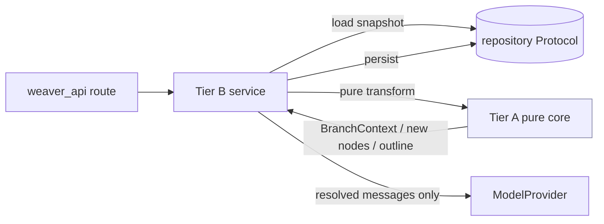
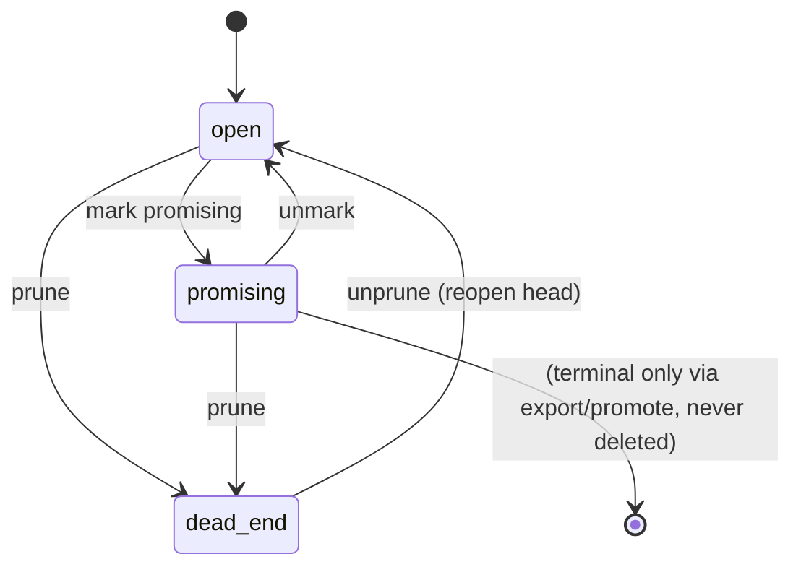
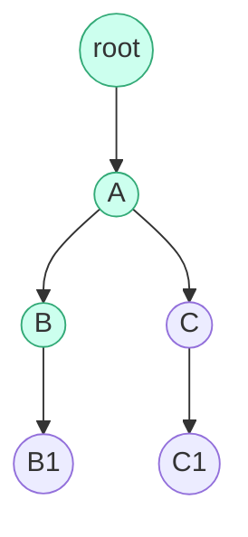

# 01 · Domain & Core Logic — incl. the per-branch context resolution algorithm (THE MOAT)

> **Status**: Design. Conforms to `00-foundation.md` (authoritative). Where this
> doc would extend the foundation, it does so within the contracts fixed there;
> any disagreement is recorded under **Open Questions**, never silently diverged.
> **Scope**: FULL VISION (P0/P1/P2), MVP boundary marked inline and in §12.
> **Owner module**: `apps/api/weaver_core/` (Python — the API owns the domain;
> foundation §1.1, §1.6).
> **Depends on**: `00-foundation.md`.
> **Downstream consumers**: `02-model-provider-and-agents.md` (receives resolved
> context), `03-api-service-and-contracts.md` (exposes these services as routes),
> `05-retrieval-and-grounding.md` (citation mapping inputs), `06-crystallize-…`
> (outline + draft), `04-frontend-…` (renders the derived read models).

This doc owns the **domain core**: the `ThoughtNode` forest, `Branch` as a
derived value object, tree operations (fork / backtrack / prune / fold), the
relations overlay, outline-from-branches crystallization, and — above all —
**`resolve_branch_context`, the per-branch context resolution algorithm (THE
MOAT)**, with its purity and testability guarantees.

---

## 0. What this module is and is not

`weaver_core` is the **pure-as-possible domain layer**. It is the only place that
knows what a node/branch *means* and *sees*. It is the layer whose correctness is
the product's competitive moat.

| `weaver_core` IS | `weaver_core` is NOT |
|---|---|
| The single implementation of the tree model + the moat (foundation §1.1) | A model caller — it never calls `ModelProvider` itself in the pure parts |
| Pure functions over in-memory snapshots where possible (esp. the moat) | A persistence layer — it depends on repository *Protocols*, not SQL |
| The source of truth for `Branch` (derived, never stored — foundation §1.6) | A transport layer — no FastAPI/HTTP/SSE knowledge |
| Storage-agnostic (no raw SQL; repos injected) | A view layer — no D3/layout/geometry (that is `apps/web`) |

Two purity tiers, used consistently below:

- **Tier A — Pure core (no I/O, no clock, no randomness, no model).**
  `context/`, `tree/` (pure transforms), `relations/` validation,
  `crystallize/` ordering. These take an in-memory snapshot in, return a value
  out. They are the unit-test bedrock and where the moat lives.
- **Tier B — Orchestrating services (do I/O via injected repos; may call the
  model provider).** `*_service.py` modules that load a snapshot from a repo,
  invoke Tier-A functions, and persist results. They never re-implement domain
  rules; they only wire Tier A to repositories and (for think/draft) to the
  provider — and only ever feed the provider a context that Tier A produced.



---

## 1. Module map (`weaver_core/`)

```text
weaver_core/
├─ schemas/                # Pydantic v2 models = source of truth for wire shapes
│  ├─ ids.py               # ULID type alias + validators
│  ├─ enums.py             # canonical enums (re-export of foundation §2.3); OWNS HonestyLabel (§9, C13)
│  ├─ node.py              # ThoughtNode, NodeForest, Branch, BranchContext
│  ├─ relation.py          # Relation
│  ├─ outline.py           # Outline, OutlinePoint
│  ├─ project.py           # Project
│  └─ context.py           # ContextPolicy, ContextMessage, BranchContext
├─ tree/                   # Tier A pure forest ops + Tier B service
│  ├─ forest.py            # NodeForest index, invariants, ancestor walk
│  ├─ ops.py               # fork / backtrack / prune / fold (pure transforms)
│  ├─ validate.py          # invariant checks (cycles, single-root-per-tree, order)
│  └─ tree_service.py      # Tier B: load → op → persist
├─ context/                # ★ THE MOAT — Tier A only, PURE
│  ├─ resolver.py          # resolve_branch_context(node_id, forest, policy)
│  ├─ policy.py            # ContextPolicy (dead-end inclusion default + toggles)
│  └─ render.py            # BranchContext → list[ContextMessage] for the provider
├─ relations/              # cross-branch overlay (P1)
│  ├─ ops.py               # add/validate relation; NEVER mutate parent_id
│  └─ relation_service.py
├─ crystallize/            # branches -> outline (M4)
│  ├─ promote.py           # nodes -> OutlinePoint; ordering; narrative roles
│  └─ crystallize_service.py
├─ draft/                  # branches/outline -> draft (M4; detail in 06-*)
├─ citation/               # sentence-level citation mapping (M3; detail in 05-*)
├─ honesty.py              # inferred vs user-judgment marking (no-source mode)
└─ persistence/            # repository Protocols (impls per foundation §1.3)
```

This doc fully specifies `schemas/{node,context,relation,outline}.py`, `tree/`,
`context/`, `relations/ops.py`, `crystallize/promote.py`, and `honesty.py`.
`citation/` and `draft/` shapes are referenced; their algorithms live in `05-*`
and `06-*`.

---

## 2. Core data shapes

All shapes are Pydantic v2 (source of truth for the wire, foundation §1.1). The
fields are the foundation's canonical domain model (§2.2); this section pins the
exact Python shapes the core operates on.

### 2.1 `ThoughtNode`, `NodeForest`

```python
# weaver_core/schemas/node.py
from __future__ import annotations
from pydantic import BaseModel, Field
from datetime import datetime
from .ids import ULID
from .enums import NodeKind, NodeState

class ThoughtNode(BaseModel):
    id: ULID
    project_id: ULID
    parent_id: ULID | None          # None == a root of the project's forest
    kind: NodeKind                  # question_answer | ai_reasoning | user_thought
    prompt: str | None = None       # the question/intent that produced this node
    content: str                    # the thought segment / answer body
    annotation: str | None = None   # 用户批注 — first-class, not metadata
    state: NodeState = NodeState.OPEN
    collapsed: bool = False         # fold state (view hint persisted on the node)
    backend_id: ULID | None = None  # which ModelBackend produced it (if AI)
    order_index: int = 0            # stable sibling ordering for layout
    branch_label: str | None = None # denormalized display label (foundation §1.6)
    created_at: datetime
    updated_at: datetime
```

`NodeForest` is the **in-memory snapshot** the pure core operates on. It is *the*
input to the moat. It is built once per request from `NodeRepo`, then passed by
value into pure functions — guaranteeing the moat never touches the DB.

```python
# weaver_core/schemas/node.py  (continued)
class NodeForest(BaseModel):
    """An immutable, indexed snapshot of one project's node tree.
    Construct via NodeForest.build(nodes); do not mutate after build."""
    project_id: ULID
    nodes: dict[ULID, ThoughtNode]          # id -> node
    children: dict[ULID, list[ULID]]        # parent_id -> [child ids], order_index-sorted
    roots: list[ULID]                       # parent_id is None, order_index-sorted

    @classmethod
    def build(cls, project_id: ULID, nodes: list[ThoughtNode]) -> "NodeForest":
        index = {n.id: n for n in nodes}
        children: dict[ULID, list[ULID]] = {}
        roots: list[ULID] = []
        for n in nodes:
            (roots if n.parent_id is None else children.setdefault(n.parent_id, [])).append(n.id)  # noqa
        # actually append id; corrected below
        ...
        return cls(project_id=project_id, nodes=index, children=children, roots=roots)
```

> Implementation note: `build` sorts every `children[*]` and `roots` by
> `(order_index, id)` so traversal is deterministic. `id` is a tie-breaker; since
> IDs are ULIDs (sortable), equal `order_index` resolves by creation order. The
> snapshot is treated as frozen — pure functions return *new* nodes/forests, they
> never mutate the snapshot in place.

### 2.2 `Branch` (derived value object — never persisted; foundation §1.6)

```python
# weaver_core/schemas/node.py  (continued)
class Branch(BaseModel):
    """A node's ancestor chain root -> ... -> head, IN ORDER.
    Derived from the forest; NEVER a stored table. (foundation §1.6)"""
    head_id: ULID                 # the node this branch terminates at
    node_ids: list[ULID]          # ordered [root, ..., head_id]
    label: str | None = None      # head.branch_label if present (display only)

    @property
    def depth(self) -> int: return len(self.node_ids)
```

`Branch` is computed by `forest.branch_of(head_id)`; there is no `BranchRepo`,
no `branches` table, no branch CRUD route. The tree is the only source of truth.

### 2.3 `BranchContext` and `ContextMessage` (the moat's output)

```python
# weaver_core/schemas/context.py
from pydantic import BaseModel
from .ids import ULID
from .node import ThoughtNode

class ContextMessage(BaseModel):
    """One turn in the resolved context, ready to hand to a ModelProvider.
    Provider-agnostic; 02-* maps these to SDK/CLI message formats."""
    role: str                 # "user" | "assistant" | "system"
    content: str
    node_id: ULID             # provenance: which node this turn came from
    state: str                # node state at resolution time (for honesty marks)
    is_inferred: bool = False # no-source honesty flag (§9)

class BranchContext(BaseModel):
    """THE MOAT'S OUTPUT. The ordered ancestor chain of a node, resolved into
    a context the model may see. PURE-derived; deterministic; ancestor-only."""
    project_id: ULID
    target_node_id: ULID
    chain: list[ThoughtNode]          # [root, ..., target] AFTER policy filtering
    excluded_dead_end_ids: list[ULID] # ancestors dropped by policy (auditable)
    grounding_enabled: bool           # whether sources exist for this project
    policy_fingerprint: str           # hash of ContextPolicy used (reproducibility)

    def to_messages(self, system: str | None = None) -> list[ContextMessage]: ...
```

The two-step shape is deliberate: `BranchContext` is the *auditable domain value*
(what the node sees, why, what was excluded); `to_messages()` is the *render* for
the provider. Tests assert on `BranchContext` (pure, no model); `02-*` consumes
`to_messages()`.

---

## 3. Tree invariants (binding)

The forest is the single source of truth; these invariants are enforced by
`tree/validate.py` and asserted in tests. Any operation that would break one is
rejected with a typed domain error (mapped to the API error envelope, foundation
§1.5).

| # | Invariant | Enforced by | Error code |
|---|---|---|---|
| I1 | **Forest per project**: every node belongs to exactly one project; `parent_id` (if set) references a node in the same project. | `validate.same_project_parent` | `CROSS_PROJECT_PARENT` |
| I2 | **No cycles**: following `parent_id` from any node reaches a root in finite steps; a node is never its own ancestor. | `validate.acyclic` (on fork/reparent) | `CYCLE_DETECTED` |
| I3 | **Single parent**: a node has at most one `parent_id` (it is a tree, not a DAG). Cross-branch links are `Relation` rows, never second parents. | type + `relations` never touch `parent_id` | `MULTIPLE_PARENTS` |
| I4 | **Stable sibling order**: siblings ordered by `(order_index, id)`; `order_index` is dense-enough integers assigned on insert; reorders rewrite indices. | `forest.build`, `ops.fork` | — |
| I5 | **Root validity**: `parent_id is None` ⇔ node is a project root; a project may have multiple roots (e.g. several QuickNote-promoted starting nodes). | `forest.roots` | — |
| I6 | **Prune never deletes**: prune sets `state=dead_end` + `collapsed=true`; the subtree stays in the forest (PRD §2.2 "不删除，留作记录"). | `ops.prune` | — |
| I7 | **State machine**: `state` transitions are limited (§4.4). | `ops.set_state` | `ILLEGAL_STATE_TRANSITION` |
| I8 | **Relation additivity**: a `Relation` never becomes a backbone edge; removing all relations leaves the tree identical (§6). | `relations/ops.py` | `RELATION_AS_BACKBONE` |

> Note on I5 (multiple roots): the foundation models a *forest* per project, not a
> single tree (e.g. several speculative starting thoughts before one is forked
> from). The moat is unaffected — `resolve_branch_context` walks one node's lineage
> up to *its* root, whichever root that is.

---

## 4. Tree operations (`tree/ops.py`, `tree/tree_service.py`)

All structural mutation goes through these. Tier A functions are pure transforms
over a `NodeForest`; the Tier B service loads the snapshot, applies the pure
transform, validates invariants, and persists the diff.

### 4.1 The six PRD thinking actions → operations

| 思考动作 (PRD §1.2) | Operation | Mutates | Notes |
|---|---|---|---|
| 岔开 fork | `fork` | inserts child node(s) under a node | explicit OR AI-proposed (same op; AI path provides candidate `content`) |
| 回溯 backtrack | `backtrack` | **no structural mutation** — refocus only | old branch stays; sets the "current focus" (a view concern echoed by the service returning the focused branch) |
| 并比 compare (P1) | `compare` | read-only | derives two `Branch`es + their `BranchContext`s side by side |
| 汇合 merge (P1) | `add_relation(kind=merge)` | adds a `Relation` overlay | never reparents (I3, I8); optional AI-synthesized child node is a *separate* `fork` |
| 剪枝 prune | `prune` | `state=dead_end`, `collapsed=true` on subtree head | I6: no delete |
| 各带上下文 isolation | `resolve_branch_context` | read-only | THE MOAT, §5 |

> **Backtrack is not a structural mutation.** PRD §2.2: "点任意旧节点→成为当前焦点，
> 新输入从这里长出；旧分支不消失，只失焦变灰." Refocus = the next `fork` simply uses the
> old node as `parent_id`. The "current focus" is client view state (`apps/web`
> `stores/`); the service exposes a convenience that returns the focused node's
> `Branch` + `BranchContext` so the next think turn is ready. No node is moved.

### 4.2 `fork` (the core write — explicit and AI-proposed share this)

```python
# weaver_core/tree/ops.py  — Tier A, pure transform
from dataclasses import dataclass
from .forest import NodeForest
from ..schemas.node import ThoughtNode

@dataclass(frozen=True)
class ForkSpec:
    parent_id: ULID | None      # None => create a new root (e.g. promote QuickNote)
    kind: NodeKind
    content: str
    prompt: str | None = None
    annotation: str | None = None
    backend_id: ULID | None = None
    branch_label: str | None = None

def fork(forest: NodeForest, spec: ForkSpec, *, new_id: ULID, now: datetime) -> tuple[NodeForest, ThoughtNode]:
    """Insert a child under spec.parent_id (or a new root). PURE: returns a NEW
    forest + the created node. Caller supplies new_id and now so the function
    stays deterministic and clock-free (no randomness/time inside the core)."""
    if spec.parent_id is not None and spec.parent_id not in forest.nodes:
        raise DomainError("NODE_NOT_FOUND", parent_id=spec.parent_id)
    siblings = forest.children.get(spec.parent_id, []) if spec.parent_id else forest.roots
    order_index = _next_order_index(forest, siblings)
    node = ThoughtNode(
        id=new_id, project_id=forest.project_id, parent_id=spec.parent_id,
        kind=spec.kind, prompt=spec.prompt, content=spec.content,
        annotation=spec.annotation, state=NodeState.OPEN, collapsed=False,
        backend_id=spec.backend_id, order_index=order_index,
        branch_label=spec.branch_label, created_at=now, updated_at=now,
    )
    new_forest = forest.with_node(node)   # returns a new indexed snapshot
    validate.assert_invariants(new_forest, changed={node.id})  # I1, I2, I4
    return new_forest, node
```

- **`new_id` and `now` are injected**, never generated inside the pure function —
  this is what keeps `fork` deterministic and unit-testable without mocks.
- **AI-proposed fork** uses the same `fork`. The provider produces *candidate*
  forks via structured generation (`response_schema`, foundation §1.2; algorithm
  in `02-*`); the candidate becomes `ForkSpec(kind=ai_reasoning, content=…)` and
  is committed only when the user accepts. There is no special "AI fork" path in
  the core — proposal is upstream, acceptance is an ordinary `fork`.
- **Multi-fork**: AI may propose N directions ("这里有 N 个方向值得分开想", PRD §2.2).
  The service calls `fork` N times under the same parent; each becomes a sibling.

### 4.3 `prune` (剪枝 — never delete; I6)

```python
def prune(forest: NodeForest, node_id: ULID, *, now: datetime) -> NodeForest:
    """Mark node_id's subtree dead_end + collapsed. Subtree stays in the forest
    (I6 / PRD §2.2). PURE: returns a new forest."""
    if node_id not in forest.nodes: raise DomainError("NODE_NOT_FOUND", node_id=node_id)
    affected = forest.descendants(node_id, include_self=True)
    updates = {nid: forest.nodes[nid].model_copy(update={
        "state": NodeState.DEAD_END, "collapsed": True, "updated_at": now,
    }) for nid in affected}
    return forest.with_nodes(updates.values())
```

`unprune` (reopen) is the inverse: set the subtree head back to `open` (children
keep their own states). Pruning the head implies the subtree is dead; reopening
only reopens the head — the user re-evaluates children explicitly.

### 4.4 Node state machine (I7)

States match the prototype ("Open / Promising / Dead end") and the enum
`NodeState` (foundation §2.3).



Allowed transitions: `open↔promising`, `open→dead_end`, `promising→dead_end`,
`dead_end→open`. Disallowed: `dead_end→promising` directly (must reopen first).
`collapsed` is orthogonal to `state` (a fold/view flag) — except prune sets both.

### 4.5 `fold` / expand

```python
def set_collapsed(forest: NodeForest, node_id: ULID, collapsed: bool, *, now) -> NodeForest:
    """Fold/expand a node. PRD §2.3 决策3: collapsed shows one-line gist;
    expanded shows full Q&A + citations. Pure flag flip; never affects context."""
```

`collapsed` is a persisted view hint (so a project reopens the way it was left),
but it is **invisible to the moat** — `resolve_branch_context` ignores `collapsed`
entirely. Folding affects only rendering, never what a node sees.

---

## 5. ★ THE MOAT — `resolve_branch_context`

This is the most important algorithm in the product. Its contract is fixed at the
foundation (§3); this section owns the **full algorithm, the dead-end policy
default and toggle, the purity/testability guarantees, and the proofs of the
isolation guarantee.**

### 5.1 Contract (restated, binding)

```python
# weaver_core/context/resolver.py — PURE. No I/O. No model. No clock. No randomness.
def resolve_branch_context(
    node_id: ULID,
    forest: NodeForest,
    policy: ContextPolicy = ContextPolicy.default(),
) -> BranchContext:
    """Return ONLY the ancestor chain of node_id: root -> ... -> node_id, in
    order, after applying `policy`. NEVER includes sibling branches or their
    descendants. Deterministic; fully unit-testable without any model."""
```

- **Pure**: depends only on its arguments. No DB, no network, no model, no clock,
  no global state, no randomness. Same `(node_id, forest, policy)` ⇒ byte-identical
  `BranchContext` (`policy_fingerprint` makes that auditable).
- **Ancestor-only**: the output `chain` is a subsequence of the lineage
  `[root, …, node_id]`. It can never contain a sibling, a cousin, a descendant,
  or any node off the direct path to the root.
- **Position**: it sits between "user asks at node X" and
  `ModelProvider.generate` (foundation §3). The provider receives
  `BranchContext.to_messages()` and **cannot widen** context — providers are
  swappable without touching the moat.

### 5.2 Algorithm

```text
function resolve_branch_context(node_id, forest, policy) -> BranchContext:

    # 1. Validate the target exists.
    if node_id not in forest.nodes:
        raise DomainError("NODE_NOT_FOUND", node_id)

    # 2. Walk strictly UP via parent_id, collecting the lineage.
    #    This is the whole isolation guarantee: we only ever follow parent_id,
    #    so we can only reach ancestors, never siblings/descendants.
    lineage = []                       # will be [node, parent, ..., root]
    seen = set()                       # cycle guard (defense-in-depth vs I2)
    cur = node_id
    while cur is not None:
        if cur in seen:                # should be impossible if I2 holds
            raise DomainError("CYCLE_DETECTED", cur)
        seen.add(cur)
        node = forest.nodes[cur]
        lineage.append(node)
        cur = node.parent_id

    lineage.reverse()                  # now [root, ..., node] — ORDERED

    # 3. Apply the dead-end policy (§5.3). The TARGET node is always kept,
    #    even if it is itself dead_end (you can still ask about a dead end).
    kept, excluded = [], []
    for n in lineage:
        is_target = (n.id == node_id)
        if n.state == DEAD_END and not is_target and not policy.include_dead_end_ancestors:
            excluded.append(n.id)
        else:
            kept.append(n)

    # 4. Optional depth cap (scale ceiling, §5.5) — keep root + most recent K,
    #    summarizing the dropped middle (P1). MVP: no cap.
    kept = policy.apply_depth_window(kept)   # identity in MVP

    # 5. Build the auditable value object. NOTE: no model call, no I/O here.
    return BranchContext(
        project_id=forest.project_id,
        target_node_id=node_id,
        chain=kept,
        excluded_dead_end_ids=excluded,
        grounding_enabled=forest_grounding_flag,   # passed in by caller-built forest
        policy_fingerprint=policy.fingerprint(),
    )
```

> The grounding flag is a project attribute (derived: has ≥1 ready Source). It is
> carried on the forest snapshot or passed alongside; the resolver itself does not
> query sources (purity). It only records *whether* grounding is on so `to_messages`
> and honesty-marking (§9) behave correctly.

### 5.3 The dead-end ancestor decision (foundation Open Question, resolved here)

The foundation fixes purity + ancestor-only and **delegates the default + toggle
semantics for including `dead_end` ancestors to this doc** (foundation §3, §11).

**Decision: by DEFAULT, `dead_end` *ancestors* are EXCLUDED from the resolved
model context, but the *target node itself* is always included even if it is
`dead_end`. A per-call/per-project toggle `include_dead_end_ancestors` can flip
the default.**

Rationale:

1. **Semantic correctness of the moat.** A `dead_end` ancestor is a branch the
   user explicitly judged "tried, doesn't work" (PRD §2.2 剪枝). Feeding it into a
   *descendant's* reasoning re-pollutes that descendant with a rejected premise —
   the exact failure mode the moat exists to prevent. Excluding it by default is
   the principled choice.
2. **But the lineage stays intact for display.** Dead-end ancestors are never
   removed from the *tree* (I6) and remain visible in the UI as greyed/collapsed.
   The exclusion is *only* from the **model** context, recorded transparently in
   `excluded_dead_end_ids` (auditable).
3. **The target is sacred.** If you click a `dead_end` node and ask "why did this
   fail / can it be salvaged?", you must be able to reason *about* it — so the
   target is always kept regardless of state.
4. **Escape hatch.** Some users want "show the AI everything I tried, including
   the dead ends, so it doesn't re-suggest them." `include_dead_end_ancestors =
   true` supports that. It is opt-in because the safe default is isolation.

Edge cases pinned:

- **Dead-end *between* two live ancestors** (root → A(open) → B(dead_end) →
  C(open) → target): with the default, `B` is excluded; the chain becomes
  `[A, C, target]`. This is intentional — `C` and `target` were pursued *after*
  judging `B` dead, so they should not carry `B`'s rejected premise. (If a user
  finds this surprising, that is precisely what the toggle is for; flagged in
  Open Questions for prototype validation.)
- **Target is dead_end**: kept (rule 3). Its dead-end *descendants* are never in
  context anyway (ancestor-only).
- **Whole chain dead_end except target**: chain = `[target]` only (a node that
  was forked off after pruning everything above it — rare but valid).

```python
# weaver_core/context/policy.py
class ContextPolicy(BaseModel):
    include_dead_end_ancestors: bool = False   # ← THE DEFAULT (exclude)
    depth_window: int | None = None            # None = unbounded (MVP); P1 cap
    system_preamble_mode: str = "branch"       # "branch" | "none"

    @classmethod
    def default(cls) -> "ContextPolicy": return cls()
    def fingerprint(self) -> str: ...          # stable hash → BranchContext.policy_fingerprint
    def apply_depth_window(self, chain): ...    # identity when depth_window is None
```

Policy precedence: explicit per-request override → `Project`-level setting →
`ContextPolicy.default()`. The chosen policy's fingerprint is recorded on every
`BranchContext` so a resolved context is fully reproducible from `(node_id,
forest, fingerprint)`.

### 5.4 Isolation guarantee — why siblings can never leak

The guarantee (foundation §3): *for sibling nodes B and C under parent A,
`resolve(B)` and `resolve(C)` share `[root..A]` and diverge after; neither
contains the other.*

This is a **structural property of the algorithm**, not a runtime check:

- Step 2 follows **only `parent_id`**. From `B`, the walk yields `B → A → … →
  root`. There is no edge in this traversal that can reach `C` (a sibling has the
  same parent `A`, but you reach a parent by going *up*; you never go *down* into
  `A`'s other children). Therefore `C ∉ resolve(B).chain` and `B ∉ resolve(C).chain`.
- `resolve(B).chain` and `resolve(C).chain` both contain `[root..A]` (same
  ancestors), then `B` resp. `C`. Shared prefix, divergent tail — exactly the
  guarantee.
- Because the only way into the chain is `parent_id`, **no `Relation` overlay can
  inject a node into context** (relations are not parent edges; I3/I8). The moat
  is immune to the relations layer by construction.



`resolve(B)` = `[root, A, B]` (green). `C`, `C1`, `B1` are unreachable by an
upward walk from `B`. Symmetric for `resolve(C)`.

### 5.5 Scale ceiling (PRD §10 待评审 — design hook, P1)

Very deep chains could exceed a model's context window or make answers sluggish
(PRD §10 "思维树规模上限"). The resolver supports an **optional depth window**
(`ContextPolicy.depth_window`): keep the root + the most recent `K` ancestors,
and replace the dropped middle with a single **summary `ContextMessage`**
(`role="system"`, `node_id` = the deepest dropped node, content = a deterministic
"[N earlier steps on this branch summarized]" placeholder in the pure core; the
*actual* summary text, if AI-generated, is produced upstream and cached on those
nodes, never inside the pure resolver).

- **MVP: `depth_window = None`** (unbounded; chains are short while validating the
  loop). The hook exists so adding a cap later is a policy change, not a core
  rewrite.
- The summary is still ancestor-derived — the isolation guarantee is preserved
  (we only ever compress *ancestors*, never pull in siblings).

### 5.6 `to_messages` — rendering the moat output for the provider

```python
# weaver_core/context/render.py
def to_messages(ctx: BranchContext, *, system: str | None) -> list[ContextMessage]:
    msgs: list[ContextMessage] = []
    if system: msgs.append(ContextMessage(role="system", content=system, node_id=ctx.target_node_id, state="open"))
    for n in ctx.chain:
        if n.kind == NodeKind.QUESTION_ANSWER:
            if n.prompt: msgs.append(_msg("user", n.prompt, n))
            msgs.append(_msg("assistant", n.content, n, inferred=_infer_flag(ctx, n)))
        elif n.kind == NodeKind.AI_REASONING:
            msgs.append(_msg("assistant", n.content, n, inferred=_infer_flag(ctx, n)))
        elif n.kind == NodeKind.USER_THOUGHT:
            body = n.content + (f"\n\n[annotation] {n.annotation}" if n.annotation else "")
            msgs.append(_msg("user", body, n))
    return msgs
```

This is still **pure** (no model). `02-*` maps `ContextMessage[]` to each
backend's concrete message format. The provider gets *only* these messages —
proving foundation §1.2: "the provider never resolves context."

---

## 6. Relations overlay (`relations/`, P1)

`Relation` is an **additive cross-branch link, never a backbone edge** (foundation
§2.2; PRD §2.3 决策2; invariant I3/I8).

```python
# weaver_core/relations/ops.py — Tier A validation
def validate_relation(forest: NodeForest, from_id: ULID, to_id: ULID, kind: RelationKind) -> None:
    for nid in (from_id, to_id):
        if nid not in forest.nodes: raise DomainError("NODE_NOT_FOUND", nid)
    if from_id == to_id: raise DomainError("SELF_RELATION", from_id)
    # I8: a relation must NOT be expressible as a parent edge — it links across
    # branches, not down one. (We don't forbid same-branch relations outright,
    # but they must never be persisted into parent_id; relations never reparent.)
```

Binding rules:

- Adding/removing a `Relation` **never** touches any `parent_id` or `order_index`.
  Remove every relation in a project and `NodeForest.build` produces an identical
  tree (I8). This is asserted in tests (§11, T-REL-2).
- `resolve_branch_context` **does not read `Relation` rows at all** — the moat is
  defined purely over `parent_id`. A `merge` relation is a *visual/semantic* note
  that two branches converge; it does not merge their contexts. (If a user wants
  the *content* of two branches combined, that is an explicit AI-synthesized
  `fork` whose new node's parent is one branch and which *references* the other —
  the synthesis text is generated upstream; the structural truth stays a tree.)
- Relations render as an overlay layer in `apps/web` (`components/relations/`);
  the core only stores/validates them.

`RelationKind`: `merge` (汇合) | `connection` (相通) | `contradiction` (反例).
`created_by` distinguishes user-drawn vs AI-suggested links (AI "发现汇合 / 标记反例",
PRD §2.4).

---

## 7. Outline-from-branches crystallization (`crystallize/`, M4)

The argument outline is the **optional crystallization view** of promising
branches (foundation §0; PRD §4.3). A draft can also be generated **directly from
branches**, bypassing the outline (foundation §0; PRD 已决议 #4) — that path lives
in `06-*`. This section owns **promote nodes → `OutlinePoint`, ordering, and
narrative roles.**

### 7.1 Promote

```python
# weaver_core/crystallize/promote.py — Tier A
@dataclass(frozen=True)
class PromoteSpec:
    node_ids: list[ULID]              # one or more nodes promoted into one claim
    text: str | None = None          # the claim; if None, derive a placeholder from nodes
    narrative_role: NarrativeRole | None = None
    note: str | None = None

def promote_to_point(forest: NodeForest, outline: Outline, spec: PromoteSpec,
                     *, new_id: ULID) -> OutlinePoint:
    for nid in spec.node_ids:
        if nid not in forest.nodes: raise DomainError("NODE_NOT_FOUND", nid)
    order_index = _next_order_index(outline.points)
    return OutlinePoint(
        id=new_id, outline_id=outline.id, order_index=order_index,
        text=spec.text or _gist(forest, spec.node_ids),  # deterministic gist (no model)
        source_node_ids=list(spec.node_ids),
        narrative_role=spec.narrative_role, note=spec.note,
    )
```

- An `OutlinePoint` is a **claim/论点** backed by one or more `source_node_ids`
  (foundation §2.2). This is the visible, auditable evidence→claim link that the
  competitive analysis identifies as the wedge ("claim 挂 evidence，可视可改可追").
- A point may aggregate **multiple nodes** (e.g. a claim supported by two branches
  that converge). The provenance set is preserved so the draft and its citations
  can trace back to exact nodes (and through them to source `Chunk`s when grounded).
- `text=None` ⇒ a **deterministic** gist placeholder (e.g. truncated first node
  content). An AI-proposed claim text is generated **upstream** via the provider
  and passed in as `spec.text`; the pure promote function never calls a model.

### 7.2 Ordering & narrative roles

- `OutlinePoint.order_index` gives a re-orderable sequence ("可重排的论证大纲",
  PRD §4.3). Reordering rewrites indices via `reorder_points(outline, ordered_ids)`
  (pure).
- `narrative_role: NarrativeRole?` tags a point with a scaffold slot —
  `cold_open | setup | turn | payoff | takeaway` (foundation §2.3; prototype "Cold
  open / Setup / Turn / Payoff", "THE SETUP / THE TAKEAWAY"). Roles are *optional
  hints* the draft generator (`06-*`) uses to shape narrative; the core only
  stores and validates them (at most one `cold_open`/`takeaway` per outline is a
  soft rule, warned not enforced, to keep the user free).
- **AI-proposed outline skeleton** (P1, PRD §4.3 "AI 提议大纲骨架"): the provider
  proposes an ordered list of `PromoteSpec`s via structured generation; the user
  accepts/edits; each accepted spec runs through the pure `promote_to_point`. Same
  pattern as AI-proposed fork: proposal upstream, commit through the pure path.

### 7.3 Direct-from-branches (no outline) — pointer

When the user skips the outline, the draft service (`06-*`) takes
`source_branch_node_ids` directly. The core service it calls is the *same* moat:
each selected branch is resolved via `resolve_branch_context` (so even draft
generation honors per-branch isolation per branch fed in). This doc fixes only
that the resolver is the shared entry point; the assembly into a draft is `06-*`.

---

## 8. The think loop (Tier B orchestration) — how the moat is wired

This sequence shows the **one place** the moat meets the model, proving the
provider is always fed pre-resolved context.

```mermaid
sequenceDiagram
    participant UI as apps/web
    participant API as weaver_api route
    participant SVC as tree_service (Tier B)
    participant REPO as NodeRepo
    participant CORE as resolver (Tier A · MOAT)
    participant MP as ModelProvider

    UI->>API: POST /nodes/{id}/think  (prompt, policy?)
    API->>SVC: think(node_id, prompt, policy)
    SVC->>REPO: load_project_nodes(project_id)
    REPO-->>SVC: list[ThoughtNode]
    SVC->>CORE: resolve_branch_context(node_id, forest, policy)
    Note over CORE: PURE — no DB, no model.<br/>Ancestor-only chain + dead-end policy.
    CORE-->>SVC: BranchContext (chain, excluded, fingerprint)
    SVC->>MP: generate(to_messages(ctx) + new prompt)
    Note over MP: provider CANNOT widen context;<br/>sees only the resolved chain
    MP-->>SVC: TokenEvent stream
    SVC->>REPO: persist answer ThoughtNode at `done` (if create_child=True)
    SVC-->>API: stream tokens (SSE)
    API-->>UI: text/event-stream
```

Key guarantees visible here:
- The resolver runs **before** the provider, on an in-memory snapshot loaded by
  the service — purity is preserved (the DB read is in Tier B, not inside the
  resolver).
- The provider receives `to_messages(ctx)`; it has no access to the forest, so it
  **cannot** add siblings. This is the architectural enforcement of the moat.
- **Answer-node lifecycle is governed by `03-*`'s `create_child` switch
  (Contract-freeze C11).** The default is `create_child=True`: `/think`
  auto-creates the child answer node and persists it (with citations) in a single
  transaction at the `done` boundary (`03-*` §4.5) — there is no separate accept
  step. `create_child=False` is the explicit, non-committing **preview**: the
  stream runs and tokens are returned but NO node is persisted (the terminal
  `done.node_id` is `null`). `01-*` references `create_child` by name as the switch
  between "preview" and "persisted answer"; the pure `fork` op (§4.2) remains the
  deterministic mechanism the service uses when `create_child=True`.

---

## 9. No-source honesty marking (PRD §10 待评审, resolved here)

PRD §10 待评审: "无素材模式下…如何标注'这是 AI 推断 / 这是我的判断'以保持可信（沿用
`inferred` 诚实原则）." The foundation flags this as an open question split between
`01-*` and `05-*` (foundation §11). This doc owns the **domain marking**; `05-*`
owns the grounded citation mechanics.

**Decision: honesty is a first-class derived flag on each context message and on
node answers, driven by `(node.kind, grounding_enabled, has_citations)`.**

> **Contract-freeze (C13): `01-*` OWNS the closed `HonestyLabel` enum.** It is
> declared here once and is the SINGLE source of the honesty vocabulary; it flows
> to TS via codegen (Pydantic → OpenAPI → `@weaver/contracts`). No other doc
> re-declares it: `06-*` references `HonestyLabel.user_judgment` (correcting its
> earlier `author_judgment`); `05-*` references `HonestyLabel.weakly_grounded`
> (underscore form, not the hyphenated `weakly-grounded`). The four members are
> exhaustive — the FE switches on them exhaustively.

```python
# weaver_core/schemas/enums.py — OWNED HERE (C13). Closed honesty vocabulary.
from enum import Enum

class HonestyLabel(str, Enum):
    USER_JUDGMENT = "user_judgment"      # 这是我的判断 — the user wrote it
    INFERRED = "inferred"                # 这是 AI 推断 — AI, no source backing
    GROUNDED = "grounded"                # ≥1 sentence-level Citation (05-*)
    WEAKLY_GROUNDED = "weakly_grounded"  # 05's low-confidence semantic match
```

```python
# weaver_core/honesty.py — Tier A, pure
def honesty_label(node: ThoughtNode, *, grounding_enabled: bool, has_citations: bool) -> HonestyLabel:
    if node.kind == NodeKind.USER_THOUGHT:
        return HonestyLabel.USER_JUDGMENT   # 这是我的判断 — the user wrote it
    if grounding_enabled and has_citations:
        return HonestyLabel.GROUNDED        # backed by source Chunks (sentence-level cites)
    # AI content with no source backing:
    return HonestyLabel.INFERRED            # 这是 AI 推断 — honesty flag
```

- `HonestyLabel.INFERRED` is surfaced on AI node answers that have no citation
  (ungrounded projects, or grounded projects where this particular answer cited
  nothing). The UI renders it as an explicit "AI inference, not source-backed" mark.
- `HonestyLabel.USER_JUDGMENT` distinguishes the user's own written
  thoughts/annotations from AI output — so "回看思维树" honestly shows what is yours
  vs the model's.
- `HonestyLabel.GROUNDED` is reserved for answers with ≥1 sentence-level
  `Citation` (`05-*`). **`HonestyLabel.WEAKLY_GROUNDED`** accepts `05-*`'s
  low-confidence-semantic case (a match below the high-confidence threshold):
  retrieval (`05-*`) only supplies the supported / unsupported / weak per-claim
  signals; **`01-*` sets the node-level label** from those signals plus
  `(node.kind, grounding_enabled)`. The hyphenated spelling is banned; the
  underscore form `weakly_grounded` keeps the generated TS literal stable.
- The flag flows into `ContextMessage.is_inferred` (§2.3) so even *downstream*
  reasoning knows which premises were AI-inferred vs evidence-backed vs the user's
  own judgment — strengthening the moat's honesty story.

This is intentionally a **derived** label (computed from node + grounding state),
not a stored column, so it can never go stale relative to citations.

---

## 10. Repository Protocols this core depends on

`weaver_core` services depend on **Protocols** only (foundation §1.3; impls in
`persistence/` per `07-*`). The pure core (`context/`, `tree/ops.py`,
`crystallize/promote.py`) depends on **nothing** — it takes snapshots/values.

```python
# weaver_core/persistence/protocols.py  (the slice this doc needs)
from typing import Protocol
from ..schemas.node import ThoughtNode
from ..schemas.relation import Relation
from ..schemas.outline import Outline, OutlinePoint

class NodeRepo(Protocol):
    def list_by_project(self, project_id: ULID) -> list[ThoughtNode]: ...
    def get(self, node_id: ULID) -> ThoughtNode | None: ...
    def upsert_many(self, nodes: list[ThoughtNode]) -> None: ...  # fork/prune diffs
    # NOTE: there is deliberately NO BranchRepo (foundation §1.6).

class RelationRepo(Protocol):
    def list_by_project(self, project_id: ULID) -> list[Relation]: ...
    def add(self, relation: Relation) -> None: ...
    def remove(self, relation_id: ULID) -> None: ...

class OutlineRepo(Protocol):
    def get_with_points(self, outline_id: ULID) -> tuple[Outline, list[OutlinePoint]] | None: ...
    def upsert(self, outline: Outline, points: list[OutlinePoint]) -> None: ...
```

The Tier B services build a `NodeForest` from `NodeRepo.list_by_project`, run the
pure transform, then persist via `upsert_many`. There is no `BranchRepo` — branch
identity is derived (foundation §1.6), so it cannot drift from the tree.

---

## 11. Testing

Conforms to the foundation testing contract (§7): the FAKE provider is default in
CI; **none of the pure-core tests need any model at all** — that is the whole
point of building the moat as Tier A.

### 11.1 Unit-test matrix — the moat (`tests/unit/test_context_resolver.py`)

| ID | Test | Asserts |
|---|---|---|
| T-CTX-1 | **Purity / determinism** | calling `resolve_branch_context` twice on the same `(node_id, forest, policy)` yields identical `BranchContext`; no DB/model imports reachable; `policy_fingerprint` stable. |
| T-CTX-2 | **Ancestor-only** | for a deep tree, `resolve(target).chain` is exactly a subsequence of `[root..target]`; contains **no** sibling/cousin/descendant id. |
| T-CTX-3 | **Sibling isolation (the guarantee)** | siblings B,C under A: `resolve(B)` and `resolve(C)` share `[root..A]`; `C ∉ resolve(B)`, `B ∉ resolve(C)`. |
| T-CTX-4 | **Dead-end default (exclude ancestors)** | with default policy, a `dead_end` ancestor is in `excluded_dead_end_ids`, not in `chain`. |
| T-CTX-5 | **Dead-end target kept** | a `dead_end` *target* node is always in `chain`. |
| T-CTX-6 | **Toggle ON** | `include_dead_end_ancestors=True` puts dead-end ancestors back into `chain`, empties `excluded`. |
| T-CTX-7 | **Dead-end between live nodes** | root→A(open)→B(dead)→C(open)→target ⇒ default chain = `[A,C,target]` (B excluded). |
| T-CTX-8 | **Cycle guard** | a forged cyclic forest raises `CYCLE_DETECTED` (defense-in-depth). |
| T-CTX-9 | **Collapsed invisible to moat** | flipping `collapsed` on ancestors does not change `chain`. |
| T-CTX-10 | **Relations invisible to moat** | adding any `Relation` does not change any `resolve_branch_context` output. |
| T-CTX-11 | **No-clock/no-rng** | resolver imports contain no `time`/`random`/`datetime.now`/DB (enforced by an import-lint test). |
| T-CTX-12 | **Depth window (P1)** | with `depth_window=K`, chain = root + last K + one summary message; still ancestor-only. |

### 11.2 Unit-test matrix — tree ops (`tests/unit/test_tree_ops.py`)

| ID | Test | Asserts |
|---|---|---|
| T-TREE-1 | fork explicit | inserts child under parent; `order_index` dense; returns new forest (input unchanged — immutability). |
| T-TREE-2 | fork new root | `parent_id=None` creates a root; multiple roots allowed (I5). |
| T-TREE-3 | fork determinism | injected `new_id`/`now` ⇒ identical node; no randomness/clock inside `fork`. |
| T-TREE-4 | AI multi-fork | N forks under one parent ⇒ N siblings, stable order. |
| T-TREE-5 | prune no-delete (I6) | prune marks subtree `dead_end`+`collapsed`; node count unchanged; subtree still walkable. |
| T-TREE-6 | unprune | reopens head to `open`, leaves children states untouched. |
| T-TREE-7 | backtrack non-mutation | "refocus" returns the focused branch + context; **no node moved**, forest byte-identical. |
| T-TREE-8 | state machine (I7) | legal transitions pass; `dead_end→promising` direct raises `ILLEGAL_STATE_TRANSITION`. |
| T-TREE-9 | invariants | cross-project parent ⇒ `CROSS_PROJECT_PARENT`; cycle attempt ⇒ `CYCLE_DETECTED`. |
| T-TREE-10 | fold flag | `set_collapsed` flips only `collapsed`; never touches `state`/structure. |

### 11.3 Unit-test matrix — relations & crystallize

| ID | Test | Asserts |
|---|---|---|
| T-REL-1 | relation validation | unknown/self relations rejected (`NODE_NOT_FOUND`/`SELF_RELATION`). |
| T-REL-2 | **additivity (I8)** | building the forest with all relations removed yields an identical tree (relations never reparent). |
| T-REL-3 | created_by | user vs ai provenance preserved. |
| T-CRYS-1 | promote single | one node ⇒ one `OutlinePoint` with `source_node_ids=[n]`. |
| T-CRYS-2 | promote multi | multiple nodes ⇒ one point aggregating provenance. |
| T-CRYS-3 | deterministic gist | `text=None` ⇒ deterministic placeholder (no model). |
| T-CRYS-4 | reorder | `reorder_points` rewrites `order_index` to match given order. |
| T-CRYS-5 | narrative role | role tag stored; soft single-`cold_open` rule warns, does not raise. |

### 11.4 Honesty marking & contract

| ID | Test | Asserts |
|---|---|---|
| T-HON-1 | user_thought ⇒ `user_judgment` regardless of grounding. |
| T-HON-2 | AI + ungrounded ⇒ `inferred`. |
| T-HON-3 | AI + grounded + has_citations ⇒ `grounded`; AI + grounded + no cites ⇒ `inferred`. |
| T-HON-4 | flag flows into `ContextMessage.is_inferred`. |
| T-CONTRACT-1 | Pydantic schemas serialize/deserialize round-trip; enums match foundation §2.3 string literals (drift guard upstream of OpenAPI codegen). |

### 11.5 Smoke (mirrors the core loop, FAKE provider)

`tests/contract/test_think_loop_smoke.py`: create project → fork two sibling
branches → `think` on each (FAKE) → assert each branch's resolved context excludes
the other sibling (the moat, end-to-end through the service + FAKE provider) →
promote one branch → assert outline point provenance. This is the M2 smoke test
the foundation requires per milestone.

---

## 12. MVP vs Later

| Capability | Milestone / Phase | Notes |
|---|---|---|
| `ThoughtNode` forest + `NodeForest` snapshot | **M2 (MVP)** | foundation §6 |
| `Branch` as derived value object (no table) | **M2 (MVP)** | foundation §1.6 |
| `fork` (explicit + AI-proposed via provider) | **M2 (MVP)** | proposal upstream, commit via pure `fork` |
| `backtrack` (refocus, non-mutating) | **M2 (MVP)** | view focus + ready branch/context |
| `prune` / `unprune` (no-delete, I6) | **M2 (MVP)** | PRD §2.2 |
| `fold`/expand | **M2 (MVP)** | view hint, invisible to moat |
| Node state machine (open/promising/dead_end) | **M2 (MVP)** | prototype states |
| **`resolve_branch_context` (THE MOAT)** | **M2 (MVP) — built & tested first** | pure, ancestor-only, dead-end default = exclude |
| Dead-end ancestor policy + toggle | **M2 (MVP)** | default exclude; `include_dead_end_ancestors` opt-in |
| No-source honesty marking (`HonestyLabel`: `user_judgment`/`inferred`/`grounded`/`weakly_grounded`) | **M2–M3 (MVP)** | derived flag; closed enum owned in §9 (C13); grounded/weakly_grounded paths land with M3 citations |
| Outline-from-branches: promote, order, narrative roles | **M4 (MVP)** | optional crystallization; direct-from-branches also supported |
| `to_messages` render for provider | **M2 (MVP)** | pure; consumed by `02-*` |
| **Relations overlay (merge/connection/contradiction)** | **P1** | additive only; invisible to moat |
| Compare (side-by-side branch + contexts) | **P1** | read-only derivation of two branches |
| AI gap/counter-example marking, AI-suggested relations | **P1** | provider proposals → relation/fork commits |
| AI-proposed outline skeleton | **P1** | structured generation → pure promote |
| Depth-window / scale-ceiling summarization | **P1** | `ContextPolicy.depth_window`; MVP = unbounded |
| Cross-project links into context | **P2** | `CrossLink` (foundation §2.2, `08-*`); moat stays per-project unless a CrossLink is explicitly resolved in |

---

## 13. Open Questions

(Flagged per foundation §11 / PRD §10; not silently resolved beyond what this doc
owns.)

1. **Dead-end *between* live ancestors** (§5.3 edge case): default excludes the
   middle dead-end node, which drops a premise that live descendants were chosen
   *after* rejecting. This is principled but may surprise users who expect the
   full visible chain. Needs prototype validation; the toggle is the safety valve.
   *Owner to confirm: should this specific case default differently from a
   dead-end leaf?*
2. **AI-proposed-fork cadence** (PRD §10): how many directions, when to offer.
   The *response_schema* and trigger live in `02-*`/UI; this doc only fixes that
   acceptance commits through the pure `fork`. No core change either way.
3. **Scale ceiling summary text source** (§5.5): when `depth_window` is active,
   the dropped-middle summary text — generated by which provider, cached where on
   the nodes, and invalidated when? Pure resolver only emits a deterministic
   placeholder; the AI summary lifecycle is a P1 design (likely `06-*` style of
   caching). Flagged so it is not assumed for MVP.
4. **`merge` relation vs context merge** (§6): we deliberately keep `merge` as an
   overlay note and require an explicit AI-synthesized `fork` to actually combine
   two branches' content. Confirm this matches the desired "合并这两枝洞察→AI 综合成
   新节点" UX (PRD §2.2) — specifically whether the synthesized node's *single*
   parent (it can have only one, I3) plus a `connection` relation to the other
   branch is the right structural encoding.
5. **Honesty flag granularity** (§9): the closed `HonestyLabel` enum (owned by
   `01-*`, C13) is currently per-node/per-message. Sentence-level honesty (some
   sentences grounded, some inferred/`weakly_grounded` within one answer) is richer
   and aligns with sentence-level citations — defer to `05-*`? The boundary is now
   fixed (retrieval `05-*` supplies supported/unsupported/weak signals; `01-*` sets
   the node-level `HonestyLabel`); this open question is only about whether to add a
   finer sub-node granularity later.
