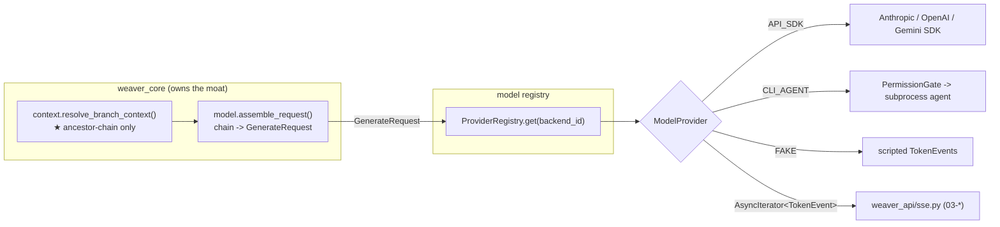

# 02 · Model Provider & Agent Integration

> **Title**: Model Provider & Agent Integration (CLI agents, permissions, AI-proposed forks, FAKE)
> **Status**: Design. Conforms to `00-foundation.md` (authoritative) and `01-domain-and-core-logic.md`.
> **Owns**: `apps/api/weaver_core/model/` — the `ModelProvider` Protocol, the
> API-SDK adapters, the CLI-agent adapters + permission gate, the deterministic
> `FAKE` provider, the backend registry, secret handling, the `TokenEvent`
> taxonomy, and AI-proposed-fork structured generation.
> **Does NOT own**: per-branch context resolution (that is the moat, owned by
> `01-*`); the HTTP/SSE wiring (owned by `03-*`); persistence of `ModelBackend`
> rows (schema in `00-*`/`07-*`, repo Protocol consumed here).

---

## 0. Scope & the one binding rule

This doc designs **the only path from `weaver_core` to a model**. Decision #2 in
`00-foundation.md` fixes a single `ModelProvider` Protocol that covers three
backend families — direct API SDKs, local CLI agents, and a deterministic
`FAKE` — behind one streaming interface, with a per-backend permission model that
is meaningful only for CLI agents.

The single most important rule, repeated from `00-*` §1.2 and §3 and never
violated anywhere in this doc:

> **The provider NEVER resolves context.** It receives `GenerateRequest.messages`
> already resolved by `weaver_core/context/` (the moat). A provider physically
> cannot widen the context — it has no access to the node forest, the repos, or
> sibling branches. This is what keeps per-branch isolation independent of any
> model call and lets backends be swapped without touching the moat.

Everything below is built so that swapping Anthropic SDK ↔ Claude Code CLI ↔
`FAKE` changes *only* the bytes that come back, never *what the model was allowed
to see*.



---

## 1. The `ModelProvider` Protocol (full)

Canonical shapes live in `apps/api/weaver_core/model/provider.py`. `00-*` §1.2
fixes the skeleton; this is the complete contract.

### 1.1 Wire & internal types

```python
# weaver_core/model/provider.py
from __future__ import annotations
from enum import Enum
from typing import AsyncIterator, Protocol, runtime_checkable, Literal
from pydantic import BaseModel, Field

# --- enums (declared in weaver_core/schemas, re-exported here; flow to TS via codegen) ---
class BackendKind(str, Enum):
    API_SDK   = "api_sdk"
    CLI_AGENT = "cli_agent"
    FAKE      = "fake"

class Permission(str, Enum):
    AUTO_RUN_READONLY = "auto_run_readonly"
    ALLOW_FILE_EDITS  = "allow_file_edits"
    NETWORK_ACCESS    = "network_access"

class PermissionSet(BaseModel):
    auto_run_readonly: bool = False
    allow_file_edits:  bool = False
    network_access:    bool = False

# --- message + request shapes (the ONLY thing a provider sees of "context") ---
class ChatMessage(BaseModel):
    role: Literal["system", "user", "assistant", "tool"]
    content: str
    # Optional provenance so adapters can pass source text inline when grounded.
    # NOTE: this is produced by context assembly upstream; the provider does not
    # fetch or expand it.
    meta: dict | None = None

class ToolSpec(BaseModel):
    name: str
    description: str
    json_schema: dict          # JSON Schema for the tool's input

class GenerateRequest(BaseModel):
    system: str | None = None
    messages: list[ChatMessage]              # ★ already context-resolved upstream
    temperature: float | None = None
    max_tokens: int | None = None
    tools: list[ToolSpec] | None = None      # SDK function-calling / agent tools
    response_schema: dict | None = None      # set => structured generation (e.g. fork proposals)
    # purpose lets adapters pick prompt framing + lets FAKE pick a script;
    # NOT used to widen context.
    purpose: Literal["chat", "fork_proposal", "outline", "draft", "relation_scan"] = "chat"
    request_id: str | None = None            # ULID; for cancel + idempotency + logging

class BackendHealth(BaseModel):
    ok: bool
    backend_id: str
    kind: BackendKind
    detail: str | None = None                # e.g. "auth failed", "binary not found"
    latency_ms: float | None = None
```

### 1.2 The `TokenEvent` taxonomy

A provider's stream is a flat `AsyncIterator[TokenEvent]`. The `type` discriminates;
`data` is a typed payload (validated per type by `weaver_api` before SSE emit).

> **Contract-freeze (C1): doc 02 is the SOLE OWNER of `TokenEvent`.** Its field
> set and the closed `type` enum below are authoritative. Docs `03-*` (SSE wire)
> and `05-*` (ingestion progress) **reference `TokenEvent` by name and never
> re-declare its fields or invent new `type` members**. The enum is exactly eight
> members; there is **no** `ingest_progress` type (it is subsumed by `progress`).

```python
class TokenEvent(BaseModel):
    # ★ closed type enum — exactly eight members; FE switches on it exhaustively
    type: Literal["token", "tool_call", "tool_result", "citation",
                  "proposal", "progress", "done", "error"]
    data: dict
    seq: int                 # mandatory; monotonically increasing per stream (resume/ordering)
    request_id: str | None = None
```

| `type`        | emitted by                                  | `data` shape                                                                 | UI surface (04-*)                          |
|---------------|---------------------------------------------|------------------------------------------------------------------------------|--------------------------------------------|
| `token`       | all providers                               | `{ "text": str }`                                                            | streamed into node `content` / draft body  |
| `tool_call`   | CLI_AGENT (+ SDK tool use)                   | `{ "id": str, "name": str, "args": dict, "category": "readonly"\|"edit"\|"network", "requires_approval": bool }` | inline "agent wants to run X" affordance   |
| `tool_result` | CLI_AGENT (+ SDK)                            | `{ "id": str, "ok": bool, "output": str, "truncated": bool }`                | collapsed tool transcript                  |
| `citation`    | grounded chat (any backend, mapped post-hoc)| `{ "chunk_id": ULID, "source_id": ULID, "quote": str, "char_start": int, "char_end": int, "anchor": str }` | clickable inline citation (P0 hard indicator) |
| `proposal`    | structured generation (fork / outline)      | one structured AI proposal object — a `ForkProposal` (§7) **or** an outline-point proposal | rendered as an accept-able suggestion (fork direction / outline point) |
| `progress`    | streaming + ingestion (any backend / pipeline)| `{ "ratio": float, "stage": str, "detail": str\|null }` | progress affordance; **subsumes ingestion progress** (there is no `ingest_progress`) |
| `done`        | all providers                               | `{ "finish_reason": "stop"\|"length"\|"tool_paused"\|"cancelled", "usage": {"input_tokens": int, "output_tokens": int}\|null, "structured": dict\|null }` | finalize node/draft; `structured` carries the parsed `response_schema` result |
| `error`       | all providers                               | `{ "code": str, "message": str, "retryable": bool }`                         | error envelope (03-*) mapped to typed TS error |

Rules:

- `citation` events are **only** emitted on grounded projects. The provider does
  not invent them; the citation mapper (`weaver_core/citation/`, owned by `01-*`
  /`05-*`) post-processes the token stream + retrieved chunks and *injects*
  `citation` events into the merged stream before SSE. (See §6.)
- For `purpose="fork_proposal"`/`"outline"` (structured), token deltas may stream
  for UX, but the **authoritative** result is the parsed object on the terminal
  `done.data.structured`. Clients must use `structured`, not reconstruct from
  `token` deltas. (See §7.)
- `seq` is assigned by the provider; `weaver_api` may renumber on the merged
  stream but preserves order. Used for SSE `id:` (resume) and dedupe.

### 1.3 The Protocol surface

```python
@runtime_checkable
class ModelProvider(Protocol):
    kind: BackendKind
    id: str                       # stable backend id, e.g. "anthropic", "claude_code", "fake"
    permissions: PermissionSet    # inert for API_SDK/FAKE; enforced for CLI_AGENT

    async def generate(self, req: GenerateRequest) -> AsyncIterator[TokenEvent]:
        """Unified streaming generation. MUST:
          - treat req.messages as the complete, final context (never widen it);
          - yield TokenEvents in order, terminating with exactly one `done`
            OR one `error` (never both, never neither);
          - be cancellable: if the consuming task is cancelled, stop the SDK
            stream / kill the subprocess and release resources.
        """
        ...

    async def health(self) -> BackendHealth:
        """Cheap liveness/auth/binary check. API_SDK: validate key + reachable.
        CLI_AGENT: binary present + `--version` works. FAKE: always ok."""
        ...
```

Notes:

- **Protocol, not ABC**, so a backend can be any object that structurally
  matches (`runtime_checkable` lets the registry assert conformance in tests).
- `generate` is an async generator. The **terminal-event invariant** (exactly one
  `done` xor one `error`) is asserted by a shared contract test that runs against
  every registered provider (§9).
- Cancellation maps to client disconnect on the SSE side (03-*): the route
  cancels the task; the provider's `finally` tears down the SDK stream or
  subprocess.

---

## 2. The backend registry & `ModelBackend` config

### 2.1 Registry

```python
# weaver_core/model/registry.py
class ProviderRegistry:
    def __init__(self, backend_repo: BackendRepo, secrets: SecretStore): ...

    def get(self, backend_id: ULID | str) -> ModelProvider:
        """Resolve a configured ModelBackend row -> a live ModelProvider.
        Builders are keyed by (kind, provider). Raises (codes from 03-*'s
        canonical `ErrorCode` enum — see C3):
          - BACKEND_NOT_FOUND : no ModelBackend row for backend_id
          - BACKEND_DISABLED  : the row exists but is disabled
          - UNKNOWN_BACKEND   : no builder registered for this (kind, provider)"""

    def default_for(self, project: Project) -> ModelProvider:
        """project.default_backend_id, else the global is_default backend,
        else the FAKE provider when WEAVER_MODEL_MODE=fake."""

    def register_builder(self, kind: BackendKind, provider: str,
                         builder: Callable[[ModelBackend, SecretStore], ModelProvider]) -> None: ...
```

- Builders are pure factories: `(ModelBackend row, SecretStore) -> ModelProvider`.
  Adding a new backend = registering a builder; no change to the Protocol or the
  call sites. This is how CLI agents land later "with no interface change"
  (`00-*` §1.2 MVP-vs-Later).
- **Contract-freeze (C10): this `ProviderRegistry` class is the canonical
  registry.** Extension is via `register_builder(kind, provider, builder)` with
  builders keyed by the **composite `(kind, provider)`** (so an SDK `gemini` and a
  CLI `gemini_cli` never collide). `08-*` **conforms to THIS class** — it does not
  declare a module-level `_REGISTRY` dict, a `@register_provider` decorator, or a
  `build_provider` function; it extends via `registry.register_builder(...)`.
- The registry is the **only** place secrets are dereferenced (§4). Domain
  services receive a `ModelProvider`, never an API key.

### 2.2 `ModelBackend` (recap from `00-*` §2.2; this doc consumes it)

```
ModelBackend
  id: ULID
  name: str                         # display, e.g. "Claude (work key)"
  kind: BackendKind                 # api_sdk | cli_agent | fake
  provider: str                     # anthropic|openai|gemini|claude_code|codex_cli|gemini_cli|opencode|fake
  model: str | None                 # e.g. "claude-..." (SDK); CLI agents may ignore
  endpoint: str | None              # base_url override (proxy / Azure / local OpenAI-compatible)
  api_key_ref: str | None           # SECRET STORE REF, never the key itself
  permissions: PermissionSet        # CLI_AGENT only
  enabled: bool
  is_default: bool
  # CLI-only operational fields (validated by the cli builder, see §3):
  command: list[str] | None         # e.g. ["claude"] | ["codex"] | ["gemini"] | ["opencode"]
  workdir: str | None               # sandbox root the agent is confined to
  env_allowlist: list[str] | None   # env vars passed through to the subprocess
```

`provider="fake"` is selectable in Settings too, so a user (and CI) can pin a
project to deterministic output.

---

## 3. Adapters

### 3.1 API_SDK adapters (Anthropic / OpenAI / Gemini)

One adapter per SDK, each mapping the vendor's streaming chunks → `TokenEvent`.
Permissions are **inert** here (there are no local commands to gate).

```python
# weaver_core/model/sdk/anthropic.py  (OpenAI/Gemini analogous)
class AnthropicProvider:
    kind = BackendKind.API_SDK
    def __init__(self, backend: ModelBackend, secrets: SecretStore):
        self.id = backend.id
        self.permissions = PermissionSet()        # inert
        self._model = backend.model or DEFAULT_MODEL
        self._client = AsyncAnthropic(api_key=secrets.resolve(backend.api_key_ref),
                                      base_url=backend.endpoint or None)

    async def generate(self, req: GenerateRequest) -> AsyncIterator[TokenEvent]:
        params = self._map_request(req)           # system, messages, tools, response_schema
        seq = 0
        try:
            async with self._client.messages.stream(**params) as stream:
                async for ev in stream:
                    for te in self._map_event(ev, seq):   # vendor chunk -> 0..n TokenEvents
                        seq = te.seq + 1
                        yield te
                final = await stream.get_final_message()
                yield self._done(final, seq, req)         # usage + structured (if response_schema)
        except anthropic.APIError as e:
            yield self._error(e, seq)
```

Mapping table (representative; OpenAI/Gemini differ only in field names):

| vendor stream event                         | → `TokenEvent`                                                |
|---------------------------------------------|---------------------------------------------------------------|
| text delta                                  | `token {text}`                                                |
| tool-use start / input delta (function call)| `tool_call {id,name,args,category="network"\|"readonly",requires_approval=false}` (SDK tools have no local side effects; category is informational) |
| tool result (when API loops tools)          | `tool_result {id,ok,output}`                                  |
| stream end + final message                  | `done {finish_reason, usage, structured?}`                    |
| `response_schema` set (structured output)   | parse final into the schema → `done.data.structured`         |
| API/auth/rate error                         | `error {code, message, retryable}`                            |

`_map_request` responsibilities:

- Anthropic: `system` → top-level `system`; `messages` 1:1 (`role` already
  constrained); `tools` → `tools=[{name,description,input_schema}]`;
  `response_schema` → a single "tool" the model must call (tool-forced JSON) OR
  the SDK's structured-output mode, whichever the SDK version exposes.
- OpenAI: `system` → first `{"role":"system"}` message; `response_schema` →
  `response_format={"type":"json_schema", json_schema}`; tools → `tools`.
- Gemini: `system` → `system_instruction`; `messages` → `contents` with role
  mapping (`assistant`→`model`); `response_schema` → `response_mime_type=
  "application/json"` + `response_schema`.

**Never** does an adapter read from repos, the node forest, or sibling branches.
Grounding text, if any, already arrives inside `req.messages[*].content`/`.meta`.

### 3.2 CLI_AGENT adapters (Claude Code / Codex CLI / Gemini CLI / OpenCode)

A CLI-agent backend runs a **local coding-agent process** as the model. Same
`generate()` contract; the difference is the body spawns and drives a subprocess,
and **the API process enforces permissions on every command / edit / network
action** the agent attempts — not the agent's own trust prompts.

```mermaid
sequenceDiagram
  participant Core as weaver_core (assembled GenerateRequest)
  participant Prov as CliAgentProvider
  participant Gate as PermissionGate
  participant Proc as agent subprocess (stdin/stdout, JSON protocol)
  Core->>Prov: generate(req)   # messages already context-resolved
  Prov->>Proc: spawn [command] --output-format stream-json (sandboxed workdir, scrubbed env)
  Prov->>Proc: write prompt (system+messages) on stdin, then close/keep-alive
  loop streamed agent events
    Proc-->>Prov: {type:"text",...}            -> yield token
    Proc-->>Prov: {type:"tool_use", action}    
    Prov->>Gate: authorize(action, backend.permissions)
    alt allowed
      Gate-->>Prov: ALLOW
      Prov->>Proc: approve(tool_id)            -> yield tool_call(category)
      Proc-->>Prov: {type:"tool_result"}       -> yield tool_result
    else denied
      Gate-->>Prov: DENY(reason)
      Prov->>Proc: deny(tool_id, reason)       -> yield tool_call(requires_approval) / error
    end
  end
  Proc-->>Prov: {type:"result", usage}         -> yield done
  Note over Prov,Proc: on cancel/disconnect: SIGTERM then SIGKILL; reap; cleanup workdir
```

```python
# weaver_core/model/cli/base.py
class CliAgentProvider:
    kind = BackendKind.CLI_AGENT
    def __init__(self, backend: ModelBackend, secrets: SecretStore, gate: "PermissionGate"):
        self.id = backend.id
        self.permissions = backend.permissions
        self._argv = self._resolve_argv(backend)          # per-provider subclass
        self._workdir = backend.workdir or _ephemeral_sandbox()
        self._env = _scrub_env(backend.env_allowlist, secrets, backend.api_key_ref)
        self._gate = gate

    async def generate(self, req: GenerateRequest) -> AsyncIterator[TokenEvent]:
        proc = await asyncio.create_subprocess_exec(
            *self._argv, cwd=self._workdir, env=self._env,
            stdin=PIPE, stdout=PIPE, stderr=PIPE)
        try:
            await self._send_prompt(proc, req)            # adapt req -> agent prompt protocol
            seq = 0
            async for raw in _read_json_lines(proc.stdout):
                async for te in self._handle(raw, req, seq):
                    seq = te.seq + 1
                    yield te
                    if te.type in ("done", "error"):
                        return
            yield self._error_from_exit(await proc.wait(), seq)
        finally:
            await _terminate(proc)                          # SIGTERM->wait->SIGKILL
            self._cleanup_sandbox()
```

Per-provider subclasses only differ in `_resolve_argv`, `_send_prompt`, and
`_handle` (how that agent frames a non-interactive run and what its stream-JSON
looks like):

| backend (`provider`) | invocation intent (illustrative)                         | stream parsing                          |
|----------------------|----------------------------------------------------------|-----------------------------------------|
| `claude_code`        | headless/print mode with JSON stream output              | line-delimited JSON events              |
| `codex_cli`          | non-interactive exec mode emitting machine output        | JSON/NDJSON events                       |
| `gemini_cli`         | non-interactive prompt mode with structured output       | JSON events                              |
| `opencode`           | run/serve mode with a JSON event stream                  | JSON events                              |

> The exact flags/protocol per agent are **operational details** validated by
> each subclass's adapter test (§9) and pinned in `07-*` (ops). They are
> deliberately not hard-coded into the architecture so a CLI's surface can change
> without touching the Protocol. The architectural contract is: **spawn →
> drive → map stdout to `TokenEvent` → gate every side-effecting action →
> terminate cleanly.**

If an agent has no machine-readable streaming mode available, the adapter falls
back to capturing final stdout and emitting a single `token` + `done` (degraded,
non-streaming) — still inside the same contract.

---

## 4. Secret handling

- `ModelBackend.api_key_ref` is **always a reference**, never the key. The DB row
  stores `api_key_ref` (e.g. `"env:ANTHROPIC_API_KEY"` or
  `"keyring:weaver/anthropic"` or `"file:~/.weaver/secrets/anthropic"`).
- A `SecretStore` Protocol resolves refs at provider-build time only:

```python
class SecretStore(Protocol):
    def resolve(self, ref: str | None) -> str | None: ...   # ref -> plaintext, in-memory
    def put(self, name: str, value: str) -> str: ...        # value -> ref (Settings save path)
```

- Default impl (local-first): OS keyring if available, else a mode-`600` file
  under the data dir, else env. `00-*`/`07-*` fix the default; this doc fixes the
  **rule**: plaintext keys never touch the DB, never appear in `openapi.json`,
  never appear in logs/`TokenEvent`s, never get serialized to the TS client.
- For CLI agents, the resolved secret is injected into the subprocess **env**
  (e.g. the agent's own expected `*_API_KEY`) via `_scrub_env`, scoped to
  `env_allowlist`; it is not written to disk or passed as an argv (argv is
  world-readable via `ps`).
- The API responses for `ModelBackend` expose `has_api_key: bool` (derived),
  never the ref's value.

---

## 5. Permission enforcement model (CLI agents)

This is the heart of "self-hosted, bring-your-own-model, but **I** decide what
the local agent may do." The prototype Settings screen shows three toggles per
CLI backend: **Auto-run read-only commands / Allow file edits / Network access**.
We enforce them **in the API process**, per action, and **do not delegate to the
agent's own trust prompts**.

### 5.1 The gate

```python
# weaver_core/model/cli/permission.py
class ActionCategory(str, Enum):
    READONLY = "readonly"   # ls, cat, grep, git status, read file...
    EDIT     = "edit"       # write/patch/delete a file
    NETWORK  = "network"    # fetch URL, install package, any socket egress
    UNKNOWN  = "unknown"    # could not classify -> safest = require approval

class Decision(str, Enum):
    ALLOW = "allow"; DENY = "deny"; REQUIRE_APPROVAL = "require_approval"

class AgentAction(BaseModel):
    tool_id: str
    name: str               # the agent's tool/command name
    raw: dict               # full args (cmd string, file path, url, ...)

class PermissionGate:
    def classify(self, action: AgentAction) -> ActionCategory: ...
    def authorize(self, action: AgentAction, perms: PermissionSet) -> tuple[Decision, str]:
        cat = self.classify(action)
        if cat is ActionCategory.READONLY:
            return (Decision.ALLOW if perms.auto_run_readonly
                    else Decision.REQUIRE_APPROVAL, "readonly")
        if cat is ActionCategory.EDIT:
            return (Decision.ALLOW if perms.allow_file_edits
                    else Decision.DENY, "edit")
        if cat is ActionCategory.NETWORK:
            return (Decision.ALLOW if perms.network_access
                    else Decision.DENY, "network")
        return (Decision.REQUIRE_APPROVAL, "unclassified")   # fail safe
```

### 5.2 Enforcement rules (binding)

1. **Default deny / least privilege.** A fresh `PermissionSet` is all-`False`.
   An unclassifiable action is `REQUIRE_APPROVAL`, never silently allowed.
2. **The gate is upstream of execution.** For agents that pause for approval, the
   adapter approves/denies the tool by id over the agent's protocol. For agents
   that may act first, the adapter runs the agent inside a **sandbox** (confined
   `workdir`, network namespace/proxy off unless `network_access`) so the OS
   enforces what the protocol cannot — i.e. permissions are enforced even if the
   agent ignores its own prompts.
3. **`EDIT` and `NETWORK` denials are hard** (`DENY`), surfaced as a
   `tool_call{requires_approval:true}` event (so the UI can offer a one-shot
   grant) followed by a `tool_result{ok:false}` if not granted. `READONLY`
   without `auto_run_readonly` is `REQUIRE_APPROVAL` (the softer case).
4. **Edits are confined to `workdir`.** A path escaping the sandbox root is
   reclassified `UNKNOWN`→ approval, and the sandbox refuses it regardless.
5. **Every gated action is auditable.** The adapter emits the `category` and the
   decision on the `tool_call`/`tool_result` events; `07-*` logs them.
6. **API_SDK / FAKE ignore permissions entirely** — the field is inert; the gate
   is never constructed for them.

### 5.3 Why this matters to the moat

The gate is independent of context resolution — it governs *side effects*, not
*what the model sees*. The two safety properties compose cleanly: the moat
guarantees branch isolation (input side), the gate guarantees local-action safety
(output side), and neither touches the other.

---

## 6. Grounded chat → `citation` events (how the moat + citations meet the provider)

The provider stays oblivious to grounding. The flow:

1. `weaver_core/context/` resolves the ancestor chain (the moat).
2. On a grounded project, the **retrieval** service (`05-*`) selects chunks for
   the user's prompt and the assembler embeds them into `req.messages` (as a
   grounded system/user block with chunk ids in `meta`). The provider just sees
   text.
3. The provider streams `token` events.
4. The **citation mapper** (`weaver_core/citation/`, `01-*`/`05-*`) wraps the
   provider stream: it matches generated sentences back to source spans and
   **injects `citation` events** into the merged stream at sentence boundaries.
5. `weaver_api/sse.py` (03-*) forwards the merged stream.

So §1.2's "providers don't emit citations on their own" holds: citation events
are produced by a wrapper around `generate()`, keeping every adapter identical
whether grounded or not.

```python
# conceptual wrapper (lives in citation/, not in any provider)
async def with_citations(stream, grounding) -> AsyncIterator[TokenEvent]:
    async for te in stream:
        yield te
        if te.type == "token":
            for cit in grounding.match(te.data["text"]):
                yield TokenEvent(type="citation", data=cit.model_dump(), seq=...)
```

---

## 7. AI-proposed forks as structured generation (not a special endpoint)

PRD §2.4: "AI 主动提议分叉" — after answering, the AI proposes "here are N
directions worth splitting into." Per `00-*` §1.2 this is **structured generation
over the same `ModelProvider.generate`**, distinguished only by `purpose=
"fork_proposal"` + a `response_schema`. There is no special model and no special
provider path.

### 7.1 The response schema

> **Contract-freeze (G7): the FE-facing field names match 03's canonical
> `ForkProposal` wire shape (`{ prompt, rationale, suggested_label? }`, owned by
> `03-*`).** This internal Pydantic maps **1:1** to that wire shape; `proposal`
> TokenEvents (§1.2) and the terminal `done` carry `ForkProposal` objects. 02
> renames its old FE-facing fields to conform: `title` → `suggested_label`,
> `seed_prompt` → `prompt`, `rationale` kept.

```python
# weaver_core/model/schemas/fork_proposal.py  (Pydantic -> JSON Schema in response_schema)
class ProposedFork(BaseModel):
    suggested_label: str | None = None  # short branch label (-> node.branch_label); maps to ForkProposal.suggested_label
    rationale: str                      # why this direction is worth splitting out
    prompt: str                         # the question/intent that starts the new branch (-> ForkProposal.prompt)
    kind: NodeKind = NodeKind.QUESTION_ANSWER
    confidence: float | None = None     # 0..1, for ranking/throttling (internal; not on the wire shape)

class ForkProposalResult(BaseModel):
    should_fork: bool                # AI may say "no, keep going on this branch"
    directions: list[ProposedFork]   # 0..N; cadence/number tuned (Open Question §11)
```

### 7.2 The call

The caller (a `weaver_core/tree/` service, invoked by the API after a normal
answer, or on demand) does:

```python
async def propose_forks(node_id: ULID, provider: ModelProvider) -> ForkProposalResult:
    chain = resolve_branch_context(node_id, forest)          # ★ moat — same isolation
    req = assemble_request(
        purpose="fork_proposal",
        chain=chain,
        system=FORK_PROPOSAL_SYSTEM,                         # "propose distinct directions..."
        response_schema=ForkProposalResult.model_json_schema(),
        temperature=0.7,
    )
    result_struct = None
    async for te in provider.generate(req):
        if te.type == "done":
            result_struct = te.data.get("structured")
        if te.type == "error":
            raise ModelError(te.data)
    return ForkProposalResult.model_validate(result_struct or {"should_fork": False, "directions": []})
```

Key properties:

- **Same isolation guarantee.** Fork proposals see only the node's ancestor
  chain. The AI cannot propose a direction informed by a sibling branch — which
  is exactly what makes the proposals trustworthy.
- **Same interface, same backends.** Any backend (SDK or CLI agent or FAKE) can
  propose forks; structured output is requested via `response_schema` and each
  adapter maps it to its vendor's JSON mode (§3.1). CLI agents that lack JSON mode
  fall back to a JSON-instructed prompt + tolerant parse.
- **Accepting a proposal** is a separate, deterministic domain action (`tree.fork`
  in `01-*`): it materializes a child `ThoughtNode` (`parent_id = node_id`,
  `branch_label = direction.suggested_label`, `prompt = direction.prompt`). The
  model never writes to the tree; it only proposes. Human-defines-angle is preserved.
- **Cadence / number-of-directions** (when to offer, how many) is an Open Question
  (§11); the *schema and the call* are fixed here, the *policy* is tunable.

### 7.3 Same pattern reused

The identical "structured generation over `generate()`" pattern serves other AI
features without new endpoints: AI outline-skeleton (`purpose="outline"`,
`OutlineProposal` schema — `06-*`), AI relation/gap/counter-example scan
(`purpose="relation_scan"`, `RelationProposal` schema — `01-*`/`08-*`). All
inherit the moat's isolation and the FAKE-in-CI determinism.

---

## 8. The deterministic `FAKE` provider

`FAKE` is first-class (`00-*` §1.2, §7) — the default in CI so no test reaches a
real model or network.

```python
# weaver_core/model/fake.py
class FakeProvider:
    kind = BackendKind.FAKE
    id = "fake"
    permissions = PermissionSet()                 # inert

    def __init__(self, script: "FakeScript | None" = None):
        self._script = script or FakeScript.from_env()   # WEAVER_FAKE_SCRIPT or builtin

    async def generate(self, req: GenerateRequest) -> AsyncIterator[TokenEvent]:
        plan = self._script.select(req)           # deterministic on (purpose, hash(messages))
        seq = 0
        for ev in plan.events:                    # scripted tokens/tool_calls/citations/done
            yield TokenEvent(**ev, seq=seq); seq += 1
```

Design:

- **Deterministic selection.** A script maps `(purpose, stable-hash(system+messages
  +response_schema))` → an ordered list of `TokenEvent`s. Same request ⇒ identical
  byte-for-byte stream ⇒ stable snapshots.
- **Structured awareness.** When `response_schema` is set (fork proposals,
  outline), FAKE emits a `done.structured` that **validates against that schema**
  (it can synthesize a minimal valid instance from the schema, or use a
  registered fixture). This makes the structured path testable end-to-end without
  a model.
- **Citation awareness.** Given grounded `meta` chunk ids in the request, FAKE can
  emit deterministic `citation` events, exercising the grounded path (§6).
- **CLI/permission simulation.** A `FAKE` script can emit `tool_call` events with
  each `category` so the `PermissionGate` and the UI approval flow are testable
  *without* spawning a real agent.
- **Selection by env.** `WEAVER_MODEL_MODE=fake` (CI default) forces
  `registry.default_for` → `FakeProvider`; `WEAVER_FAKE_SCRIPT=path` loads a
  custom script. Production sets `WEAVER_MODEL_MODE=real`.
- **Failure injection.** Scripts can emit `error` events (and CLI exit codes) so
  error-envelope mapping (03-*) is tested deterministically.

---

## 9. Testing

All model-touching tests run against `FAKE` by default (`conftest.py` wires it).

**Provider contract suite (runs against every registered provider via the
`runtime_checkable` Protocol, using a stub transport for SDK/CLI):**

- **Terminal-event invariant**: every `generate()` yields exactly one `done` xor
  one `error`; never both; never an empty stream.
- **Ordering**: `seq` strictly increasing; `token` events before `done`.
- **No-context-widening (the moat-adjacent guard)**: a provider given a fixed
  `messages` list never reads repos/forest (assert via injected spy repos that
  see zero calls during `generate`).
- **Cancellation**: cancelling the consumer stops the SDK stream / kills the
  subprocess; no orphan processes; sandbox cleaned.
- **Structured**: with `response_schema`, `done.structured` validates against the
  schema.

**API_SDK adapters** (unit, mocked SDK):
- request mapping (`system`/`messages`/`tools`/`response_schema`) per vendor;
- chunk→`TokenEvent` mapping incl. tool-use and final-usage;
- error mapping (auth/rate/timeout → `error{code,retryable}`).

**CLI_AGENT adapters** (unit, fake subprocess emitting recorded stream-JSON):
- argv/env/workdir construction; env scrubbing (no key in argv);
- stream-JSON→`TokenEvent` mapping;
- **permission gate matrix**: for each `(category × permission)` assert the
  `Decision` and the resulting events (the core safety test);
- sandbox confinement: an edit outside `workdir` is denied/blocked;
- clean termination on cancel (SIGTERM→SIGKILL, reap, cleanup).

**PermissionGate** (pure unit): classification of representative actions
(`ls`/`cat`→readonly, `write`/`patch`→edit, `curl`/`pip install`→network,
ambiguous→unknown) and the full authorize truth table; default-deny for empty
`PermissionSet`.

**FAKE provider** (unit): determinism (same request ⇒ identical stream),
schema-valid structured output, scripted citations, scripted tool_calls per
category, scripted errors.

**Registry** (unit): builder resolution by `(kind, provider)`; the error codes
(`BACKEND_NOT_FOUND` / `BACKEND_DISABLED` / `UNKNOWN_BACKEND`) raised by `get`,
referencing 03-*'s canonical `ErrorCode` enum (C3); `default_for` fallback to FAKE
under `WEAVER_MODEL_MODE=fake`; secrets resolved exactly once at build, never logged.

**Secret handling** (unit): `api_key_ref` never serialized into `openapi.json`,
API responses, logs, or `TokenEvent`s; `has_api_key` derived correctly.

**Contract/integration (03-* owns the route; this doc owns the stream shape)**:
the SSE stream from a streaming endpoint, driven by FAKE, asserts the
`TokenEvent` schema per event type; the AI-proposed-fork call returns a
schema-valid `ForkProposalResult`.

**Smoke (per milestone, FAKE)**: ask at a node → stream tokens → (M2) propose
forks → accept one → child node created with isolated context. No real model,
no network.

---

## 10. MVP vs Later

**MVP (milestones M1–M5; 3 pages):**
- Full `ModelProvider` Protocol + `TokenEvent` taxonomy + registry.
- **`API_SDK`** adapters: at least one provider end-to-end (Anthropic), with the
  mapping pattern generalizing to OpenAI/Gemini.
- **`FAKE`** provider (default in CI) incl. structured + citation + error
  scripting.
- The **permission *model*** (enum, `PermissionSet`, `PermissionGate`,
  classification, truth table) — fully built and unit-tested, even though no CLI
  agent ships yet, so the contract and tests exist day one.
- **AI-proposed forks** via structured generation (`purpose="fork_proposal"` +
  `response_schema`), with the moat's isolation (M2 — the core slice).
- Secret handling (`api_key_ref` indirection; no plaintext in DB/logs/wire).
- Streaming over SSE (shape owned here; transport in 03-*).

**Later (P1/P2, no interface change):**
- **`CLI_AGENT`** adapters (Claude Code / Codex CLI / Gemini CLI / OpenCode) with
  **live** permission enforcement + sandboxing — they register as builders behind
  the same Protocol (`00-*` §1.2: "CLI agents land progressively, no interface
  change").
- Structured generation reused for AI outline-skeleton (`06-*`) and AI
  relation/gap/counter-example scan (`08-*`).
- Multi-format Artifact generation reuses the same provider interface (`06-*`).
- Richer FAKE scenario library; failure-injection presets per backend.

---

## 11. Open questions (flag, do not silently resolve)

- **AI-proposed-fork cadence & count** (carried from `00-*` §11 / PRD §10): offer
  on every answer or only when divergence is detected? How many directions
  (`ForkProposalResult.directions` length cap)? Default `should_fork` threshold on
  `confidence`? The *schema and call are fixed here*; the *policy* is a UX tuning
  knob to settle in the prototype (likely a project setting + a server default).
- **CLI agent streaming protocols are version-volatile.** Each agent's
  non-interactive/stream-JSON flags and event shapes can change between releases.
  Proposal: pin per-agent adapter behavior with a recorded-fixture contract test
  (§9) and an adapter capability probe in `health()`; treat protocol drift as an
  adapter-local change. To confirm with `07-*` (ops/versioning).
- **Sandbox strength for CLI agents.** How strong must confinement be by default
  (subprocess `workdir` + path checks, vs OS-level sandbox/container, vs network
  namespace)? Local-first single-user lowers the threat model, but "allow file
  edits" on a real machine is genuinely dangerous. Proposed default: confined
  `workdir` + default-deny network; container isolation as an opt-in ops mode.
  To confirm with `07-*`.
- **Unknown-action classification.** The `READONLY`/`EDIT`/`NETWORK` classifier is
  heuristic over a command/tool surface that varies by agent. Misclassifying an
  edit as readonly is a safety bug. Proposal: conservative allowlists per agent +
  default `REQUIRE_APPROVAL` for anything unmatched; revisit as real agents land.
- **Tool-use depth for API SDKs.** MVP uses SDKs as plain generators (no local
  tools). If/when SDK function-calling drives local tools, those calls must route
  through the **same** `PermissionGate` as CLI agents (the gate is backend-kind
  agnostic by design) — confirm no second enforcement path appears.
- **Structured-output reliability across vendors.** JSON-mode fidelity differs
  (Anthropic tool-forced vs OpenAI `json_schema` vs Gemini `response_schema`); CLI
  agents may lack it entirely. Need a shared tolerant-parse + repair step for the
  structured path; where it lives (here vs `01-*`) is open.
