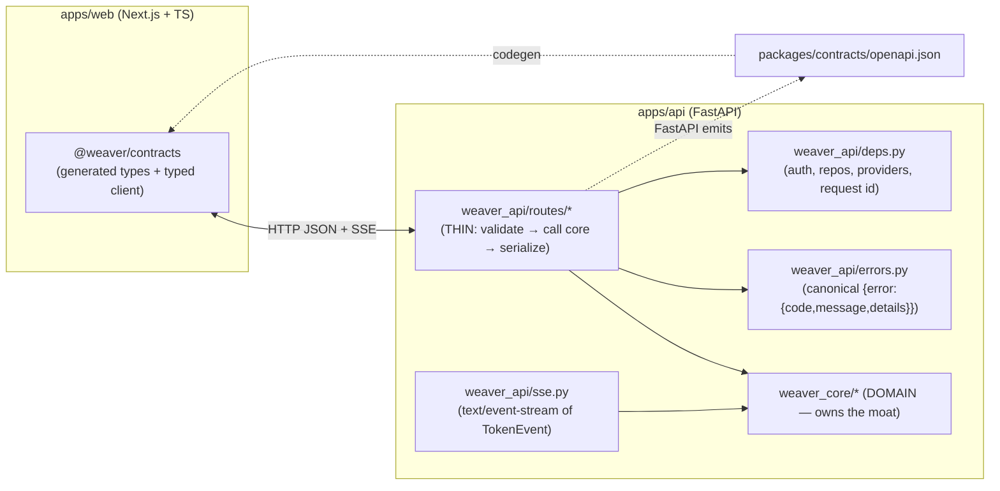
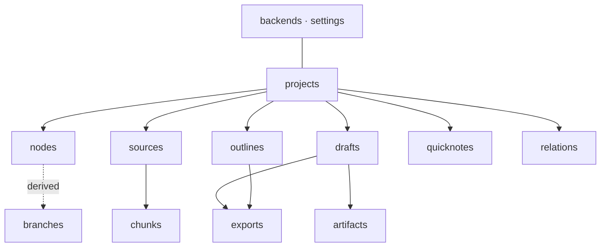
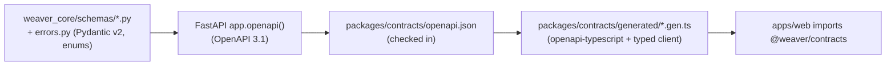

# 03 · API Service Design & Contracts (FastAPI, REST, SSE, errors, codegen)

> **Status**: Design. Conforms to `00-foundation.md` (authoritative), especially
> §1.1 (domain core in Python + schema-first codegen), §1.5 (API conventions),
> §1.6 (Branch is derived), §2 (canonical domain model), §3 (the moat contract).
> **Depends on**: `00-foundation.md`, `01-domain-and-core-logic.md` (tree ops +
> `resolve_branch_context`), `02-model-provider-and-agents.md` (`ModelProvider`,
> `TokenEvent`, AI-proposed forks, FAKE).
> **Scope**: the FastAPI HTTP layer only — route catalog, request/response
> schemas, SSE streaming, the error envelope, OpenAPI→TS codegen + CI drift
> guard. It owns **no domain rules**: routes are thin and call `weaver_core`.

---

## 0. Position in the system



The API layer is a **translation membrane**: HTTP ⇄ `weaver_core` calls. It does
not decide what a node sees, how a branch is resolved, how a draft is voiced, or
how citations map. It validates input shapes, calls a `weaver_core` service,
serializes the result (or streams it), and wraps failures in the canonical
envelope.

**The thin-routes rule (binding):** a route handler may only (1) parse/validate
the request into a Pydantic model, (2) acquire dependencies (auth, repos,
provider registry) via `Depends`, (3) call exactly the `weaver_core` service(s)
for that action, (4) serialize the domain result to a response schema or an SSE
stream, (5) translate domain exceptions to the error envelope. **No tree walking,
no context resolution, no model orchestration, no SQL** lives in a route. A route
that needs branching logic is a bug — that logic belongs in `weaver_core`.

---

## 1. Conventions (from foundation §1.5, made concrete)

| Concern | Rule |
|---|---|
| Base path | `/api/v1`. Breaking changes bump to `/api/v2`; the generated client tracks the prefix. |
| Style | Resource-oriented REST + JSON. Verb-on-resource = sub-path (`POST /nodes/{id}/fork`). |
| IDs | ULID strings in all URLs and bodies. Regex-validated path params (`^[0-9A-HJKMNP-TV-Z]{26}$`). |
| Time | UTC ISO-8601 with `Z` (`2026-06-22T11:14:00Z`). Serialized by Pydantic. |
| Pagination | Cursor-based: `?cursor=<opaque>&limit=<1..200, default 50>`. Response carries `next_cursor` (null = end). Cursor = base64url of `(created_at, id)` — stable under ULID sort. |
| Streaming | `text/event-stream` (SSE) carrying `TokenEvent`. NDJSON fallback via `Accept: application/x-ndjson`. |
| Errors | One envelope `{error:{code,message,details}}`; `code` is a stable enum (§5). |
| Auth | Single-user local: `Authorization: Bearer <local-token>` **or** same-origin session cookie. No multi-tenant. (§6) |
| Content type | `application/json` for bodies; `multipart/form-data` only for source file upload. |
| Idempotency | **Defined mechanism** (not best-effort) on mutating + streaming POSTs (`/think`, `POST /projects/{pid}/drafts`, `/nodes/{id}/fork`): server stores `(idempotency_key, request_fingerprint, result)`; a replay with the **same key + same fingerprint** within the dedupe window returns the **first persisted result** (for streams: the persisted terminal result/node, NOT a re-stream — the client refetches via the returned id); same key + **different fingerprint** → `IDEMPOTENCY_REPLAY` (409). Dedupe window = 24h (config). See §4.6; backing `idempotency_key` table lives in `07-*` (Contract-freeze: G2). |
| Casing | `snake_case` JSON fields (matches Pydantic / Python; codegen carries it verbatim to TS). |

### 1.1 Common envelope shapes

```python
# weaver_api/schemas_common.py  (Pydantic v2 — flows to TS via codegen)

from pydantic import BaseModel
from typing import Generic, TypeVar

T = TypeVar("T")

class Page(BaseModel, Generic[T]):
    items: list[T]
    next_cursor: str | None = None        # null ⇒ no more pages
    total_estimate: int | None = None     # cheap count when available, else null

class Created(BaseModel):
    id: str                               # ULID of the new resource

class Ok(BaseModel):
    ok: bool = True                       # for actions with no resource body

class ErrorBody(BaseModel):
    code: str                             # stable enum (see §5)
    message: str                          # human readable, may be localized later
    details: dict | None = None           # structured context (ids, conflicts…)

class ErrorEnvelope(BaseModel):
    error: ErrorBody
```

> **Note on generics + OpenAPI.** Pydantic v2 generic models emit concrete
> schema names per instantiation (`PageProjectSummary`, `PageNodeView`, …), which
> `openapi-typescript` turns into discrete TS types. We rely on that; we do not
> hand-roll a generic TS `Page<T>` (the drift guard would not protect it).

---

## 2. Resource map & route catalog

All routes under `/api/v1`. Read models that derive from the tree (branches,
context preview) are **GET-only derived resources**, never CRUD (foundation §1.6).

### 2.1 Resource overview



### 2.2 Full route catalog

Legend: **stream** = SSE/NDJSON; **MVP** unless marked `P1`/`P2`.

#### Projects `MVP`
| Method | Path | Purpose | Body → Resp |
|---|---|---|---|
| GET | `/projects` | List (cursor) | – → `Page[ProjectSummary]` |
| POST | `/projects` | Create | `ProjectCreate` → `ProjectView` |
| GET | `/projects/{id}` | Read | – → `ProjectView` |
| PATCH | `/projects/{id}` | Update title/desc/voice_default/default_backend_id | `ProjectUpdate` → `ProjectView` |
| DELETE | `/projects/{id}` | Delete project (cascade) | – → `Ok` |

#### Nodes (the tree) `MVP`
| Method | Path | Purpose | Body → Resp |
|---|---|---|---|
| GET | `/projects/{pid}/nodes` | Full forest snapshot for render | `?include=collapsed,citations` → `ForestView` |
| POST | `/projects/{pid}/nodes` | Add a node (root or child); ask a question OR write a thought | `NodeCreate` → `NodeView` |
| GET | `/nodes/{id}` | Read one node | `?include=citations` → `NodeView` |
| PATCH | `/nodes/{id}` | Edit content/annotation/state/collapsed/branch_label | `NodeUpdate` → `NodeView` |
| **POST** | **`/nodes/{id}/think`** | **stream** — ask at this node; resolves branch context, streams answer | `ThinkRequest` → **SSE** `TokenEvent` |
| **POST** | **`/nodes/{id}/fork`** | Create child branch(es) from this node (explicit fork) | `ForkRequest` → `list[NodeView]` |
| **POST** | **`/nodes/{id}/fork/propose`** | **stream** — AI-proposed forks (structured) | `ForkProposeRequest` → **SSE** `TokenEvent` (final `done` carries `ForkProposal[]`) |
| **POST** | **`/nodes/{id}/prune`** | Mark dead_end + collapse (soft; not deleted) | `PruneRequest` → `NodeView` |
| **POST** | **`/nodes/{id}/backtrack`** | Refocus: returns the branch ending at this node | – → `BranchView` |
| GET | `/nodes/{id}/context` | **derived** — preview the resolved per-branch context (the moat, read-only) | `?include_dead_ends=bool` → `BranchContextView` |
| DELETE | `/nodes/{id}` | Hard-delete a node + subtree (rare; pruning is preferred) | `?force=true` → `Ok` |

#### Branches (derived read models + verbs) `MVP`
> No `branches` table. A branch id == its head node id; the resource is computed.

| Method | Path | Purpose | Body → Resp |
|---|---|---|---|
| GET | `/branches/{head_node_id}` | Derived branch (root→…→node) | `?include_dead_ends=bool` → `BranchView` |
| **POST** | **`/branches/{head_node_id}/promote`** | Crystallize this branch's nodes into outline points | `PromoteRequest` → `OutlineView` |

#### Relations (cross-branch overlay) `P1`
| Method | Path | Purpose | Body → Resp |
|---|---|---|---|
| GET | `/projects/{pid}/relations` | List overlay edges | – → `list[RelationView]` |
| POST | `/projects/{pid}/relations` | Create merge/connection/contradiction | `RelationCreate` → `RelationView` |
| DELETE | `/relations/{id}` | Remove edge | – → `Ok` |
| POST | `/relations/{id}/synthesize` | **stream** `P1` — AI merges two nodes into a new synthesis node | `SynthesizeRequest` → **SSE** `TokenEvent` |

#### Sources (optional grounding) `MVP (optional)`
| Method | Path | Purpose | Body → Resp |
|---|---|---|---|
| GET | `/projects/{pid}/sources` | List | – → `Page[SourceView]` |
| POST | `/projects/{pid}/sources` | Add url/text/markdown source (JSON) | `SourceCreate` → `SourceView` (status=pending) |
| POST | `/projects/{pid}/sources/upload` | Add pdf (multipart) | file → `SourceView` |
| GET | `/sources/{id}` | Read incl. `status`, `ingest_progress` | – → `SourceView` |
| GET | `/sources/{id}/progress` | **stream** — ingest progress (for big docs); emits canonical `progress` `TokenEvent`s (Contract-freeze: C1 — no `ingest_progress` type) | – → **SSE** `TokenEvent` |
| GET | `/sources/{id}/chunks` | List chunks (for citation resolution / reader) | cursor → `Page[ChunkView]` |
| DELETE | `/sources/{id}` | Remove source + chunks | – → `Ok` |

#### Outlines (optional crystallization) `MVP (optional)`
| Method | Path | Purpose | Body → Resp |
|---|---|---|---|
| GET | `/projects/{pid}/outlines` | List | – → `list[OutlineSummary]` |
| POST | `/projects/{pid}/outlines` | Create empty outline | `OutlineCreate` → `OutlineView` |
| GET | `/outlines/{id}` | Read (ordered points) | – → `OutlineView` |
| PATCH | `/outlines/{id}` | Rename / template only (reorder moved to `/reorder`) | `OutlineUpdate` → `OutlineView` |
| **POST** | **`/outlines/{id}/reorder`** | Atomic reorder of points (Contract-freeze: C8) | `OutlineReorder` → `OutlineView` |
| POST | `/outlines/{id}/points` | Add a point (promote a node) | `OutlinePointCreate` → `OutlinePointView` |
| PATCH | `/outline-points/{id}` | Edit claim/role/order/note | `OutlinePointUpdate` → `OutlinePointView` |
| DELETE | `/outline-points/{id}` | Remove point | – → `Ok` |
| POST | `/projects/{pid}/outline/propose` | **stream** `P1` — AI proposes outline skeleton from selected branches (project-scoped; sub-path verb, Contract-freeze: C8) | `OutlineProposeRequest` → **SSE** `TokenEvent` |

#### Drafts `MVP`
| Method | Path | Purpose | Body → Resp |
|---|---|---|---|
| GET | `/projects/{pid}/drafts` | List | – → `list[DraftSummary]` |
| **POST** | **`/projects/{pid}/drafts`** | **stream** — SINGLE call: creates the Draft record AND generates its body from branches OR outline, applying Voice, preserving citations; terminal `done` carries the draft id + a `DraftView` summary (Contract-freeze: C2) | `DraftGenerateRequest` → **SSE** `TokenEvent` |
| GET | `/drafts/{id}` | Read (body + preserved citations) | – → `DraftView` |
| PATCH | `/drafts/{id}` | Edit body/voice/format (manual edits after generation) | `DraftUpdate` → `DraftView` |
| POST | `/drafts/{id}/blocks/{block_id}/op` | **stream** `P1` — expand/condense/reangle/stronger_evidence a block (sub-path verb, Contract-freeze: C8/C9) | `ParagraphOpRequest` → **SSE** `TokenEvent` |
| DELETE | `/drafts/{id}` | Delete | – → `Ok` |

#### Artifacts (single-source multi-format) `P1`
| Method | Path | Purpose | Body → Resp |
|---|---|---|---|
| GET | `/drafts/{id}/artifacts` | List derived formats | – → `list[ArtifactView]` |
| POST | `/drafts/{id}/artifacts` | **stream** — derive deck/x_thread/email/etc. from one draft | `ArtifactCreate` → **SSE** `TokenEvent` |
| GET | `/artifacts/{id}` | Read incl. `derived_from_hash` (staleness) | – → `ArtifactView` |
| DELETE | `/artifacts/{id}` | Delete | – → `Ok` |

#### Exports `MVP (markdown)`
| Method | Path | Purpose | Body → Resp |
|---|---|---|---|
| POST | `/drafts/{id}/exports` | Materialize export (markdown MVP; png/svg/docx P1) | `ExportCreate` → `ExportView` |
| GET | `/exports/{id}` | Read metadata | – → `ExportView` |
| GET | `/exports/{id}/download` | Download bytes (correct content-type) | – → `application/octet-stream` |

#### QuickNotes (速记 inbox) `MVP`
| Method | Path | Purpose | Body → Resp |
|---|---|---|---|
| GET | `/quicknotes` | List (incl. unfiled, `project_id=null`) | `?project_id=&unfiled=true` → `Page[QuickNoteView]` |
| POST | `/quicknotes` | Capture a note (optionally filed to a project) | `QuickNoteCreate` → `QuickNoteView` |
| PATCH | `/quicknotes/{id}` | Edit text / file to a project | `QuickNoteUpdate` → `QuickNoteView` |
| POST | `/quicknotes/{id}/promote` | Turn into a starting ThoughtNode | `QuickNotePromote` → `NodeView` |
| DELETE | `/quicknotes/{id}` | Delete | – → `Ok` |

#### Model backends (Settings) `MVP`
| Method | Path | Purpose | Body → Resp |
|---|---|---|---|
| GET | `/backends` | List configured backends | – → `list[BackendView]` |
| POST | `/backends` | Add SDK or CLI backend | `BackendCreate` → `BackendView` |
| GET | `/backends/{id}` | Read (api_key never returned) | – → `BackendView` |
| PATCH | `/backends/{id}` | Update name/model/permissions/enabled/is_default | `BackendUpdate` → `BackendView` |
| POST | `/backends/{id}/health` | Probe backend (calls `ModelProvider.health`) | – → `BackendHealthView` |
| DELETE | `/backends/{id}` | Remove backend | – → `Ok` |

#### CrossLinks (cross-project network) `P2`
| Method | Path | Purpose | Body → Resp |
|---|---|---|---|
| GET | `/crosslinks` | List network edges (`?project_id=`) | – → `list[CrossLinkView]` |
| POST | `/crosslinks` | Create cross-project edge | `CrossLinkCreate` → `CrossLinkView` |
| DELETE | `/crosslinks/{id}` | Remove | – → `Ok` |

#### Meta `MVP`
| Method | Path | Purpose |
|---|---|---|
| GET | `/healthz` | Liveness (no auth) |
| GET | `/api/v1/meta` | Build/version, model_mode, default backend id, typed `FeatureFlags` → `MetaView` (Contract-freeze: G3) |
| DELETE | `/streams/{request_id}` | Explicitly cancel an in-flight stream by `request_id` (for clients that cannot drop the SSE connection cleanly) → `Ok` (Contract-freeze: G1) |

---

## 3. Request/response schemas (Pydantic = source of truth)

These Pydantic v2 models live in `apps/api/weaver_core/schemas/` (foundation §5)
and are imported by routes. They are the **only** source of wire shapes; TS is
generated from them (§4). Enums are the canonical ones from foundation §2.3
(re-imported, never re-declared). Fields below are load-bearing; `created_at` /
`updated_at` (UTC ISO-8601) appear on every `*View`.

### 3.1 Projects

```python
class ProjectCreate(BaseModel):
    title: str
    description: str | None = None
    voice_default: VoiceTone | None = None
    default_backend_id: str | None = None

class ProjectUpdate(BaseModel):
    title: str | None = None
    description: str | None = None
    voice_default: VoiceTone | None = None
    default_backend_id: str | None = None

class ProjectSummary(BaseModel):
    id: str
    title: str
    grounding_enabled: bool          # derived: has ≥1 ready Source
    node_count: int
    updated_at: datetime

class ProjectView(ProjectSummary):
    description: str | None
    voice_default: VoiceTone | None
    default_backend_id: str | None
    created_at: datetime
```

### 3.2 Nodes & forest

```python
class NodeCreate(BaseModel):
    parent_id: str | None = None             # null ⇒ new root
    kind: NodeKind = NodeKind.USER_THOUGHT   # question_answer set by /think
    prompt: str | None = None                # the question/intent (optional)
    content: str = ""                        # the thought segment (user-written)
    annotation: str | None = None
    branch_label: str | None = None

class NodeUpdate(BaseModel):
    content: str | None = None
    annotation: str | None = None
    state: NodeState | None = None           # open | promising | dead_end
    collapsed: bool | None = None
    branch_label: str | None = None

class CitationRef(BaseModel):                 # compact citation as rendered on a node
    id: str
    source_id: str
    chunk_id: str
    quote: str
    char_start: int                          # Contract-freeze (C4): offset into the SOURCE canonical text
    char_end: int                            #   (NOT the chunk text) — single coordinate space (00 owner, 05 §2.5, 07 DDL)
    method: str | None = None                # marker | lexical | semantic | none (drives trust styling) — Contract-freeze C4
    answer_span: list[int] | None = None     # optional [start,end] in the answer text this citation supports — C4
    confidence: float | None = None

class NodeView(BaseModel):
    id: str
    project_id: str
    parent_id: str | None
    kind: NodeKind
    prompt: str | None
    content: str
    annotation: str | None
    state: NodeState
    collapsed: bool
    backend_id: str | None
    order_index: int
    branch_label: str | None
    citations: list[CitationRef] = []         # only when ?include=citations and grounded
    created_at: datetime
    updated_at: datetime

class ForestView(BaseModel):
    """One snapshot the frontend lays out with D3. Edges are implied by parent_id;
    the API sends NO geometry (layout is view logic, foundation §1.1)."""
    project_id: str
    nodes: list[NodeView]                      # full forest (collapsed children may be summary-only)
    relations: list["RelationView"] = []       # P1 overlay; empty in MVP
    root_ids: list[str]                         # convenience: nodes with parent_id == null
```

### 3.3 Think (the streaming core loop)

```python
class ThinkRequest(BaseModel):
    prompt: str                                # the user's question at this node
    backend_id: str | None = None             # overrides project default
    include_dead_ends: bool = False           # whether pruned ancestors enter context (01-* default)
    temperature: float | None = None
    request_id: str | None = None             # client-supplied ULID; maps to GenerateRequest.request_id (02-*),
                                              #   echoed on every TokenEvent, and is the cancel key (DELETE /streams/{request_id}, G1)
    create_child: bool = True                 # think extends the branch by creating a child node
    # Contract-freeze (C11): create_child DEFAULTS to True — at the `done` boundary the answer node
    #   is created + persisted (with citations) in one transaction (§4.5). create_child=False is the
    #   explicit NON-COMMITTING preview: tokens stream but NOTHING is persisted and `done.node_id=null`.
    # Contract-freeze (G6): there is intentionally NO `voice` field — Voice is a DRAFT-only concern
    #   (00 §0); /think node answers use a neutral project/chat register, never the VoiceTone enum.

class ThinkResultMeta(BaseModel):
    """Carried in the terminal SSE `done` event so the client can refetch/patch."""
    node_id: str | None                        # the created answer node — null when create_child=False (C11)
    branch_node_ids: list[str]                 # the resolved ancestor chain that was used
    context_segment_count: int                 # honest count of resolved branch segments (Contract-freeze: C7)
    used_backend_id: str
    citation_ids: list[str] = []               # citations attached (when grounded)
    fork_proposals: list["ForkProposal"] = []  # inline AI fork proposals, if any (Contract-freeze: G7)
```

> **Why `branch_node_ids` / `context_segment_count` are returned:** they let the UI
> render "Reading your N branches" honestly (the prototype's per-branch context
> indicator) using the *actual* chain the resolver produced — not a client guess.
> The client must never compute this set; it reads it from the server (foundation
> §1.1). **Contract-freeze (C7):** the count is *also* delivered early — the FIRST
> `/think` SSE frame is a `progress`-type `TokenEvent` (before any `token`) whose
> data is `{stage:'context_resolved', context_segment_count:int, branch_node_ids:[...]}`,
> so the FE can show the label before generation begins (no separate
> `GET .../think/preview` endpoint). The read-only `GET /nodes/{id}/context`
> remains the pure inspection surface but is not required for this label.

### 3.4 Fork (explicit) & AI-proposed forks

```python
class ForkSpec(BaseModel):
    prompt: str | None = None                 # seed question for the new branch
    content: str = ""                          # or a seed thought
    annotation: str | None = None
    branch_label: str | None = None

class ForkRequest(BaseModel):
    branches: list[ForkSpec]                   # 1..N explicit forks from this node

class ForkProposeRequest(BaseModel):
    backend_id: str | None = None
    max_directions: int = 3                     # PRD §10 cadence tuning lives in UI; bounded here

class ForkProposal(BaseModel):                  # canonical WIRE shape (Contract-freeze: G7 — owned here)
    prompt: str                                 # the proposed direction as a question
    rationale: str                              # why this is worth a separate branch
    suggested_label: str | None = None

# /fork/propose streams TokenEvents; the terminal `done` event's data is:
class ForkProposeResult(BaseModel):
    proposals: list[ForkProposal]
```

> **Contract-freeze (G7) — one shape, two delivery paths.** `ForkProposal` above is
> the single canonical wire shape; `02-*`'s internal `ProposedFork` maps 1:1 to it
> (`title`→`suggested_label`, `seed_prompt`→`prompt`, keep `rationale`). Proposals
> reach the FE either (a) **inline on `/think`** — `proposal`-type `TokenEvent`s
> (C1) each carrying ONE `ForkProposal`, plus `ThinkResultMeta.fork_proposals`; or
> (b) **on-demand** via `POST /nodes/{id}/fork/propose` whose terminal `done`
> carries `ForkProposeResult{proposals}`. The `proposal` `TokenEvent` type (C1) is
> the single transport for both fork and outline-point proposals. Accepting a
> proposal = `POST /nodes/{id}/fork` with the chosen `prompt`/`suggested_label`.

### 3.5 Prune / backtrack / branch / context

```python
class PruneRequest(BaseModel):
    reason: str | None = None                  # optional note for "我试过、走不通"
    collapse_subtree: bool = True

class BranchView(BaseModel):
    head_node_id: str
    nodes: list[NodeView]                       # ordered root → … → head
    label: str | None = None                    # from head node's branch_label

class BranchContextView(BaseModel):
    """Read-only preview of the moat output for inspection/debugging/UI badge."""
    node_id: str
    include_dead_ends: bool
    ordered_node_ids: list[str]                 # exactly the ancestor chain (root→node)
    messages: list["ContextMessage"]            # what would be sent to the provider
    excluded_dead_end_ids: list[str] = []       # ancestors omitted because pruned

class ContextMessage(BaseModel):
    role: str                                   # "system" | "user" | "assistant"
    content: str
    node_id: str | None = None                  # provenance back to the node it came from
```

> `/nodes/{id}/context` is the HTTP surface of `resolve_branch_context`
> (foundation §3, `01-*`). It is **GET / pure / side-effect-free** and exists so
> the moat is independently inspectable and contract-testable without a model
> call.

### 3.6 Relations `P1`

```python
class RelationCreate(BaseModel):
    from_node_id: str
    to_node_id: str
    kind: RelationKind                          # merge | connection | contradiction
    note: str | None = None

class RelationView(BaseModel):
    id: str
    project_id: str
    from_node_id: str
    to_node_id: str
    kind: RelationKind
    note: str | None
    created_by: str                             # "user" | "ai"
    created_at: datetime

class SynthesizeRequest(BaseModel):             # P1: AI merges the two linked nodes
    backend_id: str | None = None
```

### 3.7 Sources / chunks `MVP (optional)`

```python
class SourceCreate(BaseModel):
    kind: SourceKind                            # url | text | markdown (pdf via /upload)
    title: str
    origin: str                                 # url or label
    text: str | None = None                     # inline text/markdown payload

class SourceView(BaseModel):
    id: str
    project_id: str
    kind: SourceKind
    title: str
    origin: str
    status: str                                 # pending | ready | failed
    ingest_progress: float                      # 0.0 .. 1.0
    chunk_count: int
    created_at: datetime

class ChunkView(BaseModel):
    id: str
    source_id: str
    ordinal: int
    text: str
    char_start: int
    char_end: int
    section: str | None = None
    token_count: int
```

### 3.8 Outlines / points `MVP (optional)`

```python
class PromoteRequest(BaseModel):
    node_ids: list[str]                         # nodes on this branch to promote
    outline_id: str | None = None              # null ⇒ create a new outline
    title: str | None = None                    # used when creating

class OutlineCreate(BaseModel):
    title: str
    structure_template: str | None = None       # essay | analysis | story (P2)

class OutlineUpdate(BaseModel):
    title: str | None = None
    structure_template: str | None = None
    # Contract-freeze (C8): `point_order` removed — reorder is the explicit, atomic
    #   POST /outlines/{id}/reorder (OutlineReorder) below; PATCH keeps only title/template.

class OutlineReorder(BaseModel):                 # Contract-freeze (C8): atomic reorder
    ordered_point_ids: list[str]

class OutlinePointCreate(BaseModel):
    text: str                                    # the claim
    source_node_ids: list[str] = []
    narrative_role: NarrativeRole | None = None
    note: str | None = None

class OutlinePointUpdate(BaseModel):
    text: str | None = None
    narrative_role: NarrativeRole | None = None
    order_index: int | None = None
    note: str | None = None

class OutlinePointView(BaseModel):
    id: str
    outline_id: str
    order_index: int
    text: str
    source_node_ids: list[str]
    narrative_role: NarrativeRole | None
    note: str | None

class OutlineView(BaseModel):
    id: str
    project_id: str
    title: str
    structure_template: str | None
    points: list[OutlinePointView]               # ordered
    created_at: datetime

class OutlineProposeRequest(BaseModel):          # P1
    branch_head_node_ids: list[str]
    backend_id: str | None = None
```

### 3.9 Drafts / generation `MVP`

```python
# Contract-freeze (C2): the record-only `DraftCreate` schema is REMOVED. There is ONE
#   draft path — the single streaming `POST /projects/{pid}/drafts` (DraftGenerateRequest)
#   that creates + generates in one call. Manual empty-draft creation is not an MVP need.

class DraftUpdate(BaseModel):
    body: dict | None = None                    # markdown AST (see note) — manual edits after generation
    voice: VoiceTone | None = None
    format: ArtifactFormat | None = None

class DraftGenerateRequest(BaseModel):
    # Contract-freeze (C2): the ONE unified request body for POST /projects/{pid}/drafts.
    # Exactly one source path required: outline_id XOR non-empty source_branch_node_ids,
    #   else DRAFT_SOURCE_AMBIGUOUS (§5).
    outline_id: str | None = None               # via outline …
    source_branch_node_ids: list[str] = []     # … OR direct from branches
    voice: VoiceTone                            # applied to the DRAFT (not just chat)
    format: ArtifactFormat = ArtifactFormat.ARTICLE
    backend_id: str | None = None
    request_id: str | None = None               # cancel/idempotency key (G1/G2); echoed on every TokenEvent
    # NOTE: `grounded`/`uncited_claims` are NEVER request fields — they are server-derived (C6).

class CitationAnchor(BaseModel):                 # citation preserved into draft text
    id: str
    source_id: str
    chunk_id: str
    quote: str
    draft_anchor: str                           # stable anchor into the body AST
    char_start: int                             # Contract-freeze (C4): offset into the SOURCE canonical text
    char_end: int                               #   (NOT the chunk text) — single coordinate space (00 owner)
    method: str | None = None                   # marker | lexical | semantic | none — trust styling (C4)
    answer_span: list[int] | None = None        # optional [start,end] in the draft text this citation supports (C4)

class DraftView(BaseModel):
    id: str
    project_id: str
    outline_id: str | None
    source_branch_node_ids: list[str]
    voice: VoiceTone
    format: ArtifactFormat
    body: dict                                   # markdown AST (JSON)
    grounded: bool                               # Contract-freeze (C6): server-derived grounded state
    uncited_claims: list[str] = []               # Contract-freeze (C6): claims with no supporting citation
    citations: list[CitationAnchor] = []
    created_at: datetime
    updated_at: datetime

class ParagraphOpRequest(BaseModel):            # P1 — body for POST /drafts/{id}/blocks/{block_id}/op
    # Contract-freeze (C9): block_id moved to the PATH; `anchor` removed.
    op: ParaOp                                   # ParaOp enum owned by 06-* (expand|condense|reangle|stronger_evidence)
    backend_id: str | None = None
```

> **`body` is a markdown AST as JSON**, not a raw string (foundation §2.2 "rich
> text / markdown AST"). A typed AST schema (`DraftBody`/`Block`) is defined in
> `06-*`; this doc treats it as an opaque `dict` at the wire boundary and defers
> the node-type union there to avoid duplicating that contract.

### 3.10 Artifacts / exports `P1 / MVP`

```python
class ArtifactCreate(BaseModel):                # P1
    format: ArtifactFormat                       # deck | x_thread | email | newsletter | video_script | docx
    backend_id: str | None = None

class ArtifactView(BaseModel):
    id: str
    draft_id: str
    format: ArtifactFormat
    body: dict
    derived_from_hash: str                       # provenance/staleness vs the draft
    created_at: datetime

class ExportCreate(BaseModel):
    target: str = "markdown"                      # markdown (MVP) | png | svg | docx (P1)

class ExportView(BaseModel):
    id: str
    target: str
    citations_preserved: bool
    byte_size: int
    download_url: str                             # /api/v1/exports/{id}/download
    created_at: datetime
```

### 3.11 QuickNotes / backends `MVP`

```python
class QuickNoteCreate(BaseModel):
    text: str
    project_id: str | None = None                # null ⇒ unfiled inbox

class QuickNoteUpdate(BaseModel):
    text: str | None = None
    project_id: str | None = None

class QuickNotePromote(BaseModel):
    project_id: str                              # must be filed to promote
    parent_id: str | None = None                # where in the tree (null ⇒ root)

class QuickNoteView(BaseModel):
    id: str
    project_id: str | None
    text: str
    promoted_node_id: str | None
    created_at: datetime

class BackendCreate(BaseModel):
    name: str
    kind: BackendKind                            # api_sdk | cli_agent | fake
    provider: str                                # anthropic|openai|gemini|claude_code|codex_cli|gemini_cli|opencode|fake
    model: str | None = None
    endpoint: str | None = None
    api_key: str | None = None                  # write-only; stored as api_key_ref, NEVER returned
    permissions: PermissionSet = PermissionSet() # meaningful only for cli_agent
    enabled: bool = True
    is_default: bool = False

class BackendUpdate(BaseModel):
    name: str | None = None
    model: str | None = None
    endpoint: str | None = None
    api_key: str | None = None
    permissions: PermissionSet | None = None
    enabled: bool | None = None
    is_default: bool | None = None

class BackendView(BaseModel):
    id: str
    name: str
    kind: BackendKind
    provider: str
    model: str | None
    endpoint: str | None
    has_api_key: bool                            # NEVER the key itself
    permissions: PermissionSet
    enabled: bool
    is_default: bool
    created_at: datetime

class BackendHealthView(BaseModel):
    id: str
    ok: bool
    detail: str | None = None
    latency_ms: int | None = None
```

> **Secret rule (binding):** `api_key` is accepted on create/update only and
> persisted as `api_key_ref` in a secret store (foundation §2.2 ModelBackend).
> No response schema ever contains the key — only `has_api_key: bool`. This is
> enforced by the absence of the field on every `*View`, and asserted in a
> contract test (§8).

### 3.12 Meta / feature flags `MVP`

```python
class FeatureFlags(BaseModel):
    # Contract-freeze (G3): explicit boolean gates the FE reads by exact field name
    #   to hide P1/P2 affordances. Each is server-driven and OFF in MVP.
    relations: bool = False
    compare: bool = False
    artifacts_multiformat: bool = False
    cli_agents: bool = False
    cross_project_network: bool = False
    structure_templates: bool = False
    browser_capture: bool = False
    media_transcription: bool = False
    big_doc_jobs: bool = False
    paragraph_ops: bool = False

class MetaView(BaseModel):                       # GET /api/v1/meta — Contract-freeze (G3)
    build_version: str
    api_version: str
    default_backend_id: str | None = None
    model_mode: Literal["real", "fake"]
    features: FeatureFlags
```

> **Contract-freeze (G3):** `04-*` references `MetaView.features.*` by exact field
> name to gate UI (e.g. `features.relations` shows the relation overlay
> affordance) and stops assuming an unschematized payload. The flag list lives in
> this one Python source and flows to TS via codegen.

---

## 4. SSE streaming design

### 4.1 Transport

Streaming endpoints (`/think`, `/fork/propose`, `POST /projects/{pid}/drafts`,
`/artifacts`, `/drafts/{id}/blocks/{block_id}/op`, `/relations/{id}/synthesize`,
`/sources/{id}/progress`, `/projects/{pid}/outline/propose`)
return `Content-Type: text/event-stream`. Each chunk is a standard SSE frame:

```
event: progress
data: {"type":"progress","seq":0,"request_id":"01J...","data":{"stage":"context_resolved","context_segment_count":3,"branch_node_ids":["01J...","01J...","01J..."]}}

event: token
data: {"type":"token","seq":1,"request_id":"01J...","data":{"text":"增长逻辑"}}

event: citation
data: {"type":"citation","seq":7,"request_id":"01J...","data":{"id":"01J...","source_id":"01J...","quote":"...","char_start":40,"char_end":86,"method":"semantic"}}

event: done
data: {"type":"done","seq":42,"request_id":"01J...","data":{"node_id":"01J...","branch_node_ids":["01J...","01J..."],"context_segment_count":3,"used_backend_id":"anthropic","citation_ids":["01J..."]}}
```

- `event:` line mirrors `TokenEvent.type` so EventSource listeners can subscribe
  per-type; `data:` is the **whole** `TokenEvent` JSON (type duplicated) so a
  single `onmessage` handler also works. **Contract-freeze (C1):** `TokenEvent` —
  including its `seq: int` (monotonic per stream), optional `request_id`, and the
  closed `type` enum (`token|tool_call|tool_result|citation|proposal|progress|done|error`)
  — is OWNED by `02-*`. This doc references it and never re-declares its field set
  or invents new `type` members. The `request_id` echoed here equals the
  client-supplied `request_id` (mapped to `GenerateRequest.request_id`, 02-*) and
  is the cancel key for `DELETE /streams/{request_id}` (G1).
- **Contract-freeze (C7):** the FIRST `/think` frame is the `progress` event above
  (`stage:'context_resolved'`), delivered before any `token`, carrying the honest
  `context_segment_count` + `branch_node_ids`.
- Keep-alive: a `: ping` comment every 15s prevents proxy timeouts.
- The stream **always** ends with exactly one terminal event: `done` (success)
  or `error` (failure). Clients treat connection close without a terminal event
  as `STREAM_INTERRUPTED`.

### 4.2 `TokenEvent` event table

`TokenEvent` is OWNED by `02-*` (Contract-freeze: C1 — `{type, data, seq, request_id?}`,
closed eight-member `type` enum). This doc only documents which members + `data`
shapes it emits per endpoint; it never re-declares the model or adds `type`s
(there is NO `ingest_progress` — ingestion rides `progress`):

| `type` | When | `data` shape | Emitted by |
|---|---|---|---|
| `token` | every text delta | `{text: str}` | all generation streams |
| `tool_call` | CLI agent invokes a tool (P1) | `{name, args, permission, allowed: bool}` | `/think` w/ cli_agent |
| `tool_result` | tool returns (P1) | `{name, result_preview, truncated: bool}` | `/think` w/ cli_agent |
| `citation` | a sentence-level citation is grounded mid-stream | `CitationRef` shape | grounded `/think`, draft generation |
| `proposal` | one AI fork/outline-point proposal ready | one `ForkProposal` (or outline point) | `/think`, `/fork/propose`, `/projects/{pid}/outline/propose` |
| `progress` | early `/think` meta, ingestion, or long-op heartbeat | `{ratio: float, stage: str, detail: str|null}` (early `/think` frame adds `context_segment_count`, `branch_node_ids`) | `/think` (early), `/sources/{id}/progress`, long ops |
| `done` | terminal success | endpoint-specific meta (e.g. `ThinkResultMeta`, `ForkProposeResult`, `DraftView` summary) | all |
| `error` | terminal failure | `ErrorBody` (same `{code,message,details}`) | all |

> **Contract guarantee:** the `error` event's `data` is byte-for-byte the same
> `ErrorBody` shape as the non-stream envelope's `error`. There is exactly one
> error representation in the system (§5), whether mid-stream or pre-stream.

### 4.3 Pre-stream vs in-stream failures

```mermaid
sequenceDiagram
  participant UI
  participant R as route /nodes/{id}/think
  participant CTX as resolve_branch_context (pure)
  participant MP as ModelProvider.generate
  UI->>R: POST (ThinkRequest)
  alt validation / not-found / no-backend
    R-->>UI: HTTP 4xx + {error:{code,...}}  (NO stream opened)
  else ok
    R->>CTX: resolve(node_id, forest, include_dead_ends)
    CTX-->>R: BranchContext (ancestor chain only)
    R-->>UI: 200 text/event-stream (headers flushed)
    R->>MP: generate(messages=resolved)
    loop tokens
      MP-->>R: TokenEvent(token|citation|tool_*)
      R-->>UI: SSE frame
    end
    alt provider error mid-stream
      MP-->>R: raise / TokenEvent(error)
      R-->>UI: SSE event:error {error:{code:"MODEL_BACKEND_ERROR",...}}; close
    else success
      MP-->>R: done
      R->>R: persist answer node + citations (one tx)
      R-->>UI: SSE event:done (ThinkResultMeta); close
    end
  end
```

**Rule:** anything knowable before the first token (auth, validation, node not
found, backend disabled, context-resolution failure) is a normal **HTTP 4xx/5xx
JSON envelope** with no stream opened. Once headers are flushed (200 stream
started), every failure is an in-stream `error` event — the HTTP status can no
longer change. The route opens the stream **only after** context resolution
succeeds, so the most common pre-flight failures stay as clean HTTP errors.

### 4.4 NDJSON fallback

Clients sending `Accept: application/x-ndjson` get the identical event objects,
one JSON per line, `\n`-delimited, same terminal-event guarantee. This is for
non-browser/test clients (and is what contract tests assert against, since it is
trivially parseable). The two encodings serialize the **same** `TokenEvent`
stream — only framing differs.

### 4.5 Persistence timing

For `/think` with `create_child=True` (the default), the answer node + citations
are **persisted in a single transaction after the `done` boundary** (full text
known). Tokens stream from memory; the DB write happens once. With
`create_child=False` (non-committing preview, C11) NOTHING is persisted and the
terminal `done.node_id` is `null`. `POST /projects/{pid}/drafts` likewise creates
+ persists the Draft record at the `done` boundary and returns its id + `DraftView`
summary. **Abort persists nothing** (see §4.6): on client disconnect or explicit
`DELETE /streams/{request_id}`, the provider task is cancelled and no row is
written; an idempotency-key replay makes a retry safe (G2).

### 4.6 Cancellation (Contract-freeze: G1)

Every streaming endpoint is cancellable two ways, both mapping to the provider's
cancellable `generate` (02 §1.3):

1. **Implicit — client disconnect.** The client closes the SSE connection
   (browser `AbortController` on the fetch stream). FastAPI detects the disconnect,
   cancels the `asyncio` task; the provider's `finally` tears down the SDK stream /
   `SIGTERM`→`SIGKILL`s the subprocess. Per §4.5 an aborted `/think` persists
   nothing.
2. **Explicit — `DELETE /streams/{request_id}`.** For clients/proxies that cannot
   drop the connection cleanly, the client supplies a `request_id` (ULID) in the
   streaming request body; `DELETE /streams/{request_id}` cancels the in-flight
   stream by that id. `request_id` maps to `GenerateRequest.request_id` (02-*) and
   is echoed on every `TokenEvent.request_id`.

Both paths surface `STREAM_INTERRUPTED` to the client (the terminal `error` event
when the server can still emit one, otherwise observed as connection close).

### 4.7 Idempotency mechanism (Contract-freeze: G2)

`Idempotency-Key` is a **defined** mechanism (no longer best-effort) on the
mutating + streaming POSTs `/think`, `POST /projects/{pid}/drafts`,
`/nodes/{id}/fork`:

- The server stores `(idempotency_key, request_fingerprint, status, result_ref)`
  in the `idempotency_key` table (DDL owned by `07-*`).
- **Same key + same fingerprint** within the **24h** dedupe window (config) →
  returns the **FIRST persisted result**. For streams this is the persisted
  terminal result/node — NOT a re-stream; the client refetches via the returned id
  (no token-by-token replay; no `Last-Event-ID` in MVP).
- **Same key + different fingerprint** → `IDEMPOTENCY_REPLAY` (409).
- **Resume-after-interrupt** = re-POST with the same key: returns the
  already-persisted result if generation completed server-side, else re-runs.

A startup/periodic sweep deletes expired rows (see `07-*`).

---

## 5. Canonical error envelope & code enum

Every non-2xx (and every in-stream `error` event) is:

```json
{ "error": { "code": "NODE_NOT_FOUND", "message": "Node 01J… not found", "details": { "node_id": "01J…" } } }
```

### 5.1 Stable `code` enum

Declared once in Python (`weaver_api/errors.py`) and surfaced in OpenAPI so it
flows to TS:

```python
class ErrorCode(str, Enum):
    # --- request / auth (4xx) ---
    VALIDATION_FAILED      = "VALIDATION_FAILED"      # 422 — bad body/params
    UNAUTHORIZED           = "UNAUTHORIZED"           # 401 — missing/invalid local token
    FORBIDDEN              = "FORBIDDEN"              # 403 — permission gate (CLI backend) denied
    NOT_FOUND              = "NOT_FOUND"             # 404 — generic
    PROJECT_NOT_FOUND      = "PROJECT_NOT_FOUND"     # 404
    NODE_NOT_FOUND         = "NODE_NOT_FOUND"        # 404
    SOURCE_NOT_FOUND       = "SOURCE_NOT_FOUND"      # 404
    OUTLINE_NOT_FOUND      = "OUTLINE_NOT_FOUND"     # 404
    DRAFT_NOT_FOUND        = "DRAFT_NOT_FOUND"       # 404
    BACKEND_NOT_FOUND      = "BACKEND_NOT_FOUND"     # 404 — backend row id does not exist
    BACKEND_DISABLED       = "BACKEND_DISABLED"      # 403 — backend row exists but is disabled (Contract-freeze C3; 02/08)
    UNKNOWN_BACKEND        = "UNKNOWN_BACKEND"       # 422 — registry has no builder for (kind,provider) (Contract-freeze C3; 02/08)
    CONFLICT               = "CONFLICT"              # 409 — e.g. stale update
    IDEMPOTENCY_REPLAY     = "IDEMPOTENCY_REPLAY"    # 409 — key reused w/ different fingerprint (G2)
    # --- domain rule violations (4xx) ---
    INVALID_TREE_OP        = "INVALID_TREE_OP"       # 422 — fork on missing parent, cycle attempt
    CYCLE_DETECTED         = "CYCLE_DETECTED"        # 422 — parent_id would create a cycle
    NODE_NOT_PRUNABLE      = "NODE_NOT_PRUNABLE"     # 422 — e.g. already dead_end
    GROUNDING_UNAVAILABLE  = "GROUNDING_UNAVAILABLE" # 422 — cited op but source not ready
    DRAFT_SOURCE_AMBIGUOUS = "DRAFT_SOURCE_AMBIGUOUS"# 422 — both outline_id and branches given / neither
    NO_DEFAULT_BACKEND     = "NO_DEFAULT_BACKEND"    # 422 — no backend selected/enabled
    # --- model / streaming (5xx-ish, also in-stream) ---
    MODEL_BACKEND_ERROR    = "MODEL_BACKEND_ERROR"   # 502 — provider failed
    MODEL_TIMEOUT          = "MODEL_TIMEOUT"         # 504
    PERMISSION_DENIED_CLI  = "PERMISSION_DENIED_CLI" # 403 — cli_agent action blocked by PermissionSet
    STREAM_INTERRUPTED     = "STREAM_INTERRUPTED"    # client-observed; server closed early
    # --- ingestion (4xx/5xx) ---
    INGEST_FAILED          = "INGEST_FAILED"         # 422 — parse/chunk/embed failed
    UNSUPPORTED_SOURCE     = "UNSUPPORTED_SOURCE"    # 415 — kind not supported
    UNSUPPORTED_SOURCE_KIND= "UNSUPPORTED_SOURCE_KIND" # 422 — extensibility: source kind has no registered parser (08)
    DISCOVERY_NO_EMBEDDINGS= "DISCOVERY_NO_EMBEDDINGS" # 422 — cross-project discovery needs embeddings (08, P2)
    # --- extensibility / cross-project network (P1/P2; declared so the enum is complete — Contract-freeze C3) ---
    CROSSLINK_NOT_FOUND    = "CROSSLINK_NOT_FOUND"   # 404 — crosslink id missing (08, P2)
    CROSSLINK_SELF_LINK    = "CROSSLINK_SELF_LINK"   # 422 — cannot link a project/node to itself (08, P2)
    UNKNOWN_ARTIFACT_FORMAT= "UNKNOWN_ARTIFACT_FORMAT" # 422 — no renderer for the requested artifact format (08)
    UNKNOWN_TEMPLATE       = "UNKNOWN_TEMPLATE"       # 422 — structure template not registered (08, P2)
    # --- catch-all ---
    INTERNAL               = "INTERNAL"              # 500
```

> **Contract-freeze (C3):** this `ErrorCode` enum is the **SOLE** source of error
> codes for the whole system. It is codegen'd into the TS union
> (`components['schemas']['ErrorCode']`); `02-*`, `04-*`, and `08-*`
> **reference/import it** and must NOT hand-roll a competing union or imply codes
> absent here. `04-*` deletes its `AppErrorCode` and types `AppError`/`toAppError`
> against the generated union; `02-*`/`08-*` raise `BACKEND_DISABLED`,
> `UNKNOWN_BACKEND`, `BACKEND_NOT_FOUND` etc. by these exact names.

### 5.2 Code → HTTP status map (single table, used by the handler)

A FastAPI exception handler maps each `WeaverError(code, message, details)` to
its status via one table, then renders `ErrorEnvelope`. Routes raise typed
domain exceptions (`NodeNotFound`, `InvalidTreeOp`, …) from `weaver_core`; the
handler translates them — routes never build envelopes by hand.

```python
STATUS = {
  ErrorCode.VALIDATION_FAILED:422, ErrorCode.UNAUTHORIZED:401, ErrorCode.FORBIDDEN:403,
  ErrorCode.NOT_FOUND:404, ErrorCode.PROJECT_NOT_FOUND:404, ErrorCode.NODE_NOT_FOUND:404,
  ErrorCode.SOURCE_NOT_FOUND:404, ErrorCode.OUTLINE_NOT_FOUND:404, ErrorCode.DRAFT_NOT_FOUND:404,
  ErrorCode.BACKEND_NOT_FOUND:404, ErrorCode.BACKEND_DISABLED:403, ErrorCode.UNKNOWN_BACKEND:422,
  ErrorCode.CONFLICT:409, ErrorCode.IDEMPOTENCY_REPLAY:409,
  ErrorCode.INVALID_TREE_OP:422, ErrorCode.CYCLE_DETECTED:422, ErrorCode.NODE_NOT_PRUNABLE:422,
  ErrorCode.GROUNDING_UNAVAILABLE:422, ErrorCode.DRAFT_SOURCE_AMBIGUOUS:422,
  ErrorCode.NO_DEFAULT_BACKEND:422, ErrorCode.MODEL_BACKEND_ERROR:502, ErrorCode.MODEL_TIMEOUT:504,
  ErrorCode.PERMISSION_DENIED_CLI:403, ErrorCode.STREAM_INTERRUPTED:499,
  ErrorCode.INGEST_FAILED:422, ErrorCode.UNSUPPORTED_SOURCE:415,
  ErrorCode.UNSUPPORTED_SOURCE_KIND:422, ErrorCode.DISCOVERY_NO_EMBEDDINGS:422,
  ErrorCode.CROSSLINK_NOT_FOUND:404, ErrorCode.CROSSLINK_SELF_LINK:422,
  ErrorCode.UNKNOWN_ARTIFACT_FORMAT:422, ErrorCode.UNKNOWN_TEMPLATE:422,
  ErrorCode.INTERNAL:500,
}
```

### 5.3 TS typed-error mapping

`@weaver/contracts` exports the generated `ErrorCode` union (from the schema) and
a thin helper so callers branch on a typed code, not a magic string:

```ts
// packages/contracts/generated/errors.gen.ts  (codegen) + a tiny hand-wrapper
import type { components } from "./openapi.gen";
export type ErrorCode = components["schemas"]["ErrorCode"];      // string-literal union
export type ErrorEnvelope = components["schemas"]["ErrorEnvelope"];

export class WeaverApiError extends Error {
  constructor(public code: ErrorCode, message: string, public details?: unknown, public status?: number) {
    super(message);
  }
}
// the client wrapper parses {error:{...}} (HTTP body OR SSE `error` event) into WeaverApiError
export function toApiError(env: ErrorEnvelope, status?: number): WeaverApiError {
  return new WeaverApiError(env.error.code as ErrorCode, env.error.message, env.error.details, status);
}
```

Because `ErrorCode` is generated from the same Python enum, **adding a code in
Python automatically widens the TS union** and the drift guard fails the build if
the regen wasn't committed (§7). The UI can `switch (err.code)` exhaustively.

---

## 6. Auth (single-user, local-first)

- **Model**: one user, one machine. No multi-tenant, no RBAC, no org/seat
  concepts (foundation §1.5; rebuild-plan non-goal).
- **Mechanism**: two accepted credentials, checked by one dependency:
  1. `Authorization: Bearer <WEAVER_LOCAL_TOKEN>` — a token from env/config,
     used by the typed client and CLI/test callers.
  2. **Same-origin session cookie** — set on first load for the browser app
     (so the SPA needn't hold the token); CSRF-guarded by same-origin + a header
     check for mutating verbs.
- **Public exceptions**: `GET /healthz` only.
- `deps.require_auth()` is a single FastAPI dependency mounted on the `/api/v1`
  router; a failure raises `UNAUTHORIZED` → 401 envelope. No per-route auth code.
- **Secrets**: backend API keys live in a secret store referenced by
  `api_key_ref`; the auth layer and the secret store are separate concerns.

> Explicitly **out of scope**: multi-tenant auth, OAuth/social login, user
> management, sharing/ACLs. If self-host-for-a-team ever returns, it is a new doc,
> not a patch here.

---

## 7. Codegen pipeline & CI drift guard

### 7.1 Pipeline



Steps (wired in `Makefile` / `tooling/codegen/`):

1. `make contracts-emit` — run a tiny script that imports the FastAPI app and
   writes `app.openapi()` → `packages/contracts/openapi.json` (pinned
   OpenAPI 3.1; deterministic key ordering so diffs are stable).
2. `make contracts-ts` — `openapi-typescript openapi.json -o generated/openapi.gen.ts`,
   then generate the typed client (`openapi-fetch`/`orval`) → `generated/client.gen.ts`,
   plus the `errors.gen.ts` re-export (§5.3).
3. `make contracts` = both, in order. `apps/web` consumes `@weaver/contracts`.

Determinism requirements (so the guard is meaningful):
- Stable enum/order: emit with sorted schema keys.
- Pin tool versions (`openapi-typescript`, generator) in `package.json`.
- Generated files carry a "DO NOT EDIT — generated" header and are git-tracked.

### 7.2 CI drift guard (the required cross-language contract test)

```bash
# tooling/codegen/check-drift.sh  (runs in CI)
make contracts                       # regenerate openapi.json + *.gen.ts
git diff --exit-code packages/contracts/openapi.json packages/contracts/generated
# non-empty diff ⇒ exit 1 ⇒ red build: "contracts stale, run `make contracts` and commit"
```

This is the binding cross-language contract test from foundation §7. A Pydantic
shape change or a new `ErrorCode` that isn't regenerated turns the build red. It
guarantees the TS the frontend imports is always exactly the API's truth — no
hand-written duplicate types, no silent drift.

---

## 8. Testing

Per foundation §7; this doc owns the **contract** tier.

### 8.1 Contract tests (pytest, `apps/api/tests/contract/`)

- **One test per route** asserting the response validates against the route's
  declared OpenAPI schema (drive via FastAPI `TestClient` + the emitted schema;
  validate bodies with `jsonschema`/`openapi-core`). Covers: happy path shape,
  required fields present, enums within the declared set.
- **Error envelope test per failure class**: trigger each `ErrorCode` at least
  once (e.g. `NODE_NOT_FOUND`, `DRAFT_SOURCE_AMBIGUOUS`, `NO_DEFAULT_BACKEND`)
  and assert `{error:{code,message,details}}` shape + the correct HTTP status
  from the §5.2 table.
- **Secret-leak test**: create a backend with `api_key`, assert no `*View` (list,
  read, after update) ever contains the key; only `has_api_key: true`.
- **Thin-route guard**: a lint/AST test asserting `weaver_api/routes/*` import
  no SQLAlchemy session directly and call only `weaver_core` services + repos via
  deps (no tree traversal / context logic in routes).

### 8.2 SSE event-schema tests

- For each streaming route, consume the **NDJSON** form (deterministic with the
  FAKE provider) and assert: every line is a valid `TokenEvent`; `type` is in the
  documented set for that endpoint (§4.2); the stream ends with exactly one
  `done` **or** `error`; mid-stream `error.data` matches `ErrorBody`.
- `/think` test asserts the terminal `done.data` matches `ThinkResultMeta` and
  that `branch_node_ids` equals the ancestor chain of the target node — proving
  the API surfaces the *server-resolved* context, not a client guess (the moat
  is exercised end-to-end at the API boundary; the pure-resolver unit tests live
  in `01-*`).
- `/nodes/{id}/context` test asserts `ordered_node_ids` is exactly the ancestor
  chain and contains no sibling-branch node ids (HTTP-level moat assertion).

### 8.3 Determinism

`conftest.py` wires the **FAKE** `ModelProvider` by default (foundation §1.2,
§7). No contract or SSE test reaches a real model or the network. The FAKE
provider emits a scripted `TokenEvent` sequence so streaming assertions are
byte-stable.

### 8.4 Smoke (per milestone)

One HTTP-level smoke test mirroring the core loop: create project → add node →
`POST /think` (SSE) → `fork` → `prune` → `promote` → `POST /projects/{pid}/drafts`
(SSE, create+generate) → `export markdown` → `download`. Runs against FAKE.
Browser smoke lives in
`04-*`.

---

## 9. MVP vs Later

**MVP (M1–M5, 3 pages):**
- Projects, Nodes (incl. `/think`, `/fork`, `/fork/propose`, `/prune`,
  `/backtrack`), Branches GET + `/promote`, Sources (optional grounding) +
  chunks, Outlines (optional) + `/reorder`, Drafts via the single streaming
  `POST /projects/{pid}/drafts` (direct-from-branches OR via outline, Voice
  applied), Exports (markdown + download), QuickNotes, Backends (api_sdk + fake;
  permission *model* present), `/nodes/{id}/context`.
- SSE for `/think`, `/fork/propose`, `POST /projects/{pid}/drafts` + NDJSON
  fallback. `DELETE /streams/{request_id}` cancel.
- Full error envelope + enum; auth; codegen + drift guard from day one.
- `GET /healthz`, `GET /meta`.

**Later (P1):**
- Relations routes + `/relations/{id}/synthesize`; `/projects/{pid}/outline/propose`;
  Draft `/drafts/{id}/blocks/{block_id}/op` (paragraph ops); Artifacts
  (multi-format from one draft); Source
  `/progress` SSE for big-doc jobs; `cli_agent` backends with live
  `tool_call`/`tool_result` events + `PERMISSION_DENIED_CLI`; png/svg/docx
  exports.

**Later (P2):**
- CrossLinks (cross-project network) routes; structure-template-driven outlines.

> The interface shapes above are forward-compatible: P1/P2 routes only *add*
> resources and event types; no MVP shape changes when they land (foundation
> §1.1, §1.2 — "no interface change later").

---

## 10. Open questions

- **Dead-end ancestors in `/think` context** — `include_dead_ends` default: this
  doc threads the flag through the request and `/context` preview, but the
  *default* is owned by `01-*` (foundation §11). Confirm default = `false`.
- ~~**Idempotency scope**~~ — **RESOLVED (Contract-freeze G2, §4.7):** defined
  mechanism on `/think`, `POST /projects/{pid}/drafts`, `/nodes/{id}/fork`;
  same-key+same-fingerprint returns the first persisted result (streams refetch by
  id, no re-stream), same-key+different-fingerprint → `IDEMPOTENCY_REPLAY`; 24h
  window; backing `idempotency_key` table in `07-*`.
- **Draft `body` AST contract** — treated as opaque `dict` here; the typed
  `DraftBody` union is owned by `06-*`. If we want the drift guard to also cover
  the AST, `06-*` must export it as a Pydantic schema rather than free-form JSON.
- **SSE resumption** — do we need `Last-Event-ID` / resumable streams for
  `/think` on flaky connections, or is "regenerate via idempotency key" enough
  for a local-first single-user app? (Lean: skip resumption in MVP.)
- **Cursor opacity vs ULID** — cursor is base64url `(created_at,id)`; since ULIDs
  already sort by time, a plain `?after=<ulid>` may suffice. Keep opaque cursor
  for forward-compat (filters/sorts) unless simplicity wins.
- ~~**`/meta` feature flags**~~ — **RESOLVED (Contract-freeze G3, §3.12):**
  schematized as `MetaView { build_version, api_version, default_backend_id?,
  model_mode, features: FeatureFlags }` with an explicit boolean `FeatureFlags`
  model; `04-*` gates UI on `features.*` by exact field name.
- ~~**Paragraph-op route shape**~~ — **RESOLVED (Contract-freeze C9):** replaced
  `POST /drafts/{id}/paragraph-op {anchor, op}` with block-addressed
  `POST /drafts/{id}/blocks/{block_id}/op` (`ParagraphOpRequest { op: ParaOp,
  backend_id? }`); `ParaOp` enum (expand|condense|reangle|stronger_evidence) owned
  by `06-*`.
- ~~**Outline reorder verb**~~ — **RESOLVED (Contract-freeze C8):** removed
  `point_order` from `OutlineUpdate`; reorder is the atomic
  `POST /outlines/{id}/reorder { ordered_point_ids }`; propose renamed to
  `POST /projects/{pid}/outline/propose` (sub-path verb, no colon).
```
