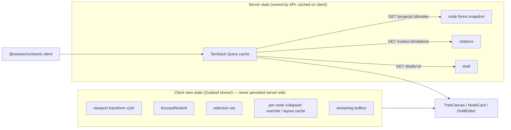
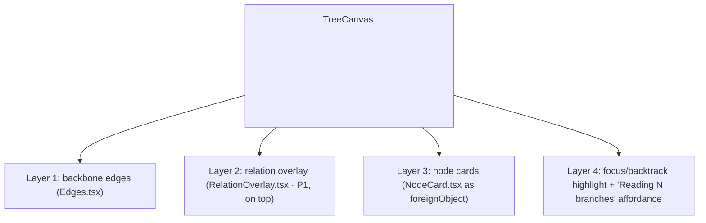
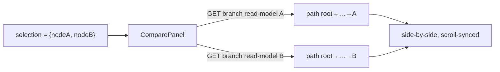
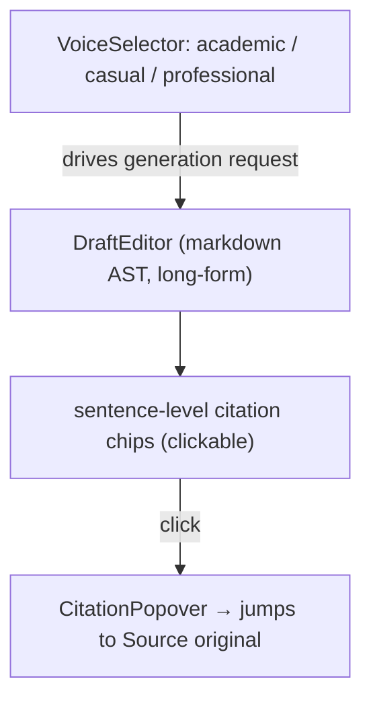

# 04 · Frontend & Thinking-Tree Rendering

> **Status**: Design. Conforms to `00-foundation.md` (authoritative) and assumes
> the contracts of `03-api-service-and-contracts.md`.
> **Scope**: The Next.js + TypeScript frontend — thinking-tree rendering with D3
> auto-layout, the interaction model (pan/zoom, fold/expand, focus/backtrack,
> node states), the compare panel and cross-branch relation overlay (P1), client
> state management, and consumption of the generated `@weaver/contracts` client.
> **Binding boundary**: this app holds **view logic only**. No domain rules.
> Geometry/layout math is allowed (it is presentation). Anything about what a
> node/branch *means* or *sees* is Python-only (foundation §1.1).
> **Owns**: `apps/web/` and the `04-*` content; depends on `00`, `03`.

---

## 0. What this app is and is not

| Is | Is not |
|----|--------|
| A renderer of server-owned state (the tree forest, node states, citations) | A second source of truth for the tree structure |
| An auto-layout view of `ThoughtNode.parent_id` lineage | A free-form canvas with manual node arrangement (PRD non-goal) |
| The place pan/zoom/fold/focus/selection live | The place "what context does a node see" is computed (that is the moat, Python-only) |
| A typed consumer of `@weaver/contracts` | A definer of domain types |

The hard rule, restated from foundation §1.1: **the frontend never computes a
node's branch context.** `resolve_branch_context` is server-side and pure. The
"Reading your N branches" affordance (§5.4) renders a number the server returns;
it does **not** recompute the ancestor set client-side.

> **Why "Branch" never appears as a client entity**: foundation §1.6 fixes Branch
> as a *derived value object*. The frontend treats a branch as "the ancestor path
> of the focused node," derived purely as **layout/highlight geometry** (which is
> view logic and allowed), and only when it must *send intent* (e.g. "draft from
> these branches") it sends the **head node IDs**, letting the server derive
> lineage. The client never persists, diffs, or reasons about branch identity.

---

## 1. App structure (App Router)

```text
apps/web/
├─ app/
│  ├─ layout.tsx                      # Geist + Geist Mono fonts, providers
│  ├─ page.tsx                        # 0 Dashboard: projects + QuickNote inbox
│  ├─ project/[projectId]/
│  │  ├─ page.tsx                     # 2 Thinking-Tree workbench ★ (most time here)
│  │  └─ draft/[draftId]/page.tsx     # 3 Draft surface (editor + Voice + citations)
│  └─ settings/page.tsx              # 4 Settings: model backends + permissions
├─ components/
│  ├─ tree/                          # D3 auto-layout, pan/zoom, fold/expand, focus, backtrack
│  │  ├─ TreeCanvas.tsx              # <svg> root: viewport, transform, layers
│  │  ├─ useTreeLayout.ts            # layout hook (d3-hierarchy + d3-flextree)
│  │  ├─ useViewport.ts              # pan/zoom (d3-zoom) bound to a transform store
│  │  ├─ Edges.tsx                   # backbone edges (parent_of)
│  │  ├─ RelationOverlay.tsx         # cross-branch overlay layer (P1)
│  │  └─ MiniMap.tsx                 # scale-ceiling navigation (P1)
│  ├─ node/
│  │  ├─ NodeCard.tsx                # collapsed (1-line) vs expanded (Q/A + citations)
│  │  ├─ NodeState.tsx               # open / promising / dead_end chip
│  │  ├─ NodeActions.tsx             # fork / prune / promote / set-state / annotate
│  │  └─ StreamingBody.tsx           # SSE token sink into the focused node
│  ├─ compare/                       # side-by-side branch compare panel (P1)
│  ├─ relations/                     # relation create/edit affordances (P1)
│  ├─ draft/
│  │  ├─ DraftEditor.tsx             # long-form editor (markdown AST)
│  │  ├─ VoiceSelector.tsx           # academic / casual / professional
│  │  └─ CitationPopover.tsx         # clickable sentence-level citation → source
│  └─ settings/
│     ├─ BackendList.tsx
│     └─ PermissionToggles.tsx       # auto_run_readonly / allow_file_edits / network_access
├─ lib/
│  ├─ api/                           # thin wrappers over @weaver/contracts client
│  │  ├─ client.ts                   # fetch + bearer + base URL
│  │  ├─ sse.ts                      # EventSource/fetch-stream → TokenEvent decoder
│  │  └─ errors.ts                   # error-envelope → typed AppError mapping
│  └─ tree/                          # PURE VIEW math (not domain): id maps, fold math
├─ stores/                           # client view state (Zustand): focus/selection/layout/transform
└─ __tests__/                        # layout/fold/focus, node-state render, error mapping, smoke
```

### 1.1 Fonts (prototype signal)

`app/layout.tsx` loads **Geist** (UI) and **Geist Mono** (code/quote spans,
prompts, IDs) via `next/font`. Mono is used for node `prompt`, citation `quote`
spans, and the draft editor's code blocks.

```tsx
import { GeistSans } from "geist/font/sans";
import { GeistMono } from "geist/font/mono";
// className={`${GeistSans.variable} ${GeistMono.variable}`}
```

---

## 2. Server state vs client state (the central separation)

Two state systems that never blur:



- **Server state** = anything the API owns: the node forest, node `state`,
  `collapsed` (the *persisted* default), citations, drafts, outlines, backends.
  Cached and mutated through **TanStack Query** over the generated client.
  Mutations are optimistic where safe (state change, annotate, collapse) and
  authoritative-on-settle (fork, prune, draft).
- **Client view state** = pan/zoom transform, current focus, multi-selection,
  transient streaming buffers, ephemeral fold overrides, layout cache. Lives in
  **Zustand** stores under `stores/`. None of it is a domain rule; all of it is
  presentation.

> `ThoughtNode.collapsed` exists on the server (persisted default fold state, so
> reopening a project restores how you left it). The client may hold a *transient*
> override (you collapsed something just to navigate) that it flushes back via
> `PATCH /nodes/:id` on idle. The store key for the override is separate from the
> server value so a refetch never fights the user.

### 2.1 Stores (Zustand)

```ts
// stores/viewport.ts — pan/zoom transform (view-only)
interface ViewportStore {
  transform: { x: number; y: number; k: number };  // d3-zoom transform
  setTransform(t: ViewportStore["transform"]): void;
  focusOn(nodeId: NodeId, layout: LayoutResult): void; // centers + sets focus
}

// stores/focus.ts — focus + backtrack + selection (view-only)
interface FocusStore {
  focusedNodeId: NodeId | null;     // the "current" node new input grows from
  selection: Set<NodeId>;           // multi-select for compare(P1)/draft-from-branches
  backtrack(nodeId: NodeId): void;  // refocus an OLD node; old branch greyed, not removed
  toggleSelect(nodeId: NodeId): void;
  clearSelection(): void;
}

// stores/fold.ts — transient collapse overrides (flushed to server on idle)
interface FoldStore {
  overrides: Map<NodeId, boolean>;  // nodeId -> collapsed override
  setCollapsed(nodeId: NodeId, collapsed: boolean): void;
  effectiveCollapsed(nodeId: NodeId, serverValue: boolean): boolean;
}

// stores/stream.ts — SSE token buffers keyed by node (view-only)
interface StreamStore {
  buffers: Map<NodeId, { text: string; citations: CitationLite[]; status: StreamStatus }>;
  forkProposals: ForkProposal[] | null;  // structured AI-proposed forks awaiting accept
  append(nodeId: NodeId, ev: TokenEvent): void;
  finalize(nodeId: NodeId): void;
}
```

All four are pure view state. `NodeId`, `CitationLite`, `TokenEvent`,
`ForkProposal` are **imported from `@weaver/contracts`**, not redefined.

---

## 3. Consuming the generated contract client

Per foundation §1.1, `apps/web` imports **everything wire-shaped** from
`@weaver/contracts` (generated from `openapi.json`). No hand-written DTOs.

```ts
// lib/api/client.ts
import createClient from "openapi-fetch";
import type { paths } from "@weaver/contracts";        // generated path types

export const api = createClient<paths>({
  baseUrl: process.env.NEXT_PUBLIC_API_BASE ?? "/api/v1",
  headers: { Authorization: `Bearer ${localBearer()}` }, // single-user local auth (foundation §1.5)
});

// Example: typed, no manual shape
const { data, error } = await api.GET("/projects/{projectId}/nodes", {
  params: { path: { projectId } },
});
```

Enums (`NodeState`, `VoiceTone`, `RelationKind`, `ArtifactFormat`, `BackendKind`,
`Permission`, `NarrativeRole`, `NodeKind`, `SourceKind`) arrive as string-literal
unions through the schema — the client uses the **same literals** the API emits,
so a backend rename breaks the TS build (the desired drift signal).

### 3.1 Error-envelope mapping (testable, foundation §1.5 / §7)

The single error envelope `{ error: { code, message, details } }` maps to typed
client errors so components branch on a stable enum, never on message strings.

> **Contract-freeze (C3)**: `ErrorCode` is owned by `03-api-service-and-contracts.md`
> (`weaver_api/errors.py`) and is the SOLE source of error codes. The frontend
> imports the **generated** union from `@weaver/contracts` and never hand-rolls a
> competing `AppErrorCode`. A backend-only code therefore breaks the FE build
> (the desired drift signal) rather than being silently branched on.

```ts
// lib/api/errors.ts
import type { components } from "@weaver/contracts";

// Generated from 03's ErrorCode enum — never hand-listed here (C3).
export type ErrorCode = components["schemas"]["ErrorCode"];

export class AppError extends Error {
  constructor(
    readonly code: ErrorCode,
    message: string,
    readonly details?: Record<string, unknown>,
    readonly httpStatus?: number,
  ) { super(message); }
}

export function toAppError(envelope: unknown, httpStatus?: number): AppError {
  const e = (envelope as any)?.error;
  if (e?.code) return new AppError(e.code as ErrorCode, e.message ?? "", e.details, httpStatus);
  // catch-all when the envelope is missing/malformed — `INTERNAL` is in 03's enum.
  return new AppError("INTERNAL", "Unexpected error", undefined, httpStatus);
}
```

UI rules (codes are 03's canonical names): `NODE_NOT_FOUND`/`PROJECT_NOT_FOUND`
→ refetch + toast; `VALIDATION_FAILED` → inline field error;
`NO_DEFAULT_BACKEND`/`BACKEND_DISABLED` → backend picker with a "configure in
Settings" link; `GROUNDING_UNAVAILABLE` → ungrounded-mode notice;
`STREAM_INTERRUPTED` → keep partial tokens, offer "Resume". Any code without a
specific branch falls through to the catch-all `INTERNAL` toast.

> **Honesty labels (C13)**: where node/draft bodies render an honesty marker, the
> FE uses the canonical `HonestyLabel` members owned by `01-domain-and-core-logic.md`
> (`user_judgment` | `inferred` | `grounded` | `weakly_grounded`), arriving via
> codegen — never a locally-spelled vocabulary.

---

## 4. The thinking tree: D3 auto-layout render

### 4.1 Layout algorithm choice

**Decision: `d3-hierarchy` for the tree model + `d3-flextree` for the layout
pass; never a force/physics layout, never manual coordinates.**

Rationale:

- The backbone is a **rooted forest** (`parent_id`), which is exactly what
  `d3.hierarchy` consumes. `d3.tree()` (Reingold–Tilford) gives stable,
  deterministic, non-overlapping placement with **zero manual arrangement** —
  satisfying "可视化是思考的副产品 / not a canvas."
- Plain `d3.tree()` assumes uniform node size; our node cards are
  **variable-height** (collapsed = 1 line, expanded = full Q/A + citations).
  `d3-flextree` is the variable-size variant of Reingold–Tilford and lays out
  nodes of arbitrary measured size without overlap. So: hierarchy for the model,
  **flextree** for the size-aware pass.
- A **force-directed** graph is explicitly rejected: it is non-deterministic,
  jitters on every relayout, and degenerates into "a canvas you must tidy by
  hand" — the exact old-Weaver pain the PRD rebuilds away from.

> **Per-project forest, not single tree**: a project can have multiple roots
> (`parent_id = null`), e.g. several QuickNote-promoted starting nodes. We wrap
> them under a synthetic invisible super-root for the layout pass, then drop the
> super-root from render. The super-root is **view-only** and never sent anywhere.

### 4.2 Stable layout via `order_index`

Layout stability is a product requirement: re-rendering after a fork must not
reshuffle the user's mental map. We guarantee determinism by:

1. **Sorting siblings by `order_index`** (server-assigned, foundation §2.2) before
   the layout pass — never by insertion order, hash, or label.
2. **Fixing orientation** to top-down (root at top, children below) so a new fork
   appears beside its siblings, not on the opposite side.
3. **Caching measured node sizes** keyed by `(nodeId, collapsed, contentHash)` so
   a layout that didn't change geometry produces byte-identical coordinates.

```ts
// components/tree/useTreeLayout.ts
import { hierarchy } from "d3-hierarchy";
import { flextree } from "d3-flextree";

export interface LayoutNode {
  id: NodeId; x: number; y: number; width: number; height: number;
  depth: number; parentId: NodeId | null; collapsed: boolean;
}
export interface LayoutResult {
  nodes: Map<NodeId, LayoutNode>;
  edges: { from: NodeId; to: NodeId }[];   // backbone edges only
  bbox: { minX: number; minY: number; maxX: number; maxY: number };
}

export function useTreeLayout(
  forest: ThoughtNode[],               // server state (a snapshot)
  measured: Map<NodeId, Size>,         // measured card sizes (view)
  foldState: (id: NodeId) => boolean,  // effective collapsed (view)
): LayoutResult {
  // 1. build adjacency; attach a synthetic super-root over all parent_id===null
  // 2. SORT every children[] by order_index  (stability rule)
  // 3. hide descendants of collapsed nodes from the layout (fold = layout-affecting)
  // 4. flextree() with nodeSize = measured[id] (collapsed → 1-line height)
  // 5. drop super-root; emit LayoutResult (memoized on forest+measured+foldState hash)
}
```

> **Fold is layout-affecting, not just visual**: a collapsed node hides its
> subtree from the layout pass so the canvas reclaims the space. This is what
> keeps a large tree readable (§9 scale ceiling) and is pure view math.

### 4.3 Render layers (SVG)



Node cards render as `<foreignObject>` so they are real HTML (rich text, citation
chips, buttons, fonts) inside the zoomable SVG transform — giving HTML ergonomics
with SVG pan/zoom geometry. Backbone edges are simple cubic Béziers parent→child.
The relation overlay (P1) draws **on top** of everything (foundation: "rendered
as an overlay layer on top of the tree").

---

## 5. Interaction model

### 5.1 Pan/zoom

`d3-zoom` bound to the SVG; its transform is mirrored into `ViewportStore` (so
"focus" / "fit" actions can drive it programmatically). Wheel = zoom, drag =
pan, pinch on trackpad = zoom. Zoom clamps `k ∈ [0.15, 2.5]`. No node is ever
moved by the user — dragging pans the *viewport*, never a node (anti-canvas).

```ts
// components/tree/useViewport.ts
const zoom = d3.zoom<SVGSVGElement, unknown>()
  .scaleExtent([0.15, 2.5])
  .on("zoom", (e) => viewport.setTransform(e.transform));
```

### 5.2 Fold / expand

Two-level disclosure (PRD §2.3 决策3):

| State | Renders | Layout effect |
|-------|---------|---------------|
| **collapsed** | one-line summary (node `prompt` or first sentence of `content`) + state chip | subtree hidden from layout |
| **expanded** | full Q/A: `prompt` + `content` + `annotation` + sentence-level citation chips | subtree participates in layout |

Toggling flushes a transient override into `FoldStore`, triggers relayout, and on
idle (debounced ~800ms) persists via `PATCH /nodes/:id { collapsed }`.

### 5.3 Focus + backtrack

- **Focus**: clicking a node sets `FocusStore.focusedNodeId`. New input grows a
  child from the focused node. The focused node and its **ancestor path** are
  highlighted (this is the *view-side* highlight of the branch; it is geometry,
  not a context computation).
- **Backtrack** (回溯): clicking an *old* node refocuses it. Critically, the
  previously-active branch is **greyed, not removed** (PRD §2.2: "旧分支不消失，
  只失焦变灰"). Implemented as a `dimmed` class on every node *not* on the focused
  node's ancestor path:

```ts
// pure view math in lib/tree/highlight.ts
export function ancestorPathIds(focusId: NodeId, byId: Map<NodeId, ThoughtNode>): Set<NodeId> {
  const path = new Set<NodeId>(); let cur: NodeId | null = focusId;
  while (cur) { path.add(cur); cur = byId.get(cur)?.parent_id ?? null; }
  return path;  // VIEW highlight only — NOT the model context (server owns that)
}
// dimmed = every rendered node whose id ∉ ancestorPathIds(focusId)
```

> This `ancestorPathIds` is *visual emphasis* and is intentionally allowed in the
> frontend. It must **never** be used to assemble messages for a model — that is
> the server's `resolve_branch_context`. The comment is load-bearing: it stops a
> future contributor from "optimizing" by sending the client path to the model.

### 5.4 Node card rendering & "Reading your N branches"

`NodeCard.tsx` renders by `kind` and `state`:

- **`kind`** (`question_answer` | `ai_reasoning` | `user_thought`) drives the card
  chrome (Q/A shows a prompt header; user_thought shows an authored-by-you mark;
  ai_reasoning shows a reasoning glyph).
- **`state`** (`open` | `promising` | `dead_end`) drives the state chip
  (prototype "Open / Promising / Dead end"):
  - `open` — neutral.
  - `promising` — accented; eligible for "Promote to argument point."
  - `dead_end` — greyed + collapsed by default (pruned record, not deleted).
- **`annotation`** renders as a distinct user-authored band on the card.
- **"Reading your N branches"** affordance: while composing input at the focused
  node, the composer shows the server-reported count of ancestor segments the AI
  will read. **The number comes from the API** via `context_segment_count`,
  echoing the moat in the UI without recomputing it. Copy mirrors the prototype:
  *"Reading your N branches."*

  > **Contract-freeze (C7)**: the count is sourced from the EARLY `progress`-type
  > TokenEvent the `/think` stream emits as its FIRST frame (before any `token`),
  > whose data is `{stage:'context_resolved', context_segment_count:int,
  > branch_node_ids:[...]}` — see §6. The same value is also present on the
  > terminal `done` (`ThinkResultMeta.context_segment_count`). The earlier
  > `GET …/think/preview` alternative is dropped. The number is always the
  > server resolver's output, never client-computed.

```tsx
// components/node/NodeCard.tsx (shape)
function NodeCard({ node, collapsed, dimmed, focused }: NodeCardProps) {
  if (collapsed) return <CollapsedCard node={node} dimmed={dimmed} />;
  return (
    <article data-kind={node.kind} data-state={node.state}
             className={cx({ dimmed, focused })}>
      {node.prompt && <PromptHeader>{node.prompt}</PromptHeader>}
      <Body markdown={node.content} citations={node.citations /* when grounded */} />
      {node.annotation && <Annotation>{node.annotation}</Annotation>}
      <NodeState state={node.state} />
      <NodeActions node={node} />  {/* fork · prune · promote(if promising) · set-state · annotate */}
    </article>
  );
}
```

### 5.5 Promote to argument point

On a `promising` node, `NodeActions` exposes **"Promote to argument point"**
(PRD "提升为论点"). It calls the crystallize action (`POST /branches/{id}/promote`
or `POST /outlines/{id}/points` per the 03/06 contract), passing the node's id;
the **server** derives the branch and builds the `OutlinePoint`. The client just
sends intent + reflects the returned outline.

---

## 6. Streaming the think loop (SSE → focused node)

The think loop is synchronous + streaming (foundation §1.4/§1.5). The flow when
the user asks at the focused node:

```mermaid
sequenceDiagram
  participant U as User (composer at focused node)
  participant Web as apps/web
  participant API as FastAPI /api/v1
  participant Core as weaver_core (moat)
  participant MP as ModelProvider

  U->>Web: submit prompt at focusedNodeId
  Web->>API: POST /nodes/{focusedNodeId}/think  (prompt, backend_id?)
  Note over Web,API: response is text/event-stream (SSE), TokenEvent shape
  API->>Core: resolve_branch_context(focusedNodeId)  ★ ancestor-only
  Core-->>API: BranchContext (ordered messages) + context_segment_count
  API-->>Web: SSE: progress {stage:'context_resolved', context_segment_count, branch_node_ids}
  API->>MP: generate(req with resolved messages)
  loop streaming
    MP-->>API: TokenEvent(token | citation | proposal | progress …)
    API-->>Web: SSE: data: {type, data, seq, request_id}
    Web->>Web: StreamStore.append(newChildId, ev)  → live render
  end
  MP-->>API: TokenEvent(done)
  API-->>Web: SSE done (node persisted iff create_child; data carries real node_id | null)
  Web->>Web: finalize → invalidate node-forest query → relayout
```

- The new child node appears **optimistically** at submit (a placeholder child of
  the focused node) so the tree grows immediately; tokens stream into its body.
  Per **C11**, treat this placeholder as **view-only** until the terminal `done`:
  `/think` defaults to `create_child=true`, so `done.data.node_id` is the real
  server id the placeholder is reconciled to; for `create_child=false`
  (non-committing preview) `node_id` is `null` and the placeholder is **discarded**.
- The **first** SSE frame is a `progress` TokenEvent carrying
  `context_segment_count`, which feeds the **"Reading your N branches"** label
  (C7) — no separate preview call.
- On `STREAM_INTERRUPTED`, partial tokens are kept and a "Resume" affordance is
  shown; resume re-issues the think call with the same `Idempotency-Key`, so the
  server returns the already-persisted result if generation completed (03 §4 /
  G2 — replays return the persisted result, not a re-stream).
- **Cancellation (G1)**: closing the SSE connection (AbortController on the fetch
  stream) implicitly cancels the in-flight generation; an aborted `/think`
  persists nothing. Clients that cannot drop the connection cleanly call
  `DELETE /streams/{request_id}` (the `request_id` the FE supplied in the request
  body and which is echoed on every `TokenEvent.request_id`). Both surface as
  `STREAM_INTERRUPTED`.

```ts
// lib/api/sse.ts
export async function streamThink(
  nodeId: NodeId, body: ThinkRequest,
  onEvent: (ev: TokenEvent) => void,
): Promise<void> {
  const res = await fetch(`/api/v1/nodes/${nodeId}/think`, {
    method: "POST", headers: { "Content-Type": "application/json",
      Authorization: `Bearer ${localBearer()}` },
    body: JSON.stringify(body),
  });
  if (!res.ok) throw toAppError(await res.json().catch(() => ({})), res.status);
  const reader = res.body!.getReader();
  // decode SSE frames → TokenEvent (NDJSON fallback handled by content-type sniff)
  // each parsed event → onEvent(ev)
}
```

The FE switches **exhaustively** over the canonical closed `TokenEvent.type` set
owned by `02-model-provider-and-agents.md` (C1) — exactly
`token | tool_call | tool_result | citation | proposal | progress | done | error`
(there is **no** `ingest_progress`; ingestion progress arrives as `progress`):
`"token"` (append text), `"citation"` (attach a sentence-level citation chip to
the running text), `"tool_call"`/`"tool_result"` (CLI-agent activity badge — P1+
backends), `"proposal"` (one `ForkProposal`/outline-point proposal — §6.1),
`"progress"` (`{ratio, stage, detail}`; the early `context_resolved` frame is a
`progress` event), `"done"`, `"error"`. The closed enum lets the FE switch be
exhaustive so a new backend type breaks the build (the desired drift signal).
The FE never re-declares `TokenEvent` — it imports it from `@weaver/contracts`.

### 6.1 AI-proposed-fork acceptance UI

AI-proposed forks are *structured* generation (foundation §1.2).

> **Contract-freeze (G7, C1)**: the proposal payload is 03's canonical **flat**
> `ForkProposal { prompt: string; rationale: string; suggested_label?: string }`
> (imported from `@weaver/contracts`). The old nested local
> `interface ForkProposal { directions: [...] }` is **deleted** — the FE never
> re-declares the shape.

The FE consumes proposals from **either** delivery path, uniformly:
- inline on `/think` — `proposal`-type TokenEvents (each carrying one
  `ForkProposal`), plus the terminal `done`'s
  `ThinkResultMeta.fork_proposals: ForkProposal[]`;
- on-demand `POST /nodes/{id}/fork/propose` — a dedicated SSE stream of
  `proposal` events whose terminal `done` carries
  `ForkProposeResult { proposals: ForkProposal[] }`.

```ts
// shape imported from @weaver/contracts (03-owned); flat list, no nesting
type ForkProposal = components["schemas"]["ForkProposal"];
// { prompt: string; rationale: string; suggested_label?: string | null }
```

UI: a non-modal "There are N directions worth thinking about separately" strip
under the answer (PRD §2.2 "AI 主动提议分叉是最大价值点"). Each proposal is a
one-click **Accept** → `POST /nodes/{id}/fork { prompt, suggested_label? }`, which
the server turns into a child node (deterministic `tree.fork`, then optionally
auto-thinks it). Dismiss is one click; cadence/count is a server/02-* concern,
the UI just renders what it gets and never fabricates directions.

---

## 7. Compare panel & relation overlay (P1)

### 7.1 Compare panel (并比)

Select two nodes (or two branch heads) → a side-by-side panel renders each
branch's ancestor path **read-only**, scroll-synced where depths align. Selection
comes from `FocusStore.selection` (max 2 for compare). The panel fetches each
branch as a **derived read model** from the API (foundation §1.6: branches are
read models, not CRUD) — the client does not assemble the branch itself for any
semantic purpose; it requests the server's rendering of the two paths.



### 7.2 Cross-branch relation overlay (汇合 / 相通 / 反例)

`Relation` (P1) is an **additive overlay**, never a backbone edge (foundation
§2.2). `RelationOverlay.tsx` draws a dashed/curved connector between
`from_node_id` and `to_node_id` using the *same* `LayoutResult` coordinates,
rendered in Layer 2 **on top** of the tree. Creating a relation: drag from one
node's relation-handle to another → `POST /relations { from, to, kind, note }`.
Kind drives style: `merge` (solid join), `connection` (dashed), `contradiction`
(red, opposed). AI-discovered relations (`created_by: "ai"`) render with an "AI
suggested" badge until confirmed.

The overlay **must not** alter the layout — it is purely additive geometry, so
the tree stays auto-laid-out and never degenerates into a hand-arranged graph.

---

## 8. Draft surface (M4/M5)

`app/project/[projectId]/draft/[draftId]/page.tsx`:



- **Editor**: renders `Draft.body` (markdown AST). MVP is generate-then-edit:
  the body streams (SSE TokenEvent) from the single streaming endpoint
  `POST /projects/{pid}/drafts` with body `DraftGenerateRequest` (exactly one
  source path: `outline_id` XOR non-empty `source_branch_node_ids`). The terminal
  `done` carries the new draft id + a `DraftView` summary, after which the client
  refetches the citation-anchored AST. Editing is local rich-text over the AST;
  save is `PATCH /drafts/:id`.

  > **Contract-freeze (C2)**: there is ONE draft route — the single streaming
  > `POST /projects/{pid}/drafts` (create + generate in one call) with request
  > schema `DraftGenerateRequest`. The bare `POST /drafts` and the two-step
  > `POST /drafts/{id}/generate` are gone.
- **Voice selector**: the three exact prototype presets — academic ("Precise,
  hedged, citation-forward"), casual ("Direct, first-person, conversational"),
  professional ("Clear, confident, brisk"). Changing Voice and regenerating sends
  `voice` in `DraftGenerateRequest`. **Voice affects the DRAFT** (foundation core
  truth / edge over NotebookLM Personas) — the selector lives on the draft
  surface, not just chat. Per **G6**, Voice is a draft-stage concern only and is
  intentionally **never** sent on `/think` node answers.
- **Citations**: sentence-level chips inline in the draft body. Clicking a chip
  opens `CitationPopover` showing the `quote` (Geist Mono) and a "Jump to source"
  link that opens the `Source` at `char_start..char_end`. Citations are preserved
  node→draft (foundation Citation entity); the client renders the
  `draft_anchor`→citation mapping the API returns and never re-derives it.

  > **Contract-freeze (C4)**: `char_start`/`char_end` on `CitationRef`/
  > `CitationAnchor` index the **SOURCE canonical document text** (owned by 00),
  > NOT the chunk text — this is what "Jump to source" resolves against. The FE
  > additionally uses `CitationAnchor.answer_span` to **underline the supported
  > span** in the draft text, and `CitationAnchor.method`
  > (`marker | lexical | semantic | none`) to drive **method-based trust styling**
  > of the chip (C4/C6).
- **Grounded state (C6)**: the draft surface renders `DraftView.grounded` (a
  grounded/ungrounded banner) and lists `DraftView.uncited_claims` (server-derived)
  as a "claims without support" warning panel. These are not request fields.
- **No-source mode**: when ungrounded (`grounded=false`), no citation chips;
  honesty marking uses the canonical `HonestyLabel` members from 01
  (`user_judgment` | `inferred` | `grounded` | `weakly_grounded`) — the surface
  renders the label the API supplies and never invents its own vocabulary (C13).
- Fonts: body in Geist; `quote` spans and any code in Geist Mono.

---

## 9. Tree scale ceiling (foundation Open Question §11)

When node count grows, "回看" must not become a burden (PRD §9 risk). The
frontend mitigations (all pure view logic):

1. **Auto-fold on depth/breadth**: nodes beyond a depth threshold or in large
   sibling fans auto-collapse to one-liners until focused (a view heuristic, not
   a server mutation — uses transient `FoldStore` overrides).
2. **Focus-follows-work**: on focus/backtrack, auto-fit the viewport to the
   focused node's ancestor path + immediate children, dimming the rest.
3. **MiniMap** (P1): a low-detail overview of the whole forest with a draggable
   viewport rectangle, for navigation in big trees.
4. **dead_end auto-collapse**: pruned branches stay (record), default collapsed
   and greyed, so they cost ~1 line of vertical space.

> Any *semantic* auto-merge/summarization of branches (e.g. AI condensing a
> region) is **not** done here — that is a `01-*` (summarization) decision. The
> frontend only does layout-level folding/focusing. Flagged in Open Questions.

---

## 10. Testing (`apps/web/__tests__/`)

Conforms to foundation §7. All model-touching paths run against the **FAKE**
provider via the API, so streaming tests are deterministic.

### 10.1 Unit / component (Vitest + Testing Library)

| Area | Test |
|------|------|
| Layout | `useTreeLayout` is deterministic: same forest+sizes+fold → identical coordinates; siblings ordered by `order_index`; collapsed node hides subtree from layout; multi-root forest places all roots. |
| Fold/expand | toggling a node collapses subtree (layout) and renders one-line summary; expand restores full Q/A + citation chips; transient override survives a refetch (no fight with server value). |
| Focus/backtrack | focusing sets focus; backtracking an old node greys (not removes) every node off the ancestor path; `ancestorPathIds` returns root→focus in order. |
| Node states | `open`/`promising`/`dead_end` render correct chip; `dead_end` defaults collapsed+greyed; `promising` shows "Promote to argument point"; `kind` drives card chrome. |
| Streaming | FAKE stream of TokenEvents appends tokens into the optimistic child; the early `progress` frame sets the "Reading N branches" count; `citation` events attach chips; `done` reconciles the placeholder to `done.node_id` (or discards it when `node_id=null`); `error`/`STREAM_INTERRUPTED` keeps partial + offers Resume. |
| Fork proposals | `proposal` TokenEvents (or `done.fork_proposals`/`ForkProposeResult.proposals`) render N proposals; Accept calls `/nodes/:id/fork` with `prompt`/`suggested_label`; dismiss removes the strip. |
| Error mapping | `toAppError` maps each envelope `code` to the right `AppError`; missing/malformed envelopes → catch-all `INTERNAL`; components branch on the generated `ErrorCode`, not message. |
| Draft | Voice selector renders the 3 presets and sends `voice` in `DraftGenerateRequest`; citation chip click opens popover with `quote` + jump link (offsets into SOURCE canonical text); `grounded=false` draft shows no chips + renders `uncited_claims`. |
| Boundary guard | a lint/test asserts no module under `lib/`, `stores/`, `components/` imports a model client or assembles "context messages" — enforces the no-domain-rules boundary. |

### 10.2 Contract alignment

The frontend never defines wire types; a CI step (foundation drift guard) fails
if `@weaver/contracts` is stale. A small test imports a representative set of
generated enums and asserts the literals the UI switches on still exist (so a
backend enum rename breaks the FE build loudly).

### 10.3 Browser smoke test (one per milestone, Playwright)

- **M2**: open project → ask at root → fork → backtrack to old node (greyed) →
  fold/expand → see "Reading your N branches." (FAKE provider.)
- **M3**: grounded project → node answer shows sentence-level citation chips →
  click chip jumps to source.
- **M4**: select branches → generate draft (direct-from-branches) → switch Voice
  → regenerate.
- **M5**: export Markdown; citations present in output. End-to-end: think →
  branch → (optional crystallize) → draft → export.

---

## 11. MVP vs Later

**MVP (M1–M5; 3 pages: Dashboard, Thinking Tree w/ optional source sidebar,
Draft):**
- App Router shell + Geist/Geist Mono.
- D3 auto-layout tree (`d3-hierarchy` + `d3-flextree`), stable via `order_index`,
  no manual arrangement.
- Pan/zoom, fold/expand (1-line ↔ full Q/A + citations), focus, backtrack (old
  branch greyed not removed).
- Node card: states (open/promising/dead_end), annotation, kind, "Reading your N
  branches" affordance, promote-to-argument-point.
- SSE token streaming into the focused node; AI-proposed-fork accept UI.
- Server/client state split (TanStack Query + Zustand stores).
- Draft surface: long-form editor + Voice selector (3 presets) + clickable
  sentence-level citations.
- Error-envelope → typed error mapping.
- Tree scale-ceiling: auto-fold + focus-follows-work + dead_end auto-collapse.
- Frontend tests + one browser smoke test per milestone.

**Later (P1/P2):**

> **Contract-freeze (G3) — feature gating**: every P1/P2 affordance below is hidden
> unless its flag is on in `GET /api/v1/meta` → `MetaView.features` (`FeatureFlags`,
> schematized in 03). The FE gates by **exact field name** — e.g.
> `features.relations` (relation overlay), `features.compare` (compare panel),
> `features.artifacts_multiformat` (multi-format artifacts), `features.cli_agents`
> (tool_call/tool_result badges), `features.cross_project_network` (CrossLink view),
> `features.structure_templates` (outline template picker),
> `features.browser_capture`, `features.media_transcription`,
> `features.big_doc_jobs`, `features.paragraph_ops`. All default off in MVP. The FE
> never assumes an unschematized `/meta` payload; it reads `MetaView.features.*`.

- **Compare panel** (side-by-side branches) — P1.
- **Cross-branch relation overlay** (merge/connection/contradiction) + AI-
  discovered relations — P1.
- MiniMap for very large trees — P1.
- Multi-format Artifact surfaces (deck / X thread / video script / email) derived
  from one draft — P1.
- Reading-view highlights → start node; browser-capture intake UI — P1.
- CLI-agent activity rendering (tool_call/tool_result badges, permission state) —
  P1+ backends.
- Cross-project thinking-network visualization (CrossLink) — P2.
- Structure-template pickers for outlines — P2.
- PNG/SVG tree/outline export surfaces — P1.

---

## 12. Open Questions (flag, do not silently resolve)

- **~~"Reading your N branches" transport~~ — RESOLVED (C7, see ADR-log)**: the
  count is sourced from the EARLY `progress`-type TokenEvent
  (`{stage:'context_resolved', context_segment_count, branch_node_ids}`) emitted as
  the first `/think` SSE frame (also on terminal `done`). The `think/preview` GET
  alternative is dropped.
- **Transient fold vs persisted `collapsed`**: debounce window and conflict rule
  (server refetch vs local override) chosen here as override-wins-until-flush;
  confirm this matches desired multi-tab behavior (single-user, but two tabs
  possible).
- **Tree scale ceiling — semantic merge**: the foundation Open Question asks
  whether large trees need *auto-merge/summarization*. This doc only does
  layout-level folding/focusing; if AI summarization of regions is wanted, it is
  a `01-*` domain feature the FE would merely render. Needs a decision.
- **~~AI-proposed-fork (`ForkProposal`) shape~~ — RESOLVED (G7/C1, see ADR-log)**:
  frozen to 03's flat `ForkProposal { prompt, rationale, suggested_label? }`,
  delivered via `proposal` TokenEvents or `done.fork_proposals` /
  `ForkProposeResult.proposals`; accept via `POST /nodes/{id}/fork`. (Cadence/count
  policy remains a 02-* concern; the wire shape is no longer open.)
- **No-source honesty marking**: the *vocabulary* is now frozen — the FE renders
  the canonical `HonestyLabel` members from 01 (`user_judgment` | `inferred` |
  `grounded` | `weakly_grounded`, C13). Only the *visual* treatment (icon/color per
  label in node bodies and draft text, PRD §10) remains a design detail; the
  enum's name/shape is no longer open.
- **foreignObject performance ceiling**: at what node count does HTML-in-SVG
  rendering degrade enough to need virtualization/canvas fallback for off-screen
  nodes? Establish a budget during M2 and add windowing if needed.
- **Compare with >2 branches**: PRD says "两条" (two). If users want N-way
  compare later, `FocusStore.selection` cap and panel layout need revisiting.
