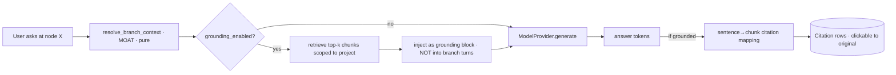

# 05 · Retrieval & Grounding

> **Title**: Retrieval & Grounding (chunking, embedding, sentence-level citation
> mapping, Chinese optimization — **optional**)
> **Status**: Design. Conforms to `00-foundation.md` (authoritative) and depends on
> `01-domain-and-core-logic.md` for the moat contract and node lifecycle.
> **Scope**: FULL VISION (P0/P1/P2). MVP boundary marked inline and in §11.
> **Owns**: `apps/api/weaver_core/retrieval/` and the `Citation` mapping algorithm.

---

## 0. The one non-negotiable: grounding is optional

This entire subsystem is **opt-in**. Weaver is a **branching thinking tool**, not a
"document Q&A" product. The tree, the moat (per-branch context isolation), forking,
backtracking, pruning, crystallization, and draft generation **all work with zero
`Source` rows**. PRD §4.1: 素材是可选的接地来源，不是前提.

The contract this doc commits to:

- A project with `grounding_enabled = false` (no `Source`) **never touches** any code
  in `weaver_core/retrieval/`. The think loop calls `resolve_branch_context` →
  `ModelProvider.generate` with **no retrieval step inserted**.
- Retrieval is **additive**: when `Source` rows exist, it produces extra context that
  is *appended to the system/grounding slot* of the already-resolved branch messages,
  and produces `Citation` rows. It **must not widen the branch context** (§5).
- Honesty marking (`inferred` vs grounded vs user judgment) is coordinated with
  `01-*` so the *ungrounded* path is still trustworthy (§8).

Everything below is therefore framed as a **bypassable pipeline**.



---

## 1. Module layout & responsibilities

```text
apps/api/weaver_core/retrieval/
├─ __init__.py
├─ service.py            # GroundingService — the only entry point routes/think-loop use
├─ ingest/
│  ├─ pipeline.py        # orchestrates parse→chunk→embed; status + progress; resumable
│  ├─ parsers/
│  │  ├─ base.py         # SourceParser Protocol -> ParsedDocument
│  │  ├─ text.py         # text / markdown (heading-aware)
│  │  ├─ pdf.py          # PDF -> text + page/section spans
│  │  └─ url.py          # URL fetch -> readability -> markdown
│  └─ progress.py        # IngestProgress events + jobs-table bridge (large docs)
├─ chunking/
│  ├─ chunker.py         # Chunker Protocol + default recursive/heading-aware impl
│  └─ segmentation.py    # sentence segmentation (CJK + Latin) — shared by citation mapping
├─ embedding/
│  ├─ embedder.py        # Embedder Protocol (batch, normalized) + registry
│  ├─ providers.py       # local (sentence-transformers / bge-m3) + API + FAKE
│  └─ cache.py           # content-hash embedding cache (idempotent re-embed)
├─ index/
│  ├─ vector_index.py    # VectorIndex Protocol
│  ├─ sqlite_vec.py      # default (sqlite-vec)
│  ├─ pgvector.py        # swappable
│  └─ flat.py            # numpy brute-force fallback (tiny corpora / no native ext)
├─ retrieve/
│  ├─ retriever.py       # query build, hybrid (vector + lexical), rerank, scoping
│  └─ query.py           # how a branch turns into a retrieval query (NO context widening)
└─ citation/
   ├─ mapper.py          # ★ sentence-level answer→chunk char-span mapping
   └─ align.py           # CJK-aware span alignment helpers
```

**Contract-freeze (G4) — `raw_ref` is a BlobStore ref**: a `Source.raw_ref` is a
**content-addressed `BlobStore` ref** (`blob://sha256/<hex>`) per the `BlobStore`
Protocol owned by `07-*`. Parsers (§2.5) read raw payloads via `BlobStore.get(raw_ref)`;
ingestion never assumes a local filesystem path. Refs are stable and deduped, and blobs
are included in the backup tarball (`07-*`). This doc references `BlobStore` by name and
does not re-declare it.

`citation/` lives in `retrieval/` (not the foundation's `weaver_core/citation/`)
because mapping is **mechanically dependent on Chunk char spans and segmentation**.
The foundation's `citation/` package name is reconciled by re-exporting:
`weaver_core/citation/__init__.py` re-exports `retrieval.citation.mapper`. (Flagged in
Open Questions if the team prefers the inverse home.) The *contract* (`Citation` shape)
is owned by the foundation and unchanged.

### 1.1 The single public surface

Everything outside `retrieval/` talks to **one** facade so the think loop stays simple
and the bypass is explicit:

```python
# weaver_core/retrieval/service.py

class GroundingService(Protocol):
    async def ingest_source(self, source_id: ULID) -> "IngestResult":
        """Parse → chunk → embed → index. Idempotent & resumable.
        Updates Source.status / Source.ingest_progress as it runs."""

    async def retrieve(self, q: "RetrievalQuery") -> "RetrievalResult":
        """Top-k chunks for a project, scoped + reranked. NEVER reads sibling
        branch nodes; only the resolved branch + the explicit query text."""

    def map_citations(
        self, answer_text: str, used_chunks: list["RetrievedChunk"],
        *, target: "CitationTarget",
    ) -> list["CitationDraft"]:
        """Pure (no I/O, no model). Maps answer sentences -> chunk char spans
        -> CitationDraft rows. Unit-testable in isolation (the P0 hard indicator)."""

    async def is_grounded(self, project_id: ULID) -> bool:
        """True iff project has >=1 Source with status='ready'. The think loop
        calls this to decide whether to insert retrieval at all."""
```

`map_citations` is **synchronous and pure** on purpose — it is the highest-risk,
most-tested piece and must be reproducible without any model or DB (mirrors the moat's
purity discipline from `00-*` §3 and §7).

---

## 2. Ingestion pipeline

### 2.1 States & data shape

`Source.status ∈ {pending, ready, failed}`; `Source.ingest_progress: float ∈ [0,1]`.
(Both already in the foundation domain model §2.2.)

```python
class IngestStage(str, Enum):
    PARSE   = "parse"      # 0.00 -> 0.30
    CHUNK   = "chunk"      # 0.30 -> 0.45
    EMBED   = "embed"      # 0.45 -> 0.95
    INDEX   = "index"      # 0.95 -> 1.00

class IngestProgress(BaseModel):
    source_id: ULID
    stage: IngestStage
    progress: float           # overall 0..1 (monotonic)
    detail: str | None        # "embedding chunk 240/1180"
    error: ErrorEnvelope | None = None

class IngestResult(BaseModel):
    source_id: ULID
    status: Literal["ready", "failed"]
    chunk_count: int
    token_count: int
    duration_ms: int
```

Progress is streamed to the UI over the same **SSE** channel the API uses elsewhere
(`00-*` §1.5). **Contract-freeze (C1)**: there is **no** `ingest_progress` event type.
Ingestion progress is emitted as the canonical **`progress`** `TokenEvent` (owned by
`02-*`, which holds the closed `type` enum). The `IngestProgress` model above maps onto
that event's `data` payload `{ratio, stage, detail}` (`ratio` ← `progress`,
`stage` ← `IngestStage`, `detail` ← `detail`); `progress` SUBSUMES ingestion progress.
This doc references `TokenEvent` from `02-*` by name and never re-declares its field set
or invents new `type` members.

### 2.2 Pipeline flow

```mermaid
sequenceDiagram
  participant UI
  participant API as routes/sources
  participant ING as ingest.pipeline
  participant P as Parser
  participant C as Chunker
  participant E as Embedder
  participant IX as VectorIndex
  participant DB as Repos (Source/Chunk)

  UI->>API: POST /sources (kind, origin, raw_ref)
  API->>DB: insert Source(status=pending, progress=0)
  alt small source (sync-first, foundation §1.4)
    API->>ING: ingest_source(id) (inline)
  else large doc (P1)
    API->>ING: enqueue asyncio job (jobs table)
  end
  ING->>P: parse(raw_ref) -> ParsedDocument(text, sections, char map)
  ING->>DB: progress=0.30 (PARSE done)
  ING->>C: chunk(ParsedDocument) -> [ChunkDraft] (char_start/end, section)
  ING->>DB: insert Chunks; progress=0.45
  loop batches
    ING->>E: embed(batch) -> vectors (cached by content hash)
    ING->>IX: upsert(chunk_id, vector)
    ING->>DB: progress += (per-batch); detail
  end
  ING->>DB: Source.status=ready; progress=1.0
  ING-->>UI: SSE progress(done) / error   %% canonical 'progress' TokenEvent (02-*), not ingest_progress
```

### 2.3 Idempotency & resumability (foundation §1.4 mandates this)

- **Deterministic chunk identity**: `chunk.id = ULID`, but a **stable content key**
  `chunk_key = blake2s(source_id || ordinal || char_start || char_end)` lets re-ingest
  detect "same chunk already produced" → skip re-embed.
- **Embedding cache** keyed by `(embedder_id, model, blake2s(normalized_chunk_text))`.
  Re-running EMBED on an interrupted source re-uses cached vectors → only the missing
  tail is computed. This is what makes EMBED resumable for a 1,000-chunk PDF that died
  at chunk 600.
- **Re-ingest is replace-in-place**: on `POST /sources/{id}/reingest`, old chunks for
  that source are soft-replaced (delete + reinsert in a transaction); citations that
  referenced removed chunks are flagged `stale` (not hard-deleted — preserves PRD's
  "don't lose the record" stance). Citation staleness rules are detailed in §7.4.
- **Crash recovery**: a Source left in `pending` with `progress < 1` after process
  restart is resumable — `ingest_source` is safe to call again because PARSE/CHUNK are
  pure functions of `raw_ref` and EMBED/INDEX are cache-backed upserts.

### 2.4 Sync-first vs async job (foundation §1.4)

| Path | Trigger | Mechanism | MVP? |
|------|---------|-----------|------|
| **Inline** | small source (heuristic: parsed text `< INLINE_TOKEN_BUDGET`, default 8k tokens, ≤ ~30 chunks) | runs in the request; `progress` written synchronously; response returns when `ready` | **M3 (MVP)** |
| **In-process job** | large doc above budget | `asyncio.create_task`; `jobs` table (`status/progress/error`); UI polls/streams | **P1** ("大文档完整处理，可见进度") |
| **Out-of-process worker** | only if a real bottleneck appears | same `jobs` table backs an external worker — no redesign | Later (escalation) |

The decision is made by `ingest/pipeline.py:choose_mode(parsed)`; the budget is config.
No queue/broker is introduced for MVP — exactly the foundation policy.

### 2.5 Parsers

```python
class ParsedDocument(BaseModel):
    text: str                       # canonical full text (the char coordinate space)
    sections: list["Section"]       # heading tree, each with char_start/char_end
    meta: dict                      # title, author, page map (PDF), source url, lang

class Section(BaseModel):
    title: str
    level: int                      # 1=H1 ...
    char_start: int
    char_end: int
    page: int | None                # PDF page for jump-to-original

class SourceParser(Protocol):
    kind: SourceKind
    async def parse(self, raw_ref: str, meta: dict) -> ParsedDocument: ...
```

- **text / markdown**: markdown headings → `sections`; the raw text *is* the char space.
- **pdf**: text extraction with **per-page char offsets** retained in `meta.page_map`
  so a citation can jump to the right page (NotebookLM-parity "click → original").
  Library choice (`pymupdf`) is an impl detail behind `SourceParser`.
- **url**: fetch → readability/Trafilatura → markdown; `origin` keeps the URL; the
  cleaned markdown is the char space. (Competitive analysis §3.1: MVP must at least do
  "粘 URL 即抓取+摘要".) Browser-extension capture (P1) feeds the *same* url/text path.
- **video / audio** (P1): transcription (whisper-class) → timestamped text;
  `Chunk.section` carries the timecode so a citation can deep-link to `t=`.

**Key invariant**: every parser produces **one canonical `text`** that is the single
char-offset coordinate space. All `char_start/char_end` on `Chunk` and `Citation` index
into *that* string (the SOURCE canonical text — see §7.1 C4). This is what makes
click-to-original deterministic.

**Contract-freeze (G5) — per-project embedding dimension**: each project records its
chosen **`embedder_id`** and **`embedding_dim`** at **first successful ingest**, stored on
the `project` row (`07-*` DDL), and they are **immutable thereafter**. The
`EMBEDDING_DIM=768` config is only a **default for new projects**, not a process-global
constraint — a non-768 embedder (e.g. a 1024-dim model) is fully supported because the
`VectorIndex` table is keyed by the project's recorded dim (§4.2), never a hardcoded
`float[768]`. Per-project embedders are allowed, but the chosen embedder's `dim` MUST be
recorded at first ingest and mid-project embedder swaps are rejected except via a
`reembed_source` job (rebuilds vectors at the new dim into the new-dim table).

---

## 3. Chunking strategy

### 3.1 Goals

1. Retrieval quality (semantically coherent units).
2. **Sentence-level citation feasibility** — a chunk must carry exact char spans so a
   cited sentence resolves to a precise substring of the original.
3. **Big-doc full coverage** (P1): every section represented; nothing silently dropped.

### 3.2 Default chunker

```python
class ChunkDraft(BaseModel):
    ordinal: int
    text: str
    char_start: int           # into ParsedDocument.text
    char_end: int
    section: str | None       # heading path "H1 > H2" or page/timecode
    token_count: int

class Chunker(Protocol):
    def chunk(self, doc: ParsedDocument, cfg: "ChunkConfig") -> list[ChunkDraft]: ...

class ChunkConfig(BaseModel):
    target_tokens: int = 320           # per chunk
    overlap_tokens: int = 48           # sliding overlap for boundary recall
    respect_sections: bool = True      # never merge across H1/H2 (P1 coverage)
    min_tokens: int = 64               # merge tiny tail into previous
    language: Literal["auto","zh","en"] = "auto"
```

**Algorithm** (recursive, heading-aware, sentence-boundary-snapped):

```
def chunk(doc, cfg):
    units = []
    for section in (doc.sections or [whole_doc_as_one_section]):
        sents = segment_sentences(doc.text[section.span], lang=cfg.language)
        #        ^ shared with citation mapping — ONE segmentation, no drift
        buf, buf_tokens, buf_start = [], 0, section.char_start
        for s in sents:                       # s carries (text, char_start, char_end)
            t = token_count(s.text, lang)
            if buf_tokens + t > cfg.target_tokens and buf_tokens >= cfg.min_tokens:
                emit_chunk(buf, buf_start, prev_end, section.title)
                buf = tail_overlap(buf, cfg.overlap_tokens)   # keep last sentences
                buf_tokens, buf_start = tokens(buf), buf[0].char_start
            buf.append(s); buf_tokens += t; prev_end = s.char_end
        if buf: emit_chunk(buf, buf_start, prev_end, section.title)
    return reindex(units)   # assign contiguous ordinals
```

Critical properties:

- **Sentence-snapped boundaries**: chunks begin/end on sentence boundaries, so a
  cited sentence is always *fully inside one chunk* (overlap guarantees boundary
  sentences are recoverable). This is the precondition for §7's mapping.
- **`respect_sections=True` ⇒ full coverage (P1)**: a large doc is chunked
  section-by-section; a coverage assertion (`Σ chunk spans ⊇ Σ section spans`) can be
  checked in tests, defeating the "big doc处理不完整" competitor pain (analysis §4).
- **Overlap** only for retrieval recall; citation mapping de-dupes overlapping spans
  by preferring the chunk whose center is closest to the matched span (§7.3).

### 3.3 Chinese (CJK) chunking specifics — see §6.

---

## 4. Embedding & VectorIndex

### 4.1 Embedder

```python
class Embedder(Protocol):
    id: str                      # "bge-m3", "openai-3-small", "fake"
    dim: int
    multilingual: bool
    async def embed(self, texts: list[str], *, kind: Literal["doc","query"]) \
        -> list[list[float]]:    # L2-normalized vectors, batched
        ...

class EmbedderRegistry:
    def get(self, id: str) -> Embedder: ...
    def default(self) -> Embedder: ...   # config-driven; FAKE in CI
```

- **Default (local-first)**: a **multilingual** model so Chinese works out of the box —
  `bge-m3` (or `bge-small-zh` / `gte-multilingual`) via `sentence-transformers`,
  CPU-friendly. Rationale in §6.
- **API embedders** (OpenAI/Gemini) selectable per project; key via `api_key_ref`
  (never inline — foundation §2.2 `ModelBackend`).
- **`doc` vs `query` asymmetry**: BGE-class models want a query instruction prefix
  (`"为这个句子生成表示以用于检索："` for zh). The Embedder handles prefixing internally
  so callers stay model-agnostic.
- **FAKE embedder** (CI): deterministic hash-based vectors (e.g. seeded from
  `blake2s(text)`), unit-length, so retrieval ordering is reproducible without a model
  (foundation §7 determinism contract).

### 4.2 VectorIndex

```python
class VectorIndex(Protocol):
    dim: int
    async def upsert(self, items: list["IndexItem"]) -> None:     # (chunk_id, project_id, vector)
    async def query(self, project_id: ULID, vector: list[float], k: int,
                    filters: "IndexFilters | None" = None) -> list["IndexHit"]:
    async def delete_source(self, source_id: ULID) -> None:
    async def count(self, project_id: ULID) -> int:

class IndexHit(BaseModel):
    chunk_id: ULID
    score: float                 # cosine similarity (normalized vectors)
```

| Impl | Backend | When | MVP? |
|------|---------|------|------|
| `sqlite_vec.py` | SQLite + `sqlite-vec` ext | default local-first | **M3** |
| `flat.py` | numpy brute force | tiny corpora / `sqlite-vec` unavailable | **M3** (fallback, always works) |
| `pgvector.py` | Postgres + `pgvector` | self-host scale | P1 (config swap) |

**Hard rule**: retrieval code imports only `VectorIndex`; no raw SQL leaks (foundation
§1.3). `project_id` is always a filter so vectors never cross projects. The flat
fallback guarantees retrieval **never hard-fails** on a missing native extension — it
just degrades to O(n) over the project's chunks, fine for single-user corpora.

**Contract-freeze (G5)**: the `VectorIndex` factory selects/creates the backing table
matching the **project's recorded `embedding_dim`** (§2.5) — e.g. a per-dimension
`vec_chunks_{dim}` `vec0` table for `sqlite_vec` — never a global `float[768]`. `dim`
above is the project's dim, not a process constant. `07-*` owns the DDL.

---

## 5. Retrieval flow — and how it feeds context WITHOUT widening the moat

This is the most important interaction in this doc. The moat (`00-*` §3) says the model
sees **only the node's ancestor chain**. Grounding must add *source evidence* without
adding *sibling-branch thoughts*.

### 5.1 The query is built from the branch, the answer goes to the grounding slot

```python
class RetrievalQuery(BaseModel):
    project_id: ULID
    text: str                     # the retrieval query string
    k: int = 6
    section_diversify: bool = True # spread hits across sections (big-doc coverage)
    source_ids: list[ULID] | None = None   # optional user scoping to specific sources

class RetrievedChunk(BaseModel):
    chunk: ChunkView              # id, source_id, text, char_start/end, section
    score: float

class RetrievalResult(BaseModel):
    chunks: list[RetrievedChunk]
    embedder_id: str
    grounding_block: str          # formatted, numbered evidence the model is told to cite
```

**How `text` is built (`retrieve/query.py`)** — and the isolation guarantee:

- The query text is composed from **only**: the user's prompt at node X **+** a bounded
  summary of the **resolved branch context** (the ancestor chain `resolve_branch_context`
  already returned). It **never** reads `NodeRepo` for siblings, children, or other
  branches. Input is the `BranchContext` value object, not the forest.
- Because the moat already restricted the input to the ancestor chain, the retrieval
  query *cannot* be contaminated by sibling branches — isolation is preserved by
  construction. Retrieval widens **evidence**, never **branch context**.

### 5.2 Where retrieved chunks land in the message list

Resolved branch messages (from `01-*`) look like:

```
[ system: project + voice (chat) ]
[ user: ancestor turn 1 ] [ assistant: ... ] ... [ user: node X prompt ]
```

Grounding **injects a dedicated evidence block** — it does **not** append fake
turns and does **not** modify the ancestor turns:

```python
def assemble_messages(branch_msgs: list[ChatMessage], rr: RetrievalResult | None) \
        -> GenerateRequest:
    system = branch_msgs.system
    if rr:
        system = system + "\n\n" + GROUNDING_INSTRUCTIONS + "\n" + rr.grounding_block
        #         evidence is in the SYSTEM/grounding slot, numbered [S1]..[Sk],
        #         with citation instruction; the conversational turns are untouched.
    return GenerateRequest(system=system, messages=branch_msgs.turns, ...)
```

`GROUNDING_INSTRUCTIONS` tells the model: answer from the branch; when a claim uses a
source, mark it inline with `[S#]`; if the sources don't support a claim, say so (feeds
honesty marking §8). The `[S#]` markers are the **bridge** the citation mapper uses in
§7 (model-emitted markers as the primary signal; lexical/semantic match as the
fallback/verifier).

### 5.3 Hybrid retrieval & rerank

```
def retrieve(q):
    qv = embedder.embed([q.text], kind="query")[0]
    vhits = index.query(q.project_id, qv, k=q.k*4, filters=scope(q))   # recall
    lhits = lexical_search(q.project_id, q.text, k=q.k*4)              # BM25/FTS (CJK-tokenized)
    fused = reciprocal_rank_fusion(vhits, lhits)                       # robust on short zh queries
    if q.section_diversify: fused = mmr_diversify(fused, by="section") # big-doc coverage
    top = fused[:q.k]
    return RetrievalResult(chunks=top, grounding_block=number_and_format(top))
```

- **Hybrid (vector + lexical)** because pure-vector recall on short Chinese queries is
  fragile; FTS over CJK-tokenized text (§6) catches exact-term matches. RRF fuses them
  without score-scale tuning.
- **MMR section-diversification** (P1) spreads evidence across sections so a long doc is
  represented broadly, not just its densest passage — directly counters the
  multi-format / big-doc inconsistency pains.
- **MVP** can ship vector-only + flat fallback; lexical fusion and MMR are P1 quality
  upgrades behind the same `retrieve()` signature.

---

## 6. Chinese (CJK) optimization

This is a deliberate differentiator (competitive analysis §4: "中文体验不对等… 引用断链").
Every stage gets a CJK-aware path.

### 6.1 Sentence segmentation (shared by chunking AND citation mapping)

The single highest-leverage piece: **one** segmenter, used by both `chunking` and
`citation/mapper`, so spans never disagree.

```python
class Sentence(BaseModel):
    text: str
    char_start: int          # into the canonical document/answer text
    char_end: int

def segment_sentences(text: str, lang: Literal["auto","zh","en"]="auto") -> list[Sentence]:
    """Boundary set:
       - CJK terminators: 。！？；…  and full-width 》」』 closers after them
       - Latin terminators: . ! ? (with abbreviation guard)
       - newline / list markers
       Returns sentences with EXACT char offsets (offsets are the load-bearing output)."""
```

- CJK has **no spaces**, so Latin sentence splitters break citation spans. The CJK
  branch splits on 。！？；… and handles trailing quotes/brackets, **preserving exact
  offsets**. Offsets are the contract; the text is derivable from them.
- Mixed zh/en is common (code, terms) → `auto` runs both rule sets and merges.

### 6.2 Tokenization for lexical search & token counting

- **Lexical/FTS**: index CJK with a word segmenter (`jieba`) **or** SQLite FTS5 with a
  CJK-aware tokenizer (e.g. ICU / trigram). Without segmentation, FTS treats a whole
  Chinese sentence as one token → zero recall. (This is the concrete fix for "引用断链".)
- **Token counting** for chunk sizing uses the *embedding model's* tokenizer when
  available (CJK is denser per character), else a CJK-aware heuristic
  (`~1 token / 1.6 chars` for zh vs `~1 token / 4 chars` for en). Avoids over-/under-
  sized chunks that hurt both retrieval and citation precision.

### 6.3 Embedding choice

- Default embedder is **multilingual** (`bge-m3` etc.) so Chinese is first-class with no
  config. English-only embedders (e.g. some OpenAI configs) are allowed but flagged in
  Settings as "may underperform on Chinese sources".

### 6.4 Prompt handling

- Query instruction prefix is language-matched (zh prefix for zh queries, §4.1).
- `GROUNDING_INSTRUCTIONS` is bilingual: the citation/honesty instruction is given in
  the document's dominant language so the model's `[S#]` discipline holds for zh output.

### 6.5 Citation span alignment for CJK (§7 hook)

- Matching answer sentences to chunk text must use **character-level** alignment for
  CJK (no word tokens to anchor on). The mapper normalizes width (full/half-width),
  strips zero-width chars, and uses a character n-gram / longest-common-substring score
  rather than token overlap (§7.3). This is what keeps zh citations from drifting by a
  few characters and "断链".

---

## 7. Sentence-level citation mapping (the P0 hard indicator)

**Goal** (PRD §3.1 / competitive analysis §3.1): every grounded answer sentence that
uses a source carries a **clickable** citation that **jumps to the exact original
span**, at sentence granularity, matching NotebookLM's trust bar.

### 7.1 Output contract (foundation `Citation` §2.2)

**Contract-freeze (C4)**: the canonical `Citation` shape is owned by `00-*` §2.2.
`char_start`/`char_end` ALWAYS index the **SOURCE's canonical document text** (the
single coordinate space every parser emits, per §2.5) — never the Chunk text — so the
cited substring is recovered as `source_canonical_text[char_start:char_end] ≈ quote`.
The `CitationDraft` below keeps `answer_span`, `method`, and `confidence` as **first-class
fields** that map **1:1** to dedicated columns on the `citation` table in `07-*`
(`answer_span JSON`, `method TEXT`, `confidence REAL`, plus `details JSON` for staleness);
they are **no longer** "serialized into confidence-adjacent fields". This doc owns the
mapping algorithm that produces these values; `00-*` owns the field set.

```python
class CitationTarget(BaseModel):                # what we're citing FROM
    node_id: ULID | None = None                 # node answer
    draft_id: ULID | None = None                # draft text (carried later, 06-*)
    draft_anchor: str | None = None

class CitationDraft(BaseModel):                 # -> persisted as Citation by the repo
    chunk_id: ULID
    source_id: ULID
    node_id: ULID | None
    draft_id: ULID | None
    draft_anchor: str | None
    quote: str                                  # the cited sentence span (from the SOURCE)
    char_start: int                             # into the SOURCE canonical text
    char_end: int
    answer_span: tuple[int, int]                # span in the ANSWER this supports (UI underline)
    confidence: float                           # 0..1
    method: Literal["marker", "lexical", "semantic", "none"]
```

Note the dual span: `char_start/end` point into the **source** (jump-to-original, the
source-canonical space per §2.5); `answer_span` points into the **answer** (which
sentence to underline). The foundation `Citation` (owner: `00-*`) stores the source span
+ back-ref; **Contract-freeze (C4)**: `answer_span`, `method`, and `confidence` each have
a **dedicated column** in `07-*`'s `citation` DDL (`answer_span JSON`, `method TEXT`,
`confidence REAL`), with staleness in a `details JSON` column — they round-trip through
storage and the wire losslessly rather than being packed into `Citation.confidence`.
`03-*` surfaces `method` + optional `answer_span` on `CitationRef`/`CitationAnchor` for FE
underline + trust styling. The foundation shape stays authoritative.

### 7.2 Mapping algorithm (pure, no I/O, no model)

```
def map_citations(answer_text, used_chunks, target):
    out = []
    ans_sents = segment_sentences(answer_text)        # SAME segmenter as chunking
    for sent in ans_sents:
        # (A) PRIMARY: explicit model marker [S#] in/after the sentence
        marker = parse_trailing_markers(sent.text)    # -> [chunk indices] or []
        if marker:
            for ci in marker:
                chunk = used_chunks[ci]
                span = best_substring_span(sent.text_without_markers, chunk)  # (C)
                out.append(make_citation(target, sent, chunk, span,
                                         confidence=clamp(0.9 * span.coverage),
                                         method="marker"))
            continue
        # (B) FALLBACK: no marker -> find best supporting chunk by alignment
        cand = best_chunk_by_alignment(sent.text, used_chunks)   # (D)
        if cand and cand.score >= TAU_LEXICAL:
            span = best_substring_span(sent.text, cand.chunk)
            out.append(make_citation(target, sent, cand.chunk, span,
                                     confidence=cand.score, method="lexical"))
        elif cand and cand.score >= TAU_SEMANTIC:    # weaker; mark lower confidence
            out.append(make_citation(..., method="semantic", confidence=cand.score))
        else:
            pass   # uncited sentence -> candidate for honesty 'inferred' mark (§8)
    return dedupe_overlaps(out)                       # prefer higher confidence / centered chunk
```

### 7.3 Span localization `best_substring_span` (C) — char-level, CJK-safe

To turn "this sentence is supported by chunk K" into an **exact source char span**:

```
def best_substring_span(answer_sentence, chunk):
    a = normalize(answer_sentence)     # width fold, strip zero-width, lower (Latin)
    c = normalize(chunk.text)
    # sliding longest-common-substring / char n-gram alignment (works without word tokens)
    lcs = longest_common_substring(a, c)            # char-level for CJK
    if lcs.len / len(a) >= MATCH_MIN:               # high overlap -> direct quote
        start = chunk.char_start + offset_of(lcs, c)
        return Span(start, start + lcs.len, coverage=lcs.len/len(a))
    # paraphrase: fall back to the chunk's most-overlapping sentence span
    best_sent = argmax_sentence_overlap(a, segment_sentences(chunk.text))
    return shift_to_source_coords(best_sent, chunk)  # whole supporting sentence span
```

- **Direct quote** → tight char span (best UX: highlights the exact words in original).
- **Paraphrase** → falls back to the supporting *source sentence* span (still
  sentence-level, still clickable). Never returns a whole-chunk span (too coarse).
- All offsets are computed by adding to `chunk.char_start`, which (by §2.5 invariant)
  indexes the canonical source text → click-to-original is exact, including PDF page via
  `Section.page` and video timecode.

`best_chunk_by_alignment` (D) scores each `used_chunk` with the same char-n-gram
similarity and returns the argmax; `TAU_LEXICAL`/`TAU_SEMANTIC` are tunable thresholds.

### 7.4 Citation lifecycle & staleness

- `map_citations` runs **right after** the answer stream completes (or incrementally per
  finished sentence for live underlining — P1). Results are persisted as `Citation`
  rows linked to `node_id`.
- On **re-ingest** (§2.3), chunks change → affected `Citation` rows get
  `details.stale = true` and the UI shows a "source changed" badge instead of silently
  breaking the link (the anti-"引用断链" guarantee).
- Citations are **carried node → draft** (foundation: "preserved through node→draft");
  `06-*` owns the draft-side anchoring, this doc owns the source-side span + the mapper.

### 7.5 Why marker-primary + alignment-fallback

- **Marker-primary** ([S#]) gives a clean, RAG-grade "explicit channel" citation
  (analysis §3.1: "可被专家审计") — the model declares which source it used.
- **Alignment-fallback** defends against models that omit markers, and **verifies**
  markers (a marker pointing to a chunk with ~0 overlap is downgraded to low
  confidence). Trust is never taken on the model's word alone.

---

## 8. No-source honesty marking (coordinated with 01-*)

PRD §10 open item: 无素材模式下如何标注 "AI 推断 / 我的判断" to stay trustworthy
(沿用 `inferred` 诚实原则). This doc supplies the *grounding-side* inputs; `01-*` owns
the node-level honesty flag and lifecycle.

**Contract-freeze (C13)**: the honesty vocabulary is the closed `HonestyLabel` enum
owned by `01-*` — exactly `user_judgment | inferred | grounded | weakly_grounded`
(underscore spelling, for codegen consistency). This doc's low-confidence-semantic case
is accepted into the enum as `weakly_grounded`; the labels in the table below reference
those canonical members and this doc never redeclares the enum.

| Situation | Marking | Owner |
|-----------|---------|-------|
| Grounded sentence with a citation (`method ∈ {marker,lexical}`, conf ≥ τ) | **grounded** (clickable) | this doc (mapper) |
| Grounded project, sentence with **no** supporting chunk | **inferred** (AI inference, no source) | this doc flags → `01-*` sets node honesty |
| Ungrounded project (no Source) | every AI claim is **inferred** by definition; user-written `content`/`annotation` is **user judgment** | `01-*` (node kind: `user_thought` = judgment; `ai_reasoning` = inferred) |
| Low-confidence semantic match | **`weakly_grounded`** (shown dimmed; not a hard citation) | this doc |

The mapper's contribution: it returns, alongside `CitationDraft[]`, the set of
**uncited answer sentences** so `01-*` can mark them `inferred`. The honesty flag is a
node/citation field defined in `01-*`; retrieval never invents UI — it only reports
"supported / not supported / weak". This keeps the **ungrounded path honest** without
any retrieval running.

---

## 9. Zero-source guarantee (restated as enforceable rules)

1. `GroundingService.is_grounded(project_id)` is the **only** gate; the think loop
   inserts retrieval **iff** it returns true.
2. No code path in `tree/`, `context/`, `crystallize/`, or `draft/` imports
   `retrieval/` at module load — retrieval is injected via the service interface and may
   be a no-op.
3. A draft generated from branches with zero sources produces **zero** `Citation` rows
   and is fully valid (foundation: Draft preserves citations *when present*).
4. **Test enforced** (§10): a full think→crystallize→draft smoke test runs with **no
   Source** and asserts no retrieval/embedding code is exercised (spy on
   `GroundingService`).

---

## 10. Testing (deterministic, FAKE-first)

Per foundation §7. CI uses the **FAKE embedder** + **FAKE model provider**; no test hits
a real model, network, or native vector ext (flat fallback in CI).

### 10.1 Unit (pytest, `tests/unit/retrieval/`)

- **Segmentation** (`segment_sentences`): zh terminators (。！？；…), trailing quotes,
  mixed zh/en, offsets are exact (`text[s.char_start:s.char_end] == s.text`) — **the**
  property test, since both chunking and citation depend on it.
- **Chunker**: boundaries snap to sentences; overlap honored; `respect_sections` never
  merges across H1/H2; **coverage property**: union of chunk spans ⊇ union of section
  spans (big-doc full coverage); tiny-tail merge.
- **Citation mapper** (the P0 indicator — heaviest suite, pure):
  - marker path: `[S2]` → chunk 2, exact quote span resolves to source substring.
  - lexical fallback: paraphrase → supporting source sentence span; confidence < direct.
  - **CJK direct quote**: zh sentence → exact char span (no off-by-N drift after
    width-normalization); golden fixtures in zh.
  - marker-verification: bogus `[S#]` with ~0 overlap → downgraded confidence.
  - uncited sentence → returned in the `inferred` set (feeds §8).
  - `char_start/end` always index the canonical source text (round-trip:
    `source_text[c.char_start:c.char_end]` ≈ `c.quote`).
- **VectorIndex**: `flat` and `sqlite_vec` return identical ranking on a fixture corpus;
  `project_id` filter prevents cross-project leakage; `delete_source` removes vectors.
- **Embedding cache**: re-embed identical text → cache hit (no recompute); resumable
  EMBED computes only the missing tail.
- **Isolation**: `retrieve()` given a `BranchContext` never reads `NodeRepo` for
  siblings (assert via repo spy) — the moat is not widened.

### 10.2 Contract (pytest, `tests/contract/`)

- `POST /sources` → `Source(status=pending)`; SSE `progress` `TokenEvent`s (C1; the
  canonical type from `02-*`, carrying `{ratio, stage, detail}`) validate against the
  registered schema; terminal `ready`/`failed`.
- Grounded node answer response includes `Citation[]` whose spans validate; ungrounded
  node answer includes `[]`.
- Drift guard already covers the wire shapes (foundation §1.1).

### 10.3 Smoke (per milestone)

- **M3**: import a 1-page text source → ask at a node → answer carries ≥1 clickable
  sentence-level citation resolving to the right span.
- **Zero-source smoke** (§9.4): full loop with no Source; assert `GroundingService`
  retrieve/embed never called.

---

## 11. MVP vs Later

| Capability | Milestone / Phase |
|------------|-------------------|
| Optional grounding service + `is_grounded` gate; zero-source guarantee | **M3 (MVP)** |
| Parsers: text/markdown, PDF, URL-fetch (粘 URL 即抓取) | **M3 (MVP)** |
| Heading-aware sentence-snapped chunker | **M3 (MVP)** |
| Multilingual embedder (zh first-class) + FAKE embedder | **M3 (MVP)** |
| `VectorIndex`: sqlite-vec default + flat fallback | **M3 (MVP)** |
| Vector retrieval + grounding-block injection (no context widening) | **M3 (MVP)** |
| **Sentence-level citation mapping** (marker + lexical fallback), CJK-safe spans, click-to-original | **M3 (MVP) — P0 hard indicator** |
| CJK segmentation + CJK-aware token counting | **M3 (MVP)** |
| No-source honesty inputs (uncited-sentence set → `01-*`) | **M3 (MVP)** |
| Sync-first inline ingestion with progress field | **M3 (MVP)** |
| Large-doc async job (jobs table, visible progress) + MMR section diversification | **P1** |
| Hybrid retrieval (vector + CJK lexical FTS, RRF) | **P1** |
| Reading view highlight → start node; browser-extension capture (same URL path) | **P1** |
| Video/podcast transcription → timecoded chunks/citations | **P1** |
| pgvector swap (Postgres) | **P1** |
| Incremental per-sentence live citation underlining | **P1** |
| Out-of-process embedding worker (only if bottleneck) | Later |
| OCR / scanned PDFs; table/figure extraction | **P2** |

---

## 12. Open Questions

1. **Citation package home**: foundation lists `weaver_core/citation/`; mapping is
   mechanically coupled to chunk spans + segmentation so this doc homes it in
   `retrieval/citation/` and re-exports. Confirm direction, or invert (keep mapper in
   `citation/`, import segmentation from `retrieval/`).
2. ~~**`answer_span`/`method`/`confidence` storage**: extend the foundation `Citation`
   with explicit columns vs a `details` JSON blob?~~ **RESOLVED (C4)**: dedicated columns
   on `07-*`'s `citation` table — `answer_span JSON`, `method TEXT`, `confidence REAL`,
   plus `details JSON` for staleness; `char_start/end` index the SOURCE canonical text;
   `00-*` owns the `Citation` shape, `03-*` surfaces `method`/`answer_span` on the read
   models. See §7.1.
3. **Honesty flag location**: is `inferred`/`grounded`/`user_judgment` a `ThoughtNode`
   field, a per-sentence annotation, or a `Citation.method`-derived view? Needs `01-*`
   to lock the field; this doc only supplies the supported/unsupported signal.
4. **Default for low-confidence semantic citations**: show dimmed vs suppress entirely?
   (Trust vs recall trade-off; UI call in `04-*`.)
5. **Inline-vs-job token budget** (`INLINE_TOKEN_BUDGET`): default 8k — tune against
   real PDF latency before M3 ships.
6. **Embedder default**: ship bge-m3 (heavier, best zh) vs a smaller bge-small-zh by
   default for CPU-only self-host? Possibly auto-select by available RAM. **Note (G5)**:
   the *dimension* question is RESOLVED — embedding dim is **per-project**, recorded at
   first ingest and immutable (changing requires `reembed_source`); `EMBEDDING_DIM` is
   only a default for new projects and the `VectorIndex` table is keyed by the project's
   recorded dim (§2.5 / §4.2). Only the default *model* choice remains open.
7. **Re-ingest citation policy**: flag stale vs attempt span re-anchoring against new
   chunks (auto-heal)? Auto-heal is nicer but riskier; staleness flag is the safe MVP.
