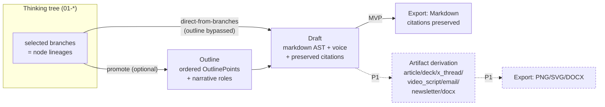
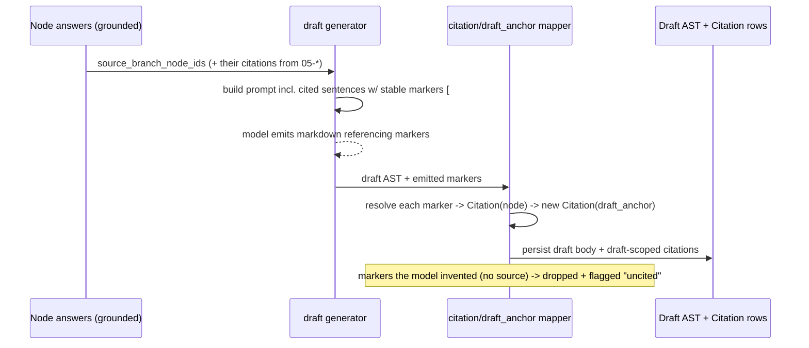

# 06 · Crystallize → Draft → Export → Multi-format

> **Status**: Design. Conforms to `00-foundation.md` (authoritative). Depends on
> `01-domain-and-core-logic.md` (tree, Branch value object, the moat) and
> `05-retrieval-and-grounding.md` (Chunk/Citation, sentence mapping).
> **Owns**: `weaver_core/crystallize/`, `weaver_core/draft/`,
> `weaver_core/citation/` (draft-anchor side), the export path, and the P1
> multi-format `Artifact` derivation.
> **Scope**: FULL VISION (P0/P1/P2). MVP boundary marked inline and in §11.

This is the **output pipeline** — the "Ship" end of *think → visualize → draft*.
It turns selected branches of the thinking tree into long-form output with a
chosen Voice, preserving sentence-level citations end to end, and (P1) derives
multiple consistent formats from one source.

Two product truths drive every decision here:

1. **The argument outline is OPTIONAL.** A draft can be generated **directly from
   selected branches**, bypassing the outline entirely. The outline is a
   crystallization *view*, not a gate.
2. **Voice (preset tone) affects the DRAFT, not just chat.** This is the
   deliberate edge over NotebookLM Personas, which only shape conversation.

A third truth (from competitive analysis §4) drives the P1 layer:

3. **Multi-format outputs are derived from ONE source** (one Draft/Outline) so
   topic emphasis stays consistent — the anti-NotebookLM "blog stresses A, video
   stresses B" inconsistency.

---

## 1. Pipeline overview



The pipeline has exactly **two entry edges into Draft** and they are symmetric in
guarantees:

| Path | `Draft.outline_id` | `Draft.source_branch_node_ids` | Citations preserved? |
|------|--------------------|---------------------------------|----------------------|
| **Direct-from-branches** (MVP default) | `null` | the selected branch heads | ✅ from node answers |
| **Via outline** (MVP optional) | the outline | union of `OutlinePoint.source_node_ids` | ✅ from node answers, carried through points |

Both paths produce the **same shape** of `Draft`. The outline only changes *how
claims are ordered and grouped before generation*, never whether citations
survive.

> **Build order (per `00-foundation.md` §6 / rebuild-plan M4–M5):** direct-from-
> branches draft + Voice land first (M4, the riskier "does it read like me?"
> bet), outline is the optional refinement, Markdown export + the end-to-end
> smoke test close M5. Multi-format `Artifact` is M-later (P1).

---

## 2. Crystallize: branches → Outline

### 2.1 What crystallization is (and is not)

Crystallization promotes selected **nodes/branches** into **OutlinePoints**
(claims/论点), orders them, and optionally tags each with a **narrative role**.
It is the "结果可视化" layer from PRD §1.3 — the visible, editable, traceable
argument skeleton that the competitive analysis (§2.2) identifies as the wedge
("把论证结构本身做成可操纵的一等公民").

It is **not** AI replacing the author. The default `promote` is a pure
structural lift (deterministic, no model). AI ordering / role suggestion (P1) is
*proposal-only* and always editable.

### 2.2 Domain shape (from `00-foundation.md` §2.2)

```python
# weaver_core/schemas/outline.py  (Pydantic v2 — source of truth for wire shape)

class OutlinePoint(BaseModel):
    id: ULID
    outline_id: ULID
    order_index: int                       # explicit, dense-or-sparse, re-sortable
    text: str                              # the claim / 论点
    source_node_ids: list[ULID]            # promoted-from nodes (1..n)
    narrative_role: NarrativeRole | None    # cold_open|setup|turn|payoff|takeaway
    note: str | None = None

class Outline(BaseModel):
    id: ULID
    project_id: ULID
    title: str
    structure_template: StructureTemplate | None = None   # essay|analysis|story (P2)
    points: list[OutlinePoint]             # read model returns them ordered
```

`source_node_ids` is the **provenance link** that lets the draft step pull each
point's grounded node answer (and thus its citations). It is many-to-many: a
point may merge several nodes (e.g. a "汇合" insight); a node may seed several
points (rare, but allowed).

### 2.3 Promote operation (pure, deterministic — MVP)

```python
# weaver_core/crystallize/promote.py  — PURE except repo writes done by caller

def build_outline_point(
    node_ids: list[ULID],
    forest: NodeForest,
    order_index: int,
) -> OutlinePointDraft:
    """Lift one or more ThoughtNodes into a single OutlinePoint.

    text  = derived claim seed (NOT a model call in MVP):
            - single node -> node.annotation if present else first sentence of content
            - multiple nodes -> concatenated annotations / first sentences, joined
    source_node_ids = node_ids (dedup, order-preserving)
    narrative_role  = None (user assigns; P1 AI may suggest)
    Pure: depends only on the forest snapshot + inputs."""
```

Design choices:

- **The claim seed is deterministic text extraction, not generation.** This keeps
  M4's first slice testable without a model and respects "人定角度" — the user
  edits the claim text. (P1 adds an optional `POST .../points:suggest-text` that
  runs the model to phrase a sharper claim; never automatic.)
- **Promoting from a branch** (not a single node) = promoting the branch's
  *head* node by default, with an option to promote the whole lineage as
  separate points. The branch is the derived `Branch` value object from `01-*`
  (`Branch = ordered list[ThoughtNode]`); we never persist a branch id.
- **`dead_end` nodes are promotable** but flagged in the UI ("promoting from a
  pruned branch") — the author may deliberately argue from a rejected line.

### 2.4 Reordering & narrative roles

- **Reordering** mutates `order_index` only. The API exposes a bulk reorder:
  `POST /outlines/{id}/reorder { "ordered_point_ids": [...] }` → server reassigns
  dense `order_index` values (0..n) in one transaction. No structural rules; pure
  list permutation. Frontend does drag-to-reorder; server is the source of truth.
  **Contract-freeze (C8):** this `/outlines/{id}/reorder` + `OutlineReorder
  { ordered_point_ids }` is the canonical reorder mechanism; `03-*` now matches it
  (it removed `point_order` from `OutlineUpdate`).
- **Narrative roles** (`cold_open | setup | turn | payoff | takeaway`) are the
  prototype's narrative scaffolds (Cold open / Setup / Turn / Payoff;
  THE SETUP / THE TAKEAWAY). They are **advisory metadata** on each point. They:
  1. drive draft section scaffolding (§4.4 voice/structure prompt), and
  2. feed the P1 narrative check ("是否有逻辑跳跃").

  Roles are **not** validated as a required sequence in MVP (a draft with no
  roles is valid). P1 narrative check *warns* on weak ordering (e.g. payoff
  before setup) but never blocks.

### 2.5 AI-proposed outline skeleton (P1)

`POST /projects/{id}/outline/propose` runs a **structured** generation over
`ModelProvider` (same `response_schema` mechanism as AI-proposed forks, per
`00-foundation.md` §1.2) on the *selected branches*. **Contract-freeze (C8):** the
sub-path form `/outline/propose` replaces the colon verb `outline:propose` (colon
verbs are banned by `00-*` §1.5); `03-*` matches this project-scoped propose route. Critically, the request is
built from **per-branch resolved contexts** (the moat): each selected branch
contributes only its own ancestor chain, so the proposal cannot blend assumptions
across sibling branches.

```python
# weaver_core/crystallize/propose.py  (P1)

OUTLINE_PROPOSAL_SCHEMA = {  # response_schema passed to ModelProvider.generate
  "type": "object",
  "properties": {
    "points": {"type": "array", "items": {
      "type": "object",
      "properties": {
        "text": {"type": "string"},
        "source_node_ids": {"type": "array", "items": {"type": "string"}},
        "narrative_role": {"enum": [r.value for r in NarrativeRole] + [None]},
      },
      "required": ["text", "source_node_ids"],
    }},
  },
  "required": ["points"],
}

async def propose_outline(project_id, selected_branch_heads, deps) -> OutlineDraft:
    contexts = [resolve_branch_context(h, deps.forest) for h in selected_branch_heads]
    req = build_proposal_request(contexts, schema=OUTLINE_PROPOSAL_SCHEMA)
    raw = await collect(deps.provider.generate(req))      # structured JSON
    return validate_and_clamp(raw, allowed_node_ids=ids_of(contexts))
```

`validate_and_clamp` **rejects any `source_node_ids` the model invented** that
are not in the selected set — the model can only reference real, in-scope nodes.
The user accepts/edits the proposal; nothing is persisted until accepted.

### 2.6 Structure templates (P2)

`StructureTemplate` (`essay | analysis | story`) is a P2 library that pre-seeds
narrative roles and section ordering hints. MVP/P1 leave `structure_template =
null` and treat the outline as a flat ordered list with optional roles.

---

## 3. Citation preservation (the spine of the whole pipeline)

This is the load-bearing guarantee: **a sentence-level `Citation` created on a
node answer (during grounded thinking, `05-*`) must survive into the draft text
and into every export.** Without this the P0 "句子级 inline 引用接地，可点击直达
原文" promise breaks at the output stage.

### 3.1 Citation shape recap (canonical owner: `00-foundation.md` §2.2; see also `05-*`)

> **Contract-freeze (C4):** `Citation` is owned by `00-foundation.md` §2.2; this is
> a recap, not a re-declaration. `char_start`/`char_end` index the **SOURCE
> canonical document text** (the single coordinate space every parser emits per
> `05-*` §2.5), NOT the Chunk text. `answer_span?`/`method` map 1:1 to the
> `citation` columns declared in `07-*`.

```python
class Citation(BaseModel):
    id: ULID
    chunk_id: ULID
    source_id: ULID
    node_id: ULID | None = None            # set when citing a node answer
    draft_id: ULID | None = None           # set when carried into a draft
    draft_anchor: str | None = None        # stable anchor into the draft AST (see 3.3)
    quote: str                             # the cited source sentence span
    char_start: int                        # offset into the SOURCE canonical text
    char_end: int
    answer_span: list[int] | None = None   # [start,end] span in the answer/draft text supported
    method: str | None = None              # marker|lexical|semantic|none (see 07-* citation DDL)
    confidence: float | None = None
```

A node-answer citation has `node_id` set, `draft_id` null. When the draft is
generated, we **create new citation rows** (or re-anchor) with `draft_id` +
`draft_anchor` set, **referencing the same `chunk_id`/`source_id`/`quote`/
offsets**. The original node-answer citation is never mutated (it still backs the
node in the tree).

### 3.2 The carry-through model



The mechanism: when assembling the generation prompt, every cited sentence from
the contributing node answers is injected with an **opaque, stable marker** of
the form `[#c{citation_id}]`. The Voice/structure system prompt instructs the
model: *"When you state a claim grounded in a provided sentence, keep its
`[#c…]` marker immediately after that claim. Do not invent markers."* After
generation, the mapper:

1. Scans the produced markdown for `[#c{id}]` markers.
2. For each marker, looks up the original node `Citation`, **creates a draft-
   scoped `Citation`** with the same chunk/source/quote/offsets, computes a
   `draft_anchor` (§3.3) at the marker position, and **replaces the inline marker
   with a rendered citation reference** in the AST.
3. **Drops** any marker whose id is not a real in-scope citation (model
   hallucination) and records a `uncited_claims` warning on the draft.

> This keeps the moat clean: the **model never resolves which source backs which
> claim from scratch** — it only *preserves markers we already attached*. Citation
> *truth* is computed by `weaver_core`, not trusted from the model. (Mirrors the
> §1.2 rule that the provider receives pre-resolved context and never widens it.)

### 3.3 `draft_anchor`: stable positions in a mutable document

The draft body is a **markdown AST** (`Draft.body`), not a flat string, so
anchors survive edits. `draft_anchor` is a string of the form
`"{block_id}:{char_offset}"` where:

- `block_id` is a ULID assigned to each block node (paragraph, heading, list
  item) in the AST at creation and preserved across edits.
- `char_offset` is the offset within that block's text.

When the user edits the draft (manual edit or paragraph-level AI op §6), block
ids are preserved for untouched blocks; edited blocks get re-anchored by the
citation re-mapper (best-effort fuzzy match of `quote`), and unmatched citations
are surfaced as "可能失效的引用" rather than silently lost. Markdown export
serializes anchors as footnote refs (§5.2).

### 3.4 Ungrounded honesty (foundation Open Question, partial)

When a draft is generated on **ungrounded** branches (no sources — fully valid
per product truth), there are no citations. Per PRD §10 honesty principle, claims
the model could not ground are not faked into citations. The draft generator
sets `Draft.grounded = False` and (P1) may emit inline honesty tags using the
canonical `HonestyLabel` enum owned by `01-*` (`user_judgment` / `inferred` /
`grounded` / `weakly_grounded`). MVP simply produces an uncited draft; no fake
citations are ever fabricated.

> **Contract-freeze (C13):** the honesty vocabulary is the closed `HonestyLabel`
> enum owned by `01-domain-and-core-logic.md`; this doc references its members by
> name and never re-declares them. (Previously this section spelled the
> author-judgment case `author_judgment`; the canonical spelling is
> `user_judgment`.)

---

## 4. Draft generation

### 4.1 Domain shape

```python
# weaver_core/schemas/draft.py

class Draft(BaseModel):
    id: ULID
    project_id: ULID
    outline_id: ULID | None = None              # null => direct-from-branches
    source_branch_node_ids: list[ULID]          # the branches/nodes that fed it
    voice: VoiceTone                            # academic|casual|professional
    format: ArtifactFormat = ArtifactFormat.ARTICLE   # default article
    body: MarkdownAST                           # block tree (see 3.3)
    grounded: bool                              # had >=1 citation source
    uncited_claims: list[str] = []              # dropped/hallucinated markers (warnings)
    derived_from_hash: str                      # provenance of inputs (see 7.2)
```

> **Contract-freeze (C6):** `grounded` and `uncited_claims` are produced here but
> declared canonically in `00-foundation.md` §2.2 (`Draft`) and mirrored on `03-*`
> `DraftView`; their storage home is the `draft` DDL in `07-*` (`grounded INTEGER`,
> `uncited_claims JSON`). This recap references those owners; it does not re-declare
> the shape.

`MarkdownAST` is a typed block tree (heading/paragraph/list/quote/code) with
per-block `block_id: ULID` and inline citation refs. It serializes losslessly to
Markdown for export and is what the frontend editor renders.

### 4.2 The two paths, one generator

```python
# weaver_core/draft/generate.py

async def generate_draft(req: DraftGenerateRequest, deps: DraftDeps) -> Draft:  # C2: renamed from DraftRequest
    # 1. Resolve the source material (SAME for both paths, just ordered differently)
    if req.outline_id:
        points = deps.outline_repo.get(req.outline_id).points        # ordered, roled
        sections = [outline_point_to_section(p, deps.forest) for p in points]
    else:
        # direct-from-branches: each selected branch head -> a section,
        # in the order the user selected them
        sections = [branch_to_section(h, deps.forest) for h in req.source_branch_node_ids]

    # 2. Gather citations + inject stable markers into the material
    material, marker_index = assemble_material_with_markers(sections, deps.citation_repo)

    # 3. Build the generation request: Voice + structure + material
    gen_req = build_generate_request(
        voice=req.voice,
        narrative_roles=[s.role for s in sections],   # None for direct path unless roled
        material=material,
        response_schema=None,                          # free-form markdown, not structured
    )

    # 4. Stream from the provider (SSE to client per 00-* §1.5)
    body_md = await collect_stream(deps.provider.generate(gen_req))

    # 5. Map markers -> draft-scoped citations + build AST
    ast, draft_citations, uncited = map_markers_to_citations(body_md, marker_index)

    # 6. Persist & return
    return persist_draft(req, ast, draft_citations, uncited, deps)
```

The **only** difference between the paths is step 1 (how sections are derived and
ordered). Steps 2–6 — citation marker injection, Voice application, mapping,
persistence — are identical, which is what guarantees "both preserve citations".

`branch_to_section` uses **`resolve_branch_context`** (the moat) so a direct
draft section carries exactly that branch's ancestor chain — sibling branches
selected for *other* sections never bleed into this section's material.

### 4.3 Streaming contract

Draft generation streams via SSE carrying the `TokenEvent` shape
(`00-foundation.md` §1.2/§1.5). Citation mapping (step 5) is a **post-stream**
finalize: tokens stream live for UX, then a terminal `done` event carries the
finalized draft id + the citation/uncited summary. The client shows live text,
then swaps to the citation-anchored AST on `done`. (Rationale: marker→citation
resolution needs the full document; doing it per-token would be fragile.)

### 4.4 Voice: how preset tone shapes the DRAFT

Voice is **not** a post-filter and **not** chat-only. It is injected into the
generation system prompt that produces the draft body, so it shapes structure,
hedging, person, and rhythm — the dimensions NotebookLM Personas leave on the
chat side.

```python
# weaver_core/draft/voice.py

VOICE_SPECS: dict[VoiceTone, VoiceSpec] = {
  VoiceTone.ACADEMIC: VoiceSpec(
     label="Precise, hedged, citation-forward",   # exact prototype preset
     directives=[
       "Hedge claims; prefer 'suggests/indicates' over absolutes.",
       "Foreground citations; attribute every empirical claim.",
       "Third person; formal register; defined terms.",
     ],
     citation_density="high",      # keep every [#c] marker; add attributive phrasing
  ),
  VoiceTone.CASUAL: VoiceSpec(
     label="Direct, first-person, conversational",
     directives=[
       "First person ('I'); short sentences; contractions allowed.",
       "Lead with the point; minimize qualifiers.",
       "Citations as light asides, not academic apparatus.",
     ],
     citation_density="low",
  ),
  VoiceTone.PROFESSIONAL: VoiceSpec(
     label="Clear, confident, brisk",
     directives=[
       "Confident, declarative; no hedging filler.",
       "Tight topic sentences; scannable structure.",
       "Citations inline but unobtrusive.",
     ],
     citation_density="medium",
  ),
}

def build_voice_system_prompt(tone: VoiceTone, roles: list[NarrativeRole|None]) -> str:
    spec = VOICE_SPECS[tone]
    return render_template(
        tone_label=spec.label,
        directives=spec.directives,
        citation_density=spec.citation_density,
        narrative_scaffold=roles_to_scaffold(roles),   # cold_open->hook, payoff->land it
        marker_rule="Preserve every [#c{id}] marker immediately after its claim; "
                    "never invent markers.",
    )
```

Key contract points:

- **`VoiceTone` is the canonical enum from `00-*` §2.3**; the three labels are the
  exact prototype strings. The `VoiceSpec` table is the single place tone→behavior
  is defined, so it is unit-testable (assert the system prompt contains the
  directives — deterministic with FAKE).
- **`citation_density`** lets Voice modulate how citations *read* (academic =
  citation-forward; casual = light) **without ever dropping a citation row** — the
  marker rule is constant across voices. Density changes phrasing, not the
  underlying `Citation` truth.
- **Default Voice** = `Project.voice_default` (falls back to `professional` if
  unset). The user can override per draft.

> **Contract-freeze (G6) — Voice is a DRAFT-stage concern ONLY.** `VoiceTone` (and
> the `sample_text`-derived `style_directives`) is applied **only** to the draft
> body and never to `/think` node answers. `/think` answers use a neutral
> project/chat system prompt with **no** `VoiceTone`; `03-*` `ThinkRequest`
> intentionally has no `voice` field (contract-frozen). This is the deliberate edge
> over NotebookLM Personas — applying Voice to `/think` would dilute it and add a
> field the prototype's tone presets never required. No future contributor should
> add a think-time voice field.

### 4.5 Voice `sample_text` — "feed-a-style" (P1; foundation Open Question)

Foundation §11 leaves *where* style extraction runs as an open question; this doc
resolves it for P1:

> **`Voice.sample_text` (P1) is processed at draft-generation time into a derived
> `style_directives` string that is appended to the Voice system prompt — it does
> NOT replace the preset tone, it refines it.** Style extraction is a small
> structured model call (`extract_style(sample_text) -> style_directives`) cached
> keyed by `hash(sample_text)`, so it runs once per sample, not per draft.

> **Contract-freeze (C6):** the cache home is the `voice_config` row in `07-*`,
> which adds `style_directives TEXT` and `sample_hash TEXT` (cache key =
> `hash(sample_text)`). `00-*` notes `Voice.style_directives?` (P1, derived/cached).
> This doc produces these fields and references those owners; it does not declare a
> competing storage shape.

Placement rationale: keeping it in `weaver_core/draft/voice.py` (not in chat, not
in retrieval) makes "Voice affects the draft" structurally true and keeps the
extraction next to where it is consumed. The preset tones remain the MVP path;
`sample_text` is purely additive (P1), so no MVP interface changes.

---

## 5. Export

### 5.1 Export shape & flow (Markdown = MVP)

```python
# weaver_core/schemas/export.py
class Export(BaseModel):
    id: ULID
    target: ExportTarget        # markdown (MVP) | png | svg (P1) | docx (P1)
    payload_ref: str            # content-addressed BlobStore ref (blob://sha256/<hex>)
    citations_preserved: bool
```

> **Contract-freeze (G4):** `Export.payload_ref` is a `BlobStore` ref and
> `deps.blob` is the `BlobStore` Protocol owned by `07-*` (`put(data, *,
> content_type) -> ref`, `get`, `delete`, `url_for`). Refs are content-addressed
> (`blob://sha256/<hex>`); the default `FileBlobStore` lives under
> `WEAVER_DATA_DIR/blobs/` and is included in the backup tarball. This doc
> references that Protocol; it does not define a competing blob interface.

```python
# weaver_core/draft/export.py
def export_markdown(draft: Draft, deps) -> Export:
    md = render_ast_to_markdown(draft.body, citation_style="footnote")
    md = append_citation_footnotes(md, deps.citation_repo.for_draft(draft.id))
    ref = deps.blob.put(md, content_type="text/markdown")
    return Export(target=ExportTarget.MARKDOWN, payload_ref=ref,
                  citations_preserved=True)
```

### 5.2 Citation-preserving Markdown

Inline citation refs in the AST serialize to **GitHub-style footnotes**:

```markdown
The sector's growth is now supply-driven.[^c1]

[^c1]: "技术降本使单位成本下降 40%" — *Source: 行业白皮书 2026*, p.12
       <weaver://source/{source_id}#char={char_start}-{char_end}>
```

- Every footnote carries the `quote`, a human source label, and a
  `weaver://source/...#char=...` deep link that the app resolves to "jump to
  original" (the P0 clickable-citation promise, preserved through export).
- `citations_preserved = True` is asserted by the export contract test (§9): the
  count of footnotes equals the count of draft-scoped citations.

### 5.3 P1 export targets

- **PNG/SVG** of the thinking tree / outline — rendered by the frontend (D3) and
  posted back as a blob (the tree geometry lives in `apps/web`, per §1.1 of
  foundation: layout is view logic). `04-*` owns the render; this doc owns the
  `Export` record + provenance.
- **DOCX** — server-side from the same `MarkdownAST` via a docx writer;
  footnotes map to Word footnotes.

---

## 6. Paragraph-level AI operations (P1)

Once a draft exists, the author can run **scoped** AI ops on a single block/
selection: `expand | condense | reangle | stronger_evidence`. These are P1.

```python
# weaver_core/draft/paragraph_ops.py  (P1)
class ParaOp(str, Enum):
    EXPAND="expand"; CONDENSE="condense"; REANGLE="reangle"; STRONGER_EVIDENCE="stronger_evidence"

async def run_paragraph_op(draft_id, block_id, op: ParaOp, deps) -> BlockPatch:
    block = deps.draft_repo.get_block(draft_id, block_id)
    ctx = block_local_context(draft_id, block_id, deps)   # neighbors + that block's citations
    if op == ParaOp.STRONGER_EVIDENCE:
        ctx += deps.retrieval.search(block.text, project_id, k=4)   # 05-* retrieval
    patch = await deps.provider.generate(build_para_op_request(op, block, ctx))
    return reanchor_citations(patch, block)               # preserve/refresh [#c] markers
```

Contract: a paragraph op operates on **one block**, preserves that block's
`block_id`, and **re-anchors citations** (§3.3). `stronger_evidence` is the only
op that pulls *new* retrieval (via `05-*`); it adds new draft citations rather
than inventing them. Ops never touch sibling branch material — they stay within
the draft. API: `POST /drafts/{id}/blocks/{block_id}/op { "op": "expand" }`,
streamed.

> **Contract-freeze (C9):** this doc **owns the `ParaOp` enum**
> (`expand | condense | reangle | stronger_evidence`). `03-*` references `ParaOp`
> by name and routes the block-addressed, no-colon form
> `POST /drafts/{id}/blocks/{block_id}/op` with `ParagraphOpRequest { op, backend_id? }`
> (`block_id` lives in the path). The colon form `blocks/{block_id}:op` is removed
> (colon verbs banned by `00-*` §1.5); the `strengthen` spelling is dropped in
> favor of `stronger_evidence`.

---

## 7. Multi-format Artifact derivation (P1)

### 7.1 The anti-NotebookLM guarantee

NotebookLM's multi-format outputs drift in emphasis because each is generated
independently from the sources. Weaver derives **every format from ONE Draft (or
Outline)**, so the claim set and ordering are shared — topic consistency by
construction (competitive analysis §4).

```python
# weaver_core/schemas/artifact.py
class Artifact(BaseModel):
    id: ULID
    draft_id: ULID | None = None       # primary source (preferred)
    outline_id: ULID | None = None     # alt source (when no full draft yet)
    format: ArtifactFormat             # article|deck|x_thread|video_script|email|newsletter|docx
    body: MarkdownAST | StructuredBody # format-specific (slides, thread items, ...)
    derived_from_hash: str             # hash of the source draft/outline at derivation
```

```mermaid
flowchart TB
  D[Draft (canonical claims + citations + voice)]
  D --> A1[article]
  D --> A2[deck (slides + speaker notes)]
  D --> A3[x_thread (N posts)]
  D --> A4[video_script (cold_open→payoff beats)]
  D --> A5[email / newsletter]
  D --> A6[docx]
  note["all share Draft.derived_from_hash → provenance + staleness"]
```

### 7.2 `derived_from_hash` & staleness

`derived_from_hash = sha256(canonical_source_repr)` where the canonical repr is
the ordered claim text + citation ids + voice of the source Draft/Outline. On
read, if the source's current hash ≠ the Artifact's `derived_from_hash`, the
Artifact is flagged **stale** (UI: "源已更新，重新派生"). Regeneration is explicit
(the author chooses), never silent — provenance over magic.

### 7.3 Per-format derivation

Each format is a deterministic *transform spec* + one model pass that **reshapes,
never re-researches** (it may not introduce claims absent from the source draft —
enforced by the same in-scope check as §2.5). Narrative roles drive structure:
`video_script` maps `cold_open→hook, setup→context, turn→tension, payoff→reveal,
takeaway→CTA`. Citations carry through where the format supports them (article/
newsletter/email/docx keep footnotes; x_thread/deck attach a sources block).

---

## 8. End-to-end smoke (think → branch → (crystallize?) → draft → export)

The M5 smoke test mirrors the core loop and runs with the **FAKE** provider:

```
1. create project
2. add node (question) -> FAKE answer  (grounded variant: with 1 source + citation)
3. fork -> 2 sibling branches; add a node in each
4. (path A) generate draft DIRECTLY from the 2 branch heads
   (path B) promote 2 nodes -> outline -> reorder -> generate draft via outline
5. assert: both drafts have voice applied (system-prompt assertion) and,
   when grounded, preserve >=1 citation with a valid draft_anchor
6. export markdown -> assert footnotes count == draft citation count
7. (grounded) assert each footnote has a resolvable weaver://source deep link
```

Both draft paths are exercised so the "outline optional" truth is regression-
guarded.

---

## 9. Testing

Per `00-foundation.md` §7; FAKE provider is the CI default — **no test reaches a
real model**.

**Unit (pytest, `tests/unit/`)**
- `build_outline_point`: claim-seed extraction (single vs multi node), dedup of
  `source_node_ids`, purity (no I/O).
- `reorder`: permutation → dense `order_index`; idempotent.
- `branch_to_section` / `outline_point_to_section`: uses `resolve_branch_context`;
  sibling material never leaks into another section.
- **Citation carry-through** (the spine): node citation → draft citation with
  same chunk/source/quote/offsets; `draft_anchor` well-formed; hallucinated
  markers dropped into `uncited_claims`; original node citation untouched.
- `draft_anchor` survives a block edit (re-anchor fuzzy match) and reports
  unmatched citations rather than losing them.
- **Voice**: each `VoiceTone` produces a system prompt containing its directives
  + the constant marker rule; `citation_density` differs but no voice drops
  markers (deterministic).
- `derived_from_hash`: stable for same input, changes when claims/voice change;
  staleness detection.
- Multi-format in-scope check: a format transform cannot introduce a
  `source_node_id`/claim absent from the source draft.

**Contract (pytest, `tests/contract/`)** — one per route, asserted against
OpenAPI + error envelope:
- `POST /projects/{id}/outlines`, `POST /outlines/{id}/points`,
  `POST /outlines/{id}/reorder`, `POST /branches/{id}/promote`.
- `POST /projects/{pid}/drafts` (both `outline_id` set and null), single streaming
  endpoint via SSE — assert the `TokenEvent` event schema and a terminal `done`
  carrying the draft id + citation summary.
- `POST /drafts/{id}/export` (markdown) — assert `citations_preserved` and
  footnote/citation count parity.
- (P1) `POST /drafts/{id}/artifacts`, `POST /drafts/{id}/blocks/{block_id}/op`.

**Frontend (`apps/web/__tests__/`)** — owned by `04-*`, referenced here: outline
drag-reorder maps to the reorder call; clicking a draft citation resolves the
`weaver://source` deep link; stale-Artifact badge.

**Smoke (per-milestone)** — §8 end-to-end, both draft paths.

---

## 10. API surface (this doc's slice; full catalog in `03-*`)

| Method & path | Purpose | Stream | MVP? |
|---|---|---|---|
| `POST /projects/{id}/outlines` | create outline | no | MVP (optional) |
| `POST /branches/{id}/promote` | promote branch head → OutlinePoint | no | MVP (optional) |
| `POST /outlines/{id}/points` | add/edit point | no | MVP (optional) |
| `POST /outlines/{id}/reorder` | bulk reorder points | no | MVP (optional) |
| `POST /projects/{id}/outline/propose` | AI outline skeleton | SSE | P1 |
| `POST /projects/{pid}/drafts` | create + generate draft (outline_id set OR null) | **SSE** | MVP |
| `GET /drafts/{id}` | fetch draft AST + citations | no | MVP |
| `PATCH /drafts/{id}` | manual edit (block-level) | no | MVP |
| `POST /drafts/{id}/export` | export (markdown MVP) | no | MVP |
| `POST /drafts/{id}/blocks/{block_id}/op` | paragraph AI op | SSE | P1 |
| `POST /drafts/{id}/artifacts` | derive a format | SSE | P1 |

All actions are verb-on-resource sub-paths per `00-*` §1.5 (no colon verbs); ULIDs
in URLs; one error envelope.

> **Contract-freeze (C2):** draft generation is the SINGLE streaming endpoint
> `POST /projects/{pid}/drafts` (owned by `03-*`) — it creates the `Draft` record
> AND streams generation in one call; the terminal `done` event carries the draft
> id + a `DraftView` summary. The request body is `DraftGenerateRequest` (renamed
> from this doc's old `DraftRequest`). The bare `POST /drafts` and any two-step
> `POST /drafts/{id}/generate` are removed.

---

## 11. MVP vs Later

**MVP (M4–M5)**
- Crystallize: **optional** outline; deterministic `promote` (no model needed);
  reorder; narrative roles as advisory metadata.
- Draft: **direct-from-branches** (default) AND via outline — both preserve
  citations; Voice **preset tones** applied to the draft body via system prompt;
  streamed generation; uncited-claim warnings; ungrounded drafts produce no fake
  citations.
- Citation preservation: node-answer `Citation` → draft-scoped `Citation` with
  `draft_anchor`; survives edits best-effort.
- Export: **Markdown**, citations preserved as deep-linked footnotes.
- End-to-end smoke (both paths) with FAKE provider.

**Later (P1)**
- AI-proposed outline skeleton; narrative check (logic-jump warnings).
- Voice `sample_text` "feed-a-style" → cached `style_directives` (refines preset).
- Paragraph-level AI ops (expand/condense/reangle/stronger-evidence; the last
  pulls retrieval).
- **Multi-format Artifacts** from one Draft/Outline (article/deck/x_thread/
  video_script/email/newsletter/docx) with `derived_from_hash` staleness — the
  anti-NotebookLM consistency guarantee.
- Export PNG/SVG (tree/outline) + DOCX.

**P2**
- Structure templates (`essay | analysis | story`) pre-seeding roles/ordering.
- Fact-check, one-click publish (out of this doc's core scope).

---

## 12. Open Questions

1. **Claim-seed quality (MVP).** Deterministic first-sentence/annotation
   extraction may yield weak claims. Is the P1 optional `:suggest-text` model
   pass enough, or should MVP allow an opt-in model phrasing from day one?
   (Leaning: keep MVP deterministic for testability.)
2. **`draft_anchor` robustness under heavy edits.** Fuzzy re-anchoring by `quote`
   may fail when the author rewrites a cited sentence entirely. Acceptable to
   surface as "失效引用" for the user to re-link, or do we need a richer anchor
   (e.g. anchored to a hidden span id the editor maintains)? `04-*` editor design
   interacts here.
3. **Voice `sample_text` placement (foundation §11).** Resolved here as
   draft-time extraction cached on the Voice row. **RESOLVED (G6 + C6):** Voice is
   draft-only (never on `/think`); `style_directives` is cached on `07-*`'s
   `voice_config` row keyed by `sample_hash`. See the contract-freeze notes in §4.4
   / §4.5 and the contract-freeze ADR log.
4. **Ungrounded honesty tags (foundation §11).** Whether `inferred` /
   `user_judgment` inline tags belong in the draft AST (this doc) or are a
   node-level flag carried through (`01-*`). **RESOLVED (C13):** the closed
   `HonestyLabel` enum (`user_judgment | inferred | grounded | weakly_grounded`)
   is owned by `01-*`; this doc references its members (see §3.4) and `01-*` sets
   the node-level label. See the HonestyLabel ADR.
5. **Multi-format citation fidelity.** For formats with no footnote affordance
   (x_thread, deck), is a trailing "sources" block sufficient to keep the P0
   citation promise, or should those formats be marked "citations: summarized"?
6. **Stale-Artifact policy.** Auto-flag only (current design) vs offer one-click
   re-derive-all — risk of silently overwriting user-edited Artifacts.
