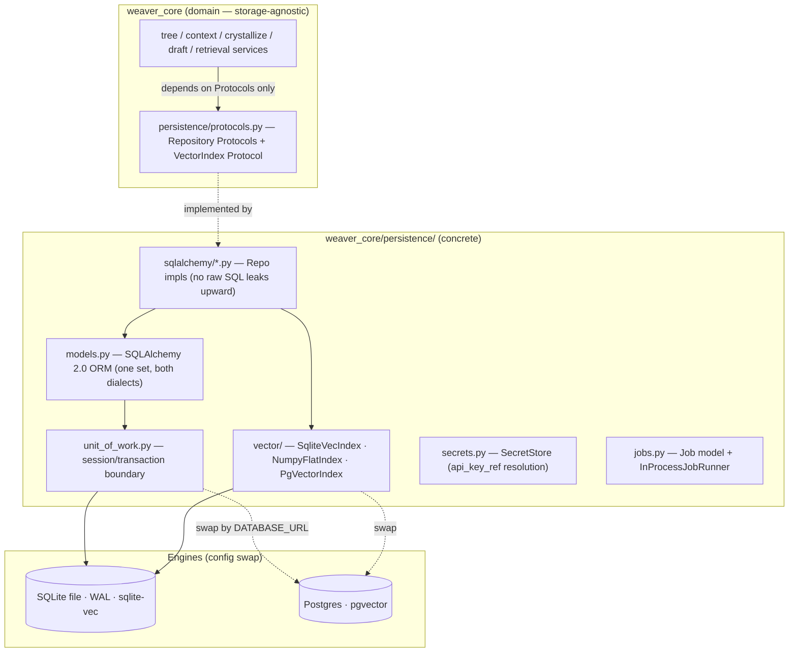
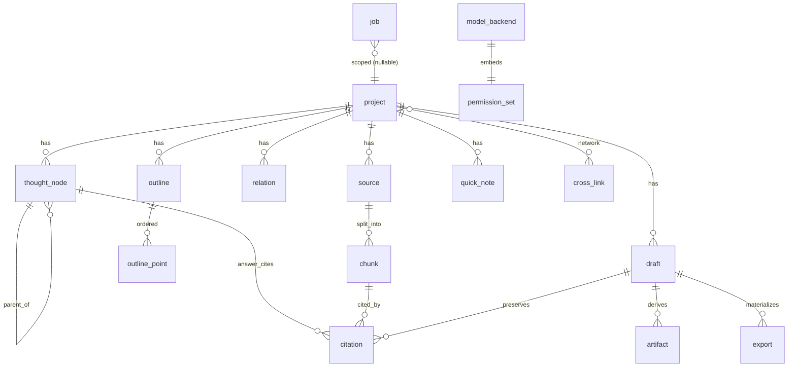
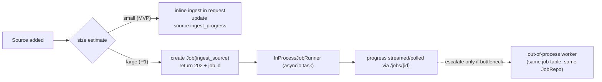

# 07 · Persistence, Deployment & Ops

> **Status**: Conforms to `00-foundation.md` (authoritative). This doc owns the
> persistence layer (DDL, repository Protocols + SQLAlchemy impls, vector
> storage), the jobs table, and deployment/ops (Docker Compose, prod env
> template, secret store, backup/restore).
> **Depends on**: `00-foundation.md` §1.3 (Persistence), §1.4 (Jobs), §2 (domain
> model + enums), §1.6 (Branch is derived, never a table).
> **Scope**: FULL VISION; MVP boundary marked inline and in the *MVP vs Later*
> section.
> **Non-negotiable inherited from foundation**:
> - `Branch` is **never** a table — it is derived from `ThoughtNode.parent_id`.
> - **No raw SQL in `weaver_core` services** — services depend on repository
>   Protocols only; concrete impls live in `weaver_core/persistence/`.
> - **Pruned ≠ deleted**: prune = `state = "dead_end"` + `collapsed = true`.
> - ULID string PKs everywhere; UTC ISO-8601 times.
> - Vectors hidden behind a `VectorIndex` interface (sqlite-vec ↔ pgvector).

---

## 1. Layer overview



The selection between SQLite and Postgres is a single config decision
(`DATABASE_URL`) made once at process start in a factory; nothing in
`weaver_core` services changes.

---

## 2. Schema / DDL

### 2.1 Conventions (applied to every table)

- **PK**: `id TEXT` holding a ULID (26-char Crockford base32). Sortable by
  creation time, URL-safe. Generated in Python (`ulid.new()`), never by the DB.
- **Timestamps**: `created_at`, `updated_at` stored as **UTC ISO-8601 text** in
  SQLite and `timestamptz` in Postgres (the ORM uses a `DateTime(timezone=True)`
  column; the dialect chooses storage). `updated_at` maintained by the app/UoW
  on flush (no DB triggers — keeps both dialects identical).
- **FKs**: `ON DELETE CASCADE` only where hard-deletion of a parent is legal
  (e.g. delete a Project cascades its nodes/sources). Where the product forbids
  deletion (prune), there is **no** cascade — the row is soft-marked instead.
- **Enums**: stored as `TEXT` with a `CHECK (col IN (...))` constraint generated
  from the canonical Python enum. We deliberately avoid native PG `ENUM` types so
  the two dialects share identical DDL and so adding a value is an Alembic data
  migration, not a fragile `ALTER TYPE`.
- **Booleans**: `INTEGER` 0/1 in SQLite, `boolean` in PG (ORM `Boolean`).
- **JSON**: `draft.body` (markdown AST), `outline_point.source_node_ids`,
  `draft.source_branch_node_ids`, `permissions`, `job.payload`, `job.error` use
  the ORM `JSON` type → `TEXT(json)` in SQLite, `jsonb` in PG.
- **Soft semantics**: prune does not delete; `deleted_at` columns exist only on
  the few aggregates the product allows a user to truly remove (Project,
  QuickNote, Draft, Source). `ThoughtNode` has **no** `deleted_at` — a node is
  never destroyed once it has descendants/citations (it becomes `dead_end`).

### 2.2 Entity-relationship (storage view)



### 2.3 DDL (canonical, dialect-neutral)

Shown as portable `CREATE TABLE` (SQLite flavor; PG differences noted). This is
the **target shape**; the actual DDL is emitted by Alembic from the ORM models
(§4) — it is reproduced here as the contract.

```sql
-- ============ Project (root aggregate) ============
CREATE TABLE project (
  id            TEXT PRIMARY KEY,
  title         TEXT NOT NULL,
  description   TEXT,
  voice_default TEXT CHECK (voice_default IN ('academic','casual','professional')),
  default_backend_id TEXT REFERENCES model_backend(id) ON DELETE SET NULL,
  -- Contract-freeze (G5): embedding dim is PER-PROJECT, locked at first ingest
  -- (immutable thereafter; changing requires a reembed_source job). The
  -- VectorIndex table is keyed by this dim, never a hardcoded float[768].
  embedder_id   TEXT,                       -- set on first successful ingest (G5)
  embedding_dim INTEGER,                     -- set on first ingest, immutable (G5)
  created_at    TEXT NOT NULL,
  updated_at    TEXT NOT NULL,
  deleted_at    TEXT                       -- soft-delete a whole project
);
-- grounding_enabled is DERIVED (EXISTS source WHERE project_id=? AND status='ready'),
-- never stored. Exposed as a computed field by the repo/read model.

-- ============ ThoughtNode (tree backbone) ============
CREATE TABLE thought_node (
  id            TEXT PRIMARY KEY,
  project_id    TEXT NOT NULL REFERENCES project(id) ON DELETE CASCADE,
  parent_id     TEXT REFERENCES thought_node(id) ON DELETE CASCADE,  -- null = root
  kind          TEXT NOT NULL CHECK (kind IN ('question_answer','ai_reasoning','user_thought')),
  prompt        TEXT,
  content       TEXT NOT NULL,
  annotation    TEXT,
  state         TEXT NOT NULL DEFAULT 'open'
                  CHECK (state IN ('open','promising','dead_end')),
  collapsed     INTEGER NOT NULL DEFAULT 0,    -- bool; prune sets state+collapsed
  backend_id    TEXT REFERENCES model_backend(id) ON DELETE SET NULL,
  order_index   INTEGER NOT NULL DEFAULT 0,    -- sibling ordering for stable layout
  branch_label  TEXT,                          -- denormalized display label (§1.6)
  created_at    TEXT NOT NULL,
  updated_at    TEXT NOT NULL
  -- NO deleted_at: a node is never hard-deleted once it has children/citations.
);
CREATE INDEX ix_node_project        ON thought_node(project_id);
CREATE INDEX ix_node_parent         ON thought_node(parent_id);
-- composite supports "load a project's forest ordered for layout" in one scan:
CREATE INDEX ix_node_proj_parent_ord ON thought_node(project_id, parent_id, order_index);
CREATE INDEX ix_node_proj_state      ON thought_node(project_id, state);

-- ============ Relation (cross-branch overlay, P1) ============
CREATE TABLE relation (
  id           TEXT PRIMARY KEY,
  project_id   TEXT NOT NULL REFERENCES project(id) ON DELETE CASCADE,
  from_node_id TEXT NOT NULL REFERENCES thought_node(id) ON DELETE CASCADE,
  to_node_id   TEXT NOT NULL REFERENCES thought_node(id) ON DELETE CASCADE,
  kind         TEXT NOT NULL CHECK (kind IN ('merge','connection','contradiction')),
  note         TEXT,
  created_by   TEXT NOT NULL DEFAULT 'user' CHECK (created_by IN ('user','ai')),
  created_at   TEXT NOT NULL,
  updated_at   TEXT NOT NULL,
  CHECK (from_node_id <> to_node_id)
);
CREATE INDEX ix_relation_project ON relation(project_id);
CREATE UNIQUE INDEX ux_relation_edge ON relation(from_node_id, to_node_id, kind);

-- ============ Source (optional grounding) ============
CREATE TABLE source (
  id              TEXT PRIMARY KEY,
  project_id      TEXT NOT NULL REFERENCES project(id) ON DELETE CASCADE,
  kind            TEXT NOT NULL CHECK (kind IN ('url','pdf','text','markdown','video','audio')),
  title           TEXT NOT NULL,
  origin          TEXT,                  -- url or filename
  raw_ref         TEXT,                  -- pointer into blob store / text payload
  status          TEXT NOT NULL DEFAULT 'pending'
                    CHECK (status IN ('pending','ready','failed')),
  ingest_progress REAL NOT NULL DEFAULT 0.0,   -- 0..1
  created_at      TEXT NOT NULL,
  updated_at      TEXT NOT NULL,
  deleted_at      TEXT
);
CREATE INDEX ix_source_project ON source(project_id);

-- ============ Chunk (retrievable segment) ============
CREATE TABLE chunk (
  id            TEXT PRIMARY KEY,
  source_id     TEXT NOT NULL REFERENCES source(id) ON DELETE CASCADE,
  ordinal       INTEGER NOT NULL,
  text          TEXT NOT NULL,
  -- Contract-freeze (C4): chunk char_start/char_end ALSO index the SAME source
  -- canonical text as citation — a chunk span is a window into that text, not a
  -- chunk-local coordinate space. Consistent with the citation table above.
  char_start    INTEGER NOT NULL,         -- offset into SOURCE canonical text (C4)
  char_end      INTEGER NOT NULL,         -- offset into SOURCE canonical text (C4)
  section       TEXT,                    -- chapter/heading for big-doc coverage
  embedding_ref TEXT,                    -- opaque handle into the VectorIndex
  token_count   INTEGER NOT NULL DEFAULT 0,
  created_at    TEXT NOT NULL,
  updated_at    TEXT NOT NULL
);
CREATE INDEX ix_chunk_source ON chunk(source_id, ordinal);

-- ============ Citation (sentence-level grounding link) ============
-- Contract-freeze (C4): char_start/char_end ALWAYS index the SOURCE's canonical
-- document text (the single coordinate space every parser emits, 05 §2.5) —
-- NOT the chunk text. Canonical Citation shape owned by 00 §2.2; the cited
-- substring is recovered as source_canonical_text[char_start:char_end] ≈ quote.
CREATE TABLE citation (
  id           TEXT PRIMARY KEY,
  chunk_id     TEXT NOT NULL REFERENCES chunk(id) ON DELETE CASCADE,
  source_id    TEXT NOT NULL REFERENCES source(id) ON DELETE CASCADE,
  node_id      TEXT REFERENCES thought_node(id) ON DELETE CASCADE,   -- node-answer cite
  draft_id     TEXT REFERENCES draft(id) ON DELETE CASCADE,          -- draft-text cite
  draft_anchor TEXT,                      -- stable anchor into draft.body AST
  quote        TEXT NOT NULL,
  char_start   INTEGER NOT NULL,          -- offset into SOURCE canonical text (C4)
  char_end     INTEGER NOT NULL,          -- offset into SOURCE canonical text (C4)
  answer_span  JSON,                       -- [start,end] span in answer/draft text this cite supports (C4)
  method       TEXT CHECK (method IN ('marker','lexical','semantic','none')),  -- C4
  confidence   REAL,                       -- 05's CitationDraft.confidence maps here 1:1 (C4)
  details      JSON,                        -- {stale: bool, ...} (staleness etc.) (C4)
  created_at   TEXT NOT NULL,
  updated_at   TEXT NOT NULL,
  CHECK (node_id IS NOT NULL OR draft_id IS NOT NULL)   -- must back-ref one target
);
CREATE INDEX ix_citation_node   ON citation(node_id);
CREATE INDEX ix_citation_draft  ON citation(draft_id);
CREATE INDEX ix_citation_source ON citation(source_id);

-- ============ Outline + OutlinePoint (optional crystallization) ============
CREATE TABLE outline (
  id                 TEXT PRIMARY KEY,
  project_id         TEXT NOT NULL REFERENCES project(id) ON DELETE CASCADE,
  title              TEXT NOT NULL,
  structure_template TEXT CHECK (structure_template IN ('essay','analysis','story')),  -- P2
  created_at         TEXT NOT NULL,
  updated_at         TEXT NOT NULL
);
CREATE INDEX ix_outline_project ON outline(project_id);

CREATE TABLE outline_point (
  id              TEXT PRIMARY KEY,
  outline_id      TEXT NOT NULL REFERENCES outline(id) ON DELETE CASCADE,
  order_index     INTEGER NOT NULL DEFAULT 0,
  text            TEXT NOT NULL,                     -- the claim/论点
  source_node_ids JSON NOT NULL DEFAULT '[]',        -- ULID[] promoted-from nodes
  narrative_role  TEXT CHECK (narrative_role IN
                    ('cold_open','setup','turn','payoff','takeaway')),
  note            TEXT,
  created_at      TEXT NOT NULL,
  updated_at      TEXT NOT NULL
);
CREATE INDEX ix_opoint_outline ON outline_point(outline_id, order_index);

-- ============ Draft ============
CREATE TABLE draft (
  id                     TEXT PRIMARY KEY,
  project_id             TEXT NOT NULL REFERENCES project(id) ON DELETE CASCADE,
  outline_id             TEXT REFERENCES outline(id) ON DELETE SET NULL,  -- null = direct-from-branches
  source_branch_node_ids JSON NOT NULL DEFAULT '[]',   -- ULID[] feeding branches
  voice                  TEXT NOT NULL DEFAULT 'professional'
                           CHECK (voice IN ('academic','casual','professional')),
  body                   JSON NOT NULL,                -- markdown AST
  format                 TEXT NOT NULL DEFAULT 'article'
                           CHECK (format IN ('article','deck','x_thread',
                                  'video_script','email','newsletter','docx')),
  grounded               INTEGER NOT NULL DEFAULT 0,   -- bool; server-derived (C6)
  uncited_claims         JSON NOT NULL DEFAULT '[]',   -- list[str]; server-derived (C6)
  created_at             TEXT NOT NULL,
  updated_at             TEXT NOT NULL,
  deleted_at             TEXT
);
-- Contract-freeze (C6): grounded/uncited_claims declared canonically in 00 (Draft)
-- and 03 (DraftView); 06 produces them. Stored here, not on DraftGenerateRequest.
CREATE INDEX ix_draft_project ON draft(project_id);

-- ============ Artifact (multi-format derived, P1) ============
CREATE TABLE artifact (
  id                TEXT PRIMARY KEY,
  draft_id          TEXT REFERENCES draft(id) ON DELETE CASCADE,
  outline_id        TEXT REFERENCES outline(id) ON DELETE CASCADE,
  format            TEXT NOT NULL CHECK (format IN ('article','deck','x_thread',
                       'video_script','email','newsletter','docx')),
  body              JSON NOT NULL,
  derived_from_hash TEXT NOT NULL,        -- provenance: detect staleness vs source
  created_at        TEXT NOT NULL,
  updated_at        TEXT NOT NULL,
  CHECK (draft_id IS NOT NULL OR outline_id IS NOT NULL)
);
CREATE INDEX ix_artifact_draft ON artifact(draft_id);

-- ============ Export (materialized output) ============
CREATE TABLE export (
  id                  TEXT PRIMARY KEY,
  draft_id            TEXT REFERENCES draft(id) ON DELETE CASCADE,
  artifact_id         TEXT REFERENCES artifact(id) ON DELETE CASCADE,
  target              TEXT NOT NULL CHECK (target IN ('markdown','png','svg','docx')),
  payload_ref         TEXT NOT NULL,       -- pointer to materialized bytes/file
  citations_preserved INTEGER NOT NULL DEFAULT 1,
  created_at          TEXT NOT NULL,
  updated_at          TEXT NOT NULL,
  CHECK (draft_id IS NOT NULL OR artifact_id IS NOT NULL)
);

-- ============ QuickNote (速记 inbox) ============
CREATE TABLE quick_note (
  id               TEXT PRIMARY KEY,
  project_id       TEXT REFERENCES project(id) ON DELETE CASCADE,  -- nullable: unfiled
  text             TEXT NOT NULL,
  promoted_node_id TEXT REFERENCES thought_node(id) ON DELETE SET NULL,
  created_at       TEXT NOT NULL,
  updated_at       TEXT NOT NULL,
  deleted_at       TEXT
);
CREATE INDEX ix_quicknote_project ON quick_note(project_id);

-- ============ Voice config (P1 feed-a-style; MVP uses enum only) ============
CREATE TABLE voice_config (
  id           TEXT PRIMARY KEY,
  project_id   TEXT REFERENCES project(id) ON DELETE CASCADE,
  tone         TEXT NOT NULL CHECK (tone IN ('academic','casual','professional')),
  sample_text  TEXT,                      -- P1
  -- Contract-freeze (C6): cached extracted Voice.style_directives, keyed by
  -- sample_hash = hash(sample_text) so 06 §4.5 is storable without per-draft recompute.
  style_directives TEXT,                  -- P1; derived/cached from sample_text (C6)
  sample_hash  TEXT,                       -- cache key = hash(sample_text) (C6)
  instructions TEXT,
  created_at   TEXT NOT NULL,
  updated_at   TEXT NOT NULL
);

-- ============ ModelBackend + embedded PermissionSet ============
CREATE TABLE model_backend (
  id          TEXT PRIMARY KEY,
  name        TEXT NOT NULL,
  kind        TEXT NOT NULL CHECK (kind IN ('api_sdk','cli_agent','fake')),
  provider    TEXT NOT NULL CHECK (provider IN ('anthropic','openai','gemini',
                 'claude_code','codex_cli','gemini_cli','opencode','fake')),
  model       TEXT,
  endpoint    TEXT,
  api_key_ref TEXT,                        -- secret store REF, never the key itself
  permissions JSON NOT NULL DEFAULT '{"auto_run_readonly":false,
                 "allow_file_edits":false,"network_access":false}',
  enabled     INTEGER NOT NULL DEFAULT 1,
  is_default  INTEGER NOT NULL DEFAULT 0,
  created_at  TEXT NOT NULL,
  updated_at  TEXT NOT NULL
);
-- at most one default backend (partial unique index; emulated in SQLite):
CREATE UNIQUE INDEX ux_backend_one_default ON model_backend(is_default)
  WHERE is_default = 1;

-- ============ CrossLink (cross-project network, P2) ============
CREATE TABLE cross_link (
  id              TEXT PRIMARY KEY,
  from_project_id TEXT NOT NULL REFERENCES project(id) ON DELETE CASCADE,
  to_project_id   TEXT NOT NULL REFERENCES project(id) ON DELETE CASCADE,
  from_node_id    TEXT REFERENCES thought_node(id) ON DELETE SET NULL,
  to_node_id      TEXT REFERENCES thought_node(id) ON DELETE SET NULL,
  kind            TEXT NOT NULL CHECK (kind IN ('shared_theme','contradiction','continuation')),
  note            TEXT,
  created_by      TEXT NOT NULL DEFAULT 'user' CHECK (created_by IN ('user','ai')),
  created_at      TEXT NOT NULL,
  updated_at      TEXT NOT NULL
);
CREATE INDEX ix_crosslink_from ON cross_link(from_project_id);
CREATE INDEX ix_crosslink_to   ON cross_link(to_project_id);

-- ============ Job (background work; §1.4) ============
CREATE TABLE job (
  id            TEXT PRIMARY KEY,
  kind          TEXT NOT NULL CHECK (kind IN ('ingest_source','reembed_source','export')),
  status        TEXT NOT NULL DEFAULT 'pending'
                  CHECK (status IN ('pending','running','succeeded','failed','cancelled')),
  progress      REAL NOT NULL DEFAULT 0.0,        -- 0..1
  project_id    TEXT REFERENCES project(id) ON DELETE CASCADE,
  subject_id    TEXT,                              -- e.g. source_id this job targets
  payload       JSON NOT NULL DEFAULT '{}',        -- idempotent inputs (for resume)
  cursor        JSON,                              -- resume checkpoint (e.g. last chunk ordinal)
  error         JSON,                              -- {code,message,details} on failure
  attempts      INTEGER NOT NULL DEFAULT 0,
  created_at    TEXT NOT NULL,
  updated_at    TEXT NOT NULL,
  started_at    TEXT,
  finished_at   TEXT
);
CREATE INDEX ix_job_status  ON job(status);
CREATE INDEX ix_job_subject ON job(subject_id);
-- idempotency: at most one live job per (kind, subject_id)
CREATE UNIQUE INDEX ux_job_live ON job(kind, subject_id)
  WHERE status IN ('pending','running');

-- ============ IdempotencyKey (Idempotency-Key store; G2) ============
-- Contract-freeze (G2): backs 03's defined Idempotency-Key mechanism on mutating
-- + streaming POSTs (/think, POST /projects/{pid}/drafts, /nodes/{id}/fork). A
-- replay with the SAME key + SAME request_fingerprint within the 24h window
-- returns the FIRST persisted result (for streams: the persisted terminal
-- result/node via result_ref — NOT a re-stream); same key + DIFFERENT fingerprint
-- → IDEMPOTENCY_REPLAY (409). A startup/periodic sweep deletes expired rows.
CREATE TABLE idempotency_key (
  key                 TEXT PRIMARY KEY,
  request_fingerprint TEXT NOT NULL,
  result_ref          TEXT,                 -- ref to the persisted result/node
  status              TEXT CHECK (status IN ('in_progress','completed','failed')),
  created_at          TEXT NOT NULL,
  expires_at          TEXT NOT NULL         -- created_at + dedupe window (24h, config)
);
CREATE INDEX ix_idemp_expires ON idempotency_key(expires_at);
```

> **Vectors are NOT in these tables.** `chunk.embedding_ref` is an opaque handle.
> The actual vectors live in the `VectorIndex` (§5): a `vec0` virtual table in
> SQLite, a `vector` column / separate table in Postgres, or an in-memory numpy
> array for the flat fallback. This keeps the relational schema dialect-portable
> and lets the vector backend swap independently.

### 2.4 Partial-unique-index portability note

`ux_backend_one_default` and `ux_job_live` use `WHERE` (partial indexes).
SQLite (≥3.8) and Postgres both support them, so the ORM declares them with
`sqlalchemy.Index(..., sqlite_where=..., postgresql_where=...)`. This enforces
"one default backend" and "one live job per subject" at the DB level rather than
in app code (defense in depth; the repos also check).

---

## 3. Repository Protocols

Defined in `weaver_core/persistence/protocols.py`. Services import **only**
these; concrete impls are injected. Return types are domain/Pydantic models from
`weaver_core/schemas/`, never ORM rows (the ORM never escapes the persistence
package).

```python
# weaver_core/persistence/protocols.py
from typing import Protocol, Sequence, Iterable
from weaver_core.schemas import (
    Project, ThoughtNode, Relation, Source, Chunk, Citation,
    Outline, OutlinePoint, Draft, Artifact, Export, QuickNote,
    ModelBackend, CrossLink, Job, NodeState,
)
from weaver_core.types import ULID, Cursor, Page

class ProjectRepo(Protocol):
    async def get(self, id: ULID) -> Project | None: ...
    async def list(self, *, cursor: Cursor | None = None, limit: int = 50,
                   include_deleted: bool = False) -> Page[Project]: ...
    async def create(self, p: Project) -> Project: ...
    async def update(self, p: Project) -> Project: ...
    async def soft_delete(self, id: ULID) -> None: ...
    async def grounding_enabled(self, id: ULID) -> bool: ...   # derived, not stored

class NodeRepo(Protocol):
    async def get(self, id: ULID) -> ThoughtNode | None: ...
    # Loads the WHOLE forest snapshot for a project in one query — this is what
    # resolve_branch_context consumes (the moat works on an in-memory forest, no
    # per-ancestor round-trips). Ordered by (parent_id, order_index).
    async def list_forest(self, project_id: ULID) -> list[ThoughtNode]: ...
    async def get_ancestor_chain(self, id: ULID) -> list[ThoughtNode]: ...  # recursive CTE; root->node
    async def create(self, n: ThoughtNode) -> ThoughtNode: ...
    async def update(self, n: ThoughtNode) -> ThoughtNode: ...
    async def set_state(self, id: ULID, state: NodeState, *, collapsed: bool | None = None) -> ThoughtNode: ...
    async def next_order_index(self, project_id: ULID, parent_id: ULID | None) -> int: ...
    # NOTE: no hard delete. Prune = set_state(DEAD_END, collapsed=True).

class RelationRepo(Protocol):          # P1
    async def list_by_project(self, project_id: ULID) -> list[Relation]: ...
    async def create(self, r: Relation) -> Relation: ...
    async def delete(self, id: ULID) -> None: ...

class SourceRepo(Protocol):
    async def get(self, id: ULID) -> Source | None: ...
    async def list_by_project(self, project_id: ULID) -> list[Source]: ...
    async def create(self, s: Source) -> Source: ...
    async def update(self, s: Source) -> Source: ...          # status/ingest_progress
    async def soft_delete(self, id: ULID) -> None: ...

class ChunkRepo(Protocol):
    async def bulk_create(self, chunks: Sequence[Chunk]) -> list[Chunk]: ...
    async def list_by_source(self, source_id: ULID) -> list[Chunk]: ...
    async def get_many(self, ids: Iterable[ULID]) -> list[Chunk]: ...
    async def delete_by_source(self, source_id: ULID) -> None: ...   # for reembed/resume

class CitationRepo(Protocol):
    async def bulk_create(self, cites: Sequence[Citation]) -> list[Citation]: ...
    async def list_by_node(self, node_id: ULID) -> list[Citation]: ...
    async def list_by_draft(self, draft_id: ULID) -> list[Citation]: ...

class OutlineRepo(Protocol):
    async def get(self, id: ULID) -> Outline | None: ...
    async def get_with_points(self, id: ULID) -> tuple[Outline, list[OutlinePoint]] | None: ...
    async def create(self, o: Outline) -> Outline: ...
    async def upsert_points(self, outline_id: ULID, points: Sequence[OutlinePoint]) -> list[OutlinePoint]: ...

class DraftRepo(Protocol):
    async def get(self, id: ULID) -> Draft | None: ...
    async def list_by_project(self, project_id: ULID) -> list[Draft]: ...
    async def create(self, d: Draft) -> Draft: ...
    async def update(self, d: Draft) -> Draft: ...
    async def soft_delete(self, id: ULID) -> None: ...

class ArtifactRepo(Protocol):          # P1
    async def list_by_draft(self, draft_id: ULID) -> list[Artifact]: ...
    async def create(self, a: Artifact) -> Artifact: ...

class ExportRepo(Protocol):
    async def create(self, e: Export) -> Export: ...
    async def get(self, id: ULID) -> Export | None: ...

class QuickNoteRepo(Protocol):
    async def list(self, *, project_id: ULID | None = None) -> list[QuickNote]: ...
    async def create(self, q: QuickNote) -> QuickNote: ...
    async def promote(self, id: ULID, node_id: ULID) -> QuickNote: ...
    async def soft_delete(self, id: ULID) -> None: ...

class BackendRepo(Protocol):
    async def get(self, id: ULID) -> ModelBackend | None: ...
    async def list(self) -> list[ModelBackend]: ...
    async def create(self, b: ModelBackend) -> ModelBackend: ...
    async def update(self, b: ModelBackend) -> ModelBackend: ...
    async def set_default(self, id: ULID) -> None: ...        # clears others atomically
    async def delete(self, id: ULID) -> None: ...

class CrossLinkRepo(Protocol):         # P2
    # Contract-freeze (C12): create verb standardized to `create` (matches all
    # sibling repos); 08 conforms (its sketch's `add` → `create`). 07 owns the
    # full P2 surface 08 needs.
    async def create(self, c: CrossLink) -> CrossLink: ...
    async def get(self, id: ULID) -> CrossLink | None: ...
    async def list_for_project(self, project_id: ULID, status: str | None = None) -> list[CrossLink]: ...
    async def list_network(self, *, kinds: Sequence[str] | None = None,
                           status: str | None = None,
                           cursor: Cursor | None = None, limit: int = 100) -> Page[CrossLink]: ...
    async def update_status(self, id: ULID, status: str) -> CrossLink: ...
    async def delete(self, id: ULID) -> None: ...

class JobRepo(Protocol):
    async def create(self, j: Job) -> Job: ...
    async def get(self, id: ULID) -> Job | None: ...
    async def claim_next(self, kinds: Sequence[str]) -> Job | None: ...  # pending->running, atomic
    async def update_progress(self, id: ULID, progress: float, cursor: dict | None = None) -> None: ...
    async def mark_succeeded(self, id: ULID) -> None: ...
    async def mark_failed(self, id: ULID, error: dict) -> None: ...
    async def find_live(self, kind: str, subject_id: ULID) -> Job | None: ...  # idempotency check

class IdempotencyRepo(Protocol):       # G2 — backs 03's Idempotency-Key mechanism
    # Contract-freeze (G2): durable Idempotency-Key store (table in §2.3). `get`
    # returns the stored (fingerprint, result_ref, status) for a key; `put`
    # records/updates it; `sweep_expired` deletes rows past expires_at. A
    # startup/periodic sweep keeps the table bounded. Replay semantics (same
    # key+fingerprint → first result; different fingerprint → IDEMPOTENCY_REPLAY)
    # are enforced by 03's service layer using this repo.
    async def get(self, key: str) -> "IdempotencyRecord | None": ...
    async def put(self, rec: "IdempotencyRecord") -> "IdempotencyRecord": ...
    async def sweep_expired(self, now: str) -> int: ...   # returns rows deleted
```

### 3.1 Unit of Work / session boundary

Repos are **stateless** over a `Session`; the transaction boundary is owned by a
`UnitOfWork` so multi-repo operations (e.g. promote QuickNote → create Node +
update QuickNote) commit atomically.

```python
# weaver_core/persistence/unit_of_work.py
class UnitOfWork(Protocol):
    projects: ProjectRepo
    nodes: NodeRepo
    relations: RelationRepo
    sources: SourceRepo
    chunks: ChunkRepo
    citations: CitationRepo
    outlines: OutlineRepo
    drafts: DraftRepo
    artifacts: ArtifactRepo
    exports: ExportRepo
    quicknotes: QuickNoteRepo
    backends: BackendRepo
    crosslinks: CrossLinkRepo
    jobs: JobRepo
    idempotency: IdempotencyRepo        # G2
    vector: "VectorIndex"
    blobs: "BlobStore"                   # G4

    async def __aenter__(self) -> "UnitOfWork": ...
    async def __aexit__(self, *exc) -> None: ...   # commit on success, rollback on exc
    async def commit(self) -> None: ...
    async def rollback(self) -> None: ...
```

A FastAPI dependency yields a `SqlAlchemyUnitOfWork` bound to one async session
per request; services receive the UoW, never an engine. **No service constructs
SQL** — this satisfies the "no raw SQL in `weaver_core` services" rule.

---

## 4. SQLAlchemy 2.0 implementation & migrations

### 4.1 ORM models (one set, both dialects)

`weaver_core/persistence/models.py` declares `MappedAsDataclass` /
`DeclarativeBase` 2.0-style models. Type-portable columns:

```python
from sqlalchemy import String, Integer, Float, Boolean, ForeignKey, Index, CheckConstraint, JSON
from sqlalchemy.orm import DeclarativeBase, Mapped, mapped_column, relationship

class Base(DeclarativeBase):
    type_annotation_map = {dict: JSON, list: JSON}   # portable JSON

class ThoughtNodeORM(Base):
    __tablename__ = "thought_node"
    id:          Mapped[str] = mapped_column(String(26), primary_key=True)
    project_id:  Mapped[str] = mapped_column(ForeignKey("project.id", ondelete="CASCADE"), index=True)
    parent_id:   Mapped[str | None] = mapped_column(ForeignKey("thought_node.id", ondelete="CASCADE"), index=True)
    kind:        Mapped[str] = mapped_column(String(16))
    prompt:      Mapped[str | None]
    content:     Mapped[str]
    annotation:  Mapped[str | None]
    state:       Mapped[str] = mapped_column(String(12), default="open")
    collapsed:   Mapped[bool] = mapped_column(Boolean, default=False)
    backend_id:  Mapped[str | None] = mapped_column(ForeignKey("model_backend.id", ondelete="SET NULL"))
    order_index: Mapped[int] = mapped_column(Integer, default=0)
    branch_label:Mapped[str | None]
    created_at:  Mapped[str]
    updated_at:  Mapped[str]
    __table_args__ = (
        CheckConstraint("kind IN ('question_answer','ai_reasoning','user_thought')"),
        CheckConstraint("state IN ('open','promising','dead_end')"),
        Index("ix_node_proj_parent_ord", "project_id", "parent_id", "order_index"),
        Index("ix_node_proj_state", "project_id", "state"),
    )
```

A `to_domain()` / `from_domain()` mapper (or a thin `pydantic.from_attributes`
config) converts ORM ↔ Pydantic at the repo boundary so ORM instances never leak
into services.

### 4.2 Engine factory & dialect-specific isolation

```python
# weaver_core/persistence/engine.py
def make_engine(database_url: str) -> AsyncEngine:
    if database_url.startswith("sqlite"):
        engine = create_async_engine(database_url, connect_args={"timeout": 30})
        @event.listens_for(engine.sync_engine, "connect")
        def _sqlite_pragmas(dbapi_conn, _):
            cur = dbapi_conn.cursor()
            cur.execute("PRAGMA journal_mode=WAL;")        # concurrent reads + 1 writer
            cur.execute("PRAGMA synchronous=NORMAL;")      # WAL-safe durability/speed
            cur.execute("PRAGMA foreign_keys=ON;")         # SQLite needs this per-conn
            cur.execute("PRAGMA busy_timeout=5000;")
            cur.close()
        return engine
    # postgres+asyncpg: pool, statement_timeout, etc.
    return create_async_engine(database_url, pool_size=10, pool_pre_ping=True)
```

**Dialect-specific bits, isolated in one place:**

| Concern | SQLite | Postgres |
|---|---|---|
| Foreign keys | `PRAGMA foreign_keys=ON` per connection | always on |
| Concurrency | WAL + `busy_timeout` (single writer) | MVCC, pool |
| JSON | `JSON` → `TEXT` | `JSON` → `jsonb` |
| Vectors | `sqlite-vec` `vec0` virtual table | `pgvector` `vector` column |
| Recursive CTE | supported (ancestor chain) | supported |
| Partial unique idx | `sqlite_where=` | `postgresql_where=` |
| Booleans | 0/1 | native |

No service code branches on dialect; only `engine.py` and the `VectorIndex`
impls do.

### 4.3 Ancestor-chain query (feeds the moat from storage)

`NodeRepo.get_ancestor_chain` uses a recursive CTE (works in both dialects):

```sql
WITH RECURSIVE chain(id, parent_id, depth) AS (
    SELECT id, parent_id, 0 FROM thought_node WHERE id = :node_id
  UNION ALL
    SELECT n.id, n.parent_id, c.depth + 1
    FROM thought_node n JOIN chain c ON n.id = c.parent_id
)
SELECT n.* FROM thought_node n JOIN chain c ON n.id = c.id ORDER BY c.depth DESC;
-- depth DESC => root first ... target last (the order resolve_branch_context wants)
```

> Note: the **moat itself** (`resolve_branch_context`, owned by `01-*`) operates
> on an in-memory forest snapshot (`list_forest`) and is pure/I/O-free. This CTE
> is only a storage convenience for callers that want a single chain without
> loading the whole forest. Both must agree; a contract test (§9) asserts the CTE
> result equals `resolve_branch_context(node, list_forest(project))`.

### 4.4 Alembic migration strategy

- **Autogenerate from the ORM**, then hand-review every revision (autogen misses
  CHECK constraints and partial indexes — these are added explicitly).
- **One migration chain serves both dialects.** Avoid PG-only constructs
  (`ENUM`, `gin`/native types) in shared revisions. The single pgvector-specific
  step (`CREATE EXTENSION vector`) is guarded:
  ```python
  def upgrade():
      if op.get_bind().dialect.name == "postgresql":
          op.execute("CREATE EXTENSION IF NOT EXISTS vector")
  ```
  The sqlite-vec equivalent (`load_extension`) is loaded at connect time, not in
  a migration.
- **`alembic upgrade head` runs at container start** (entrypoint), idempotent.
- **No down-migrations relied upon in production** (local-first, single user);
  `downgrade()` is best-effort for dev. Forward-only with backup before upgrade
  (§8) is the supported recovery path.
- **Enum value additions** (e.g. a new `ArtifactFormat`) are data/`CHECK`
  migrations: drop+recreate the CHECK in SQLite via batch ops
  (`op.batch_alter_table`), `ALTER ... DROP/ADD CONSTRAINT` in PG.
- Migrations live in `apps/api/migrations/` (per repo structure §5).

---

## 5. Vector storage — one interface, three impls

```python
# weaver_core/persistence/vector/base.py
class VectorIndex(Protocol):
    dim: int
    async def upsert(self, items: list[tuple[str, list[float]]]) -> None:
        """items = (embedding_ref, vector). embedding_ref ties back to chunk.embedding_ref."""
    async def query(self, vector: list[float], *, k: int,
                    filter_refs: set[str] | None = None) -> list["VectorHit"]:
        """Top-k by cosine similarity. filter_refs optionally restricts to a
        candidate set (e.g. chunks of the current project's sources)."""
    async def delete(self, refs: list[str]) -> None: ...

class VectorHit(BaseModel):
    ref: str          # embedding_ref -> chunk.embedding_ref
    score: float      # cosine similarity in [-1,1]
```

### 5.1 `SqliteVecIndex` (default, local-first)

- Uses the `sqlite-vec` extension; creates a `vec0` virtual table **per
  dimension**, selected/created from the project's recorded `embedding_dim` (G5) —
  never a hardcoded `float[768]`:
  ```sql
  -- Contract-freeze (G5): table name is keyed by the project's recorded dim,
  -- e.g. vec_chunks_768 / vec_chunks_1024. The VectorIndex factory selects or
  -- creates the table matching project.embedding_dim. A reembed_source job (§6)
  -- rebuilds vectors at a new dim into the new-dim table.
  CREATE VIRTUAL TABLE vec_chunks_{dim} USING vec0(
      embedding_ref TEXT PRIMARY KEY,
      embedding float[{dim}]               -- {dim} = project.embedding_dim (G5)
  );
  ```
- `query` runs `SELECT embedding_ref, distance FROM vec_chunks
  WHERE embedding MATCH :vec ORDER BY distance LIMIT :k` and converts L2/cosine
  distance to a similarity score. Lives in the same SQLite file → one-file
  backup includes vectors.

### 5.2 `NumpyFlatIndex` (tiny-corpus / zero-extension fallback)

- For environments where `sqlite-vec` can't load (locked-down OS, exotic arch).
- Loads all `(ref, vector)` for the project into a numpy matrix, computes cosine
  by matmul, returns top-k. O(n·dim) — fine for the small grounded corpora the
  PRD targets; selected automatically if the extension fails to load, with a
  one-time warning. Vectors persisted in a plain `chunk_vector(ref, vec BLOB)`
  table.

### 5.3 `PgVectorIndex` (self-host scale)

- `pgvector` `vector(768)` column on a `chunk_vector` table; `<=>` cosine
  operator with an `ivfflat`/`hnsw` index built once corpus is non-trivial.
- Same `VectorIndex` interface; retrieval code (`05-*`) is unchanged.

**Selection**: a factory keyed off `VECTOR_BACKEND` env (`sqlite_vec` |
`numpy_flat` | `pgvector`), defaulting to match `DATABASE_URL`. Contract-freeze
(G5): embedding *dimension* is **per-project**, locked at first ingestion and
recorded on `project.embedding_dim` (+ `project.embedder_id`), immutable
thereafter. The factory creates/selects the dim-matched table
(`vec_chunks_{dim}` for sqlite-vec; the flat/pgvector impls store the dim with
each vector). A non-768 embedder is fully supported; mixing models across
projects works. Changing a project's embedder requires a `reembed_source` job
(§6) that rebuilds vectors at the new dim.

---

## 6. Jobs — synchronous-first, escalation-ready

Per foundation §1.4: the think loop is **never** a job. Only ingestion
(parse → chunk → embed) and (P1) heavy exports are job-eligible.

### 6.1 Policy ladder



- **MVP**: small sources ingested **inline**; progress written to
  `source.ingest_progress`. The `job` table exists but is optional in the hot
  path.
- **P1**: large docs create a `Job`; an in-process `asyncio` runner executes it;
  UI polls `GET /jobs/{id}` or subscribes via SSE.
- **Escalation**: because all job state lives in the `job` table and is accessed
  through `JobRepo`, moving execution to a separate worker process (or a broker
  like RQ/Arq) requires **no schema change** — the worker simply calls
  `JobRepo.claim_next(...)`. The `ux_job_live` partial index guarantees a single
  worker can't double-claim.

### 6.2 In-process runner (idempotent + resumable)

```python
# weaver_core/persistence/jobs.py
class InProcessJobRunner:
    def __init__(self, uow_factory, handlers: dict[str, JobHandler]): ...

    async def submit(self, kind: str, *, subject_id: str, payload: dict,
                     project_id: str | None) -> Job:
        async with self.uow_factory() as uow:
            existing = await uow.jobs.find_live(kind, subject_id)
            if existing:                       # idempotent: reuse live job
                return existing
            job = await uow.jobs.create(Job(kind=kind, subject_id=subject_id,
                                            payload=payload, project_id=project_id))
        asyncio.create_task(self._run(job.id))
        return job

    async def _run(self, job_id: str) -> None:
        async with self.uow_factory() as uow:
            job = await uow.jobs.claim_next_by_id(job_id)   # pending->running
        handler = self.handlers[job.kind]
        try:
            # handler is RESUMABLE: it reads job.cursor and skips completed work.
            async for progress, cursor in handler.run(job):
                async with self.uow_factory() as uow:
                    await uow.jobs.update_progress(job.id, progress, cursor)
            async with self.uow_factory() as uow:
                await uow.jobs.mark_succeeded(job.id)
        except Exception as e:
            async with self.uow_factory() as uow:
                await uow.jobs.mark_failed(job.id, to_error_envelope(e))
```

**Idempotency / resumability contract for handlers:**
- A handler reads `job.cursor` (e.g. `{"last_chunk_ordinal": 412}`) and continues
  from there; re-running a partially-done job must not duplicate chunks/vectors.
- Chunk creation is keyed by `(source_id, ordinal)` so a re-run upserts rather
  than duplicates. Vector upsert is keyed by `embedding_ref`.
- On process restart, a startup sweep re-queues jobs left in `running`
  (crash recovery): `status running + stale started_at → pending`.
- The same startup hook (and a periodic timer) calls
  `IdempotencyRepo.sweep_expired(now)` to delete `idempotency_key` rows past
  `expires_at`, keeping the dedupe table bounded (G2).

---

## 7. Deployment (self-host, local-first)

### 7.1 Docker Compose

Two profiles in one file: **default** (SQLite, single container, zero deps) and
**postgres** (adds a `db` service). Local-first users run the default.

```yaml
# tooling/docker/docker-compose.yml
services:
  api:
    build: { context: ../.., dockerfile: tooling/docker/api.Dockerfile }
    environment:
      DATABASE_URL: ${DATABASE_URL:-sqlite+aiosqlite:////data/weaver.db}
      VECTOR_BACKEND: ${VECTOR_BACKEND:-sqlite_vec}
      WEAVER_DATA_DIR: /data
      SECRET_STORE: ${SECRET_STORE:-file}        # file | env | os_keychain
      SECRET_STORE_PATH: /data/secrets.json
      MODEL_MODE: ${MODEL_MODE:-real}            # 'fake' forces FAKE provider (CI/dev)
      WEAVER_BEARER_TOKEN: ${WEAVER_BEARER_TOKEN} # local single-user auth
    volumes:
      - weaver-data:/data                        # ★ the entire DB + blobs + secrets
    ports: ["8000:8000"]
    healthcheck:
      test: ["CMD", "curl", "-fsS", "http://localhost:8000/api/v1/health"]
      interval: 30s
    restart: unless-stopped

  web:
    build: { context: ../.., dockerfile: tooling/docker/web.Dockerfile }
    environment:
      NEXT_PUBLIC_API_BASE: http://localhost:8000/api/v1
    ports: ["3000:3000"]
    depends_on: { api: { condition: service_healthy } }
    restart: unless-stopped

  # enabled only with: docker compose --profile postgres up
  db:
    profiles: ["postgres"]
    image: pgvector/pgvector:pg16
    environment:
      POSTGRES_USER: weaver
      POSTGRES_PASSWORD: ${POSTGRES_PASSWORD}
      POSTGRES_DB: weaver
    volumes: [pg-data:/var/lib/postgresql/data]
    healthcheck:
      test: ["CMD-SHELL", "pg_isready -U weaver"]
      interval: 10s

volumes:
  weaver-data:
  pg-data:
```

- The `api` entrypoint runs `alembic upgrade head` then `uvicorn` (migrations
  idempotent, safe on every boot).
- For Postgres: set `DATABASE_URL=postgresql+asyncpg://weaver:...@db/weaver` and
  `VECTOR_BACKEND=pgvector`, then `--profile postgres`. **No app code change.**
- One named volume (`weaver-data`) holds the *entire* user dataset in SQLite mode
  — this is what backup/restore (§8) operates on.

### 7.2 Production env template

```bash
# tooling/docker/.env.example  (copy -> .env)

# --- Persistence ---
DATABASE_URL=sqlite+aiosqlite:////data/weaver.db   # or postgresql+asyncpg://weaver:PW@db/weaver
VECTOR_BACKEND=sqlite_vec                           # sqlite_vec | numpy_flat | pgvector
WEAVER_DATA_DIR=/data
EMBEDDING_DIM=768                                    # DEFAULT dim for NEW projects only;
                                                     # actual dim is recorded per-project
                                                     # at first ingest (project.embedding_dim, G5)

# --- Auth (single-user, local-first) ---
WEAVER_BEARER_TOKEN=change-me-long-random           # required; same-origin or bearer

# --- Secret store for model api_key_ref (NEVER inline keys in DB) ---
SECRET_STORE=file                                   # file | env | os_keychain
SECRET_STORE_PATH=/data/secrets.json                # 0600; gitignored; backed up separately

# --- Model backends (bring-your-own; resolved via api_key_ref -> secret store) ---
# Keys are stored in the secret store, the DB only holds a ref like "secret://anthropic".
# Example file secret store content (NOT committed): {"anthropic":"sk-ant-...", ...}
MODEL_MODE=real                                     # 'fake' -> deterministic FAKE provider

# --- Postgres only ---
POSTGRES_PASSWORD=change-me
```

### 7.3 Secret store & `api_key_ref`

Foundation mandates `api_key_ref` is a **ref, never an inline key**. The
`SecretStore` resolves a ref (e.g. `secret://anthropic`) to the actual key at
provider-construction time, never persisting the key in the DB or returning it
over the API.

```python
# weaver_core/persistence/secrets.py
class SecretStore(Protocol):
    def get(self, ref: str) -> str | None: ...     # ref -> secret value
    def put(self, ref: str, value: str) -> None: ...
    def delete(self, ref: str) -> None: ...

# Impls:
#  FileSecretStore   - JSON at SECRET_STORE_PATH, chmod 0600, gitignored (default, local-first)
#  EnvSecretStore    - reads env var named by the ref (12-factor / CI)
#  OsKeychainSecretStore - macOS Keychain / libsecret (P1, best UX for desktop self-host)
```

- The API layer **redacts** `api_key_ref` resolution: settings endpoints accept a
  raw key, write it to the secret store, and persist only the ref. `GET` of a
  backend never returns the key (returns `api_key_ref` + a `key_set: bool` flag).
- `secrets.json` is **excluded from the normal DB backup** by default and called
  out as a separately-protected file (§8) so a leaked backup of thinking data
  does not leak model keys.

### 7.4 Blob store & content-addressed refs

Contract-freeze (G4): raw payload refs (`source.raw_ref`, `export.payload_ref`,
artifact payloads) are resolved through a `BlobStore` Protocol — the same
seam-pattern as `SecretStore`/`VectorIndex`. Refs are **content-addressed**
(`blob://sha256/<hex>`) so identical payloads dedupe and refs are stable. 05's
`Source.raw_ref` and 06's `deps.blob.put(...)` reference this Protocol by name.

```python
# weaver_core/persistence/blobs.py
class BlobStore(Protocol):
    async def put(self, data: bytes | str, *, content_type: str) -> str:
        """Stores bytes and returns a content-addressed ref `blob://sha256/<hex>`.
        Identical payloads collapse to the same ref (dedupe)."""
    async def get(self, ref: str) -> bytes: ...
    async def delete(self, ref: str) -> None: ...
    def url_for(self, ref: str) -> str: ...

# Default impl (local-first):
#  FileBlobStore - on-disk under WEAVER_DATA_DIR/blobs/<sha256-prefix>/<sha256>;
#                  content-addressed → dedupe + idempotent restore.
#  (swap seam: S3/object-store impl later, no domain-code change)
```

- Blobs are **on-disk and INCLUDED in the backup tarball** (§8 already tars
  `blobs/`). Content-addressing makes restore idempotent (re-writing an existing
  ref is a no-op). This resolves Open Question #1 (§11).

---

## 8. Backup / restore (data ownership — anti-golden-cage)

A core product truth is **local-first data ownership**. Backup/restore must be
trivial, transparent, and produce a portable artifact the user fully owns — the
explicit anti-"golden cage" stance (your thoughts are never trapped in our app).

### 8.1 What constitutes "the data"

| Mode | What to back up |
|---|---|
| SQLite (MVP default) | the single `weaver.db` file (+`-wal`/`-shm`) → all entities AND vectors live here. Plus `WEAVER_DATA_DIR` blobs (raw PDFs etc.) and `secrets.json` (separately). |
| Postgres | `pg_dump` of the `weaver` DB (includes pgvector data) + blob dir + secrets. |

### 8.2 SQLite backup (consistent, online)

Use the SQLite **online backup API** (`VACUUM INTO`) so a backup is consistent
even while the API is running (no need to stop the container):

```bash
# make backup  (wraps this)
sqlite3 /data/weaver.db "VACUUM INTO '/data/backups/weaver-$(date +%Y%m%dT%H%M%SZ).db'"
tar czf weaver-backup-$(date +%Y%m%dT%H%M%SZ).tgz \
    -C /data backups/weaver-*.db blobs/      # secrets.json bundled ONLY with --with-secrets
```

- `VACUUM INTO` produces a single clean file with WAL already checkpointed — safe
  to copy. No partial-write risk.
- Optional `--with-secrets` includes `secrets.json`; default **excludes** it so
  sharing a backup of thinking data does not leak keys.

### 8.3 Restore

```bash
# make restore FILE=weaver-backup-....tgz
docker compose stop api
tar xzf $FILE -C /data            # replaces weaver.db + blobs
docker compose start api          # entrypoint runs `alembic upgrade head` (forward-compatible)
```

- Restore is **stop → replace file → start**. Because migrations run on boot, an
  older backup is auto-upgraded to the current schema.
- Postgres restore = `pg_restore` into a fresh `weaver` DB, then start `api`.

### 8.4 Export = portability (not just disaster recovery)

Beyond raw backup, the product offers **human-portable export** (owned by `06-*`
for Draft→Markdown). At the data layer we additionally support a
**whole-project JSON export** (`GET /projects/{id}/export?format=json`) that
serializes the project's forest, relations, sources metadata, outlines, drafts,
and citations into one self-describing JSON — so a user can leave with their
entire thinking structure, not only finished drafts. This is the data-ownership
guarantee at the structural level (MVP: project-JSON export; full re-import is
P1).

---

## 9. Testing

Per foundation §7 (FAKE model default; deterministic CI). Persistence tests run
against **SQLite in a temp file** (real WAL/extension behavior) and, in a marked
suite, against a **Postgres container** to prove the swap.

### 9.1 Repository behavior unit tests (rebuild-plan M1)

For every repo, against both dialects (parametrized fixture
`db = [sqlite, postgres]`):
- **CRUD round-trip**: create → get returns equal domain model; ULID PK stable;
  `created_at`/`updated_at` set; `updated_at` advances on update.
- **Soft-delete semantics**: `soft_delete` hides from default `list` but
  `include_deleted=True` shows it; for `ThoughtNode`, assert there is **no**
  hard-delete path and that **prune = `set_state(DEAD_END, collapsed=True)`**
  leaves the row + descendants intact (PRD §2.2).
- **Forest integrity**: `list_forest` returns nodes ordered by
  `(parent_id, order_index)`; no cycles creatable (inserting a node whose parent
  is its own descendant is rejected by the tree service — repo test asserts FK +
  service guard).
- **Ancestor chain ≡ moat**: `get_ancestor_chain(node)` (CTE) equals
  `resolve_branch_context(node, list_forest(project))` for a fixture tree with
  siblings — **the cross-check that the storage path and the pure moat agree**.
- **One-default invariant**: `set_default` clears the prior default; the partial
  unique index rejects two defaults even on a direct insert.
- **Citation back-ref**: a citation must reference a node OR a draft (CHECK).
- **Cascade**: deleting a Project removes its nodes/sources/chunks/citations;
  pruning a node does NOT.

### 9.2 Vector index contract tests

One parametrized suite over `[SqliteVecIndex, NumpyFlatIndex, PgVectorIndex]`:
- upsert N vectors → `query(v, k)` returns nearest by cosine, in descending
  score; `filter_refs` restricts the candidate set; `delete` removes from
  results. Same assertions, three backends — proves the interface is honest.

### 9.3 Jobs tests

- **Idempotency**: two `submit(ingest_source, subject_id=X)` calls return the
  same live job (partial unique index + `find_live`).
- **Resumability**: a handler that fails midway leaves a `cursor`; re-run
  continues and does not duplicate chunks/vectors (assert chunk count).
- **Crash recovery**: a job stuck in `running` is re-queued by the startup sweep.

### 9.4 Migration & smoke tests

- `alembic upgrade head` on an empty SQLite **and** Postgres produces a schema
  whose `CREATE TABLE`s match the ORM `metadata.create_all` (no drift).
- `alembic downgrade base` then `upgrade head` is clean in dev.
- **Deploy smoke (M6)**: `docker compose up` (default profile) → `/health` green
  → create project → add node → resolve context → FAKE draft → export Markdown →
  `make backup` → `make restore` → data identical. Run with `MODEL_MODE=fake`.

### 9.5 Determinism

All model-touching tests use the FAKE provider (`MODEL_MODE=fake`); persistence
tests never reach a network. ULIDs are seeded via an injectable clock/id factory
so fixture trees are reproducible.

---

## 10. MVP vs Later

**MVP (M1–M6)**
- Full DDL for all **MVP** entities (Project, ThoughtNode, Source, Chunk,
  Citation, Outline/OutlinePoint, Draft, Export, QuickNote, ModelBackend +
  PermissionSet, Voice config, Job). `Relation`, `Artifact`, `CrossLink` tables
  are **created** (schema is cheap, drift-free) but exercised later.
- Repository **Protocols** for every aggregate + SQLAlchemy 2.0 impls; UoW.
- **SQLite (WAL) + sqlite-vec** default; `NumpyFlatIndex` fallback.
- Alembic chain; one-chain-both-dialects discipline; migrations on boot.
- **Postgres + pgvector proven by the interface and the parametrized test
  suite**, but the shipped default is SQLite (M6 documents the swap).
- Jobs table + **inline** ingestion (M3) with `source.ingest_progress`; the
  in-process runner present but only needed for large docs.
- Docker Compose (default profile), prod env template, file secret store,
  `make backup` / `make restore`, project-JSON export.

**Later (P1/P2)**
- Async **in-process job runner** as the primary ingestion path for big docs;
  **out-of-process worker** escalation (no schema change).
- **Postgres + pgvector** as a first-class deployed default for self-host scale
  (compose `postgres` profile becomes promoted).
- `OsKeychainSecretStore`; encrypted backups; scheduled auto-backup.
- `Artifact`/multi-format (P1) and `CrossLink`/cross-project network (P2) tables
  become active; `Relation` overlay (P1).
- Full **re-import** of project-JSON export (round-trip portability).
- Reembed jobs on embedding-model change; HNSW index tuning on pgvector.

---

## 11. Open Questions

1. **Blob storage for raw sources** (`source.raw_ref`): **RESOLVED (G4, ADR-G4)** —
   on-disk **content-addressed** `BlobStore` (`FileBlobStore` under
   `WEAVER_DATA_DIR/blobs/<sha256-prefix>/<sha256>`, refs `blob://sha256/<hex>`),
   INCLUDED in the backup tarball (§7.4, §8); NOT in-DB BLOB. Dedupe + idempotent
   restore. Used for `source.raw_ref`, `export.payload_ref`, artifact payloads.
2. **Embedding dimension lock**: **RESOLVED (G5, ADR-G5)** — dim is **per-project**,
   locked at first ingest and recorded on `project.embedding_dim`/`embedder_id`
   (immutable thereafter). `EMBEDDING_DIM` is now only the DEFAULT for new
   projects (§7.2). The VectorIndex table is keyed by the project's dim
   (`vec_chunks_{dim}`, §5.1); changing models requires a `reembed_source` job.
   Mixing models across projects works.
3. **`updated_at` source of truth**: app-maintained (chosen, for dialect
   parity) vs DB triggers. App-maintained risks a stray write bypassing the UoW.
   Acceptable for single-user; revisit if a worker writes concurrently.
4. **Dead-end ancestors in context** (foundation §11): not a persistence
   decision, but the resolver toggle may want a stored per-project default — if
   so it lands on `project` as a column. Owned by `01-*`; flagging the possible
   schema touch here.
5. **Secret store in backups**: default excludes `secrets.json`. Is an
   opt-in encrypted-secrets-in-backup flow needed for true "move machines"
   portability, or is re-entering keys on restore acceptable? Lean: re-enter
   (safer) for MVP.
6. **Partial unique index on SQLite older builds**: relies on SQLite ≥3.8 (2013).
   The pinned base image satisfies this; flag if a constrained host ships an
   ancient SQLite — fallback is an app-level guard already present in the repos.
