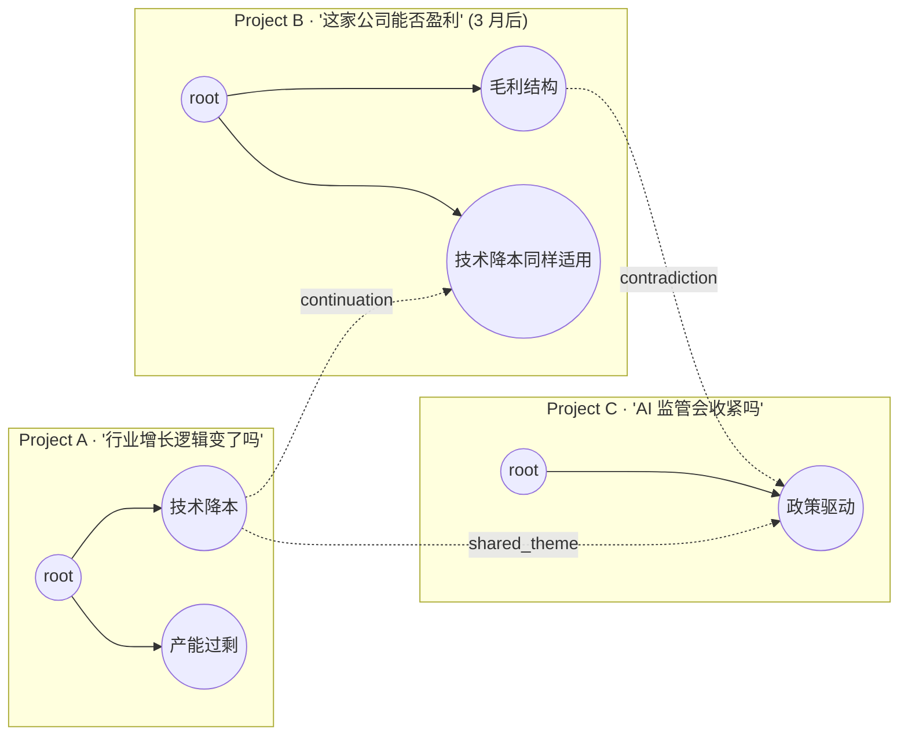
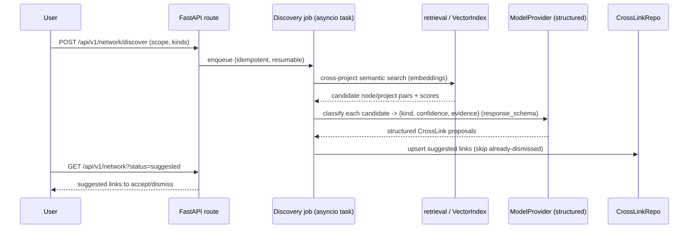
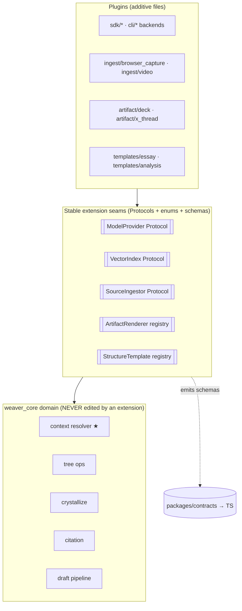

# 08 · Cross-Project Thinking Network & Extensibility

> **Status**: Later-phase design (P2 for the network; P1/P2 for the extension
> plugins). **None of this is MVP.** Build only after the M1–M5 core loop
> (think → branch → optional crystallize → cited draft → export) is excellent.
> **Conforms to**: `00-foundation.md` (authoritative contract — domain model,
> enums, ModelProvider/VectorIndex/Repository interfaces, API conventions) and
> `01-domain-and-core-logic.md` (`resolve_branch_context`, tree ops, Branch as a
> derived value object). This doc does **not** redefine any of those; it extends
> *across* projects and shows how the existing interfaces absorb new backends,
> source kinds, artifact formats, and structure templates **without core
> changes**.
> **Scope**: (1) the cross-project thinking network (`CrossLink`); (2) the
> extensibility surface the plugin abstractions already make possible.

---

## 0. Why this doc exists (the two "later" bets)

The foundation deliberately keeps MVP narrow: a single project is a self-contained
thinking tree. Two value bets live beyond that boundary, and both are *additive
overlays on already-fixed contracts* — which is exactly why they belong in one
doc:

1. **The cross-project thinking network (P2).** A deep creator tracks the *same
   issue over months across many projects*. NotebookLM's worst structural pain is
   the **"notebook island"**: each notebook is sealed; you cannot ask "where do my
   notebooks agree / contradict each other on topic X?" (competitive-analysis
   §4, "Notebook/Board 孤岛，无法跨项目查询冲突/共性"). `CrossLink` makes the
   *forest of projects* itself navigable — `shared_theme` / `contradiction` /
   `continuation` edges between projects (optionally between specific nodes),
   created by the user or *discovered by AI*.

2. **The extensibility surface (P1/P2).** The foundation already chose plugin
   abstractions — `ModelProvider`, `VectorIndex`, the repository `Protocol`s, and
   the schema-first contract. This doc states the *rules* that keep adding a new
   `ModelBackend`, `SourceKind`, `ArtifactFormat`, or `structure_template`
   **purely additive** (new file + new enum value + new schema), never a core
   edit. Browser-capture and video/podcast transcription are presented as the
   first two real source-ingestion plugins that prove the surface.

The unifying principle: **the network is "extensibility across the project
boundary," and the plugin surface is "extensibility across the capability
boundary." Both are made cheap by the same contracts.**

---

## 1. The cross-project thinking network (P2)

### 1.1 Mental model: project forest + cross-project overlay

A single project is a **forest of `ThoughtNode`s** with a `Relation` overlay
(intra-project, `merge`/`connection`/`contradiction`). The cross-project network
is the *exact same idea one level up*: the set of all projects, with a
**`CrossLink` overlay** drawn *between* projects (and optionally between specific
nodes in those projects).



Design rules (mirroring intra-project `Relation`, fixed in `00-foundation.md`):

- **`CrossLink` is an additive overlay, never a structural/backbone edge.**
  Deleting every `CrossLink` leaves every project intact. The project's own tree
  is the only structural truth; the network is a navigation layer.
- **`CrossLink` never participates in `resolve_branch_context`.** The moat is
  ancestor-only *within one project*. A cross-project edge MUST NOT widen a
  node's resolved model context (that would silently break isolation — the very
  thing we sell against). Cross-project context is an *explicit, user-initiated*
  retrieval step (§1.6), not an implicit lineage extension.
- **Branch identity stays derived.** `CrossLink` references `node_id`s and
  `project_id`s, never a stored "branch id" (Foundation §1.6). The endpoints are
  nodes (or whole projects), which *are* stored.

### 1.2 `CrossLink` schema (canonical, from Foundation §2.2)

`CrossLink` is already in the canonical domain model. This doc adds only the
concrete Pydantic shape, the discovery provenance, and a staleness guard — no new
fields beyond what the contract permits.

```python
# weaver_core/schemas/crosslink.py  (P2 — added when the network ships)

from enum import Enum
from pydantic import BaseModel
from .common import ULID, UtcDateTime

class CrossLinkKind(str, Enum):
    SHARED_THEME  = "shared_theme"   # 同一议题/主题
    CONTRADICTION = "contradiction"  # 跨项目结论冲突
    CONTINUATION  = "continuation"   # 同议题的延续/后续

class CreatedBy(str, Enum):
    USER = "user"
    AI   = "ai"

class CrossLink(BaseModel):
    id: ULID
    from_project_id: ULID
    to_project_id:   ULID
    from_node_id: ULID | None = None   # None => link is project-level
    to_node_id:   ULID | None = None
    kind: CrossLinkKind
    note: str | None = None
    created_by: CreatedBy
    # discovery provenance & lifecycle (additive, AI-discovered links):
    status: "CrossLinkStatus" = "suggested"   # see §1.4
    confidence: float | None = None           # AI similarity/score; None for user links
    evidence: list["CrossLinkEvidence"] = []  # what the AI matched on
    derived_from_hash: str | None = None      # staleness guard (§1.5)
    created_at: UtcDateTime
    updated_at: UtcDateTime

class CrossLinkStatus(str, Enum):
    SUGGESTED = "suggested"   # AI proposed, awaiting user
    ACCEPTED  = "accepted"    # user confirmed (or user-created)
    DISMISSED = "dismissed"   # user rejected; kept to avoid re-surfacing

class CrossLinkEvidence(BaseModel):
    from_quote: str          # span in the from-node/project that matched
    to_quote: str            # span in the to-node/project that matched
    score: float
```

> **`CrossLinkKind` is declared once in Python** and flows to TS via the
> schema-first pipeline (Foundation §1.1), exactly like `RelationKind`. The
> frontend never hand-writes these literals.

`CrossLinkRepo` is already named in Foundation §1.3 (P2). Its Protocol mirrors the
other repos and is **declared canonically in `07-persistence-deployment-ops.md`
§3**; this sketch conforms to it verbatim (Contract-freeze: the create verb is
`create`, matching every sibling repo — C12):

```python
class CrossLinkRepo(Protocol):
    async def create(self, link: CrossLink) -> CrossLink: ...
    async def get(self, id: ULID) -> CrossLink | None: ...
    async def list_for_project(self, project_id: ULID,
                               status: CrossLinkStatus | None = None) -> list[CrossLink]: ...
    async def list_network(self, *, kinds: list[CrossLinkKind] | None = None,
                           status: CrossLinkStatus | None = None,
                           cursor: str | None = None, limit: int = 100) -> "Page[CrossLink]": ...
    async def update_status(self, id: ULID, status: CrossLinkStatus) -> CrossLink: ...
    async def delete(self, id: ULID) -> None: ...
```

### 1.3 The global network view (read model)

The UI needs a *graph of projects*, not a giant merged tree. The core exposes a
pure read-model builder (no I/O inside; fed a snapshot, like the moat resolver):

```python
# weaver_core/network/graph.py  (P2) — PURE assembly of a read model

class NetworkNode(BaseModel):     # one project (optionally drilled to nodes)
    project_id: ULID
    title: str
    node_count: int
    last_active_at: UtcDateTime
    grounding_enabled: bool

class NetworkEdge(BaseModel):
    crosslink_id: ULID
    from_project_id: ULID
    to_project_id: ULID
    from_node_id: ULID | None
    to_node_id: ULID | None
    kind: CrossLinkKind
    created_by: CreatedBy
    confidence: float | None
    status: CrossLinkStatus

class NetworkGraph(BaseModel):
    nodes: list[NetworkNode]
    edges: list[NetworkEdge]

def build_network_graph(projects: list[ProjectSummary],
                        links: list[CrossLink],
                        *, include_suggested: bool = False) -> NetworkGraph:
    """Pure. Project-level by default; an edge with both *_node_id set can be
    drilled into in the UI. `suggested` links are filtered unless requested."""
```

Rendering (owned by `04-*` conventions, extended to a project-graph canvas):

- **Default zoom = project-level**: each `CrossLink` collapses to a single edge
  between two project bubbles, even if it pins specific nodes. Edge thickness/
  color encodes `kind`; dashed = `suggested`, solid = `accepted`.
- **Drill-in**: expanding two linked project bubbles reveals the pinned
  `from_node_id` / `to_node_id` so the user sees *which thoughts* connect.
- This is a *navigation* surface, not an editing canvas — consistent with the
  product truth "the core artifact is a tree, never a free-form canvas." The
  network view is read-and-jump, not arrange-by-hand.

### 1.4 AI-discovered links vs user-created links

Two creation paths, **one schema**, distinguished by `created_by` and `status`:

| Path | `created_by` | initial `status` | `confidence` | Lifecycle |
|------|--------------|------------------|--------------|-----------|
| User draws a link in the network view | `user` | `accepted` | `None` | edit note / delete |
| AI discovery job proposes a link | `ai` | `suggested` | score | user accepts → `accepted`, rejects → `dismissed` |

**User-created**: the user, in the network view, drags from one project (or a
specific node) to another and picks a `kind`. Immediately `accepted`. This is the
deterministic, always-available path — it requires **no model call**.

**AI-discovered** (the differentiator that answers the "notebook island" pain):
an **offline discovery job** scans across projects for candidate links and
proposes them as `suggested`. It is deliberately a *batch background job*, never
in the think-loop hot path (Foundation §1.4: jobs only for non-hot-path work).



Algorithm (candidate generation → classification):

```text
discover_cross_links(scope, kinds, threshold=0.78):
  # 1. candidate generation — reuse the SAME VectorIndex (no new infra)
  candidates = []
  for chunk_or_node_embedding e in scope.embeddings():
     hits = vector_index.search(e.vector, top_k=K,
                                filter=lambda h: h.project_id != e.project_id)  # cross-project only
     for h in hits where h.score >= threshold:
        candidates.append((e.owner, h.owner, h.score))
  candidates = dedupe_symmetric(candidates)          # (A,B) == (B,A)
  candidates = drop_if_dismissed(candidates)         # respect prior user "no"

  # 2. classification — ONE structured ModelProvider call per candidate (or batched)
  for (a, b, score) in candidates:
     # cross-project context is EXPLICIT here, and still ancestor-scoped per side:
     ctx_a = resolve_branch_context(a.node_id, forest_of(a.project_id))  # the moat, per project
     ctx_b = resolve_branch_context(b.node_id, forest_of(b.project_id))
     proposal = model.generate(GenerateRequest(
        system=CROSSLINK_CLASSIFY_PROMPT,
        messages=[render(ctx_a), render(ctx_b)],
        response_schema=CrossLinkProposalSchema))     # {kind, confidence, evidence}
     if proposal.kind in kinds and proposal.confidence >= threshold:
        upsert_suggested(CrossLink(created_by="ai", status="suggested",
                                   confidence=proposal.confidence,
                                   evidence=proposal.evidence, ...))
```

Key contract conformances:

- **The moat is preserved even in discovery.** Each side's context is resolved by
  `resolve_branch_context` *within its own project* — the classifier sees two
  clean ancestor chains, never a polluted merge. Cross-project comparison happens
  *between* two isolated contexts, not by widening either one.
- **AI-proposed `CrossLink`s reuse the structured-generation path** already fixed
  in Foundation §1.2 (`response_schema`), the *same* mechanism as AI-proposed
  *forks*. No special endpoint, no special model — just a different schema.
- **`dismissed` is sticky**: re-running discovery never re-suggests a pair the
  user already rejected (the table is the dedupe memory). Jobs are idempotent.
- **Embeddings are the same ones used for grounding** (§3.2) — discovery needs the
  `VectorIndex` interface, no new store. Ungrounded projects (no embeddings) can
  still get *user-created* links and can opt into on-demand embedding of node
  `content` for discovery (a config flag), but discovery is best-effort there.

### 1.5 Staleness / provenance

A `suggested` link references quotes that may change as projects evolve.
`derived_from_hash` = hash of the two endpoint contents (or their embeddings'
source text) at proposal time. On read, if the live hash differs, the UI flags the
link as **stale** (re-verify); `accepted` links keep their `note` but show a
"sources changed" badge. This mirrors `Artifact.derived_from_hash` (Foundation
§2.2) — one staleness pattern across the system.

### 1.6 How this answers the NotebookLM "island" pain (and stays on-brand)

| NotebookLM island problem | Weaver network answer |
|---|---|
| Each notebook sealed; no cross-notebook query | `CrossLink` overlay + network view: see all projects and their edges at once |
| Cannot find where my sources/conclusions *contradict* across notebooks | `contradiction` links, AI-discovered with evidence quotes |
| Cannot track one issue over time | `continuation` links thread the same theme across months of projects |
| Synthesis is a black box | every AI link carries `evidence` (matched quotes) + `confidence`; user accepts/dismisses — visible, auditable, user-controlled |
| Implicit context bleed across content | **explicit, ancestor-scoped** cross-project context only; the moat is never widened |

This keeps Weaver's positioning intact: *人定角度，AI 加速综合* — AI **proposes**
network edges, the user **decides**. The network is a thinking aid, not an
auto-merged knowledge blob.

---

## 2. Extensibility surface — the rules that keep extensions additive

The foundation already chose the abstractions; this section states the **binding
extension rules** so that every new capability is "new file + new enum value + new
schema," never a core edit. The litmus test for every extension:

> **An extension is correct iff (a) it adds a new enum value and/or a new adapter
> file, (b) it touches zero domain logic in `weaver_core/{tree,context,
> relations,crystallize,citation}`, and (c) it flows to TS purely through the
> schema-first contract.** If an extension forces an edit to the moat, the tree
> ops, or the draft pipeline, it is mis-designed.



### 2.1 Adding a `ModelBackend` (SDK or CLI) — zero core change

The `ModelProvider` Protocol (Foundation §1.2) is the single seam for all model
backends. Adding one is:

1. Add the provider value to the `provider` enum on `ModelBackend` (e.g.
   `"mistral"`, or a new CLI like `"aider"`).
2. Drop a new adapter file under `weaver_core/model/sdk/` or
   `weaver_core/model/cli/` implementing the Protocol's `generate()` +
   `health()`.
3. Register its **builder** on the canonical `ProviderRegistry` (owned by
   `02-model-provider-and-agents.md` §2.1), keyed by the composite
   `(kind, provider)`.

> **Contract-freeze:** the provider registry is the `ProviderRegistry` *class*
> declared in `02-*` §2.1 — an instance constructed with `(backend_repo,
> secrets)`, with builders keyed by `(kind, provider)` via
> `register_builder(kind, provider, builder)` and resolved through
> `get(backend_id)` / `default_for(project)`. This doc does **not** define a
> competing module-level `_REGISTRY` dict, `@register_provider` decorator, or
> `build_provider()` function — those are deleted in favor of conforming to
> 02's class. The composite key disambiguates e.g. an SDK `"gemini"` from a CLI
> `"gemini_cli"` (C10).

```python
# Extension = register a builder on 02's ProviderRegistry instance.
# adding a new SDK backend = ONE new adapter file + ONE register_builder call:

class MistralProvider:                          # implements ModelProvider Protocol
    kind = BackendKind.API_SDK
    async def generate(self, req: GenerateRequest) -> AsyncIterator[TokenEvent]: ...
    async def health(self) -> BackendHealth: ...

# wired at startup against the canonical registry (02 §2.1):
registry.register_builder(BackendKind.API_SDK, "mistral", MistralProvider.from_backend)
```

`registry.get(backend_id)` raises (codes owned by `03-*` §5.1 `ErrorCode`):
`BACKEND_NOT_FOUND` when the row id doesn't exist, `BACKEND_DISABLED` when the
row is disabled, and `UNKNOWN_BACKEND` when no builder is registered for the
row's `(kind, provider)` (C3, C10).

What does **not** change: the context resolver (still feeds pre-resolved
`messages`), the API routes (still call `registry.get(backend_id).generate(...)`),
the SSE `TokenEvent` shape, the permission *enforcement* (CLI gate wraps any
`cli_agent` provider uniformly — see `02-*`). A new CLI agent inherits the exact
same `PermissionSet` enforcement (`auto_run_readonly` / `allow_file_edits` /
`network_access`) without touching the gate.

> **Why this holds**: the provider *never resolves context* (Foundation §1.2), so
> a new backend can't reach into the tree. It is downstream of the moat by
> construction.

### 2.2 Adding a `SourceKind` (ingestion plugin) — the `SourceIngestor` seam

`05-retrieval-and-grounding.md` owns chunking/embedding/citation mapping. This doc
fixes the **ingestion seam** so new source kinds plug in without touching that
pipeline:

```python
# weaver_core/retrieval/ingest/base.py
class IngestResult(BaseModel):
    title: str
    raw_ref: str                 # content-addressed BlobStore ref (blob://sha256/<hex>)
                                 # — BlobStore Protocol owned by 07-* §3 (G4)
    blocks: list["SourceBlock"]  # normalized text blocks with char offsets + section

class SourceBlock(BaseModel):
    text: str
    char_start: int
    char_end: int
    section: str | None = None   # chapter/heading -> Chunk.section (big-doc coverage)
    media_ref: str | None = None # timestamp/page anchor for video/PDF (citation jump-back)

class SourceIngestor(Protocol):
    kind: SourceKind
    async def ingest(self, origin: str, raw: bytes | str,
                     progress: "ProgressSink") -> IngestResult: ...
```

The pipeline downstream of ingestion is **kind-agnostic**: every ingestor emits
the same `SourceBlock[]`, then the *shared* chunker → embedder (`VectorIndex`) →
sentence-level citation mapper runs unchanged. Adding a `SourceKind` = new enum
value + one `SourceIngestor` file + register it. The `Source`/`Chunk`/`Citation`
schemas already carry everything a new kind needs (`section`, and `media_ref` maps
into the citation's jump-back anchor).

```python
_INGESTORS: dict[SourceKind, SourceIngestor] = {}
def register_ingestor(k: SourceKind):
    def deco(obj): _INGESTORS[k] = obj; return obj
    return deco
```

#### 2.2.1 Browser-capture ingestion plugin (P1)

YouMind's most-valued feature ("单项最值功能，月省~5h" — competitive-analysis §3.1).
Architecturally it is **just another `SourceIngestor`** plus a thin capture
client:

- **Capture client** (browser extension / bookmarklet, lives in `apps/web` or a
  separate `apps/extension`, *not* in `weaver_core`): grabs the readable article
  (Readability-style DOM extraction) + canonical URL + selection, POSTs to
  `POST /api/v1/sources` with `kind="url"` and a `captured_html` payload.
- **Server ingestor** (`ingest/browser_capture.py`, `kind=URL`): cleans the
  captured HTML → `SourceBlock[]` with offsets, preserving the canonical origin
  for citation jump-back. Reuses the URL ingestor's cleaning if a raw URL is
  given instead of captured HTML.
- A captured selection can be promoted directly into a **starting `ThoughtNode`**
  (PRD §4.1 "高亮可作为思维树的起点节点") via the existing node-create path — no
  new domain logic.

MVP already ships "paste URL → fetch + summarize" (`kind=url` ingestor). The
extension is an *additive capture front-end* over the same ingestor + the same
`POST /sources`; promoting it to MVP+1 (competitive-analysis recommendation #3)
needs no core change.

#### 2.2.2 Video / podcast transcription plugin (P1/P2)

`SourceKind.VIDEO` / `SourceKind.AUDIO` already exist in the enum (Foundation
§2.3, marked P1). Adding them:

- **`ingest/media.py`** (`kind=VIDEO|AUDIO`): runs a transcription backend
  (configurable: a local Whisper, or a transcription API) → timestamped
  segments. Each segment becomes a `SourceBlock` with `media_ref` = `t=HH:MM:SS`
  (and page/frame for video). Transcription is **slow → an async ingestion job**
  (Foundation §1.4) with visible progress emitted as the canonical `progress`
  `TokenEvent` (owned by `02-*` §1.2; subsumes the deleted `ingest_progress`
  type — C1), exactly the path big-doc ingestion uses.
- Citations then jump back to the *timestamp* in the original media — the same
  sentence-level citation machinery (`05-*`), just with a media anchor instead of
  a char range. `Citation.quote` = the transcript sentence; `media_ref` carries
  the timestamp. **No change to the citation mapper's contract.**
- Transcription provider is itself a small registry (Whisper-local vs API),
  following the same register-an-adapter pattern as model backends — so swapping
  transcription engines is additive too.

> **Why media ingestion does not perturb the core**: it lands as normalized
> `SourceBlock[]`. From the chunker onward, a podcast is indistinguishable from a
> PDF. The moat, tree, crystallize, and draft pipelines never learn that "video"
> exists.

### 2.3 Adding an `ArtifactFormat` (output renderer) — the renderer registry

Multi-format output (P1, owned in depth by `06-*`) is the anti-NotebookLM
"single-source, topic-consistent multi-format" bet. The extension seam is an
**`ArtifactRenderer` registry** keyed by `ArtifactFormat`:

```python
# weaver_core/draft/artifact/base.py
class ArtifactRenderer(Protocol):
    format: ArtifactFormat
    def render(self, draft: Draft, voice: VoiceTone,
               scaffold: list[NarrativeRole] | None = None) -> ArtifactBody: ...
```

- Every renderer derives from the **same `Draft`** (one source of truth) and
  records `derived_from_hash` — guaranteeing the formats agree (the explicit
  anti-NotebookLM property). Adding `deck`, `x_thread`, `video_script`, `email`,
  `newsletter`, `docx` = new enum value (already enumerated in Foundation §2.3) +
  one renderer file + register.
- Renderers may consume `NarrativeRole` scaffolds (`cold_open/setup/turn/payoff/
  takeaway` — the prototype scaffolds) but never re-derive content; they reshape
  the one draft. **No core edit**; `Draft`/`Artifact` schemas are unchanged.

### 2.4 Adding a `structure_template` — template registry (P2)

`Outline.structure_template` already allows `essay | analysis | story` (Foundation
§2.2, P2 template library; competitive-analysis §3.2 "Skills 模板库" learning).
Templates are **data + an ordering heuristic**, not code branches in the
crystallizer:

```python
# weaver_core/crystallize/templates/base.py
class StructureTemplate(BaseModel):
    key: str                          # "essay" | "analysis" | "story" | <new>
    title: str
    roles: list[NarrativeRole]        # ordered scaffold the outline should fill
    ordering_hint: str                # natural-language guidance for AI ordering

_TEMPLATES: dict[str, StructureTemplate] = {}
def register_template(t: StructureTemplate): _TEMPLATES[t.key] = t
```

The crystallizer (`weaver_core/crystallize/`, owned by `01-*`/`06-*`) takes a
`StructureTemplate` as *input* and orders promoted `OutlinePoint`s into its
`roles`. Adding a template = registering a data row; the crystallization algorithm
is unchanged.

### 2.5 The contract guarantee that makes all of this safe

Every extension above introduces (at most) a new **enum value** and a new
**schema/adapter**. Because Pydantic models are the single source of truth and CI
drift-guards `openapi.json` + generated TS (Foundation §1.1), the moment a new
`SourceKind`, `ArtifactFormat`, `CrossLinkKind`, or backend `provider` is added in
Python, the typed TS literal flows to the frontend automatically and the drift
guard *forces* regeneration. **There is no path to a hand-written, drifting
client type.** The frontend gets exhaustive switch coverage (TS will flag an
unhandled new enum member), so "did we handle the new kind in the UI?" is a
compile-time question, not a runtime surprise.

---

## 3. How the seams reuse existing interfaces (no new infrastructure)

| Extension | Reuses | New thing added | Touches core? |
|---|---|---|---|
| New SDK/CLI backend | `ModelProvider` Protocol, registry, permission gate, SSE `TokenEvent` | 1 adapter file + `provider` enum value | **No** |
| New `SourceKind` | shared chunk→embed→cite pipeline, async jobs table | 1 `SourceIngestor` + `SourceKind` enum value | **No** |
| Browser capture | `POST /sources`, URL ingestor, node-create path | capture client + thin ingestor | **No** |
| Video/podcast | `SourceIngestor`, async ingestion jobs, `VectorIndex`, citation mapper (media anchor) | media ingestor + transcription adapter | **No** |
| New `ArtifactFormat` | one `Draft`, `derived_from_hash`, `NarrativeRole` | 1 `ArtifactRenderer` + enum value | **No** |
| New `structure_template` | crystallizer ordering | 1 `StructureTemplate` data row | **No** |
| Cross-project network | `VectorIndex` (same embeddings), structured generation, `resolve_branch_context` per project, `Relation` overlay pattern, staleness hash | `CrossLink` schema/repo/route + network read model + discovery job | **No** (overlay only) |

### 3.1 `VectorIndex` is the shared substrate

The same `VectorIndex` interface (Foundation §1.3 — `sqlite-vec` local /
`pgvector` swappable) serves: (a) grounded node-answer retrieval, and (b)
cross-project link discovery. Cross-project search is just a `VectorIndex.search`
with a `project_id != self` filter. No second store, no new index type.

### 3.2 Repository Protocols absorb the network

`CrossLinkRepo` is one more repository behind the same Protocol pattern; SQLite
gets a `cross_links` table, Postgres the same. The network does **not** introduce
a graph database — a small edge table over ULIDs is sufficient at single-user
scale, and `build_network_graph` assembles the read model in memory.

---

## 4. API surface (P2 / P1 additions, conforming to Foundation §1.5)

All REST + JSON under `/api/v1`, resource-oriented, ULIDs, cursor pagination, the
canonical error envelope, SSE for streaming. Full schemas land in `03-*` when
these ship.

```text
# Cross-project network (P2)
GET    /api/v1/network                      -> NetworkGraph  (?status=&kinds=&cursor=&limit=)
POST   /api/v1/crosslinks                   -> create user link (created_by=user, accepted)
PATCH  /api/v1/crosslinks/{id}              -> edit note / update_status (accept|dismiss)
DELETE /api/v1/crosslinks/{id}
POST   /api/v1/network/discover             -> start AI discovery job (async; returns job id)
GET    /api/v1/jobs/{id}                     -> discovery job status/progress (shared jobs table)

# Extensibility-driven additions
POST   /api/v1/sources                       (extended: accepts captured_html; kind=url|pdf|text|markdown|video|audio)
GET    /api/v1/backends/registry             -> list registered provider keys (so Settings can offer new backends)
POST   /api/v1/drafts/{id}/artifacts         (P1) -> render an ArtifactFormat from one Draft
GET    /api/v1/templates                      (P2) -> list registered structure templates
```

Error codes this doc relies on (machine-stable, mapped to typed TS errors):
`CROSSLINK_NOT_FOUND`, `CROSSLINK_SELF_LINK` (from == to project with no node
distinction), `UNKNOWN_BACKEND`, `UNSUPPORTED_SOURCE_KIND`,
`UNKNOWN_ARTIFACT_FORMAT`, `UNKNOWN_TEMPLATE`, `DISCOVERY_NO_EMBEDDINGS`.

> **Contract-freeze:** these codes are **declared in `03-*` §5.1's canonical
> `ErrorCode` enum** (the sole error-code source of truth, codegen'd into the TS
> union). This doc **references** them and does not own or re-declare them; the
> registry codes `BACKEND_DISABLED` / `BACKEND_NOT_FOUND` it raises are likewise
> sourced from 03's enum (C3).

`POST /network/discover` streams nothing in the hot path; it returns a job id and
the UI polls `GET /jobs/{id}` (Foundation §1.4 jobs policy). Discovery is never on
the think-loop critical path.

---

## 5. Testing

Conforms to the Foundation §7 determinism contract: the **FAKE** ModelProvider is
the default in CI; no test reaches a real model or network.

**Unit (pytest) — pure, no I/O**
- `build_network_graph`: project-level collapse of node-pinned links; `suggested`
  filtering honored; deterministic edge ordering.
- Symmetric dedupe of discovery candidates: `(A,B)` == `(B,A)`; `dismissed` pairs
  never re-emitted.
- Staleness: `derived_from_hash` mismatch flags stale; match does not.
- **Moat-preservation test (critical):** assert the discovery path calls
  `resolve_branch_context` *per project* and that the classifier input for side A
  contains **only** A's ancestor chain (never B's nodes, never siblings). This is
  the cross-project analogue of the core isolation test and MUST exist before the
  network ships.
- Registry tests: `ProviderRegistry.register_builder` (02 §2.1) /
  `register_ingestor` / `register_template` / `ArtifactRenderer` registration is
  additive; `ProviderRegistry.get` raises `UNKNOWN_BACKEND` (03 §5.1 `ErrorCode`)
  when no builder matches the row's `(kind, provider)`.

**Extensibility "additive" guard (pytest + CI)**
- A test that imports `weaver_core.context`, `weaver_core.tree`,
  `weaver_core.crystallize` and asserts they have **no import** of any
  `ingest/*`, `artifact/*`, `crosslink`, or `network` module — encoding "an
  extension never reaches into the moat/tree/crystallizer."
- Enum-completeness: for every `SourceKind` there is a registered ingestor; for
  every non-MVP `ArtifactFormat` there is a renderer once that format is enabled
  (xfail-marked until implemented).

**Contract (pytest)**
- One test per new route against the OpenAPI schema (`/network`, `/crosslinks`,
  `/network/discover`, `/drafts/{id}/artifacts`, `/templates`,
  `/backends/registry`).
- Error-envelope tests for each new error code.
- **Drift guard** (already global): adding `CrossLinkKind` / a new `SourceKind` /
  `ArtifactFormat` regenerates `openapi.json` + TS or the build goes red.

**Frontend (`__tests__/`)**
- Network view renders nodes/edges from a `NetworkGraph` fixture; dashed vs solid
  for `suggested` vs `accepted`; kind→color mapping.
- Exhaustive-switch test: an unhandled new `CrossLinkKind`/`SourceKind` fails
  TypeScript compilation (the additive-safety property).

**Smoke (one per feature, mirrors a real flow)**
- Network: create two projects → `POST /network/discover` (FAKE classifier emits
  a scripted `shared_theme`) → suggested link appears → accept → it shows in
  `GET /network` as `accepted`.
- Video ingest: ingest a fixture transcript via `ingest/media` (FAKE transcriber)
  → chunks carry `media_ref` timestamps → a node answer citation jumps to a
  timestamp.

---

## 6. MVP vs Later

**MVP (M1–M5) — none of this doc ships.** The MVP is a single self-contained
project: think → branch (with the moat) → optional crystallize → cited draft →
Markdown export, with `API_SDK` + `FAKE` backends, the permission *model*, SQLite,
and the schema-first contract. The **only** MVP-relevant guarantee from this doc
is *negative*: the extension seams (`ModelProvider`, `VectorIndex`, repository
Protocols, the schema-first contract) are built in MVP **shaped so that
everything below is additive later** — i.e. MVP must not bake in assumptions that
would later force a core edit (e.g. it must not special-case "url" sources in the
chunker, must not hardcode "article" in the draft pipeline, must keep the moat
provider-agnostic).

**Later — P1 (after the core loop is excellent):**
- Browser-capture ingestion plugin (capture client + `ingest/browser_capture`),
  MVP+1 per competitive-analysis recommendation #3.
- Video/podcast transcription ingestion (`SourceKind.VIDEO|AUDIO`,
  `ingest/media`, async transcription job, timestamped citations).
- Multi-format `Artifact` renderers (`deck`/`x_thread`/`email`/`newsletter`/
  `video_script`/`docx`) from one `Draft` (depth in `06-*`).
- Additional `ModelBackend`s incl. `CLI_AGENT` family wired through the existing
  provider gate.

**Later — P2:**
- The cross-project thinking network: `CrossLink` schema/repo/routes, the network
  read model + view, user-created links.
- AI-discovered cross-project links (discovery job, structured classification,
  evidence, accept/dismiss lifecycle, staleness).
- `structure_template` library (`essay`/`analysis`/`story` + custom).

Mapping to Foundation §6 build sequence: this entire doc is item **8 ("Later")**
of the build sequence — explicitly after M6.

---

## 7. Open questions (flag, do not silently resolve)

- **Discovery scope & cost control (P2)**: across *all* projects every run, or an
  incrementally-indexed delta? At what project count does per-pair classification
  get expensive, and do we cap candidates or move classification fully batched?
  (Job design in `07-*` jobs table; tuning is empirical.)
- **Ungrounded-project discovery**: do we auto-embed node `content` for projects
  with zero sources to make them discoverable, or require explicit opt-in?
  (`DISCOVERY_NO_EMBEDDINGS` exists as the explicit-failure path; default policy
  unresolved.)
- **Network view scale**: at many projects + many edges, the project graph hits
  the same "tree gets big" concern flagged in Foundation §11 / PRD §10. Need
  filtering/clustering (by `kind`, by recency, by theme). View concern for `04-*`.
- **CrossLink granularity default**: should AI discovery default to *project-
  level* or *node-pinned* links? Node-pinned is more precise but noisier.
- **Transcription engine policy**: bundle a local Whisper (heavier image, fully
  local-first) vs default to an API (lighter, but breaks "fully local"). Affects
  `07-*` deployment image. Likely a config choice, default local.
- **Does `CrossLink(contradiction)` ever feed a draft?** I.e. should the network
  be able to surface "you contradicted yourself across projects" into a draft's
  counter-argument section? Tempting but expands scope — keep out of P2 v1; record
  as a future bet.
