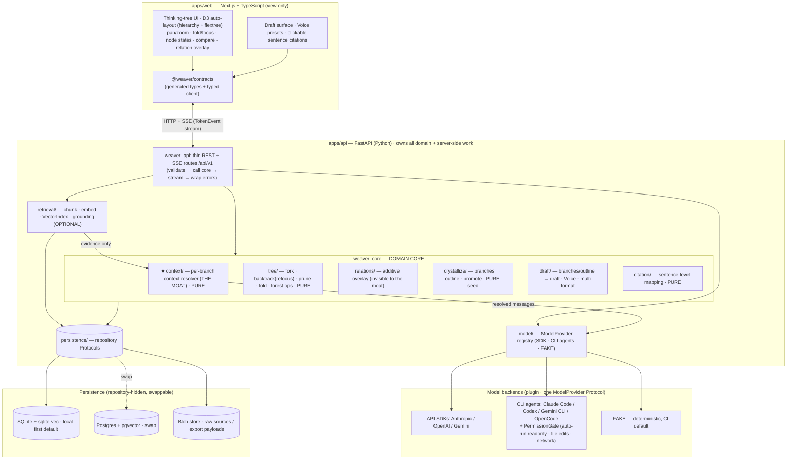

# Weaver Next — Architecture Overview

> **Status**: Index / connective tissue. Authoritative slices live in the
> numbered docs below; `00-foundation.md` is the canonical contract every doc
> conforms to.
> **Scope**: FULL VISION (P0/P1/P2), with the MVP boundary (3 pages, M1–M5)
> marked throughout.
> **Upstream sources of truth**: [`../PRD-Weaver-Redesign-2026.md`](../PRD-Weaver-Redesign-2026.md)
> (中文, product spec), [`../competitive-analysis-2026.md`](../competitive-analysis-2026.md),
> [`../rebuild-plan.md`](../rebuild-plan.md) (M0–M6).

Weaver Next is a **local-first, single-user, branching thinking tool (思维树)**:
think → fork into branches → (optionally) crystallize into an outline → generate
a cited draft in a chosen Voice → export. It is *not* a free-form canvas and
*not* linear chat. Sources and the outline are both **optional**.

---

## The architecture in one page

**The moat = per-branch context isolation (按分支隔离上下文).** Given a node, the
AI sees **only that node's ancestor chain**, never sibling branches. This is a
**pure, model-independent, unit-testable** function (`resolve_branch_context`) in
`apps/api/weaver_core/context/`, built and tested first. It walks `parent_id`
upward over an in-memory forest snapshot — so sibling isolation is a *structural*
property, not a runtime check. Every context-producing path (retrieval, draft
generation, cross-project discovery) routes through it; the ModelProvider only
ever receives already-resolved messages and has no access to the forest.

**Cross-language split (binding decision #1).** The **domain core lives in Python**
(`weaver_core/`). TypeScript holds **no** domain rules — only rendering and a
**generated** typed client. Sync is **schema-first**: Pydantic models →
FastAPI OpenAPI 3.1 → checked-in `packages/contracts/openapi.json` →
`openapi-typescript` → `@weaver/contracts`, guarded by a CI drift check.

**Layering rules (binding):** UI renders state + sends intent (no domain rules);
routes are a thin translation membrane (no tree-walking / context resolution /
SQL); `weaver_core` owns domain rules and is pure where it can be; retrieval is
visible-I/O optional grounding, never hidden in chat; persistence is behind
repositories; the ModelProvider is the **only** path to a model and is always
fed pre-resolved context.

**Two purity tiers:** *Tier A* = pure core (context, tree ops, crystallize/
promote, citation mapping, relation validation) — no I/O, no model, no clock, no
randomness; this is what makes the moat and citations unit-testable without a
model. *Tier B* = orchestrating services that do repo I/O and call the provider
but never re-implement domain rules and only ever feed the provider a
Tier-A-produced context.

---

## Design documents

| # | Doc | Owns / one-line purpose |
|---|-----|--------------------------|
| 00 | [`00-foundation.md`](00-foundation.md) | **Canonical contract.** Cross-cutting decisions, the domain model, repo tree, build sequence, glossary. Everyone conforms. |
| 01 | [`01-domain-and-core-logic.md`](01-domain-and-core-logic.md) | **The moat + domain.** `resolve_branch_context` (pure, ancestor-only, dead-end-excluded), fork/backtrack/prune, promote, relations, honesty flag. |
| 02 | [`02-model-provider-and-agents.md`](02-model-provider-and-agents.md) | **Model layer.** One `ModelProvider` Protocol for SDK/CLI/FAKE, `TokenEvent` stream, PermissionGate, secret refs, AI-proposed forks via structured generation. |
| 03 | [`03-api-service-and-contracts.md`](03-api-service-and-contracts.md) | **The contract seam.** FastAPI routes, SSE vs JSON errors, the canonical `ErrorCode` enum, schema-first codegen + drift guard. |
| 04 | [`04-frontend-and-tree-rendering.md`](04-frontend-and-tree-rendering.md) | **Frontend.** D3 hierarchy + flextree auto-layout, stable layout, server-state vs view-state split, Voice-on-draft, citation chips. |
| 05 | [`05-retrieval-and-grounding.md`](05-retrieval-and-grounding.md) | **Optional grounding.** Bypassable retrieval, pure sentence-level `map_citations`, shared CJK-aware segmenter, swappable VectorIndex. |
| 06 | [`06-crystallize-draft-export-multiformat.md`](06-crystallize-draft-export-multiformat.md) | **Crystallize → draft → export.** Deterministic promote, one generator for both draft paths, citation-preserving markers, Voice→draft, multi-format Artifacts. |
| 07 | [`07-persistence-deployment-ops.md`](07-persistence-deployment-ops.md) | **Persistence & ops.** Repository impls, SQLite/Postgres, pgvector, jobs table, Docker Compose, backup/restore. |
| 08 | [`08-cross-project-network-and-extensibility.md`](08-cross-project-network-and-extensibility.md) | **P2 + extensibility.** CrossLink overlay (never in the moat), shared `SourceBlock` ingestion seam, the additivity litmus test. |

---

## Build sequence (aligned to M0–M6)

| Milestone | Slice | Primary docs |
|-----------|-------|--------------|
| **M0** Skeleton | Monorepo (`apps/web`, `apps/api`, `packages/contracts`); schema-first codegen + drift guard; **FAKE** provider; CI determinism contract. | 00, 03 |
| **M1** Project model | Project CRUD; repository layer (SQLite); UoW; repo unit tests. | 07, 03 |
| **M2 ★** Tree core (the moat) | ThoughtNode forest; **`resolve_branch_context` built & tested first** (purity, ancestor-only, sibling isolation); fork/backtrack(refocus)/prune/fold; ModelProvider (SDK + FAKE); AI-proposed forks (structured gen); D3 auto-layout render, pan/zoom, focus. | 01, 02, 04, 03 |
| **M3** Optional grounding | Source ingest (text/PDF/URL) → chunk → embed → retrieval; **sentence-level clickable citations** on answers (CJK-aware). Tree still works with zero sources. | 05, 07 |
| **M4** Crystallize + draft | Promote branches → optional outline; one generator for direct-from-branches OR via-outline; **Voice presets applied to the draft**; citation markers preserved. | 06, 04 |
| **M5** Export | Markdown export preserving citations (`draft_anchor` → source); end-to-end smoke test (think → branch → crystallize → draft → export). | 06, 03 |
| **M6** Deployment | Docker Compose; prod env template; backup/restore. | 07 |
| **Later (P1/P2)** | CLI-agent backends + live permission enforcement; Relations/compare/merge; multi-format Artifacts; browser capture; video/podcast transcription; big-doc jobs; Postgres+pgvector; cross-project network (CrossLink); structure templates; richer export. | 02, 04, 06, 08 |

Every milestone ships a smoke test mirroring the core loop; CI runs against the
**FAKE** provider so no test reaches a real model or network.

**MVP vs Later (one line):** MVP = 3 pages (Dashboard, Thinking Tree w/ optional
source sidebar, Draft) over `weaver_core` + the moat + `API_SDK`/`FAKE` +
SQLite + synchronous streaming + optional grounding/outline + Voice-to-draft +
Markdown export. Everything else (CLI agents with live enforcement, relations,
multi-format, capture, transcription, Postgres, cross-project network) is Later.

---

## Open Questions & Known Inconsistencies

> **Contract-freeze (this pass) — 2026-06-22.** A dedicated contract-freeze pass
> resolved the entire cross-language contract seam. **All 13 contradictions
> (C1–C13) and all 7 coverage gaps (G1–G7) are RESOLVED** in docs 00–08, each
> with exactly one owner doc declaring the shape and every other doc referencing
> it by name. What was frozen, in one breath: `TokenEvent` (one closed 8-member
> type enum, `seq`+`request_id`, `ingest_progress` deleted — owner 02); the
> single streaming draft route `POST /projects/{pid}/drafts` + `DraftGenerateRequest`
> (owner 03); `ErrorCode` as the sole codegen error union (owner 03); `Citation`
> char offsets indexing the **SOURCE canonical text** + `answer_span`/`method`/
> `confidence`/`details` storage (owners 00/05/07/03); plus the gap closures —
> SSE cancellation, the idempotency-key store, `MetaView`/`FeatureFlags`,
> `BlobStore`, per-project embedding dim, Voice-is-draft-only, and one
> `ForkProposal` shape. The freeze is recorded in **ADR-0021…ADR-0027**; the
> drift guard (`make contracts`) is now meaningful and the seam is frozen
> **before M2**. The tables below are kept as a resolution ledger.

A consistency review of docs 00–08 found the load-bearing product truths
**unusually well-aligned** — the moat is pure/ancestor-only/model-independent
everywhere, Branch-is-derived (no table) holds, and Python-owns-core +
schema-first codegen are honored throughout. The serious problems clustered at
the **cross-language contract seam** and have now been frozen (see the note
above). The original severity tally was **5 high · 5 medium · 3 low**
contradictions plus **7 coverage gaps** — all resolved.

### Contradictions — RESOLVED ledger

| # | Severity | Issue (original) | Resolution → owner |
|---|----------|-------|-------------|
| C1 | HIGH | `TokenEvent` defined 3 incompatible ways across 00/02/03/05. | **RESOLVED** — doc 02 sole owner: one shape `{type, data, seq, request_id?}`, closed 8-member enum `token, tool_call, tool_result, citation, proposal, progress, done, error`; `progress` subsumes ingestion; `ingest_progress` deleted; 03/05 reference by name. (ADR-0021) |
| C2 | HIGH | Draft route specified two mutually exclusive ways (two-step vs single streaming). | **RESOLVED** — doc 03: one streaming `POST /projects/{pid}/drafts` (creates + streams; `done` carries id + `DraftView`); unified `DraftGenerateRequest` (outline_id XOR source_branch_node_ids); two-step + record-only create removed; 04/06 reference by name. (ADR-0022) |
| C3 | HIGH | `ErrorCode` is codegen truth yet 04 hand-rolled `AppErrorCode`; 02/08 raised codes absent from 03. | **RESOLVED** — doc 03 sole `ErrorCode`; added `BACKEND_DISABLED`, `UNKNOWN_BACKEND`, + 08 P2 codes; 04 imports the generated union; prose names corrected; 02/08 reference by name. (ADR-0023) |
| C4 | HIGH | `Citation.char_start/end` coordinate space contradictory; `answer_span`/`method`/`confidence`/`details` had no DDL home. | **RESOLVED** — owner 00: offsets index the **SOURCE canonical text** (chunk spans are a window into it); 07 adds `answer_span`/`method`/`details` columns (keeps `confidence`); 05 maps 1:1; 03 surfaces `method` + optional `answer_span`. (ADR-0024) |
| C5 | HIGH | Umbrella: freeze the seam before M2. | **RESOLVED** — composed of C1–C4 + G1–G3, all landed; this README ledger + ADRs record the freeze. (ADR-0021…0027) |
| C6 | MED | `grounded`/`uncited_claims` + `Voice.style_directives` absent from canonical shapes. | **RESOLVED** — owner 00 (`Draft`); mirrored in 03 `DraftView` + 07 DDL; `style_directives`/`sample_hash` cached on 07 `voice_config`. (ADR-0026) |
| C7 | MED | No agreed pre-generation transport for the "Reading your N branches" count. | **RESOLVED** — owner 03: early `progress`-type `TokenEvent` (`stage:'context_resolved'`, `context_segment_count`, `branch_node_ids`) as the first `/think` frame; also on `ThinkResultMeta`; 04 references by name; `think/preview` dropped. |
| C8 | MED | Outline reorder + colon-verb style diverged (violating 00 §1.5). | **RESOLVED** — owner 03: `POST /outlines/{id}/reorder` (`OutlineReorder{ordered_point_ids}`); `point_order` removed from `OutlineUpdate`; colon verbs banned → `…/outline/propose`; aligned in 06/08. |
| C9 | MED | Paragraph-op addressed two ways + op spelling drift. | **RESOLVED** — owner 03 route `POST /drafts/{id}/blocks/{block_id}/op` (`ParagraphOpRequest{op: ParaOp, backend_id?}`); `ParaOp` (`expand\|condense\|reangle\|stronger_evidence`) owned by 06; `strengthen` dropped. |
| C10 | MED | Two provider-registry designs. | **RESOLVED** — owner 02 `ProviderRegistry` class (composite `(kind,provider)` key, `register_builder`); 08 deletes its decorator registry and conforms. (ADR-0027) |
| C11 | MED | `/think` answer-node creation described 3 ways. | **RESOLVED** — owner 03: defaults `create_child=True` (persist at `done` in one tx); `create_child=False` = non-committing preview (`node_id=null`); 01 §8 references the switch; 04 treats optimistic child as view-only until `done`. (ADR-0025) |
| C12 | LOW | `CrossLinkRepo` verbs differ (`add` vs `create`). | **RESOLVED** — owner 07 carries full P2 surface with `create`; 08 conforms (`add`→`create`). (ADR-0027) |
| C13 | LOW | Honesty-label vocab drifts. | **RESOLVED** — owner 01: closed enum `user_judgment, inferred, grounded, weakly_grounded`; 06 fixes `author_judgment`; 05 uses `weakly_grounded`. (ADR-0027) |

### Coverage gaps — RESOLVED ledger

| # | Gap (original) | Resolution → owner |
|---|-----|-----------------|
| G1 | Cancellation/abort transport over SSE not contracted. | **RESOLVED** — owner 03: implicit (client disconnect → task cancel) + explicit `DELETE /streams/{request_id}`; both → `STREAM_INTERRUPTED`; `request_id` maps to 02's `GenerateRequest.request_id`. (ADR-0026) |
| G2 | `Idempotency-Key` consumed as a hard guarantee but only "optional"; no store/window. | **RESOLVED** — owner 03 + 07: defined on mutating/streaming POSTs; same key+fingerprint → first persisted result (refetch by id, no re-stream); different fingerprint → `IDEMPOTENCY_REPLAY` (409); 24h window; `idempotency_key` table + sweep in 07. (ADR-0026) |
| G3 | `/meta` feature-flags payload never schematized. | **RESOLVED** — owner 03: `MetaView{build_version, api_version, default_backend_id?, model_mode, features}` with explicit boolean `FeatureFlags`; 04 gates UI on `features.*` by name. (ADR-0026) |
| G4 | No `BlobStore` Protocol for `raw_ref`/`payload_ref`. | **RESOLVED** — owner 07: content-addressed `BlobStore` Protocol (`blob://sha256/<hex>`), `FileBlobStore` default, included in backups; 05/06/08 reference by name. (ADR-0026) |
| G5 | Embedding-dimension consistency (global 768 vs per-project dims). | **RESOLVED** — owner 07 + 05: dim is per-project, locked at first ingest (`embedder_id`/`embedding_dim` on `project`); per-dim `vec_chunks_{dim}` table; `EMBEDDING_DIM` is default-for-new-projects only; reembed to change. (ADR-0026) |
| G6 | Voice-in-chat policy unstated. | **RESOLVED** — owner 06 + 03: Voice is **draft-only**; `/think` answers use a neutral register with NO `VoiceTone`; `ThinkRequest` has no `voice` field (intentional, contract-frozen). (ADR-0026) |
| G7 | AI-proposed-fork transport ambiguous end-to-end. | **RESOLVED** — owner 03: one `ForkProposal{prompt, rationale, suggested_label?}`; two delivery paths (inline `proposal` `TokenEvent`s + `done.fork_proposals`, OR `POST /nodes/{id}/fork/propose` → `ForkProposeResult`); accept via `POST /nodes/{id}/fork`; 02's `ProposedFork` maps 1:1; 04 deletes its nested shape. (ADR-0026) |

### Genuinely still-open (product-judgment / deferred — not contract-seam)

These are intentionally deferred prototype/UX knobs and later-milestone questions;
none block the frozen seam or M2 codegen.

### Aggregated open questions (tracked, not lost)

**Foundation-level (00):**
- Dead-end ancestors in context: default ON/OFF + toggle semantics. *(01 decided: default OFF, `include_dead_end_ancestors` toggle, target node always kept.)*
- AI-proposed-fork cadence: how many directions, when to offer, without intruding. *(schema in 02; policy is a UX/prototype knob.)*
- No-source honesty marking: `inferred` (AI) vs `user_judgment` labeling. *(01 owns the closed enum; resolved this pass — C13.)*
- Tree scale ceiling: auto-merge / auto-focus / summarization when node count grows. *(04 view + possibly 01 summarization; AI summary lifecycle deferred, likely a later milestone.)*
- Voice "feed-a-sample" (P1): where style extraction runs. *(06 resolved: draft-time cached extraction keyed by `hash(sample_text)`, additive.)*
- Multi-format topic-consistency: all Artifacts derived from one Draft/Outline with `derived_from_hash` staleness. *(06 confirmed as the anti-NotebookLM guarantee.)*

**Per-doc open questions (highlights):**
- **01**: dead-end node *between* two live ancestors (default excludes a premise live descendants were chosen after — may surprise; needs prototype validation); `merge` relation vs true content merge (requires explicit AI-synthesized fork); honesty granularity per-node/message vs sentence-level (align with 05).
- **02**: CLI agent streaming protocols are version-volatile (recorded-fixture contract tests + capability probe); sandbox strength under "allow file edits" (confined workdir + default-deny network, container opt-in); unknown-action classification heuristic (conservative per-agent allowlists + default REQUIRE_APPROVAL); SDK function-calling must route through the same `PermissionGate`; cross-vendor structured-output reliability (shared tolerant-parse/repair — location open).
- **03**: whether AST drift-guard covers `DraftBody`; resumable SSE / `Last-Event-ID` (lean: skip in MVP); cursor pagination opaque vs plain `?after=<ulid>`. *(Resolved this pass: `Idempotency-Key` semantics G2, `/meta` schema G3, `include_dead_ends` default `false`.)*
- **04**: transient-fold vs persisted-collapsed debounce/conflict rule; foreignObject (HTML-in-SVG) performance ceiling (set a budget in M2, windowing/canvas fallback?); N-way compare cap (PRD specifies two). *(Resolved this pass: `context_segment_count` transport C7.)*
- **05**: citation package home (`weaver_core/citation/` vs `retrieval/citation/`); `INLINE_TOKEN_BUDGET` default (8k) tuning before M3; default embedder (bge-m3 vs bge-small-zh, auto-select by RAM?); re-ingest citation policy (flag stale vs auto-heal). *(Resolved this pass: `answer_span`/`method`/`confidence`/`details` storage C4.)*
- **06**: claim-seed quality in MVP (deterministic vs opt-in model phrasing); `draft_anchor` robustness under heavy edits (`失效引用` vs richer hidden span-id); multi-format citation fidelity for footnote-less formats (x_thread/deck); stale-Artifact policy (auto-flag vs one-click re-derive-all). *(Resolved this pass: honesty-tag vocabulary C13.)*
- **07**: `updated_at` app-maintained vs DB triggers; dead-end-default stored per-project column; secrets in backups (lean: re-enter for MVP); SQLite ≥3.8 partial-unique-index dependency. *(Resolved this pass: blob storage on-disk content-addressed G4; embedding-dim per-project G5.)*
- **08**: discovery scope/cost control (full scan vs incremental); ungrounded-project discoverability (auto-embed vs opt-in); network-view scale (filtering/clustering); CrossLink granularity (project-level vs node-pinned); transcription engine (local Whisper vs API); whether `CrossLink(contradiction)` ever feeds a draft counter-argument (out of P2 v1).

**Housekeeping:**
- Flatten the doubled-prefix doc directory so all nine docs live directly under `docs/architecture/` (see path note above).
