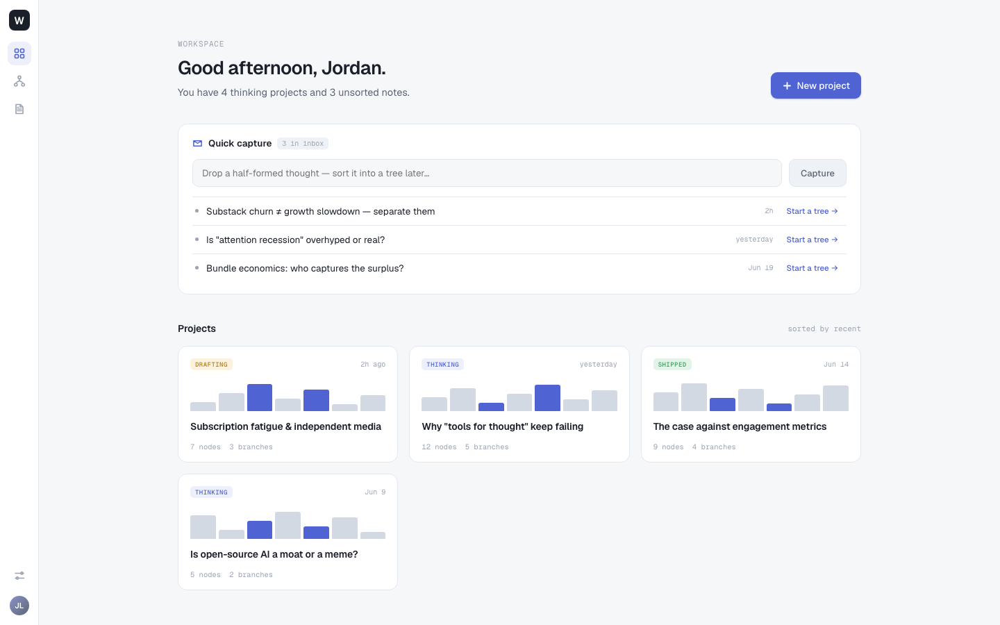
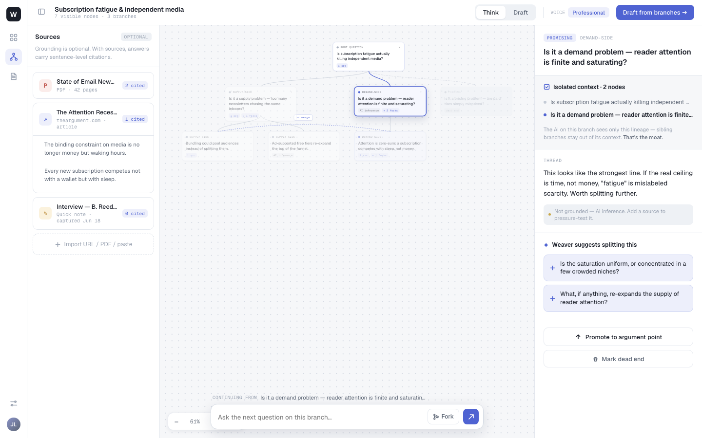
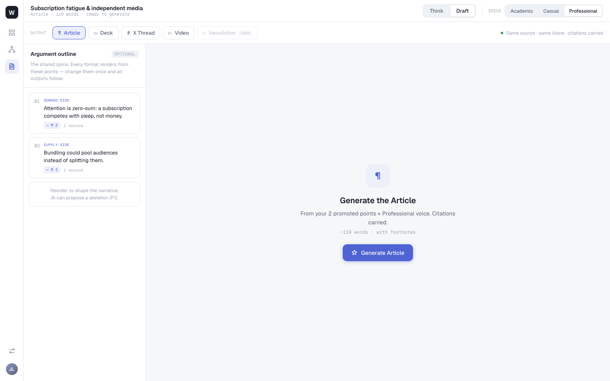
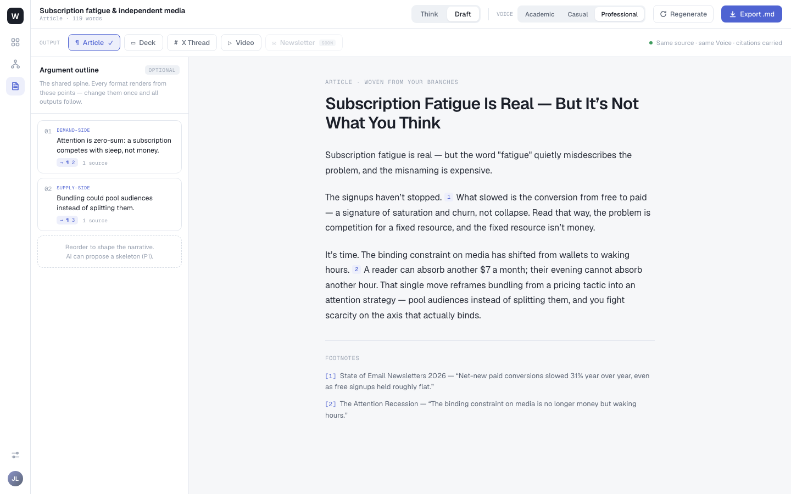
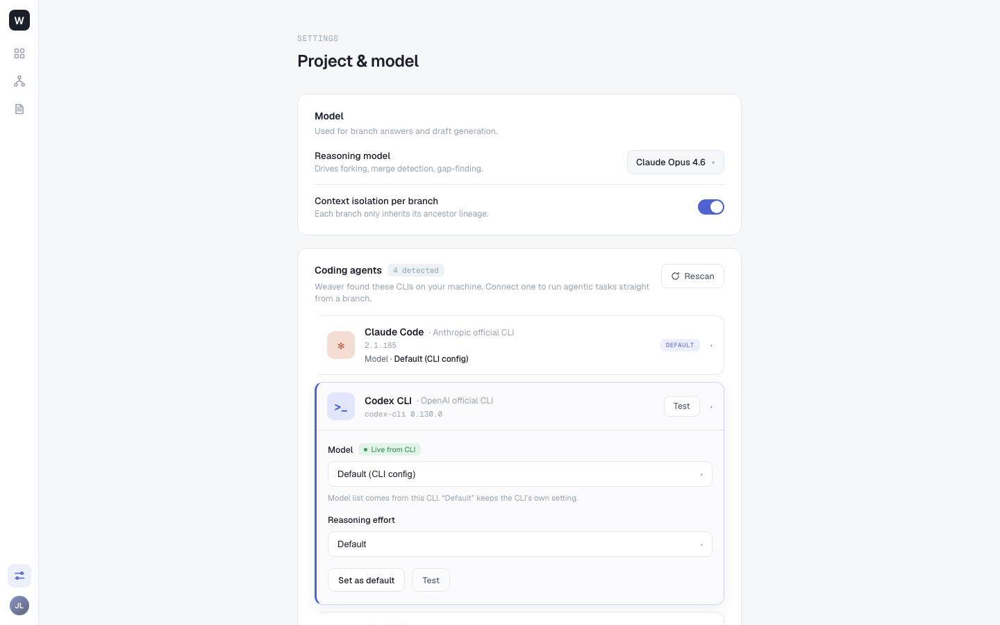

# Weaver Next — Page Design Spec

> **Source of design truth:** [`../../weaver.html`](../../weaver.html) — the bundled interactive prototype, rendered and captured screen-by-screen (see [§ How these were captured](#how-these-screenshots-were-captured)). Screenshots live in [`screens/`](screens/).
> **Pairs with:** the frontend architecture in [`../architecture/04-frontend-and-tree-rendering.md`](../architecture/04-frontend-and-tree-rendering.md) (the *how* — D3 layout, state split, contracts) and the backlog in [`../implementation-plan.md`](../implementation-plan.md) (the *what* — epics/stories). This doc is the *look & behaviour* layer that the 🎨 Frontend cards build to.
> **Status:** Draft v1 (2026-06-22), extracted from the prototype. Where the prototype shows P1/P2 surface (multi-format, coding agents), it is labelled.

The prototype resolves the PRD's "5 pages" into **four routed screens behind one app shell**, plus Sources realized as a panel (not its own page):

| # | Screen | Route (nav) | Primary epic | Prototype screen |
|---|--------|-------------|--------------|------------------|
| 1 | **Workspace** (Dashboard) | rail · grid icon / logo | E1 | `screens/00-workspace.png` |
| 2 | **Thinking Tree** | rail · fork icon → a project, `Think` tab | E2 (+E3 sources panel) | `screens/01-think.png` |
| 3 | **Draft** | `Draft` tab within a project | E4 / E5 (+E9 multi-format) | `screens/02-draft-deck.png`, `03-draft-article.png`, `04-draft-generated.png` |
| 4 | **Settings** | rail · sliders icon (bottom) | E12 | `screens/05-settings.png` |
| 5 | **Sources** | left panel of Thinking Tree; full reading view is P1 | E3 (+E8) | (panel in `01-think.png`) |

---

## Global shell & design system

### App shell — the left rail

A fixed, dark, ~56px vertical rail is present on every screen:

- **Top:** `W` logo (white glyph on a near-black rounded square) — also navigates to Workspace.
- **Nav icons** (muted grey; **active = indigo glyph on a pale-indigo tile**):
  1. ▦ grid → **Workspace**
  2. ⛕ fork/branch → **Thinking Tree** (current project)
  3. ▢ document → **Draft** (current project)
- **Bottom:** ⚙ sliders → **Settings**; circular **avatar** (`JL`, indigo) → account.

The rail is the only persistent chrome. Each screen owns its own top bar.

### Design tokens (observed from the prototype)

| Token | Value (approx.) | Used for |
|-------|-----------------|----------|
| `--bg-app` | `#f6f7f8` very light grey | page background |
| `--bg-surface` | `#ffffff` | cards, panels |
| `--bg-rail` | `#1b1c1f` near-black | left rail |
| `--border` | `#ececf0` hairline | card/panel borders, dividers |
| `--accent` | indigo `#4f46e5`→`#5b5be6` | primary buttons, active tab, toggle-on, selected node, links, citation marks, active rail icon |
| `--accent-tint` | pale indigo `#eef0fe` | active icon tile, branch-tag text bg |
| `--text` | `#16181d` | headings/body |
| `--text-muted` | `#5d6675` | secondary/help text, eyebrows |
| radius | `8px` controls · `12–14px` cards | — |
| elevation | soft, low-spread shadow | project cards, primary buttons, popovers |

**Status / semantic colours:** `DRAFTING` amber · `THINKING` indigo-tint · `SHIPPED` green · `● Live from CLI` green dot.

### Typography — the sans/mono split (load: **Geist** + **Geist Mono**)

- **Geist (sans)** — UI and headings. Page titles are bold ~28px ("Good afternoon, Jordan.", "Project & model").
- **Geist Mono** — every *label/metadata* token: eyebrows (`WORKSPACE`, `OUTPUT`, `SETTINGS`), pills (`OPTIONAL`, `DEFAULT`, `4 detected`, `3 in inbox`), counts (`7 nodes · 3 branches`), timestamps (`2h`, `Jun 19`), versions (`2.1.185`), chips (`→ Slide 3`, `1 source`, `~119 words · with footnotes`), and **branch tags** (`ROOT QUESTION`, `SUPPLY-SIDE`, `DEMAND-SIDE`, `PRICING`).
- **Reading view** (generated article body) uses comfortable long-form type with a clear measure (~60–70ch), larger line-height, and superscript citation marks.

> Rule of thumb for implementers: **if it's a machine fact (a count, a state, an id, a label), it's Geist Mono; if it's human prose, it's Geist.** This single rule reproduces ~90% of the prototype's texture.

### Shared components (build once, reuse everywhere)

- **Button**: primary (indigo, white text, soft shadow), secondary/ghost (white, hairline border — `Test`, `Rescan`, `Regenerate`, `Capture`), with optional leading glyph (`+`, `✦`, `⤓`).
- **Segmented control**: `Think | Draft` tab, `Academic | Casual | Professional` voice, `Article | Deck | X Thread | Video | Newsletter`.
- **Badge/pill**: status badge (semantic colour) and neutral mono pill.
- **Card**: white surface, hairline border, 12–14px radius (project card, source row, outline point, settings group, agent row).
- **Toggle**: pill switch, indigo when on (`Context isolation per branch`).
- **Dropdown/select**: bordered, mono value + caret (`Claude Opus 4.6 ▾`, `Default (CLI config) ▾`).
- **Eyebrow + title + subtitle** header block (every full-page screen).

---

## 1 · Workspace (Dashboard) — epic E1

**Purpose:** the home; start/return to work and capture loose thoughts. **Route:** rail grid icon / logo.

**Layout** — centered single column (~980px) on `--bg-app`:

1. **Header** — eyebrow `WORKSPACE`, title `Good afternoon, {name}.`, subtitle `You have {N} thinking projects and {M} unsorted notes.`; **`+ New project`** primary button top-right.
2. **Quick capture** card — ✉ icon + `Quick capture` + `{n} in inbox` pill; text input *"Drop a half-formed thought — sort it into a tree later…"* + **`Capture`** button; then the inbox list — each row: bullet + note text + right-aligned mono timestamp + **`Start a tree →`** link.
3. **Projects** — section title `Projects` + `sorted by recent`; responsive **card grid** (3-up). Each project card:
   - status badge (`DRAFTING`/`THINKING`/`SHIPPED`) + mono timestamp
   - a **sparkline preview of the tree** (bar glyphs, some indigo — a glanceable shape of the thinking)
   - project title
   - footer `{n} nodes · {m} branches`

**Interactions:** New project → creates project, opens its Thinking Tree. Capture → appends a QuickNote to inbox. `Start a tree →` → promotes a QuickNote into a new project's root node. Project card → opens its Thinking Tree.

**Data → API:** `GET /projects` (`ProjectSummary[]` incl. `node_count`, branch count, status, `updated_at`), `GET /quicknotes?unfiled=true`, `POST /projects`, `POST /quicknotes`, `POST /quicknotes/{id}/promote`.
**Builds:** E1.2 (project list/new), E1.3 (quick-capture inbox + promote). The sparkline is a small derived tree-shape preview (P1 polish — flag if descoped for MVP).

---

## 2 · Thinking Tree — epic E2 (the moat) + E3 (sources)

**Purpose:** the product's heart — branch-think on a canvas where every branch keeps its own context. **Route:** project → `Think` tab.

**Layout** — three panels under a project top bar:

- **Top bar:** project title + mono subtitle `{N} visible nodes · {M} branches`; **`Think | Draft`** segmented tab (Think active); `VOICE {tone}` indicator; **`Draft from branches →`** primary button (jump to Draft seeded by selection).
- **Left panel — `Sources` (`OPTIONAL`)**: helper *"Grounding is optional. With sources, answers carry sentence-level citations."*; source rows, each: type glyph (`P` pdf / `↗` url / `✎` note), title, mono meta (`PDF · 42 pages`, `theargument.com · article`, `Quick note · captured Jun 18`), and a **`{n} cited`** count; **`Import URL / PDF / paste`** affordance; a `⟿ merge` control.
- **Center — the tree canvas**: auto-laid-out nodes connected by edges; **branch-column tags** in indigo mono (`ROOT QUESTION`, `SUPPLY-SIDE`, `DEMAND-SIDE`, `PRICING`) with `▾` fold carets; each node shows a one-line gist + `{n} src` + markers (`✦ {n} forks`, `promising`); the focused node is highlighted (indigo), off-path dimmed. **Bottom-left zoom controls** (`▾ − + Fit`). **Bottom-center composer**: *"Ask the next question on this branch…"* input + **`Think`** button (extends the focused branch).
- **Right panel — node detail**: the focused node's full Q&A; `{n} cited` sources inline; reasoning / sub-questions; actions **`Promote to argument point`** and **`Mark dead end`**.

**States to design:** node `open` / `promising` (✦) / `dead_end` (greyed + collapsed); folded (one-line) vs expanded (full Q&A + citations); AI-proposed-fork strip ("N directions worth thinking about separately" → one-click Accept); the early **"Reading your N branches"** signal in the composer (from the first `progress` SSE frame); citation chip → jump-to-source popover.

**Data → API:** `GET /projects/{id}/nodes` (`ForestView`), `POST /nodes/{id}/think` (SSE), `POST /nodes/{id}/fork`(+`/fork/propose`), `/backtrack`, `/prune`, `PATCH /nodes/{id}` (fold), `POST /branches/{id}/promote`; sources via `POST /projects/{id}/sources`, citations on node answers when grounded.
**Builds:** E2.10–E2.20 (tree ops, streaming think, D3 render), E2.17 (AI forks), E2.19 ("Reading your N branches"), E3.2/E3.3/E3.8/E3.10 (sources panel + citation chips + progress).

---

## 3 · Draft — epic E4 / E5 (+ E9 multi-format)

The Draft screen has a **pre-generate** and a **generated** state, and a format switcher.

### 3a · Pre-generate (Article = MVP default)

- **Top bar:** project title + mono subtitle `{Format} · {meta} · ready to generate`; `Think | Draft` tab (Draft active); **`VOICE` segmented `Academic | Casual | Professional`** (drives the draft, not chat).
- **Output row:** eyebrow `OUTPUT` + format tabs **`Article` (MVP) · `Deck` · `X Thread` · `Video` · `Newsletter (SOON)`**; right-aligned promise **`● Same source · same Voice · citations carried`** — the anti-NotebookLM theme-consistency guarantee.
- **Left panel — `Argument outline` (`OPTIONAL`)**: helper *"The shared spine. Every format renders from these points — change them once and all outputs follow."*; ordered outline points, each: number, branch tag (`DEMAND-SIDE`), claim text, target chip (`→ ¶ 2` for Article / `→ Slide 3` for Deck) + `{n} source`; a dashed slot *"Reorder to shape the narrative. AI can propose a skeleton (P1)."*
- **Center — generate empty-state:** format glyph, `Generate the {Format}`, *"From your {n} promoted points + {Voice} voice. Citations carried."*, mono meta (`~119 words · with footnotes` / `5 slides · 16:9 · speaker notes`), **`✦ Generate {Format}`** primary button.

### 3b · Generated (Article)

- Top bar gains **`⟲ Regenerate`** + **`⤓ Export .md`**; the active format tab shows a ✓.
- **Center — long-form reading/edit view:** eyebrow `ARTICLE · WOVEN FROM YOUR BRANCHES`; generated title; body paragraphs in reading type with **inline superscript citation marks** (`¹ ²`); a **`FOOTNOTES`** block listing each citation as `[n] {Source} — "{quote}"` (sentence-level, deep-linkable). Outline panel's chips now point at paragraphs (`→ ¶ 2/3`).

**Interactions:** pick format → re-renders from the same outline/branches; pick Voice → changes register (Generate/Regenerate to apply); Generate → streams the draft; citation mark → jump to source; `Export .md` → download citation-preserving Markdown; Regenerate → re-run.

**Data → API:** `POST /projects/{id}/drafts` (`DraftGenerateRequest` — `outline_id` XOR `source_branch_node_ids`, `voice`, `format`; SSE), `GET/PATCH /drafts/{id}`, `POST /drafts/{id}/exports` + `GET /exports/{id}/download`; multi-format via `POST /drafts/{id}/artifacts`.
**Builds:** E4.3 (draft direct from branches), E4.4 (via outline), E4.5 (Voice→draft), E4.6 (citations carried → footnotes), E4.1/E4.2 (promote/reorder outline), E5.1 (Export .md). Format tabs beyond Article + paragraph-ops are **E9 (P1)**; `Newsletter (SOON)` is explicitly future.

---

## 4 · Settings — epic E12

**Purpose:** configure models, local coding-agent backends, and the moat. **Route:** rail sliders icon.

**Layout** — centered column; eyebrow `SETTINGS`, title `Project & model`; stacked setting-group cards:

1. **Model** card — *"Used for branch answers and draft generation."*
   - **Reasoning model** + *"Drives forking, merge detection, gap-finding."* + dropdown (`Claude Opus 4.6 ▾`).
   - **Context isolation per branch** + *"Each branch only inherits its ancestor lineage."* + **toggle (ON)** — the moat surfaced as a switch.
2. **Coding agents** card — title + `{n} detected` pill + **`Rescan`**; *"Weaver found these CLIs on your machine. Connect one to run agentic tasks straight from a branch."* Then one **agent row per detected CLI**:
   - icon, **name** + `· {vendor} official CLI`, mono version (`2.1.185`, `codex-cli 0.130.0`), `Model · {selection}`, and either a `DEFAULT` badge or **`Test`** + caret.
   - **expanded agent** (selected, indigo border): `Model` + `● Live from CLI`, model dropdown (`Default (CLI config)`) with helper *"Model list comes from this CLI. 'Default' keeps the CLI's own setting."*, **`Reasoning effort`** dropdown, and **`Set as default`** + **`Test`** buttons.
   - Detected in the prototype: **Claude Code** (Anthropic), **Codex CLI** (OpenAI), Gemini CLI (Google), OpenCode — plus per-agent permission switches (`Auto-run read-only commands` / `Allow file edits` / `Network access`) below the fold.

**Data → API:** `GET/POST/PATCH/DELETE /backends`, `POST /backends/{id}/health` (Test), `PATCH /backends/{id} {is_default}` (Set as default), project `default_backend_id` + `voice_default`; the isolation toggle is informational (always-on, pure-service guarantee).
**Builds:** E12.1 (backend CRUD, secret-by-ref), E12.2 (permission toggles), E12.3 (default backend), E12.4 (test-connection), E12.5 (Voice presets). Maps the model-integration decision: **API SDK models + local CLI agents behind one provider abstraction.**

---

## 5 · Sources — epic E3 (panel) + E8 (full reading view, P1)

In the prototype, **Sources is the left panel of the Thinking Tree** (see §2), not a standalone page — consistent with "sources are optional grounding." The MVP scope is: add (paste / URL / PDF), list with type + meta + `{n} cited`, and click a citation chip to **jump to the original span**.

A **full-screen reading view** (highlight passages → "send to tree" as start nodes; in-source navigation) is **P1** — backlog **E8.3** (highlight→node) and **E8.1/E8.2/E8.4** (browser capture, transcription, large-doc). Design it as a two-pane reading surface reusing the citation/jump-to-source mechanics already built for the tree.

---

## Mapping to the backlog

| Screen | MVP stories | P1/P2 surface |
|--------|-------------|----------------|
| Workspace | E1.2, E1.3 | sparkline polish |
| Thinking Tree | E2.10–E2.21, E3.2/E3.3/E3.8/E3.10 | E7 (compare/relations/merge), E8 (capture) |
| Draft | E4.1–E4.7, E5.1 | E9 (Deck/Thread/Video/Newsletter, para-ops, PNG/SVG/DOCX) |
| Settings | E12.1–E12.5 | extra providers (E10.4) |
| Sources | E3.* (panel) | E8.* (reading view, transcription, big docs) |

---

## How these screenshots were captured

The prototype is a runtime-decompressed bundle using Shadow DOM, so it must be **rendered** to inspect:

1. Serve the file: `python3 -m http.server 8137` in the repo root (over `http://` so the bundle's `fetch` works — `file://` breaks it).
2. Drive with Playwright (Chromium, 1440×900), wait ~3.5s for decompress+render, then navigate via the left rail icons and `Think`/`Draft`/format/`Voice` controls, screenshotting each state. Scripts used: `/tmp/pw/*.mjs` (throwaway).
3. Canonical captures copied into [`screens/`](screens/).

To re-capture after the prototype changes, repeat with the same viewport and the navigation map in the table at the top of this doc.
