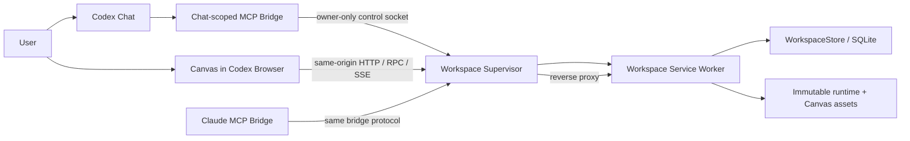

# Weaver Localhost Canvas Runtime PRD

> Status: Approved; implementation in progress
> Decision date: 2026-07-13
> Scope: Replace the full Codex Apps-SDK Canvas Widget with one localhost Canvas application while retaining MCP as the trusted Chat and Agent bridge.

> Implementation status: Phases 0-6 are implemented and automated acceptance is green.
> Phase 7 remains in its required observation window; Phase 8 is intentionally pending.
> See [localhost-canvas-runtime-status.md](localhost-canvas-runtime-status.md) for the
> dated incomplete-item checklist and evidence log.
> Supersedes on approval: the native-Widget and browser-preview boundaries in `product.md`, `AGENTS.md`, `docs/PRD-Weaver-Redesign-2026.md`, and `docs/architecture-current.md`.

## 1. Executive decision

Weaver will become a Codex-driven localhost application.

- The formal Canvas UI is one browser application served by a workspace-scoped local runtime.
- Codex's in-app Browser is the preferred container. A system browser is a fallback.
- Codex Chat remains the only natural-language Agent entry point.
- MCP remains responsible for trusted Chat identity, model-facing tools, AgentTask orchestration, and pairing a Chat with a Canvas.
- The workspace service becomes the sole runtime owner of SQLite, browser RPC, SSE, browser sessions, and static Canvas assets.
- A lightweight workspace supervisor keeps a stable loopback origin while workers restart or upgrade.
- Manual Canvas editing remains available without an online Chat. Agent writes fail closed unless the current browser Canvas is paired to an online Chat binding.
- Production and Playwright use the same localhost page, RPC, SSE, and SQLite path.

This is a comprehensive architecture migration, not a cosmetic change to where the existing Widget is rendered.

## 2. Problem statement

The current native Widget path is unreliable and expensive to verify:

1. The Apps-SDK resource can fail before Weaver business code runs because the host owns resource mounting, display-mode requests, iframe lifecycle, and the tool-call proxy.
2. The Canvas currently contains host-specific `codex`, `claude`, and `dev` branches, so a passing localhost E2E does not prove the Codex Widget path.
3. Loopback HTTP, RPC, SSE, widget bundle serving, WorkspaceStore access, and MCP tool registration are coupled in `packages/mcp` and live inside a Chat-scoped process.
4. The current preview identity is derived from the MCP launch `cwd`, not from an exact Chat pairing. That makes the preview work as a host-wide synthetic binding but does not satisfy the agreed one-Chat/one-Canvas pairing model.
5. The current stable port and token are tied to the plugin process launch directory. They are not workspace-owned and can drift across plugin cache copies.
6. The existing E2E already proves a real localhost path, but it starts the Claude-flavored MCP process and consumes `previewUrl`; it does not exercise an independent workspace service, worker recovery, pairing, or single-project write ownership.
7. `WorkspaceStore` currently treats every `PRAGMA user_version` mismatch as incompatible: it renames the entire `.weaver` directory and creates a new empty store. Adding browser-session schema under that policy would violate the agreed no-business-data-rebuild requirement.

## 3. Goals

### 3.1 User goals

- Opening Weaver reliably puts the requested Project in the Codex right-side Browser.
- The Canvas remains usable for manual edits when Chat or MCP disconnects.
- Refresh, worker restart, and plugin update do not lose Project, View, layout, viewport, selection, or manual work.
- Duplicate tabs cannot silently produce concurrent writers for one Project.
- Failures expose a stage, error code, Project/View/Session/build context, and a recovery action instead of infinite Loading.

### 3.2 Engineering goals

- One production Canvas codepath across Codex, Claude, manual browser use, and Playwright.
- One workspace service owns WorkspaceStore and ProjectEvent publication.
- Exact Chat identity remains inside the MCP bridge; the browser never asserts a Chat identity.
- All browser and Agent writes reuse validated contracts, revision checks, transactions, event audit, and undo/revert semantics.
- Core localhost E2E becomes a required PR gate.
- Runtime binaries and Canvas assets do not depend on the lifetime of a Codex plugin cache directory.
- Existing business data upgrades in place with transactionally tested migrations.

## 4. Non-goals

- No LAN binding, remote-device access, tunnel mode, or collaborative multi-user editing.
- No browser chat box or browser-owned model invocation.
- No second semantic graph, alternate storage backend, or direct SQLite access from the UI.
- No multi-writer support for the same Project in the first release.
- No launchd service or global always-on multi-workspace daemon.
- No rewrite of the Canvas renderer, Graph/Layout model, Scene Packs, templates, or Agent tool semantics.
- No long-term maintenance of both a full native Widget and a full localhost UI.

## 5. Success criteria

### 5.1 Open and recovery SLOs

Measured on the supported local macOS baseline after dependencies are installed:

| Path | Initial target | Failure behavior |
|---|---:|---|
| Reuse healthy workspace runtime | launch handle within 2 s | stage-specific error |
| Cold workspace runtime start | healthy within 5 s | `SERVICE_START_FAILED` or `BUILD_MISMATCH` |
| In-app Browser navigation through Canvas bootstrap | within 10 s | `BROWSER_NAVIGATION_FAILED`, `PAIRING_EXPIRED`, or `CANVAS_BOOTSTRAP_FAILED` |
| Worker restart with supervisor alive | authoritative Canvas recovered within 5 s | visible reconnect/error state |
| SSE gap recovery | authoritative revisions restored within 5 s | visible `STREAM_RECOVERY_FAILED` |

The values are baselines to tune with measured evidence. The stage boundaries and finite timeouts are normative.

### 5.2 Functional acceptance

- A user can open, manually edit, refresh, disconnect Chat, continue editing, reconnect, and invoke an Agent without recreating the Project.
- A second tab for the same Project is read-only until explicit takeover; takeover detaches the former writer and cancels its non-terminal Agent work.
- A worker can be killed during an open Canvas session; the supervisor restarts it and the page recovers without another `weaver_open_space` call.
- A new bridge connecting to an old runtime never runs a mixed protocol/build combination.
- Existing Graph, View, Layout, ChangeSet, Artifact, Asset, and revision data survive an upgrade byte-for-byte or semantically equivalently as specified by migration fixtures.
- No new browser console errors occur in the tested flows.

### 5.3 Test acceptance

- Core real localhost E2E runs on every PR with real RPC, SSE, SQLite, and browser writes.
- No E2E route interception or mock is allowed for application RPC, SSE, WorkspaceStore, or write operations.
- Nightly tests cover all View families, larger graphs, prolonged reconnects, worker crash loops, and performance.
- Codex in-app Browser and Claude each receive a release smoke, but host-container smoke does not substitute for core E2E.

## 6. Current implementation facts to preserve or change

### 6.1 Reuse

- Reuse the Canvas application, PixiJS hybrid renderer, hooks, direct-manipulation operations, and existing real browser E2E behavior.
- Reuse `WorkspaceStore`, typed Graph/Layout operations, ChangeSet, LayoutRun, ProjectEvent, revision guards, Canvas context, and Task guards.
- Reuse the current build-pinned asset concept and `widget.reload` development behavior, renamed to host-neutral Canvas terms.
- Reuse the loopback allowlist principle and workspace path confinement.
- Reuse the current redaction rules and bounded log rotation implementation after moving it to the workspace runtime.

### 6.2 Replace

- Replace `ui://` resource mounting and `openai/outputTemplate` Canvas rendering.
- Replace process/cwd-derived preview identity with bridge-issued, exact Chat pairing.
- Replace the global preview capability token with browser sessions, one-time launch nonces, and an owner-only bridge control channel.
- Replace `Access-Control-Allow-Origin: *` with one same-origin Canvas application and strict origin checks.
- Replace MCP-process-owned HTTP/SSE/WorkspaceStore with a workspace worker.
- Replace destructive schema-version reset for supported migrations with incremental migrations.
- Replace host-name inference in `host-mode.ts` with capabilities returned by workspace bootstrap.

## 7. Options considered

| Option | Description | Advantages | Disadvantages | Decision |
|---|---|---|---|---|
| A. Promote current preview inside MCP | Return the existing `/preview` URL for Codex and open it in the in-app Browser | Smallest diff; existing E2E mostly applies | Still Chat-process-owned; cwd identity; no independent recovery; plugin cache coupling | Rejected |
| B. Split a workspace HTTP service but keep no supervisor/runtime cache | Browser and MCP share a service process started by the bridge | Better testability and separation | Browser dies with service; no crash recovery without Chat; updates can delete lazy assets | Rejected |
| C. Workspace supervisor + worker + immutable runtime | Stable workspace origin, exact pairing, independent worker, one Canvas app | Meets reliability, recovery, testing, and version goals | Largest migration; requires new lifecycle and migration tests | Selected |

## 8. Target architecture



### 8.1 Runtime ownership

| Concern | Authority |
|---|---|
| Raw Codex thread metadata | MCP bridge only |
| Hashed Chat identity and Chat binding | WorkspaceStore, written through bridge-authenticated control calls |
| Public loopback port | Supervisor |
| Worker lifecycle/build selection | Supervisor |
| Graph/Layout/View/Task/ProjectEvent | Workspace service worker + WorkspaceStore |
| Browser access and refresh credentials | Workspace service worker |
| Project write ownership | Workspace service worker |
| Canvas rendering and transient interaction | Browser Canvas |
| Natural-language Agent loop | Codex/Claude bridge |

### 8.2 Process model

The supervisor is workspace-scoped and on-demand.

- It owns one `127.0.0.1` listener with an ephemeral port for the lifetime of the workspace runtime.
- It publishes an owner-only descriptor under `~/.weaver/workspaces/<workspaceKey>/runtime.json` and an owner-only control socket under the short macOS-safe path `~/.weaver/sockets/<workspaceKey-prefix>.sock`; when a configured runtime root would exceed the macOS Unix-socket path limit, the socket uses an owner-only per-UID directory under the system temporary directory. The descriptor records only the socket basename.
- `workspaceKey = sha256(realpath(workspaceDir))`; the raw path is not part of the directory name or diagnostics.
- The descriptor contains protocol version, build ID, supervisor PID, public port, control-socket name, state, and timestamps. It contains no browser credential, launch nonce, Chat identifier, or raw workspace path.
- The supervisor starts one worker from `~/.weaver/runtimes/<buildId>/` and reverse-proxies Canvas HTTP, RPC, SSE, and assets to it.
- Worker failure leaves the public origin alive. The supervisor serves a bounded reconnect response, restarts the worker, and resumes proxying.
- Browser or bridge heartbeats keep the runtime alive. When neither exists for the configured idle period, supervisor and worker exit and remove the descriptor/socket atomically.
- Supervisor failure is the recovery ceiling: the next `weaver_open_space` recreates it. No OS-level infinite-restart promise is made.

Initial lifecycle defaults:

- browser and bridge heartbeat: 5 seconds
- online grace window: 30 seconds
- runtime idle shutdown: 10 minutes after no browser and no bridge remain online
- worker crash circuit breaker: 5 crashes in 60 seconds; then serve `SERVICE_START_FAILED` until an explicit retry or a new build
- restart backoff: 250 ms, 1 second, 3 seconds, then capped at 5 seconds inside the circuit-breaker window

### 8.3 Immutable runtime cache

`~/.weaver/runtimes/<buildId>/` contains only executable JS, manifests, and Canvas assets.

- Installation copies from the active plugin or development build into a temporary sibling directory.
- Every file is verified against a release manifest before atomic rename.
- A running build is immutable and never overwritten.
- A new bridge may install a new build, ask the old supervisor to quiesce writes, start the candidate worker, validate health/protocol/schema, then atomically switch.
- Old builds remain until no descriptor references them. Cleanup is bounded by size and last-used age.
- No Project data, prompt, Graph content, or browser credential is stored in the runtime cache.

Initial cache policy keeps every referenced build plus the two most recent unreferenced builds, with a 1 GiB soft cap. Cleanup never deletes a build referenced by a live descriptor and runs only after a successful runtime start or explicit cleanup command.

### 8.4 Bridge control plane

The MCP bridge communicates with the supervisor through the owner-only Unix socket, not through browser RPC.

Required control operations:

```ts
type RuntimeControlRequest =
  | { kind: "ensure_runtime"; workspaceKey: string; requestedBuildId: string; protocolVersion: number }
  | { kind: "create_launch"; chatSessionKey: string; projectId?: string; requestedViewId?: string }
  | { kind: "read_binding"; chatSessionKey: string }
  | { kind: "dispatch_agent_operation"; chatSessionKey: string; tool: string; arguments: unknown }
  | { kind: "get_diagnostics"; errorsOnly?: boolean; limit?: number }
  | { kind: "shutdown_if_idle" };
```

The worker validates every request. A socket connection is not sufficient authorization for a write: Chat-bound Agent operations still validate `chatSessionKey`, binding revision, Canvas session, online presence, Task identity, and base revisions.

### 8.5 Browser launch and pairing

`weaver_open_space` becomes a plain model-facing MCP tool and no longer declares a full Apps-SDK output resource.

1. The bridge derives `chatSessionKey` from trusted request metadata and verifies direct/nested Codex thread metadata agree.
2. The bridge ensures the workspace runtime and requested build.
3. The worker opens or updates the Chat binding and creates a cryptographically random launch nonce.
4. The nonce is scoped to workspace, hashed Chat identity, Project, optional View, and a 30-second expiry. Only its hash is retained.
5. The tool returns `launchUrl`, `expiresAt`, `projectId`, `viewId`, `buildId`, and `protocolVersion`. The URL may appear in the Codex tool trace but must not be repeated in assistant prose or diagnostics.
6. `weaver-open-space` uses the Codex in-app Browser: claim the existing Weaver tab when available, otherwise create one, navigate to `launchUrl`, wait for a successful Canvas bootstrap, make the Browser visible, and keep the tab as the user deliverable.
7. The launch route consumes the nonce once, creates or restores a Browser Session, sets a secure local session cookie, and redirects to a nonce-free Canvas URL.
8. Claude uses the same launch contract and opens a system browser or returns the short-lived link when automatic opening fails.

The MCP tool reports launch creation. The skill-level workflow reports the end-to-end result only after browser bootstrap is observed.

### 8.6 Browser sessions and Project writer lease

Add durable, host-neutral browser session state:

```ts
type BrowserSession = {
  id: string;
  credentialHash: string;
  credentialVersion: number;
  status: "active" | "detached" | "expired";
  pairedChatSessionKey?: string;
  pairedBindingRevision?: number;
  createdAt: string;
  lastSeenAt: string;
  expiresAt: string;
};

type ProjectWriteLease = {
  projectId: string;
  browserSessionId: string;
  revision: number;
  status: "active" | "released";
  lastSeenAt: string;
};
```

- Raw refresh credentials live only in an HttpOnly, SameSite=Strict cookie. SQLite stores a slow/hash-safe digest and rotation version.
- Refresh rotates the credential. Replay of an older version invalidates the session and requires a new launch.
- Browser Sessions expire after 30 days without activity. Expiry is extended only by a valid refresh, not by unauthenticated page loads.
- A Browser Session can edit manually without `pairedChatSessionKey`.
- Agent eligibility requires an online paired Chat binding whose binding revision and Canvas session match.
- One Project has one active ProjectWriteLease. A second Browser Session is read-only until explicit takeover.
- Takeover is transactional: increment lease revision, detach the former writer, cancel its non-terminal tasks and pending reviews, append a binding/session event, and grant the new writer.
- Different Projects may have independent writers in different tabs.
- Viewport, selection, and focused node remain Canvas-session/View state, not Project-global state.

### 8.7 RPC and event surface

The Canvas is same-origin with the supervisor. Target routes:

| Route | Purpose | Authentication |
|---|---|---|
| `GET /launch/:nonce` | consume one-time launch and set session | nonce, once |
| `GET /app/*` | Canvas shell and immutable assets | browser session for app bootstrap; public shell may only show pairing state |
| `GET /api/bootstrap` | capability, binding, Project/View and build bootstrap | browser session |
| `POST /api/rpc` | allowlisted Canvas query/command operations | browser session + writer lease for writes |
| `GET /events` | Project/session SSE with sequence recovery | browser session |
| `POST /api/session/refresh` | rotate browser credential | refresh cookie |
| `POST /api/session/takeover` | claim Project writer lease | browser session + explicit user action |
| `GET /healthz` | supervisor/worker/build readiness | loopback; no sensitive fields |

The old `/mcp-rpc` name may remain as a temporary alias during migration, but the final browser endpoint is application RPC and must not depend on MCP tool registration internals.

Project events continue to carry durable sequence numbers. Session/binding events are filtered so one Chat or Canvas cannot observe another session's private Task/binding details. A sequence gap or revision lag triggers an authoritative Graph/Layout/View/bootstrap read.

### 8.8 Manual mutation audit, idempotency, and undo

Manual browser intent applies immediately, but it is not an unaudited shortcut.

Every mutating Canvas RPC carries:

```ts
type CanvasMutationRequest = {
  mutationId: string; // caller-generated idempotency key
  projectId: string;
  viewId?: string;
  writerLeaseRevision: number;
  baseGraphRevision?: number;
  baseLayoutRevision?: number;
  baseViewCatalogRevision?: number;
  operation: unknown; // discriminated and validated by contracts
};
```

The worker persists a mutation record in the same transaction as the state and ProjectEvent changes:

```ts
type CanvasMutationRecord = {
  id: string;
  projectId: string;
  viewId?: string;
  browserSessionId: string;
  kind: "graph" | "layout" | "view" | "mixed";
  baseGraphRevision?: number;
  resultGraphRevision?: number;
  baseLayoutRevision?: number;
  resultLayoutRevision?: number;
  baseViewCatalogRevision?: number;
  resultViewCatalogRevision?: number;
  forwardOperations: unknown[];
  inverseOperations: unknown[];
  status: "applied" | "reverted";
  createdAt: string;
  revertedAt?: string;
};
```

- Repeating `mutationId` returns the original result without applying a second write.
- The Browser Session must own the current ProjectWriteLease revision.
- Content mutations validate and increment only `graphRevision`; layout mutations validate and increment only the target `layoutRevision`; View catalog mutations increment only `viewCatalogRevision`.
- Undo applies the stored inverse operations only when their expected current revisions still match. A conflict returns `UNDO_REVISION_CONFLICT` and never overwrites newer work.
- Manual mutations do not create fake AgentTasks and do not enter Agent review. Their audit authority is `CanvasMutationRecord` plus the transactionally appended ProjectEvent.
- Agent-originated ChangeSets and LayoutRuns retain their existing review/revert records. Both audit paths share the same underlying validated Graph/Layout operations.
- Records contain semantic user content only when required to make the operation reversible; credentials, raw Chat identity, and absolute paths are forbidden.

### 8.9 Transport-independent application operations

The current loopback dispatcher captures MCP registrations and invokes handlers with empty metadata. The target removes that inversion.

- Move storage-backed operation bodies into `packages/workspace-service/src/operations/` grouped by catalog, graph, layout, session, task, review, asset, and artifact.
- Canvas RPC adapters call these operations with a validated Browser principal.
- MCP tool handlers become thin bridge adapters that call the workspace service with a validated Chat principal.
- Zod schemas and shared result types remain in `packages/contracts`.
- Operation functions receive explicit principals and never infer identity from process environment or request payload.
- `packages/core` remains IO-free. `packages/storage` remains persistence-focused and does not import HTTP or MCP.

This migration can proceed tool family by tool family, but a family must not have two divergent business implementations.

### 8.10 Capability model

Bootstrap returns explicit capabilities instead of `host-mode.ts` inference:

```ts
type CanvasCapabilities = {
  manualWrite: boolean;
  agentConnected: boolean;
  agentWrite: boolean;
  canTakeOver: boolean;
  hostLabel?: "Codex" | "Claude";
  disconnectReason?: string;
};
```

Expected visible states:

- `Local editing · Agent disconnected`
- `Connected to this Codex chat`
- `Connected to this Claude session`
- `Read only · Project open in another tab`
- `Detached · Session taken over`
- stage-specific service/build/pairing/bootstrap errors

No hostname or query parameter may upgrade Agent capability.

## 9. Security requirements

- Bind only `127.0.0.1`; do not bind `0.0.0.0` or expose a remote flag.
- Validate `Host` against the runtime's exact origin and reject DNS rebinding patterns.
- Use a same-origin Canvas; do not emit wildcard CORS.
- Validate Origin for state-changing requests and require a CSRF token bound to the Browser Session.
- Use HttpOnly and SameSite=Strict cookies; use Secure when the platform later supports trusted local HTTPS.
- Never accept `workspaceDir`, Chat identity, or agent eligibility from browser RPC.
- Realpath and pin the workspace during supervisor creation. All assets and files remain within project/workspace confinement.
- Redact token, cookie, nonce, lease, credential, raw thread ID, prompt, content, and absolute path fields from diagnostics.
- A launch nonce is not a durable credential and cannot refresh a session.
- Browser RPC exposes a minimal allowlist. Agent-only operations remain unreachable from an unpaired browser principal.
- Asset responses use `nosniff`, strict CSP, no referrer, and content-disposition rules appropriate to the asset type.

## 10. Storage and migration

### 10.1 Required schema policy change

Before adding any new table, replace the current all-or-nothing version reset with a migration registry:

```ts
type Migration = {
  from: number;
  to: number;
  apply(db: DatabaseSync): void;
  verify(db: DatabaseSync): void;
};
```

- Supported versions migrate sequentially inside controlled transactions.
- Before the first migration, create a complete timestamped backup without renaming the live store away.
- On failure before commit, keep the original database authoritative and enter a read-only `SCHEMA_MIGRATION_FAILED` state.
- Do not automatically restore a backup over a store that has accepted newer writes.
- Truly incompatible retired schemas may retain the existing backup-and-fresh-store path only when explicitly identified, not for every version mismatch.
- Migration fixtures must verify Project count, node/edge content, graph revisions, all View layouts/revisions, View catalog revision/default, ChangeSets, Tasks, Artifacts, Assets, events, and Canvas state.

### 10.2 New persistence

Add:

- `browser_session`
- `project_write_lease`
- `canvas_mutation`
- optional `runtime_upgrade` audit state if upgrade recovery needs durable fencing

Launch nonces remain in worker memory and are intentionally lost on worker restart. Losing an unused nonce produces `PAIRING_EXPIRED`; it does not affect an established browser session.

Existing `chat_canvas_binding`, `canvas_session`, and `canvas_view_state` remain. Their contracts are extended rather than replaced so existing Project/Canvas history remains readable.

## 11. Diagnostics and error contract

### 11.1 Default local diagnostics

The workspace runtime writes redacted operational diagnostics by default:

- directory mode `0700`, file mode `0600`
- 1 MiB per file, at most 3 files, 7-day retention
- events for supervisor start/stop, worker start/crash/restart, runtime install/upgrade, pairing lifecycle, bootstrap stages, RPC/SSE failures, and duration
- no prompt, content, credential, raw Chat ID, or absolute workspace path

Provide clear/export operations. Export must re-run redaction and never include the browser cookie store.

### 11.2 Required user-visible codes

- `SERVICE_START_FAILED`
- `WORKSPACE_UNAVAILABLE`
- `BUILD_MISMATCH`
- `PROTOCOL_MISMATCH`
- `SCHEMA_MIGRATION_FAILED`
- `PAIRING_EXPIRED`
- `PAIRING_ALREADY_CLAIMED`
- `BROWSER_NAVIGATION_FAILED`
- `CANVAS_BOOTSTRAP_FAILED`
- `SESSION_TAKEN_OVER`
- `PROJECT_WRITER_EXISTS`
- `AGENT_DISCONNECTED`
- `BOUND_CANVAS_OFFLINE`
- `STREAM_RECOVERY_FAILED`

Every error includes a safe stage, retryability, build/protocol IDs, Project/View/session hashes where relevant, revisions, and one or more supported recovery actions.

## 12. Package and file plan

### 12.1 New packages and entry points

- `apps/canvas/` — final host-neutral Canvas app; created by mechanically renaming `apps/widget` only after localhost is default and green.
- `packages/workspace-service/` — worker, routes, principals, operations, RPC/SSE, sessions, diagnostics.
- `packages/workspace-supervisor/` — descriptor, lock, control socket, public listener, proxy, worker lifecycle, upgrade.
- `scripts/start-workspace-supervisor.mjs` — development/operator entry.
- `scripts/install-runtime.mjs` or equivalent library entry used by the bridge/release package.

### 12.2 Existing areas to modify

- `packages/contracts/` — host-neutral Canvas bootstrap, runtime, pairing, browser session, capabilities, RPC/error schemas. Keep compatibility exports from `widget.ts` during migration.
- `packages/storage/` — incremental migrations, browser sessions, writer lease, takeover, recovery credential hash/rotation.
- `packages/mcp/src/tools/workspace.ts` — plain launch tool, no full Apps-SDK resource metadata.
- `packages/mcp/src/tools/*` — migrate storage-backed bodies to workspace operations and retain thin MCP adapters.
- `packages/mcp/src/thread-context.ts` — keep exact trusted metadata hashing; delete cwd-based Codex preview substitution.
- `packages/mcp/src/session-identity.ts` — retain Claude bridge identity only where required; remove Canvas host inference.
- `packages/mcp/src/event-hub.ts` — split reusable concepts into workspace service and delete after the transition.
- `apps/widget/src/mcp-client.ts` — replace Apps SDK/host branches with same-origin application client before final rename.
- `apps/widget/src/lib/host-mode.ts` — delete after capability bootstrap lands.
- `apps/widget/src/hooks/useProjectBootstrap.ts` and `useCanvasEventStream.ts` — consume browser session bootstrap and same-origin SSE.
- `scripts/build-plugin-release.mjs` — package bridge plus immutable supervisor/worker/Canvas runtime manifest.
- `scripts/start-mcp*.mjs` and release variants — become bridge launchers; do not own HTTP/SQLite.
- `.codex-plugin/plugin.json`, `.mcp.json`, Weaver skills, installation/release docs — update the launch story.
- `e2e/` and `playwright.config.ts` — runtime fixture and required PR projects.

### 12.3 Delete after cutover

- full `ui://` Canvas resource registration
- `openai/outputTemplate` and display-mode handling
- `mcp-app-connection.ts` and Apps-SDK Canvas transport
- inline launcher/fullscreen Widget tests
- host-mode inference and Codex/Claude/dev UI branching
- preview token files and cwd-derived preview secret/port behavior
- legacy full Widget build from the release snapshot

## 13. Implementation phases

All phases use Red → Green → Refactor. Each phase is independently reviewable and has a rollback boundary.

### Phase 0 — Decision docs and migration safety

**Purpose:** make the new product boundary authoritative and ensure schema additions cannot erase business data.

1. Update `product.md`, `AGENTS.md`, current PRD, current architecture, WORKFLOW host verification language, installation, and release docs.
2. Add a focused ADR linking this PRD and recording why native Widget is no longer the formal UI.
3. Write failing Storage tests showing a supported schema version upgrades in place.
4. Implement migration registry, backup, verification, and read-only failure behavior.
5. Add legacy fixtures representing the current schema and at least one prior supported schema.

**Gate:** all existing Storage tests plus migration fixtures pass; a forced migration failure leaves the original database unchanged and readable.

### Phase 1 — Runtime and Canvas contracts

1. Add schemas for runtime descriptor, control requests/results, launch result, Browser Session, writer lease, capabilities, bootstrap, and error envelope.
2. Add protocol version compatibility rules and contract fixtures.
3. Rename contract concepts from Widget to Canvas via additive exports; do not mechanically rename the app yet.
4. Add tests that browser-controlled fields cannot assert workspace, Chat identity, Agent eligibility, lease, or revisions.

**Gate:** contracts build and all legacy Widget consumers continue compiling through compatibility exports.

### Phase 2 — Workspace service extraction

1. Create a worker serving `/app`, bootstrap, application RPC, SSE, refresh, takeover, assets, and health.
2. Move one low-risk read family into transport-independent workspace operations to prove the adapter pattern.
3. Migrate remaining operation families in bounded commits; each family moves its tests and keeps the public tool/result contract.
4. Make the worker the sole WorkspaceStore owner for the target workspace.
5. Move ProjectEvent watching/publication and redacted diagnostics into the worker.

**Gate:** current MCP tests pass through bridge adapters and Canvas RPC tests pass against the same operation bodies; no migrated family has duplicate business logic.

### Phase 3 — Browser sessions and single writer

1. Add Browser Session credential hashing/rotation and expiry.
2. Add ProjectWriteLease acquisition, read-only duplicate behavior, and transactional takeover.
3. Support local manual Canvas sessions with `agentEligible=false` and no Chat binding.
4. Pair/unpair a Chat without changing manual editing authority.
5. Cancel stale Task/review work during takeover or rebind and emit scoped events.

**Gate:** integration tests cover two browser sessions, two Projects, takeover, refresh replay, Chat disconnect, stale Task rejection, and local manual writes.

### Phase 4 — Supervisor and immutable runtime

1. Implement workspace key, descriptor/lock/socket permissions, lifecycle state machine, and stale descriptor recovery.
2. Implement stable public listener, worker proxy, heartbeat accounting, idle shutdown, and worker restart backoff.
3. Implement atomic runtime installation and manifest verification.
4. Implement quiesce, candidate health check, atomic build switch, and rollback.
5. Keep the public port stable across worker restart/upgrade.

**Gate:** tests kill the worker, corrupt a candidate build, delete the original plugin cache, collide two start attempts, and verify exactly one healthy supervisor and no data loss.

### Phase 5 — Canonical localhost Canvas

1. Replace Apps-SDK/host-mode client routing with same-origin bootstrap, RPC, session refresh, and SSE.
2. Render explicit capability and failure states.
3. Preserve all direct manipulation, editor, View Library, layout preview, undo, viewport, and recovery behavior.
4. Add duplicate-tab read-only and takeover UI.
5. Add reconnect flow for worker restart and authoritative revision gap recovery.

**Gate:** Canvas unit/typecheck/build passes and real localhost E2E covers manual editing, refresh, disconnect, takeover, worker restart, SSE gap, and console errors.

### Phase 6 — MCP bridge and in-app Browser launch

1. Change `weaver_open_space` to ensure runtime, create launch, and return the short-lived launch contract.
2. Remove full Canvas resource metadata from the tool under the localhost feature path.
3. Update `skills/weaver-open-space/SKILL.md` to prefer the Codex in-app Browser, claim/reuse an existing Weaver tab, navigate, verify bootstrap, make visible, and keep it open.
4. Add fallback behavior for missing Browser capability and Claude system-browser launch.
5. Proxy all Agent tool calls through the workspace service control plane and revalidate Chat/binding/task state there.

**Gate:** exact Chat A cannot read or mutate Chat B's private Canvas task/binding; a fork is unbound; Codex Browser and Claude smoke both complete an Agent write.

### Phase 7 — Default switch with time-boxed rollback

1. Introduce a temporary surface switch with explicit owner and removal date.
2. Make localhost the default after core E2E and host smoke gates pass.
3. Keep native Widget fallback for at least 14 days and one release acceptance cycle, whichever is longer.
4. Record fallback usage and failure codes locally without content telemetry.
5. Fix localhost blockers; do not add new features to the old Widget.

**Exit gate:** no unresolved P0/P1 localhost opening/data-loss defect, required SLOs measured, migration fixture green, and rollback has not been required for seven consecutive dogfood days.

### Phase 8 — Delete native Widget and finalize names

1. Remove Apps-SDK Canvas resource, display-mode code, inline launcher, proxy fallback, and native Widget tests.
2. Mechanically rename `apps/widget` to `apps/canvas`, package/scripts/contracts/tests to Canvas terminology.
3. Remove the temporary surface switch and old build assets.
4. Update plugin snapshot and release manifest.
5. Grep docs, skills, code, and generated package for native-Widget and deprecated preview paths.

**Gate:** no full Canvas `ui://` resource remains; production, E2E, Codex, and Claude all use the localhost runtime.

## 14. Test plan

### 14.1 Unit tests

- runtime descriptor validation and permissions
- workspace key determinism and path confinement
- nonce creation/hash/expiry/one-time use
- refresh credential hashing, rotation, replay rejection
- ProjectWriteLease state transitions
- capability derivation
- Origin/Host/CSRF validation
- protocol/build compatibility
- diagnostic redaction
- migration registry sequencing and verification

### 14.2 Integration tests

- bridge control socket authentication and malformed request handling
- MCP tool adapter → workspace operation → SQLite transaction → ProjectEvent
- Canvas RPC principal authorization
- Chat binding and browser pairing convergence
- local-only Canvas with Agent calls rejected
- session takeover cancels old Tasks/reviews and preserves applied work
- SSE filtering, sequence gaps, reset, and revision recovery
- worker quiesce and upgrade rollback

### 14.3 Required PR E2E

1. Cold start a temporary workspace and runtime.
2. Create a Project through the real bridge/service path.
3. Launch and pair a browser session.
4. Create/edit/link/move nodes; verify graph/layout revision separation.
5. Refresh and verify persisted viewport/content.
6. Disconnect bridge; manually edit; verify Agent unavailable.
7. Reconnect and verify Agent sees the latest revision.
8. Open a duplicate tab; verify read-only; take over; verify old tab detached.
9. Kill worker; verify supervisor restart and page recovery.
10. Force SSE gap; verify authoritative recovery.
11. Assert no console/page errors and inspect the expected local diagnostics.

### 14.4 Nightly and release

- all View families and matrix/table projections
- 500-node performance fixture and hardware benchmark where available
- repeated crash/restart and upgrade cycles
- credential expiry and long-idle shutdown
- two workspaces running concurrently
- old-schema migration corpus
- Codex in-app Browser visible smoke
- Claude bridge/system-browser smoke
- installed plugin cache deletion and runtime-cache survival

## 15. Upgrade and rollback

### 15.1 Runtime upgrade

1. Install candidate runtime immutably and verify manifest.
2. Fail closed for new Agent writes.
3. Flush browser/manual writes and quiesce old worker.
4. Back up and migrate schema if required.
5. Start candidate worker and run health, protocol, schema, bootstrap, and read checks.
6. Atomically switch supervisor routing.
7. Notify Canvas to refresh bundle and reconnect.
8. Retain old runtime until the new worker has passed the stability window.

If candidate health fails before accepting writes, route back to the old worker/runtime. If an irreversible migration has committed, do not silently restore an older database; enter a clear blocked/read-only state and require the migration's documented forward recovery.

### 15.2 Feature rollback during migration

- Before Phase 8, the temporary surface switch can return `weaver_open_space` to the native Widget.
- Rollback never rolls back Project content or revisions.
- Each phase lands in reviewable commits with additive contract compatibility before deletion.
- After Phase 8, rollback is a release rollback to the prior plugin/runtime, not a permanent dual path.

## 16. Documentation changes required at implementation start

The approved design conflicts with current authoritative text. Phase 0 must update all of the following in the same change:

- `AGENTS.md`: formal UI, host rules, lifecycle, build/restart, security, and UI acceptance.
- `product.md`: Codex-driven localhost application instead of native Widget.
- `docs/PRD-Weaver-Redesign-2026.md`: replace v4.2 browser boundary and Codex plugin-first Widget language.
- `docs/architecture-current.md`: runtime modules, state authority, verification hosts, and data compatibility.
- `WORKFLOW.md`: real localhost PR gate, in-app Browser release smoke, supervisor/worker restart rules, immutable runtime publishing.
- `docs/INSTALLATION.md`, `docs/USAGE.md`, `docs/RELEASING.md`: runtime cache, launch flow, troubleshooting, cleanup, and upgrade.
- `skills/weaver-open-space/SKILL.md`: in-app Browser orchestration and fallback.

Deprecated `docs/rebuild-plan.md` and `docs/architecture/` remain historical and must not be updated as current architecture.

## 17. Implementation readiness checklist

- [ ] User approves this PRD as the shared implementation source.
- [ ] Phase 0 documentation precedence is resolved.
- [ ] Dirty working-tree changes are preserved and rebased intentionally; no unrelated generated plugin snapshot is overwritten.
- [ ] Current localhost E2E baseline is recorded before refactoring.
- [ ] Supported schema versions and migration fixtures are enumerated.
- [ ] Temporary native Widget fallback has an owner and deletion date.
- [ ] Runtime cache size/retention defaults are fixed in contracts/tests.
- [ ] Idle timeout and Browser Session expiry defaults are fixed in contracts/tests.
- [ ] Required PR E2E budget is measured and accepted.
- [ ] Codex in-app Browser capability is available in the target installation, with fallback documented.

## 18. Recommended first implementation slice

Do not begin by renaming `apps/widget` or deleting the native resource. The first slice should be:

1. Add migration-registry tests that fail under the current destructive schema policy.
2. Implement supported in-place migrations and read-only failure behavior.
3. Add host-neutral runtime/pairing/session contracts with compatibility exports.
4. Create a minimal workspace worker exposing health plus one read-only catalog operation.
5. Create a supervisor that starts/reuses that worker in a temporary workspace.
6. Add an integration test proving two MCP bridge processes reuse the same workspace runtime and receive the same authoritative catalog without sharing a synthetic `cwd` identity.

That slice removes the highest data-risk blocker and proves the new ownership boundary before UI or launch behavior changes.
